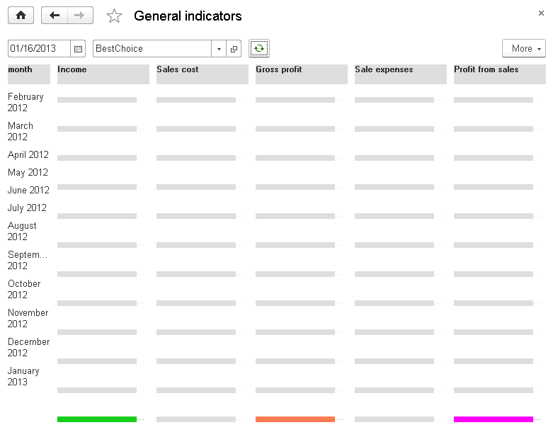
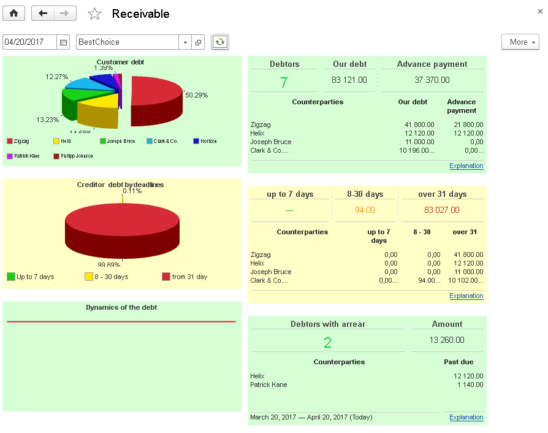
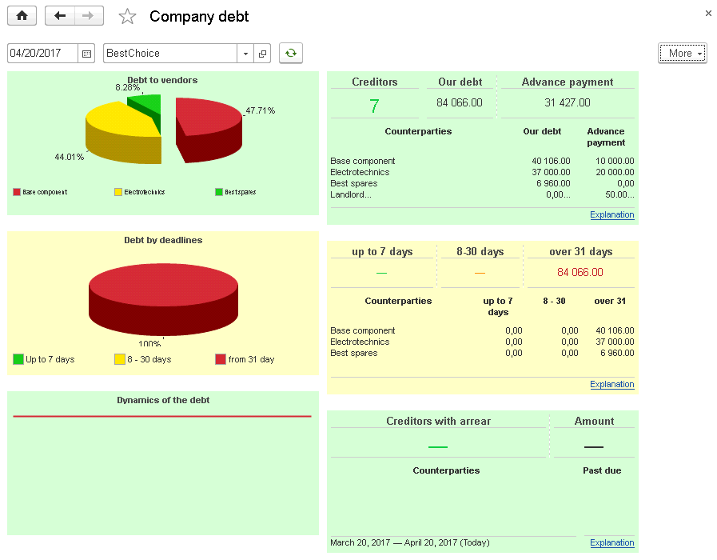
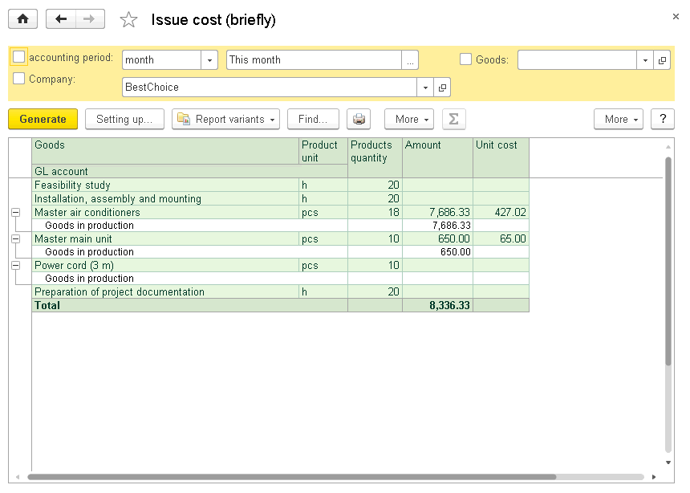
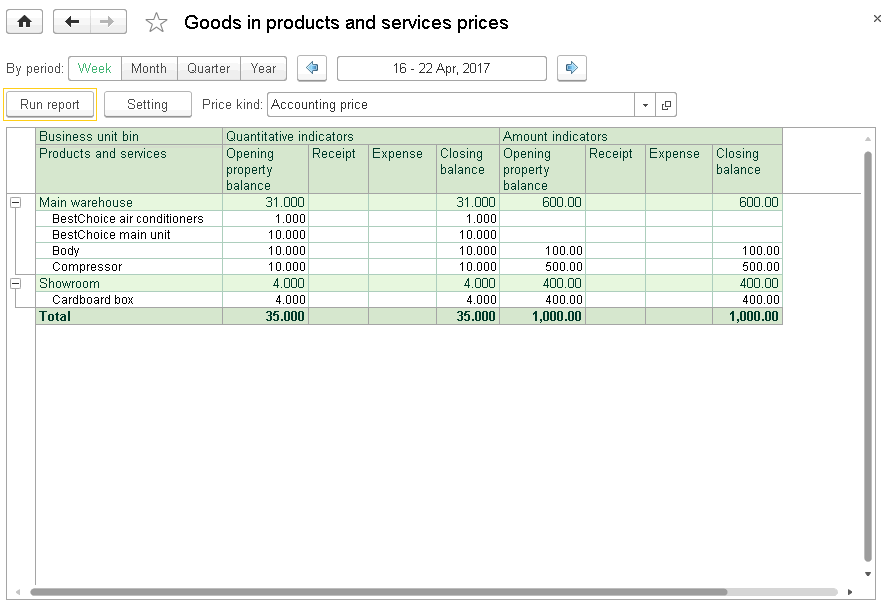
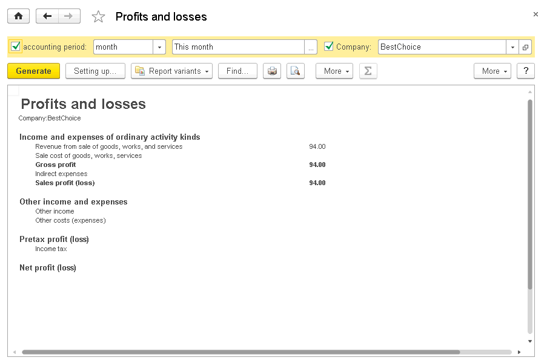
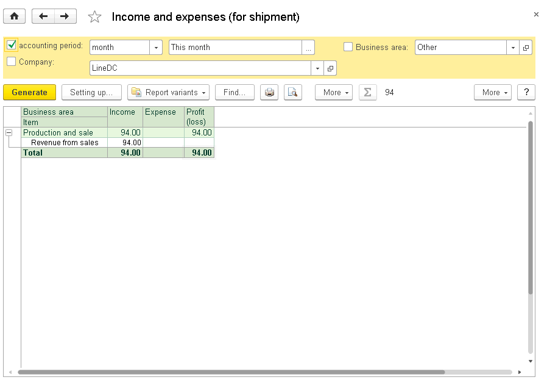
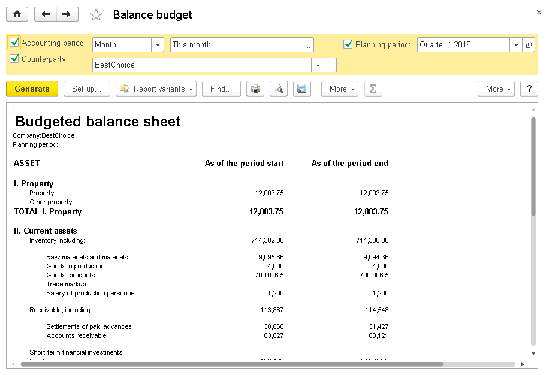
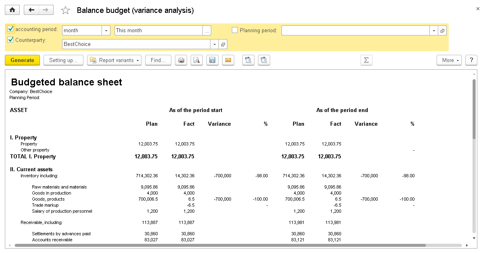

CHAPTER 10
==========

.. _analysis-1:

ANALYSIS
~~~~~~~~

With this section, management can track the company activities. It
includes tools for the company state analysis and assessment, such as
**Manager dashboard** and **General indicators**, **Funds**,
**Settlements with customers**, **Settlements with suppliers**.

MANAGER DASHBOARD
~~~~~~~~~~~~~~~~~

To access Manager dashboard, in the navigation panel, click the
corresponding link. It includes the items listed below.

.. _funds-4:

Funds
~~~~~

The form shows cash balance as of the specified day end by all cash
funds and accounts of the company. The charts display balance change
dynamics over the last month. To access the **Cash statement** report,
click **More**.

.. _income-and-expenses-1:

Income and expenses
~~~~~~~~~~~~~~~~~~~

On the form, you can see the following information: total amount of
earned income, incurred expenses, and aggregate profit (loss) over the
last month. The chart displays profit (loss) dynamics by days over the
last month. To access the **Statement of income and expenses** report,
click **More**.

Orders
~~~~~~

The form shows a number of non-closed customer and purchase orders
including those on the specified date, and a number of overdue orders.
To access the **Customer order analysis** report and the **Purchase
orders** report, click **More**.

.. _sales-2:

Sales
~~~~~

On the form, you can see information about company sales amounts,
quantity of goods and services names sold over the last month. The chart
displays sales dynamics by days over a month. To access the **Sales
statement** report, click **More**.

Debtors
~~~~~~~

**Debtors** is a list of counterparties having debt to the company. In
the header, you can see a total number of debtors and total debt amount
including overdue debt. Five most highly indebted debtors are
represented in a separate list. Received prepayment not allocated to
order documents is specified in the **Advance** column. To access the
**Settlements with customers** report, click **More**.

Creditors
~~~~~~~~~

**Creditors** is a list of counterparties to whom the company owes. In
the header, you can see a total number of creditors and total debt
amount including overdue debt. Five creditors with the highest debt are
represented in a separate list. Issued prepayment not allocated to order
documents is specified in the **Advance** column. To access the
**Settlements with suppliers** report, click **More**.

|image1521153995025849|

As a manager, you can display such lists for any date and company using
selection fields in the command bar. You can also change location of the
dashboard lists and fields or restrict displaying extra indicators on
the settings form. To access it, click **More**, and then click **Change
form**...

GENERAL INDICATORS
~~~~~~~~~~~~~~~~~~

You can access the **General indicators** form by clicking the
corresponding link in the navigation panel of the **Analysis** section.

On the form, you can see charts and values of the following indicators:
**Revenue**, **Cost**, **Gross profit**, **Expense**, and **Profit** for
each month over the last year.

You can display information on any date and company on the form. To
change the widget position and prevent some indicators from being
displayed, click **All actions**, click **Change form**, and then enable
the required options.

|image1521154001076874|

.. _funds-5:

FUNDS
~~~~~

To access the **Funds** form, in the **Analysis** section, in the
navigation panel, click **Funds**. The form includes the items listed
below.

Cash balance
~~~~~~~~~~~~

The widget shows cash balance as of the specified day end by all cash
funds and accounts of the company. The chart displays balance change
dynamics over a period depending on the specified interval. To access
the **Cash statement** report, click **More.**

Funds receipt
~~~~~~~~~~~~~

The form shows cash receipt amount by cash flow items. The chart
displays receipt change dynamics over a period depending on the
specified interval. To access the **Cash flow** report, click **More**.

Funds expense
~~~~~~~~~~~~~

The form shows cash expense amount by cash flow items. The chart
displays expense change dynamics over a period depending on the
specified interval. To access the **Cash flow** report, click **More**.

Depending on the specified interval, you can change the analyzed period:

-  With intervals **Day** or **Week**, the last month is analyzed.

-  With intervals **Month** or **Quarter**, the last year is analyzed.

On this form, you can display information on any date with specified
intervals and for any company. To change the widget position and prevent
some indicators from being displayed, click **All actions**, click
**Change form**, and then enable the required options.

|image1521153994010887|

SETTLEMENTS WITH CUSTOMERS
~~~~~~~~~~~~~~~~~~~~~~~~~~

To access the **Settlements with customers** form, in the **Analysis**
section, in the navigation panel, click **Settlements with customers**.
There you can see the following items.

.. _debtors-1:

Debtors
~~~~~~~

On the form, you can see an amount of counterparty debt owed to the
company and an amount of advances not allocated to order documents. With
the chart, you can assess the percentage ratio of each counterparty debt
to total debt amount of counterparties. The chart is generated on the
specified date. To go to the **Statement of settlements with customers**
report, click **More**.

.. _receivable-by-periods-1:

Receivable by periods
~~~~~~~~~~~~~~~~~~~~~

Use the form to receive information about counterparty debt periods and
percentage of old (over a month) and relatively new debts that arose
over the last week or month before the specified date. To access the
**Receivable by periods report (man. cur.)**, click **More**.

Debt dynamics and debtors with arrear
~~~~~~~~~~~~~~~~~~~~~~~~~~~~~~~~~~~~~

In the chart, you can see dynamics of debt change by days over the last
month. On the **Debtors with arrear** form, you can see data on
receivable which will be overdue on the specified date. To access the
**Receivable by periods report (man. cur.)**, click **More**.

On the form, you can display information for any date and company. To
change the widget position and prevent some indicators from being
displayed, click **All actions**, click **Change form**, and then enable
the required options.

|image1521153996778032|

.. _settlements-with-suppliers-1:

SETTLEMENTS WITH SUPPLIERS
~~~~~~~~~~~~~~~~~~~~~~~~~~

You can access the **Settlements with suppliers** form by clicking
**Settlements with suppliers** in the navigation panel of the
**Analysis** section. There you can see the following items.

.. _creditors-1:

Creditors
~~~~~~~~~

The form shows total amount of the company debt to counterparties and an
amount of advances not allocated to order documents. Use the chart to
assess the percentage ratio of each debt to counterparty and total
amount of debt to counterparties. The chart is generated on the
specified date. Click **More** to access the **Statement of settlements
with suppliers** report.

.. _payable-by-periods-1:

Payable by periods
~~~~~~~~~~~~~~~~~~

You can use the form to receive information on periods of debt to
counterparties and percentage of old debts (over a month) and relatively
new debts over the last week or month before the specified date. Click
**More** to access the **Payable by periods (man. cur.)** report.

Debt dynamics and creditors with arrear
~~~~~~~~~~~~~~~~~~~~~~~~~~~~~~~~~~~~~~~

In the chart, you can see dynamics of debt change by days over the last
month. On the **Creditors with arrear** form, there is data on payable
that is overdue on the specified date. Click **More** to access the
**Payable by periods (man. cur.)** report.

On the form, you can display information for any date and company. To
change the window position and prevent some indicators from being
displayed, click **All actions**, click **Change form**, and then enable
the required options.

|image1521153993027966|

ANALYSIS SECTION REPORTS
~~~~~~~~~~~~~~~~~~~~~~~~

In the **Analysis** section, you can access reports which use data of
accumulation registers and **Management** accounting register which
contains management accounting records. You can use the accounting
register to generate the following reports: **Balance**, **Profits and
losses**, **Balance budget**, **Profit and loss budget**, and **Trial
balance**.

|image1521154001101628|

Sales variance analysis
~~~~~~~~~~~~~~~~~~~~~~~

You can analyze ratio of planned and actual sales using the **Sales
variance analysis** report.

|image1521153995055905|

The report displays difference between quantity and amount of goods
planned for sale and sold. Variance percent value of the difference in
relation to the planned data is indicated.

Cost
~~~~

In the report, you can see data on cost of released products, works and
services with explanation of the expenses.

|image1521154001127771|

.. _sales-3:

Sales
~~~~~

In the **Sales** report, you can see data on sold products and services
items over the specified time period in quantitative and value terms.

|image1521153991148112|

In the report, you can use grouping by orders.

Use the **Gross profit** report variant for analysis of gross profit
from sales over the period.

|image1521153994220831|

Goods in products and services prices
~~~~~~~~~~~~~~~~~~~~~~~~~~~~~~~~~~~~~

Use the report for analysis of potential inventory volume in warehouses
in quantitative and value terms.

|image1521153991172040|

Balance
~~~~~~~

The report shows balance sheet statement over the specified period for
the selected company.

|image1521153994867896|

Financial result
~~~~~~~~~~~~~~~~

The report contains data on financial result of company activities
calculated during month-end closing. The report data is grouped by
business areas.

|image1521154001156599|

Financial result (forecast)
~~~~~~~~~~~~~~~~~~~~~~~~~~~

In the report, you can see information on financial result forecast over
the specified period for the selected company. The report is generated
based on data of the **Budget** documents.

|image1521153991097938|

The report can be generated in the **Main** and **Variance analysis**
modes.

|image1521154001183743|

Profits and losses
~~~~~~~~~~~~~~~~~~

In the report, you can see information about company profits and losses
over the specified period.

|image1521154001205276|

The report data is grouped by common and other activity kinds. At the
bottom of the report, you can see information about income and expenses
before taxation and net profit (loss).

Cash flow
~~~~~~~~~

The report displays summary information about company cash flow over the
specified period: cash as of the period start and end, inflow and
outflow grouped by cash flow items, and total inflow (outflow) of funds.

|image1521154001231412|

Income and expenses (cash method)
~~~~~~~~~~~~~~~~~~~~~~~~~~~~~~~~~

The report contains data on company income and expenses calculated using
cash method (acc. to payment). You can access it if you select the **Use
cash method of income and expenses accounting** check box in accounting
settings.

|image1521154001256202|

The report data is grouped by business areas.

.. _income-and-expenses-2:

Income and expenses
~~~~~~~~~~~~~~~~~~~

The report contains data on company income and expenses calculated using
accrual method (according to shipment).

|image1521153990663902|

The report data is grouped by business areas.

Cash flow budget
~~~~~~~~~~~~~~~~

The report displays information about cash flow budget over the
specified period for the selected company. The report is generated based
on data of the **Cash flow budget** documents.

|image1521153992692369|

You can generate the report in the following modes: **Main** and
**Variance analysis**. If you select the **Main** option, the report
shows information about all cash inflow and outflow. Variance analysis
allows you to display information about planned and actual inflow and
outflow, absolute value and variance percent.

Profit and loss budget
~~~~~~~~~~~~~~~~~~~~~~

The report displays information about budget of profit and loss over the
specified period for the selected company. The report is generated based
on data of the **Budget** documents.

|image1521153994945394|

You can generate the report in the following modes: **Main** and
**Variance analysis**. If you select the **Main** option, the report
shows information about all income and expenses and total profit (loss)
considering taxation. Variance analysis allows you to display
information about planned and actual income and expenses, planned and
actual profit (loss) considering taxation, absolute value and variance
percent.

Budgeted balance sheet
~~~~~~~~~~~~~~~~~~~~~~

In the report, you can see budgeted balance sheet data over the
specified period for the selected company.

|image1521153994450947|

You can generate the report in the following modes: **Main** and
**Variance analysis**. If you select the **Variance analysis** mode, the
report shows data on planned and actual budgeted balance sheet, an
absolute value, and variance percent.

|image1521154001283908|

.. |image1521153995025849| image:: media/image316.png
   :width: 4.63542in
   :height: 3.29167in

.. |image1521153994010887| image:: media/image318.png
   :width: 4.67708in
   :height: 3.66667in

.. |image1521154001101628| image:: media/image321.png
   :width: 4.33333in
   :height: 3.21875in
.. |image1521153995055905| image:: media/image322.png
   :width: 4.63542in
   :height: 2.98958in

.. |image1521153991148112| image:: media/image324.png
   :width: 4.63542in
   :height: 2.90625in
.. |image1521153994220831| image:: media/image325.png
   :width: 4.63542in
   :height: 3.47917in

.. |image1521153994867896| image:: media/image327.png
   :width: 4.625in
   :height: 3.25in
.. |image1521154001156599| image:: media/image328.png
   :width: 4.33333in
   :height: 3.33333in
.. |image1521153991097938| image:: media/image329.png
   :width: 4.63542in
   :height: 3.26042in
.. |image1521154001183743| image:: media/image330.png
   :width: 4.33333in
   :height: 2.11458in

.. |image1521154001231412| image:: media/image328.png
   :width: 3.9375in
   :height: 3.58333in
.. |image1521154001256202| image:: media/image332.png
   :width: 4.30208in
   :height: 3.38542in

.. |image1521153992692369| image:: media/image334.png
   :width: 4.63542in
   :height: 2.25in
.. |image1521153994945394| image:: media/image335.png
   :width: 4.63542in
   :height: 3.17708in

