CHAPTER 11
==========

BOOKKEEPING PORTABLE
~~~~~~~~~~~~~~~~~~~~

With Bookkeeping Portable module, you can easily configure your
day-to-day accounting operations using variety of uploaded GL accounts.
Whenever a new financial document arrives, you can create postings for
it with a single click. In this chapter, you will learn how to:

-  `Enable Bookkeeping
portable <#permanently-enabling-bookkeeping-portable>`__

-  `Upload chart of accounts <#uploading-chart-of-accounts>`__

-  `Configure postings <#configuring-postings>`__

-  `Create postings <#creating-postings>`__

-  `Keep track of your bookkeeping operations using
reports <#bookkeeping-reports>`__

Permanently Enabling Bookkeeping portable
~~~~~~~~~~~~~~~~~~~~~~~~~~~~~~~~~~~~~~~~~

To enable Bookkeeping portable section, administrator does the
following:

1. Click the **Settings** section, and then click **Finance**:

|image1521153993558513|

2. Select the **Enable section use** check box to active the
functionality.

Configuring postings
~~~~~~~~~~~~~~~~~~~~

To configure postings for your day-to-day activities, you need to:

-  `Upload chart of accounts <#uploading-chart-of-accounts>`__

-  `Assign financial groups to counterparties you deal
with <#assigning-financial-groups-to-counterparties>`__

-  `Assign financial groups to products and
services <#assigning-financial-groups-to-products-and-services>`__

-  `Create bookkeeping templates to every document kind that requires
postings <#creating-bookkeeping-templates>`__

Uploading chart of accounts
~~~~~~~~~~~~~~~~~~~~~~~~~~~

Once you purchase the system, you might need to upload your company’s
chart of accounts into it to automatically allocate expenses and income
to the right GL accounts.

To upload chart of accounts:

1. Click the **Settings** section, and then click **Print forms, reports
and data processors**:

|image1521153996263204|

2. In the **Print forms, reports and data processors** window, click
**Additional reports and data processors**.

|image1521153991572091|

3. In the **Additional reports and data processors** window, click
**Create**, and then select a local file with the data processor for
uploading charts of accounts. The file is supplied with the
application. The **Additional data processor** window appears:

|image1521153991804484|

4. In this window, click **Undefined** next to **Placement**, select
**Section "Finances"**, and then click **OK**.

5. Click **Save and close**. The data processor appears in the **Funds**
section.

6. Click the **Funds** section, and then click **Additional data
processors**:

|image1521153992388089|

7. In the **Additional data processors** window, click **Charts of
accounts import**, and then click **Execute**. The **Chart of
accounts import** window appears:

|image1521153992422971|

8. In this window:

-  Select **Import from template** if you want to upload a predefined
template with GL accounts.

-  Select **Import from file** if you want to upload your own GL
accounts created earlier.

9. Click **Import**. The uploaded GL accounts appear in the **Chart of
accounts template** area. You can start using them in the application
for postings.

|image1521153995137380|

To access a list of your company’s GL accounts, click the **Bookkeeping
portable** section, and then click **Chart of accounts "Bookkeeping"**.

After some time your company might need new GL accounts. To add them to
the application:

1. Click the **Bookkeeping portable** section, and then click **Chart of
accounts "Bookkeeping"**:

|image1521153992456882|

2. In this window, click **Create**:

|image1521153995825318|

3. In the **Choose new account parent** window, select whether your GL
account is a root one or subordinate to another one, and then click
**OK**.

|image1521153991750264|

4. Specify the account code, validity period, balance side, and extra
dimensions if any.

5. Click **Save and close**. The account appears in the main list of GL
accounts.

Assigning financial groups to counterparties
~~~~~~~~~~~~~~~~~~~~~~~~~~~~~~~~~~~~~~~~~~~~

With financial counterparty groups, you do not need to assign GL
accounts for every counterparty, but simply set GL accounts and posting
templates for counterparty categories, such as foreign or domestic
counterparties, wholesale or retail counterparties, suppliers,
customers, investors, contracts, etc. You can access the list of
financial counterparty groups in the **Bookkeeping portable** section.

To assign financial groups to counterparties:

1. In the **Sales** section, click **Customers**. The **Counterparties**
catalog appears.

2. In the **Counterparties** catalog, select the required counterparty:

|image1521153993151998|

3. Click the **Additional information** tab, and then in the **Financial
group** field select a financial group for the counterparty or create
a new one.

|image1521153993762232|

4. Click |image1521153992196054|. The **BookkeepingSettingsCommonForm** window
appears:

|image1521153991625847|

5. In this window, set a start date for the financial group in the
**Period** field.

6. Select required accounts in the **Ac. payable**, **Prepayment for
customer**, **Prepayment for supplier**, **Ac. receivable** fields.
Account names may differ depending on your company requirements.

7. Click **Write**. A new record appears in the left side of the window.

8. Click **Save and close** in the counterparty card.

Assigning financial groups to products and services
~~~~~~~~~~~~~~~~~~~~~~~~~~~~~~~~~~~~~~~~~~~~~~~~~~~

With financial products and services groups, you do not need to assign
GL accounts for every product or service, but simply set GL accounts and
posting templates for product or service categories, such as inventory,
raw materials, materials, services, etc. You can access the list of
financial products and services groups in the **Bookkeeping portable**
section.

To assign financial groups to products and services:

1. In the **Products and services** catalog, selected the required
product or service:

|image1521153996237857|

2. Click the **Main parameters** tab, and then in the **Financial
group** field select a financial group for the product or service or
create a new one.

|image1521153993786759|

3. Click |image1521153992196054|. The **BookkeepingSettingsCommonForm** window
appears:

|image1521153991967271|

4. In this window, set a start date for the financial group in the
**Period** field.

5. Select required accounts in the **Cost of goods**, **Sales amount**,
**Sales costs** fields. Account names may differ depending on your
company requirements.

6. Click **Write**. A new record appears in the left side of the window.

7. Click **Save and close** in the product or service card.

Creating bookkeeping templates
~~~~~~~~~~~~~~~~~~~~~~~~~~~~~~

With the Bookkeeping portable module, you can create an unlimited number
of predefined bookkeeping templates for every document you need to post.
Use the templates to categorize document postings depending on
customers, counterparties, product or service, etc.

To create bookkeeping templates:

1.  In the **Bookkeeping portable** section, click **Bookkeeping
operations templates**, and then click **Create**.

|image1521153997467310|

2.  In the template card, specify its description, and select a document
base, e.g. a customer invoice.

3.  Click **Set filter** to create multiple sets of postings using the
same bookkeeping template (for example, to sell to foreign and
domestic counterparties). You can set filter by a required document
attribute. The bookkeeping template will be filtered by this
document attribute.

4.  In the opened window, click **Add new item**. A list of document
attributes appears. Select an attribute you want to filter by from
the list, e.g. a company or a customer.

|image1521153993879648|

5.  Select the check box next to the attribute, and then click **Save
filter settings**. The bookkeeping template will be filtered by this
document attribute only.

6.  Select the **Group records** check box if you want to group the same
records while creating bookkeeping operations from this template.

7.  Select the **Don’t generate zero records** check box if you want to
eliminate records with zero amounts while creating bookkeeping
operations from this template.

8.  Click **Try** if you want to check the template in the test mode. In
the test mode, you can verify document postings after each change.
Every template modification requires reposting of all documents
based on it. It is not recommended to use the test mode for a long
time.

9.  Click **Turn to work mode** if you want to activate the template.
Once you post any bookkeeping operations using the template in the
work mode, you will not be able to change the template. Turn to work
mode only if you are sure no more changes are required.

If one day you no longer want to use the template, click **Lock this
template for use in new documents**. The template will not be used
for new document postings. Postings of existing bookkeeping
operations are not changed.

10. Click **Add operation** to assign bookkeeping operations to the
template. For more information, see chapter `**"Creating
postings"** <#creating-postings>`__.

11. Click the **Bookkeeping records** tab:

|image1521153997494832|

12. In the opened window, click |image1521153991835086| to select a posting base. The
**Table choosing** window appears:

|image1521153997416090|

13. Select a posting base: document data, document tabular section data
or document register, e.g. **Sales**, and then click **OK**. The
selected option appears in the left side of the window in the
**Table** area.

14. In the **Table** area, click the option you’ve previously selected.
The **Add** button becomes available in the right side of the
window.

15. Click **Add** to add a posting with credit amount. A new row appears
in the table below the **Add** button.

16. Double-click the **Account** column. The **Bookkeeping operations
templates** window appears:

|image1521153997518461|

17. In this window, click |image1521153992220983| in the field. The following
window appears:

|image1521153997544077|

18. Click **New parameter**. The following window appears:

|image1521153997571061|

19. Select the required GL account, e.g. for Sales register, click
**Product or service**, and then select the required account, for
example, **Sales amount**.

20. Click **OK**.

21. In the **Bookkeeping operation template parameter** window, click
**Select**.

22. In the **Bookkeeping operations template** window, click **OK**. The
account you’ve selected appears in the **Account** column of the
table.

23. Double-click the **Extra dimension** column to assign extra
dimensions to the selected account.

24. Select the required dimension in the same manner as in steps 7-12.
For example, for the **Sales** register, click **Document**, click
**Counterparty**, and then click **Financial group**. The extra
dimension you’ve selected appears in the **Extra dimension** column
of the table.

25. Specify currency and currency amount in the **Currency** column if
the account is a currency one. Otherwise, leave the column empty.

26. Specify debit or credit amount depending on the account. For
example, for the **Sales** register, select the **Amount**
attribute.

27. Click **Save and close** in the template card.

28. Add a posting with debit amount in the same manner, for example,
using the **Accounts receivable** register.

In the application, you can also set when and how postings are created
for every document kind:

1. In the **Bookkeeping portable** section, click **Bookkeeping posting
settings**, and then click **Create**:

|image1521153997216706|

2. Select a document kind and bookkeeping posting type:

-  **On posting** – to automatically create postings whenever a new
document of the specified kind is posted.

-  **Delayed** – postings are created only using a special data
processor for group posting.

-  **Don’t post** – not to create postings for the document kind.

3. Click **Save and close**.

Creating postings
~~~~~~~~~~~~~~~~~

Whenever a new financial document, for example, a customer invoice, is
received in the application, a person in charge needs to create postings
for it.

To create postings:

1. Open the required document.

2. In the document card, click |image1521153993378510| to create a bookkeeping
operation. The following window appears:

|image1521153991994133|

3. The postings are generated automatically based on the configured
templates. Check the postings, and then click **Post close**.

Bookkeeping reports
~~~~~~~~~~~~~~~~~~~

With the **Bookkeeping portable** module, you can take advantage of the
following reports:

-  **Account balances and turnovers** – shows credit and debit amounts
of your GL accounts for opening balance, closing balance and its
turnover.

-  **Trial balance** – lists the balances in each of an organization’s
GL accounts by required financial years and with extra dimensions.
Accounts with zero closing balances and turnovers can be omitted.

-  **Trial balance by account** – lists the balances for a required GL
account by required financial years.

.. |image1521153993558513| image:: media/image338.png
   :width: 4.59375in
   :height: 0.95833in
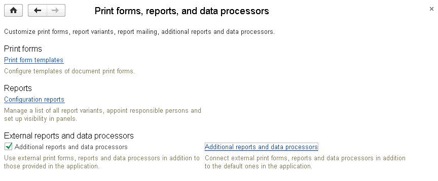
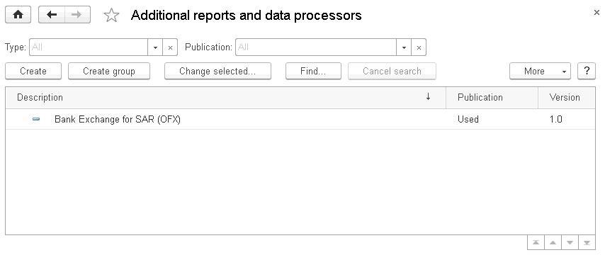
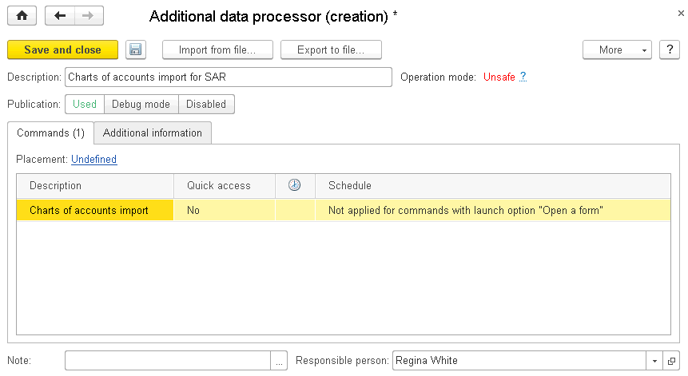
.. |image1521153992388089| image:: media/image342.png
   :width: 2.90625in
   :height: 1.26042in
.. |image1521153992422971| image:: media/image343.png
   :width: 3.90625in
   :height: 3.10417in
.. |image1521153995137380| image:: media/image344.png
   :width: 4.5in
   :height: 2.73958in
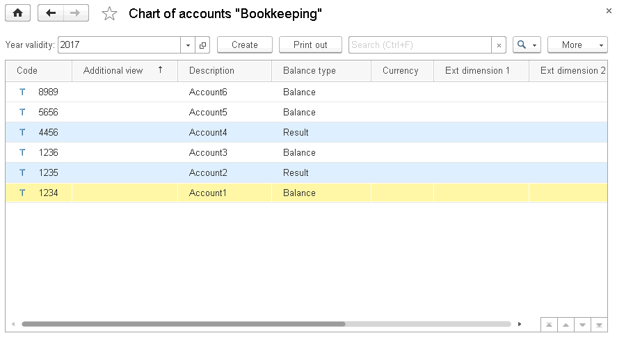
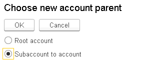
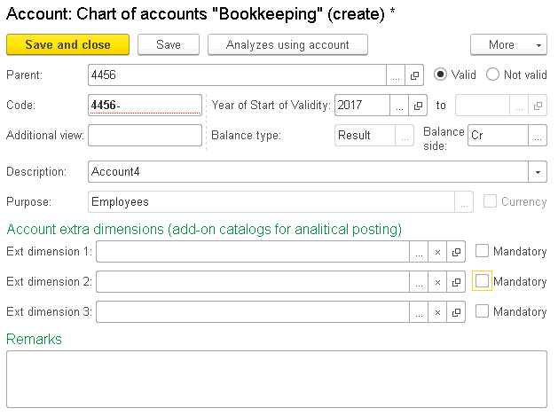
.. |image1521153993151998| image:: media/image348.png
   :width: 4.39583in
   :height: 2.98958in
.. |image1521153993762232| image:: media/image349.png
   :width: 3.34375in
   :height: 1.51042in
.. |image1521153992196054| image:: media/image350.png
   :width: 0.27083in
   :height: 0.25in
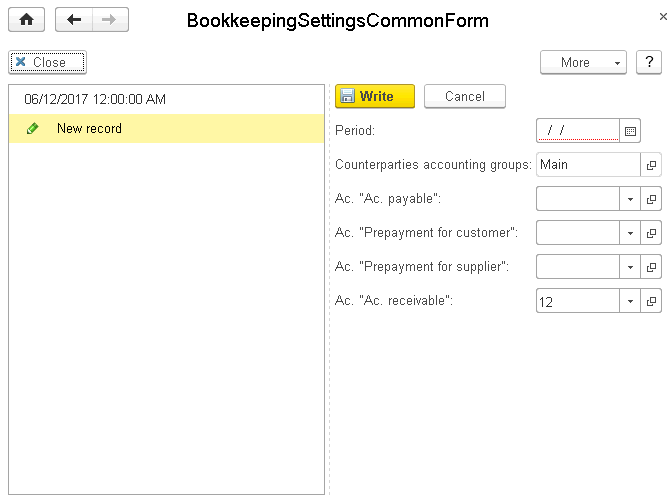
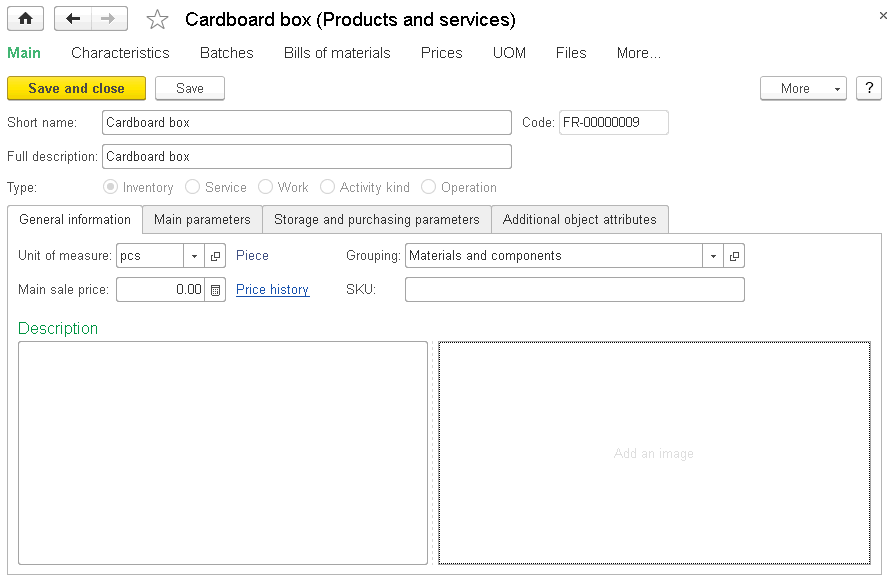
.. |image1521153993786759| image:: media/image353.png
   :width: 3.3125in
   :height: 1.04167in
.. |image1521153992196054| image:: media/image350.png
   :width: 0.27083in
   :height: 0.25in
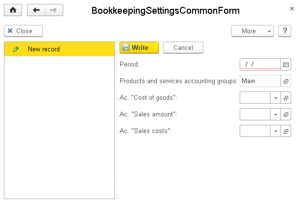
.. |image1521153997467310| image:: media/image355.png
   :width: 4.5in
   :height: 3.60417in
.. |image1521153993879648| image:: media/image356.png
   :width: 4.39583in
   :height: 1.65625in
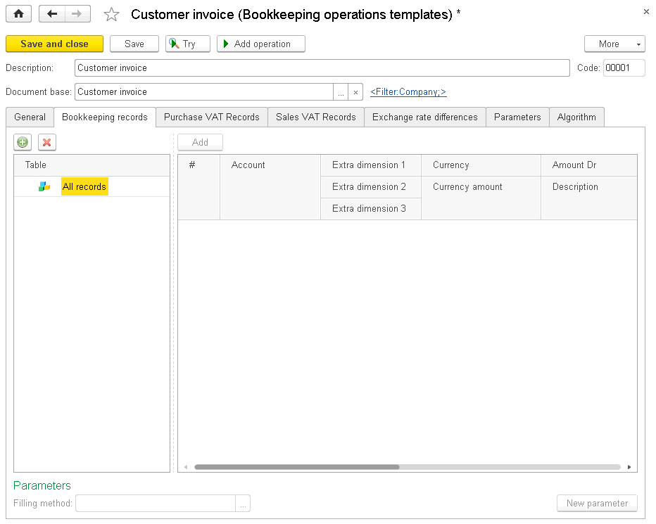
.. |image1521153991835086| image:: media/image358.png
   :width: 0.27083in
   :height: 0.26042in
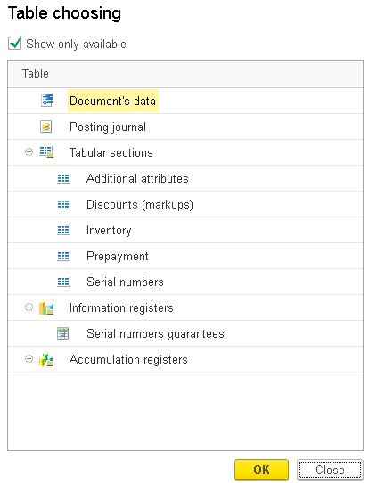
.. |image1521153997518461| image:: media/image360.png
   :width: 2.38542in
   :height: 1.4375in
.. |image1521153992220983| image:: media/image361.png
   :width: 0.22917in
   :height: 0.26042in
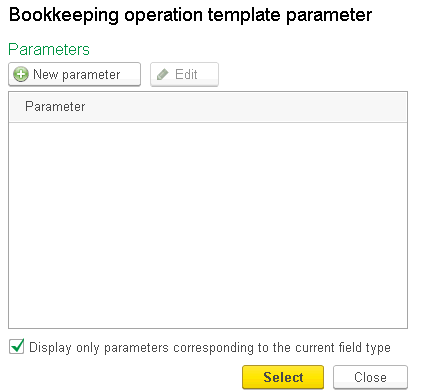
.. |image1521153997571061| image:: media/image363.png
   :width: 4.41667in
   :height: 3.79167in
.. |image1521153997216706| image:: media/image364.png
   :width: 3.54167in
   :height: 0.94792in

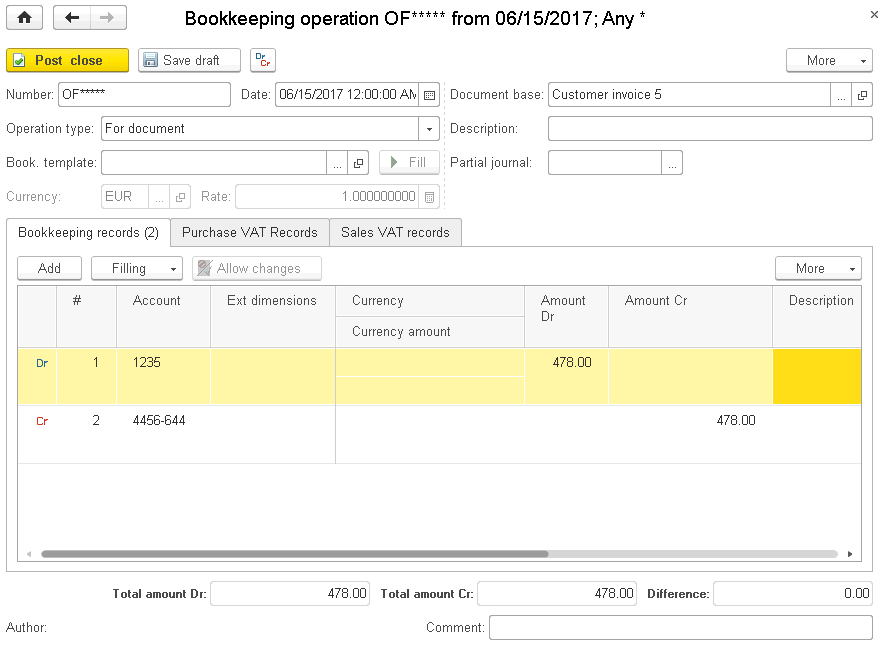
