CHAPTER 12
==========

SETTINGS
~~~~~~~~

.. _setting-up-accounting-1:

SETTING UP ACCOUNTING
~~~~~~~~~~~~~~~~~~~~~

You can find information about accounting setup in the initial system
settings section.

Customizing application
~~~~~~~~~~~~~~~~~~~~~~~

Support and service
~~~~~~~~~~~~~~~~~~~

You can access the **Support and service** panel by clicking the
corresponding link in the navigation panel of the **Settings** section
to:

-  Record various events

-  View a list of users who are operating in the application

-  Prohibit and allow users to operate in the application

-  Permanently delete the application objects that were marked for
deletion

-  Update the application version

-  Assess the application performance using APDEX method

-  Set up, run, and monitor states of scheduled and background jobs

-  Prevent from changing the application user data of previous periods

-  Manage totals of accumulation and accounting registers

-  Keep the full-text search index up-to-date

-  Back up the application and restore data from the application backup

Event log
~~~~~~~~~

All user actions are registered in a special event log. To access it,
click **Event log** in the actions panel.

With the event log, you can track all actions with the infobase data.

Viewing active users
~~~~~~~~~~~~~~~~~~~~

Active users are users currently operating in the infobase. To access
the list, in the actions panel, click the corresponding link. The list
shows not only users operating in the infobase via **Thin client**,
**Thick client**, **Web client** or **Designer**, but also users
operating via **COM connection**, **WS connection**, etc.

|image1521153994477096|

To analyze actions of a specific user, go to the active user list by
clicking the corresponding link in the **Support and service** panel of
the **Settings** section.

Locking user operation
~~~~~~~~~~~~~~~~~~~~~~

The application administrator can lock connections if it is required to
end user sessions to perform administrative actions. In this case, users
will receive a corresponding message.

You can call the data processor with the actions panel command. With the
data processor, you can prevent users from connecting to the infobase
and end sessions of all active users (including the one who initiated
the lock).

This feature is useful to perform administrative actions and make sure
no users are connected.

The data processor allows you to lock/unlock connections to the infobase
in the « **1C:Enterprise»** mode for the specified period.

|image1521153994503634|

On the lock start time, sessions of users connected to the infobase will
be closed, and a new session will be attempted to start.

To unlock connections before the lock end, perform the following
actions:

1. Enter the infobase using launch parameter /UC with the access
permission code you specified to set the lock.

2. Start this data processor and specify **Unlock connections**.

3. Click **Perform**.

Service data processor parameters
~~~~~~~~~~~~~~~~~~~~~~~~~~~~~~~~~

On the data processor form, you can specify:

-  Whether it is locked or unlocked

-  Period (time) of lock start and end

-  Message text that is displayed for users to warn about scheduled lock
of connections

-  Permission code that is an arbitrary string which you can use as
launch parameter /UC to enter the infobase further on despite the
lock.

Actions after setting lock on infobase connections
~~~~~~~~~~~~~~~~~~~~~~~~~~~~~~~~~~~~~~~~~~~~~~~~~~

5 minutes before the data processor start, all users receive warnings on
planned time of lock of connections and a lock message.

At the lock time, sessions of users connected to the infobase will be
attempted to close, with sending requests for saving data and closing
the application. Till the end of the lock, new connection to the
infobase is available only if the permission code specified for the lock
matches command line parameter /UC or connection string parameter UC.

In a minute after the lock start, sessions of users connected to the
infobase will be closed. Standard actions on exiting the application
will be performed: termination request (if closing confirmation mode is
set for a user), disconnecting shop fixtures and fittings and other.

2 minutes after the lock start, sessions of users connected to the
infobase will be closed.

Updating application version
~~~~~~~~~~~~~~~~~~~~~~~~~~~~

Use the configuration update tool to auto update the infobase
configuration in the **On request** mode or at the specified time.

To update the configuration, in the **Support and service** section,
click **Search and install updates**. With the Configuration update
wizard, you can update from the following sources:

-  The Internet

-  An arbitrary file from a local or network directory

|image1521153997037542|

Note

It is not recommended to use this configuration update method if change
of metadata objects is enabled in the configuration. In such cases, you
can use the designer to update. For more information, see
«1C:Enterprise» 8.3. Developer Guide included in the delivery set.

Updating configuration online
~~~~~~~~~~~~~~~~~~~~~~~~~~~~~

Online configuration update includes the following steps:

-  Check for update

-  Connect to the user website

-  Update the configuration

The application can automatically check for updates on the user website
on every application start or on schedule. To set the check mode, use
the **Configure application update via the Internet** command. If an
update is found, you can see short description of the update. To
download an update from the user website, click **Next**.

On the first update from the user website, specify a user code and a
password. Only «1C:Enterprise» registered users have access to updates.
For more information about a user code and a password, see instructions
at
`v8.1c.ru. <file:///rise-izh.local....UsersshestakovaAppDataRoamingUsersSolovyeva_LDocuments%20and%20SettingsDocuments%20and%20SettingsShestakovaAppDataRoamingMicrosoftwww.v8.1c.ru>`__

You can remember a user code and a password. Not to enter it every time,
select the **Remember password** check box.

In some companies, it is required to specify a user name and a password
for a proxy server. Select the **Specify a user name and a password for
a proxy server to have access via the proxy server** check box. You can
receive more information about a proxy server from your local network
administrator.

Click **Next**. The application connects to the user website using the
specified user code and password. The application receives an update
file. The file will be saved to a template directory. You can update at
once or on the next wizard launch. Updating can take a long time
depending on a specific file size and the Internet connection speed.

Updating time can be increased if several intermediate updates are
required for the current application version. In this case, all updates
will be received and installed automatically.

Configuration update features are different for file and client/server
application modes. In the file application mode, you can update
instantly.

Before updating the configuration, back up the infobase. You can select
an auto backup method depending on the current application mode. In the
file mode, click **Backup** to configure backup parameters. You can back
up data using other methods, for example, by copying an infobase file.
In the client/server mode, you can back up data manually using SQL tools
if necessary.

Before continuing the configuration update, perform the following
actions:

-  Save all unsaved data or close their edit forms.

-  Close Designer if it is opened.

-  If other users are operating with the infobase, ask them to
temporarily exit the application.

-  If other applications are connected to the infobase in the external
connection mode, close them.

If all the conditions are fulfilled, click **Finish**. The application
will back up the infobase automatically if it is allowed. The
configuration will be updated. If the infobase is in the client/server
mode, all connections during backing up and updating the configuration
are locked. In the client/server mode, all in-process connections will
be disconnected automatically.

Updating the configuration can take a long time depending on computer
performance and the infobase size. In the client/server mode, you can
postpone the update, for example, to night time. The application will
update at the specified date and time. Do not shut down your computer.
You can configure update report sending to the specified email.

After completing the configuration update, the application will be run
automatically. If necessary, enter a user name and a password again to
log on. After that, the application will be ready for further operation.

In case of emergencies during the update, contact the administrator. Use
the **event log** to diagnose errors (in the **Support and service**
section, click **Event log**). In the event log, records on errors and
performed operations are registered (the **Infobase update** event
type).

Updating configuration from an arbitrary file
~~~~~~~~~~~~~~~~~~~~~~~~~~~~~~~~~~~~~~~~~~~~~

If an update file already exists in a local or network directory, you
can select the configuration update from file mode and specify the file.
You can select configuration update file .cfu or configuration delivery
file .cf.

If an update file is already imported into basic configuration before
and it is required to apply it to the infobase configuration, select
**Update file is not required because it is already imported into the
main configuration**. This feature is available, for example, when
updating a configuration of distributed infobase host (DIB).

After clicking **Next**, the application prompts to update.

Deleting marked objects
~~~~~~~~~~~~~~~~~~~~~~~

Use the **Deletion of marked objects** data processor to check whether
it is possible to delete objects without risks to the remaining data.
For example, if you decide to delete a corresponding item of the
**Individuals** catalog due to dismissal of an employee, the data
processor will check whether the employee data is used in any documents
or reports that are stored in the infobase. If such documents or reports
are detected, you will not be able to delete the catalog item.

Note

The **Deletion of marked objects** data processor checks all infobase
objects that are marked for deletion: catalog items, populated reports,
documents. To save your time, run the data processor only when there is
quite a large number of objects marked for deletion.

To run the data processor, in the **Settings** section, click **Deletion
of marked objects** in the **Support and service** panel. In the opened
window, set the radio button to the required position: automatic or
selective deletion of objects.

|image1521153994530742|

Then, click **Delete** in automatic mode and **Next >** in manual
deletion mode. In the first case, you can automatically delete marked
objects and after that you can see the result in the application. If you
select manual mode by clicking **Next >**, you will see the dialog box
with a list of objects that you can delete. Select check boxes for the
objects which you want to delete. Then click **Delete**.

After that, you will see a list of objects that cannot be deleted and
objects that reference to them and prevent from deletion.

After manual deletion of references to these objects, you can repeat the
deletion procedure.

Closing dates of data change
~~~~~~~~~~~~~~~~~~~~~~~~~~~~

Sometimes you might want to prohibit changing data in the infobase when
using it until a specified date.

You can set a closing date of data change in the application. To set a
closing date of data change and customize its settings, in the
**Settings** section, in the **Support and service** panel, click the
corresponding command.

|image1521153993004798|

You can set a closing date of data change both for all application
users, and for a specific user or a user group. You can also set a
closing date of data change using different methods (for more
information, see further chapters). If the closing date of data change
is set, users receive a message prompting that they cannot change data
whenever they try to make changes to the infobase before the date of
data change. Let's have a look at various options of change closing date
setup.

Setting change closing date by users
~~~~~~~~~~~~~~~~~~~~~~~~~~~~~~~~~~~~

If you need to set a change closing date for all application users,
select **All users** in the **Set up closing date** field. Fields
**Closing** **date indication method** and **Closing date** become
available on the form (for more information, see further chapters).

|image1521153992903020|

If a closing date is not set, restrictions are not applied. When setting
the closing date, you can specify not only a custom date but also a
relative date. The following relative date values are available:

-  **Last year end**

-  **Last quarter end**

-  **Last month end**

-  **Last week end**

-  **Previous day**

For relative dates (except for **Previous day**), you can specify a
number of delay days before setting the closing date on the form. During
these days you will still be allowed to change data.

If you specify a relative date, then for the change closing date to
change automatically according to the specified rules, there is the
**Recalculation of current values of relative change closing dates**
scheduled job. If you cannot use scheduled jobs for any reason,
recalculate current values of relative closing dates using the
**Recalculate** command. In this case, run the command regularly
according to the specified relative date. For example, if you select
**Previous day**, run the command every day. If you select **Last month
end**, run the command every month.

|image1521153992979430|

Sometimes you might need to specify different change closing dates for
different users. For example, it will be required to set a change
closing date for all users except for administrators. In such cases,
select **By users** in the **Set up closing date** field. In this case,
a list will appear on the form. You can add application users (user
groups) (using corresponding commands) and set their own change closing
dates for every user in the list.

|image1521153992931923|

There is always the **<All users>** item by default in the list. You
cannot delete or change the item. Settings of the change closing date
configured for this item will be used for all users except for those
specified in the list. For example, in the picture above, settings of
the closing date for the **<All users>** item will be applied to all
users except for **Regina White**.

To set a change closing date, select a required user (a user group) or
the **<All users>** item in the list, configure the settings below in
the **Closing date indication method** and **Closing date** fields.

Specifying change closing date
~~~~~~~~~~~~~~~~~~~~~~~~~~~~~~

Except for specification of change closing date by users, the
application allows you to specify change closing date indication method
– **By objects** or **Common date**. You can specify the method in the
settings form of change closing date, in the **Closing date indication
method** field.

**Common date** – if you use this method, the same change closing date
is specified for all infobase data items.

|image1521153992954994|

**<Common date>** is always in the list by default. Value of change
closing date for this item will be a default value for all sections,
except for those already in the list. If a value of the **Set up closing
date** field is set to **All users**, you cannot delete the **<Common
date>** item and sections. If a value of the **Set up closing date**
field is set to **By users**, you can delete the **<Common date>** item
and sections.

**By objects** – closing dates are specified by the application objects.
Change closing date is specified for each object. Objects by which you
can set change closing date are **Companies**. The list to which you can
add objects (using corresponding command) and specify change closing
date for each object will be available in the form. **<Common date>**;
is also in the list for the same purposes as for the previous method.

Reports on change closing date settings
~~~~~~~~~~~~~~~~~~~~~~~~~~~~~~~~~~~~~~~

If you select **By users** in the **Set up closing date** field, the
**Reports** command becomes available on the setting form of closing
form of data change. In the reports, you can group data by
sections/objects (**Report on objects**) or by users (**Closing dates by
users**).

The reports show information on set change closing dates for users by
sections and objects.

Infobase backup
~~~~~~~~~~~~~~~

System administrator regularly backs up data to reduce the infobase data
loss risks. The more data is entered into the infobase, the more
frequently the infobase is backed up.

The system allows you to create infobase backups in the
« **1C:Enterprise»** mode. Data can be backed up both automatically and
manually. To use auto mode, configure the settings. You can restore the
infobase data any time from the previously created backup.

You can use this functionality only for the file operation mode. It is
recommended to use DBMS tools to create backups for client/server mode.
For more information on it, see the «1C:Enterprise» 8.3 Guide.
Client/server mode. Administrator Guide.

To back up data, administrator should have the **Full rights** role.

Configuring automatic backup
~~~~~~~~~~~~~~~~~~~~~~~~~~~~

After initial infobase start, in a day the application will display a
message prompting you to configure the infobase backup. If you click the
message link, the **Backup setup** wizard appears. If the administrator
ignores the message, they can open the backup setup wizard in the
**Infobase backup wizard**. To access the **Backup** wizard, in the
**Settings** section, in the **Support and service** panel, click the
corresponding command.

|image1521154001309418|

On the first page of the wizard, you can perform the following:

-  If the administrator cannot configure backup at the moment, they
specify a period after which the application displays a reminder. To
receive the reminder, select the **Remind me to configure backup
later** radio button. Click **Finish** to close the wizard.

-  If you back up data using external tools, for example, DBMS tools in
the client/server mode, clear the **Run automatic backup** check box.

If you select the **Run automatic backup** check box, specify a backup
method – on schedule or on exiting the application.

If you select **Regularly on schedule**, a link to set up the schedule
will be available. If you click it, the **Schedule** form appears. Here
you can select one of the schedules set by default.

Specify a job start and end date, and a repetition mode on the
**Common** tab.

Specify a daily schedule of the job on the **Daily** tab:

-  Time of the job start and end

-  Time of the job completion after which it is not required to execute
the job

-  Job repetition interval

-  Pause duration between repetitions

-  Execution duration

You can specify arbitrary combination of conditions.

Specify a weekly schedule of the job on the **Weekly** tab.

Select the days when the job will be executed. If it is required to
repeat the job, specify a repetition interval in weeks. For example, if
a job is executed every two weeks, then the repetition value is 2.

Specify a monthly schedule for the job on the **Monthly** tab.

Select the months when the job will be executed. If necessary, you can
specify a certain day (of the month or week) of execution since
month/week start or end.

If you select **On exiting the application**, the application will offer
the administrator to back up the infobase every time they close the
application. If there are two or more administrators in the infobase
with the **Full rights** role, the application will offer data backing
up to the last administrator who closes the application.

Specify a directory to save the infobase backups on the same page of the
wizard. To make sure your disk space is not overloaded due to old
backups, you can select the **Store backups** check box in the wizard,
and specify either a number of backups or a period for which they will
be stored (for example, for the last month).

Backup procedure
~~~~~~~~~~~~~~~~

Before backing up data, the application locks the infobase and closes
all user sessions. A form from which you can open a list of connections
to the infobase by clicking **Active users** appears.

If the application cannot close all user sessions, in 5 minutes it will
offer to back up data without disconnecting the users from the infobase.
Administrator can continue backing up if they are sure that the
connected users do not enter data to the infobase (for example, if users
forgot to close their sessions). Otherwise, it is required to close the
user sessions at their work places.

After all users close their sessions, the application data will be
backed up.

Once backup is completed, the application will be restarted. A form with
information about completed backup appears.

Manual backup
~~~~~~~~~~~~~

It is recommended to back up data before every infobase operation which
can irretrievably change large amount of data, for example, before bulk
edit of the system object attributes. In these cases, you can back up
data manually using the **Backup** wizard.

To open the wizard, in the **Settings** section, in the Support and
service panel, click **Backup**.

In the upper part of the wizard page, you can see information on last
backup. Specify a folder to save the backup in the **Select directory to
save backup** field.

Restoring data from backup
~~~~~~~~~~~~~~~~~~~~~~~~~~

You can restore the infobase data any time from the previously created
backup. All data in the restored infobase will be up to date at the time
of creation. The data entered into the infobase after creation of backup
will be missing in the restored infobase.

To restore data from backup, use the **Restore from backup** wizard. To
open the wizard, in the **Support and service** panel in the
**Settings** section, click the corresponding command **.**

In the wizard, specify a path to the backup file. After that, the
application sets lock to the infobase, ends all user sessions, and
restores the infobase data from the specified backup. After recovery,
the application is restarted.

Application change description
~~~~~~~~~~~~~~~~~~~~~~~~~~~~~~

If you click **Application change description** in the actions panel,
you can see a window with a list of configuration versions and short
description of their features.

General settings
~~~~~~~~~~~~~~~~

You can customize general settings using the dialog box of the panel by
clicking the corresponding link in the navigation panel of the
**Settings** section.

In the **Application title** field, specify a title text that will be
displayed in the main application window.

Select check boxes to manage the following options:

-  Classification of contact information of counterparties

-  Object versioning

-  Adding attributes and information to the application objects

-  Balance control when posting documents and canceling document posting

Contact information kinds
~~~~~~~~~~~~~~~~~~~~~~~~~

Whenever you populate catalogs **Counterparties**, **Users**,
**Individuals** and **Companies**, specify contact information to
contact a counterparty, a user, an individual and a company accordingly.
Contact information for each catalog depends on the **Contact
information kinds** catalog. To access the catalog, in the **Settings**
section, in the **General settings** panel, click **Contact information
kinds**.

|image1521153994555722|

The catalog contains predefined items divided by groups depending on
purpose. Each group contains contact information kinds for populating
one of the above mentioned catalogs.

Object versioning
~~~~~~~~~~~~~~~~~

You can use versioning to keep records of object change history. You can
also generate reports on object versions or a specific object version.
Catalogs or configuration documents can be versioned objects.

To configure object versioning, in the **Settings** section, in the
**General settings** panel, use the **Versioned objects** information
register.

For every configured object (a document, a catalog), click **Set
versioning option**. A drop-down list appears. In the list, select the
required versioning option:

-  **Do not version**. Do not create versions on writing changes of a
catalog or a document.

-  **Version on writing**. Create versions on writing changes of a
catalog or a document.

-  **Version on posting**. Create document versions after its first
posting on every change.

-  **Default**. Set recommended settings (Do not version for catalogs,
Version on posting for documents).

|image1521154001333511|

Versioning of a large number of objects can increase the size of
information stored in the application. It might slow down the
application.

You can control a number and size of stored versions using a report. To
access it, click the corresponding link.

You can delete obsolete versions manually or automatically. To delete
obsolete versions manually, click **Clear**.

To delete obsolete versions automatically, select the **Automatically
delete obsolete versions** check box. You can configure a schedule to
delete obsolete versions on the **Schedule** form. To access it, click
**Configure schedule**.

Specify a job start and end date, and a repetition mode on the
**Common** tab.

Specify a daily schedule of the job on the **Daily** tab:

-  Time of the job start and end

-  Time of the job completion after which it is not required to execute
the job

-  Job repetition interval

-  Pause duration between repetitions

-  Execution duration

You can specify arbitrary combination of conditions.

Specify a weekly schedule of the job on the **Weekly** tab.

Select the days when the job will be executed. If it is required to
repeat the job, specify a repetition interval in weeks. For example, if
a job is executed every two weeks, then the repetition value is 2.

Specify a monthly schedule for the job on the **Monthly** tab.

Select the months when the job will be executed. If necessary, you can
specify a certain day (of the month or week) of execution since
month/week start or end.

Sets of additional attributes and information
~~~~~~~~~~~~~~~~~~~~~~~~~~~~~~~~~~~~~~~~~~~~~

You can assign additional attributes and information to items of some
catalogs. You can use them for generating reports. Unlike products and
services characteristics, quantitative accounting is not kept by
properties. Properties are used to filter and group data in reports.

Additional property storage method in the application and its location
in the object window depend on the property type:

-  Additional attributes are stored in the object itself (in a special
tabular section). You can create additional attributes for properties
that are integral parts of an object. They are entered when editing
the object and are available to the same user who has access to the
object and its properties.

-  Additional information is used to store object information that is
not an integral part of the object. As a rule, additional information
can be viewed and/or edited by users having no access to the object
itself. You can edit additional information on a separate form
available from an object form.

Additional attributes and information
~~~~~~~~~~~~~~~~~~~~~~~~~~~~~~~~~~~~~

To use additional attributes and information, in the **Settings**
section, in **General settings**, select the **Additional attributes and
information** check box. The corresponding commands will be available.

You can start operating with additional attributes in a list. To access
it, in the **Settings** section, in **General settings**, click
**Additional attributes** or **Additional information** respectively.

You can also open a set list of additional information and attributes
from the application objects if they are configured:

-  For attributes – click **More**, then click **Change set of
additional attributes**.

-  For information – click **More**, and then click **Additional
information**.

The **additional attributes (information)** list is a table consisting
of two parts:

-  In the left side, you can see sets of additional attributes and
information assigned to catalogs or documents. The sets are shown as
groups. If a catalog contains groups, sets of additional attributes
(information) correspond to catalog groups.

-  In the right side, you can see a list of additional attributes
(information) included in the selected set. In the list of additional
attributes, required attributes are shown in bold. The table shows
the following information:

-  **Additional attribute (information)**. It includes a list of
additional attribute (information) names.

-  **Value type**. Specify a type of additional attributes(information)
and a number of values.

The catalog contains predefined sets of additional attributes and
information on configuration objects: catalogs **Counterparties**,
**Products and services**, **Companies**, and other. Properties and
value types are defined for every set.

|image1521154001359044|

One of the predefined objects is a group containing property sets for
the **Products and services characteristics** catalog items. Each set
included into this group corresponds to the **Products and services
groups** catalog items.

With the item form, you can assign a set of additional attributes to the
corresponding catalog by selecting them from a list.

Assigning new additional attribute (information) to catalog or document
~~~~~~~~~~~~~~~~~~~~~~~~~~~~~~~~~~~~~~~~~~~~~~~~~~~~~~~~~~~~~~~~~~~~~~~

You can create a new attribute (information) using the main option or
according to sample. To create a new attribute (information) using the
main option, select an object to create a new property for and click
**Add**. A form appears. On this form, fill in the required fields.

To create a new attribute (information) according to sample, in the
**Settings** section, in the **General settings** panel, select the
**Attributes and information with common value list** check box. In this
case, whenever you click **Add**, the **According to sample...** button
appears.

You can select an additional attribute (information) from a list of
existing ones in the application. Type and all values of the selected
additional attribute (information) will be copied into a new item.

Adding common additional attributes (information)
~~~~~~~~~~~~~~~~~~~~~~~~~~~~~~~~~~~~~~~~~~~~~~~~~

Common attribute belongs to several sets. This option is suitable when
not only the value list should be common, but the attribute itself as
well. In lists and reports by items of various catalogs and documents,
common attributes are grouped and displayed as a single attribute in one
column or field. For example, to pick all yellow clothes and shoes, use
the **Color** common attribute.

To use this functionality, in the **Settings** section, click **General
settings**, and then select the **Common attributes and information**
check box.

To select the **Common** command from the drop-down list, click **Add**.

You can select from the list an existing common additional attribute,
or, if there is no necessary attribute in the list, create a new one by
clicking **Create**.

Deleting additional attributes (information)
~~~~~~~~~~~~~~~~~~~~~~~~~~~~~~~~~~~~~~~~~~~~

To delete common additional attribute (information), delete it from all
sets to which this attribute belongs. To permanently delete the
attributes, you might need to clear the additional attribute values.

If you mark a property for deletion in a set, the property values are
saved in objects until they are cleared. The property marked for
deletion in the set will be highlighted in the object window and
additional information window.

You can clear the deletion mark if necessary.

Example of assigning and using additional attributes and information
~~~~~~~~~~~~~~~~~~~~~~~~~~~~~~~~~~~~~~~~~~~~~~~~~~~~~~~~~~~~~~~~~~~~

A company sells some industrial products from different manufacturers.
Some of these products have several design options, and the others have
the only one. Managers decide to analyze demand for products depending
on a manufacturer, a number of design options available for a specific
model using the reports.

In this case, information on a manufacturer is stored in the products
and services card. Information on design options is stored on a separate
form.

To create the **Manufacturer** attribute, perform the following steps:

1. In the **Settings** section, click **General settings**, and then
click **Additional attributes**. The **Sets of additional information
and attributes** list opens.

2. Select the **Products and services** set and add the **Manufacturer**
attribute to a list of the corresponding attributes.

3. On the **Main** tab, select an attribute value type. In this case, it
is **Additional value**. The following attribute values are available:

-  **Boolean **

-  **Date **

-  **String **

-  **Number**

-  **Currency **

-  **Additional value **

-  **Additional value (hierarchy)**

-  **Counterparty **

-  **User **

-  **Individual **

In the tabular section of the form, specify values available for the
**Manufacturer** attribute.

|image1521154001387620|

To create the **Design options** information, perform the following
steps:

1. In the **Settings** section, click **General settings**, and then
click **Additional information**. The **Sets of additional information
and attributes** list opens.

2. Select the **Products and services set** and add the **Design
option** information to a list of the corresponding information.

3. On the **Main** tab, in the **Value type** field, select **Number**.
It is not required to create a value list as the values are simple
numeric values.

After creating an attribute or information, open a product card in the
**Products and services** catalog.

The **Additional attributes** tab appears in the product card. The tab
contains the **Manufacturer** selection field. In the field, you can
specify one of the values entered before in the **Object property
values** catalog.

|image1521153994578733|

To open the window containing a list of additional product information,
click **More**, click **Product cards**, and then click **Additional
information**. Created additional information of **Design options** will
be shown in the list. The **Value** column is empty. In the column,
specify a number matching the number of design options set for this
product by the manufacturer.

Specify mismatched values of additional attribute and information for
several items of the **Products and services** catalog. Add additional
properties to an indicator list, set a filter by additional information
(for example, a number of design options is greater than one), and
generate the report (for example, **Customer order analysis**). You can
set an hierarchy for additional information.

|image1521153991195902|

After saving the settings, create a new customer order using products
with the specified values of additional attribute and property. Then
generate a report with a filter by this order.

|image1521154001414002|

The report shows only the products with the value of the **Design
option** additional information equal to 3 and 6, as these values are
greater than 1. Products with the value of the additional information
equal to 1 are not shown in the report.

User and rights settings
~~~~~~~~~~~~~~~~~~~~~~~~

User registration
~~~~~~~~~~~~~~~~~

If multiple users operate in the application, you can make them identify
themselves when starting the application. To do that, register them in
the **Users** catalog.

After the registration, you will be able to:

-  Specify own personal settings for every user

-  Control user actions

You can access a list form of the **Users** catalog by clicking the
corresponding command in the **User and rights settings** panel in the
**Settings** section. The catalog item form looks like this:

|image1521154001440763|

To register a new infobase user:

-  Open a list form of the **Users** catalog, and create a new item by
clicking **Create**.

-  Fill in the **Full name** field in the item form (required). The full
name will be displayed in lists and reports of the application.

-  Allow access to the infobase by selecting the corresponding check
box.

-  Specify personal settings (roles) for the user and click **Write and
close**.

Note

The user you have registered should write down or remember their
password. They will enter their password on every application start.

If you decide not to specify a password, remain the **Password** field
empty.

If you clear the **Show in the selection list** check box in the user
form, this user will not be displayed in the user selection list of the
authentication window. Thus other users will not know that this user
exists.

The applied solution allows you to use Windows authentication, a
universal feature of «1C:Enterprise» 8 applications. When using Windows
authentication, it is supposed that every user is assigned to own
computer and can log on to Windows only using their passwords.

User authentication
~~~~~~~~~~~~~~~~~~~

If at least one user is registered in the infobase user list, user
authentication (identification) is required on every startup. The
application displays an authentication window to specify a login (select
it from a list of infobase users) and a password corresponding to the
login.

|image1521154001466450|

Tooltip

If the **Show in the selection list** check box is cleared when
registering an infobase user, you will be need to type the user name
manually (it cannot be selected from the list).

In the **Users** catalog item, on the **Properties** tab, you can change
user authentication parameters including a password.

Rights
~~~~~~

In the application, you can grant access rights to users to restrict
their access only to required accounting sections.

Access rights are grouped by user profiles. To grant user rights, on the
list form or in the **Users** catalog item, click **Access rights** and
assign the rights.

|image1521153994757694|

Access restriction to configuration sections
~~~~~~~~~~~~~~~~~~~~~~~~~~~~~~~~~~~~~~~~~~~~

You can set access restriction to configuration sections in a user card.
You can access the form in the **Settings** section by clicking **User
and rights settings** in the **Users** list. To select profiles required
for the user, select corresponding check boxes in the **User profiles**
list. You can access the list by clicking **Access rights** in the
navigation panel of the form. Whenever you select a profile, description
of actions available to a user appears on the right. You can assign
several profiles to one user.

Access restriction by counterparty groups
~~~~~~~~~~~~~~~~~~~~~~~~~~~~~~~~~~~~~~~~~

Use this option to restrict access of sales representatives only to
their "own" counterparties. Counterparties of other sales
representatives and documents related to them will be unavailable.

|image1521153994604802|

To enable this functionality, in the **Settings** section, in the **User
and rights settings** panel, select check boxes **Limit access on the
record level**, **Counterparty access groups** and create required
groups.

|image1521153994630971|

The **Access group** field appears on counterparty forms. The field is
required.

|image1521153994685429|

To populate access groups of several counterparties at once, use the
**Change selected items** form. To open the form, click **More**, and
then click **Change selected**.

|image1521153994787882|

After allocating the counterparties, specify access groups to operate
with for every user.

Restriction by access groups is set for profiles **Sales**, **Funds**,
and **Returns from customers (additionally)**. If you assign a user with
more than one of these profiles, enable restriction by counterparty
groups for each profile.

Restricting access to cash funds
~~~~~~~~~~~~~~~~~~~~~~~~~~~~~~~~

This option is available for the **Funds** profile. You can restrict
access to documents and reports only by those cash funds which are
defined in the user settings.

|image1521153993978391|

To enable the option, in the **User and rights settings** panel, set the
**Limit access on the record level** option and specify the required
cash funds in the user settings.

Preventing managers from changing prices in sale documents
~~~~~~~~~~~~~~~~~~~~~~~~~~~~~~~~~~~~~~~~~~~~~~~~~~~~~~~~~~

To prevent managers from changing prices and discounts in sale
documents, from the price list, in product and services cards, in user
settings, clear the **Allow editing prices in documents** check box.

You can use this option for the **Sales** profile.

Preventing users from changing products and services
~~~~~~~~~~~~~~~~~~~~~~~~~~~~~~~~~~~~~~~~~~~~~~~~~~~~

With this option, you can prevent the **Sales** profile users from
creating and editing products and services and associated catalogs such
as products and services characteristics. To configure this option, in
the additional rights settings, clear the **Allow editing products and
services** check box.

User settings
~~~~~~~~~~~~~

You can specify default settings for every user to autocomplete in all
catalogs and documents which this user will use. You can access the
setting form from the user card by clicking the hyperlink in the **User
settings** navigation panel.

|image1521154001494697|

Every infobase user can correspond to several employees who will be
allowed to utilize this user account. You can access a list of such
employees from the user card by clicking **User employees**.

Print forms, reports, and data processors
~~~~~~~~~~~~~~~~~~~~~~~~~~~~~~~~~~~~~~~~~

In the panel, with application tools, you can configure print forms,
report variants, report mailings, additional reports and data
processors.

Report variant localization
~~~~~~~~~~~~~~~~~~~~~~~~~~~

Report panel
~~~~~~~~~~~~

If multilingual values are filled out in the **Reports** catalog, then a
report form for each section is generated in the user language.

|image1521153995727137|

Organizer
~~~~~~~~~

In the panel, you can configure email, notes, reminders, and business
processes.

Email
~~~~~

You can configure the system account by clicking the corresponding link.
Most parameters are autopopulated depending on mail server settings of
an email account.

Remember password for system
`accounts <v8mnghelp://help/topics/v8config/v8cfgHelp/mdobject/id6b2340d7-687f-43a3-8eb8-8ddb86712466/038b5c85-fb1c-4082-9c4c-e69f8928bf3a>`__
to allow the application to send messages from such accounts
automatically. The decision whether to store passwords in the infobase
or not should be made on a case-by-case basis.

Email accounts
~~~~~~~~~~~~~~

Email accounts are stored in the **Email accounts** catalog. To access
it, in the **Settings** section, in the **Organizer** panel, click
**Email accounts**.

The list shows:

-  **Email** account name

-  **User name**. Specify an email sender name. It may differ from a
user name in the application.

-  **Account email address** in format user@mailserver

If accounts receive and send emails automatically, set a password for
them. To avoid errors in the application, configure system email
account.

The application is supplied with a predefined account which is a system
email account. You can use it for sending notifications from the
application by default, for example, for automatic sending of messages
to administrator after the application update is complete.

Administrator tools
~~~~~~~~~~~~~~~~~~~

Use this panel to access tools required for the infobase administration:

-  Transfer to export and import data forms

-  Group document reposting

-  Search and deletion of duplicates

-  Job management

-  Other

Scheduled and background jobs
~~~~~~~~~~~~~~~~~~~~~~~~~~~~~

Use the console to change scheduled jobs and control their execution.

Simple control includes analysis of columns **State** and **End date**
and a value of the **User messages** and error details field.

|image1521154001521181|

Detailed control includes analysis of a background job list on the
**Background jobs** tab.

|image1521154001548273|

Detailed control is carried out using background job filter by a
scheduled job and analysis of background job attributes. Information
about the scheduled job execution is a result of selection of some
information about execution of the last background job.

Note

Click **Update** to filter the background job.

Searching and deleting duplicates
~~~~~~~~~~~~~~~~~~~~~~~~~~~~~~~~~

Use this function to:

-  Find all duplicate items in the infobase

-  Replace all references in documents with duplicates using references
to the selected "correct" item

-  Mark duplicate items for deletion in the list

|image1521153990687627|

Click **Delete duplicates** to replace all duplicate items in documents
with the selected original.

Configuring data synchronization
~~~~~~~~~~~~~~~~~~~~~~~~~~~~~~~~

Select the **Data synchronization** check box (constant) and the
infobase prefix before you start using the functionality.

|image1521154001574411|

On the **Data synchronization** form, you can configure exchange. To
open the form, in the **Settings** section, in the navigation panel,
click **Configure data synchronization**.

In the drop-down list, select the configuration to perform exchange
with.

To create a new data exchange, complete the following stages. First,
configure data exchange in the first infobase. In the end of this stage,
the first infobase generates a configuration file with specified
settings. Second, import this file into the second infobase. This
approach allows you to use the same settings for all infobases involved
in exchange.

When you create an exchange in accordance with conversion rules for
different configurations, use the following rule to select the first
infobase from which you start data exchange: if you configure data
exchange between two infobases, select the less filled of the two bases.

When you create a new data exchange in the first infobase, configure the
following exchange parameters:

-  Data exchange method with transport settings: directory, email, or
FTP. Functionality of the selected exchange method is checked.

-  Data migration limitation for the pair of infobases that are involved
in exchange. Filters by companies, warehouses, and departments are
used.

-  Default values to use on data import.

-  Infobase prefix if it was not previously specified.

Save the first stage settings to a configuration file to use them at the
second stage.

On the final step of the first stage, you are offered to start exchange
– to perform the first data export.

At the beginning of the second stage, select the configuration file and
continue creating exchange in the second infobase.

On setup completion, you are offered to continue data exchange by
performing import and export in the second base.

Exchanging data with website
~~~~~~~~~~~~~~~~~~~~~~~~~~~~

«1C:SimpleERP» solution allows you to perform data exchange with
websites (online stores) in CommerceML standard.

You can export information about goods and services from the
configuration to the website: products and services, characteristics,
additional attributes and information, images, price kinds, prices,
remaining products, and unclosed customer orders previously imported
from the website.

Along with the orders, information on the order state is exported. The
order state can be determined automatically on export (an order is
considered paid or shipped if its payment or shipment is fully
completed) or set manually.

Information about customer orders is imported into the configuration
from the website. Counterparties and products and services received from
the website are identified in the corresponding catalogs. The objects
that were not found are created. Counterparties are identified in
accordance with the selected search method. Search by name or by TIN is
available, as well as substituting a predefined counterparty into the
imported orders. Products and services are identified by unique ID.

Data exchange with website can be performed in interactive or automatic
(on a schedule) mode and use various communication channels: via the
Internet or a network directory.

There are the following stages of exchange functionality use:

-  Configure exchange with website (performed by an administrator)

-  Perform exchange with website (performed by a power user)

Configuring exchange with website
~~~~~~~~~~~~~~~~~~~~~~~~~~~~~~~~~

A user with administrative rights configures exchange with a website.

Before you start using the functionality, in the **Settings** section,
click **Exchange with websites**, and then select the **Use exchange
with websites** check box.

To configure exchange, click **Set up exchange with websites**, and use
the **Nodes of exchange with sites** form.

|image1521154001600653|

To create a new exchange with a website, on the **Nodes of exchange with
sites** form, click **Create**, and then use the **Wizard of data
exchange with the website**.

Configure the following exchange parameters:

-  Data exchange mode: if you need to export products and services to
the website, use **Export goods**, and if you need to import customer
orders from the website, use **Exchange orders**.

-  Website connection settings. You can perform exchange with a website
via the Internet or using directories on disk.

|image1521154001626050|

-  Settings for products and services export if the **Export goods**
mode is set. Specify price kinds that determine the prices exported
to the website, set filter by products and services groups and
additional filters if necessary. If you want to export images
attached to products and services to the website, select the **Export
products and services images** check box.

|image1521154001649337|

-  Order exchange settings if the **Exchange orders** mode is set.
Specify the **method of importing counterparties** from the website
and groups into which products and services and counterparties that
are not in the infobase will be imported. Counterparty import method
determines the counterparty search mode in the infobase when
importing orders from the website. You can select one of the
following values: **Search by name**, **Search by TIN + CRTR**, or
**Do not create**. If you select **Do not create**, specify the
counterparty in the **Counterparty** field to insert in the imported
customer orders.

On the final step of exchange setup, specify settings for automatic data
exchange. To do it, select the **Use automatic data exchange** check box
and configure the exchange schedule. If you select the **Exchange with
the website when clicking "Finish"** check box, exchange with the
website starts after setup completion.

Exchanging with website
~~~~~~~~~~~~~~~~~~~~~~~

Users with the **Exchange data with websites** role can exchange data
with websites.

Use the **Nodes of exchange with websites** form to perform exchange. To
open the form, in the **Settings** section, in the **Exchange with
websites** panel, click **Set up exchange with websites**.

On the **Nodes of exchange with websites** form, you can see an exchange
name, dates of performed imports and exports, and also dates of
successfully completed imports and exports. Successfully completed
imports/exports are marked with a green icon, failed – with a red one.

Perform exchange as follows: import products and services first, then
import and export customer orders.

To start exchange interactively, click **Exchange data** or **Execute
full data exchange**. You can exchange data automatically if the
automatic exchange mode is enabled and the schedule is set. To access
the commands, click **Data synchronization**.

Exported data depends on the **Exchange data** and **Execute full data
exchange** commands. If you click **Data exchange**, changes from the
last completed export which meet the export conditions will be exported.
If you click **Execute full data exchange**, all data which meet the
export conditions will be exported.

The configuration allows you to monitor the events occurred on exchange
with websites. Events occurred on import and export are written to the
event log. To open the event log with a filter by exchange events, click
**Data import events** or **Data export events**. For more information
on event logs, see help.

To see information about the infobase changes which will be exported to
the website during the next exchange session, click **Show registered
changes**. After you click it, the form which shows the objects involved
in exchange with the website and the changes registered for them will be
opened. You can delete any object change registration from the list. To
delete it, in the object field, click the clear button.

Configuring file operations
~~~~~~~~~~~~~~~~~~~~~~~~~~~

In this panel, in the dialog box, you can:

-  Select a file storage method in the infobase – in volumes or on hard
drives.

-  Configure connection to file storage volumes on the file server.

-  Set maximum allowed size of files imported to the application.

-  Allow using digital signatures and configure cryptography.

Peripherals
~~~~~~~~~~~

Data on peripherals at user work places is stored in the **Peripherals**
catalog. To access the catalog, in the **Settings** section, click
**Peripherals**.

|image1521154001675731|

To install a new device, click **Create**. On the opened form, specify
the following:

-  **Peripheral type**. In the application, the following peripheral
types are supported:

-  Barcode scanners

-  Fiscal data recorders

-  Data collection terminals

-  Customer displays

-  Magnetic stripe card readers

-  Electronic scales

-  POS terminals

-  Label printing scales

-  Offline cash registers

-  **Peripheral driver** – you can select it from a list. The list items
depend on the components of peripherals management system installed
earlier.

-  **Work place** – conditional work place name automated with a
peripheral, by default it includes computer and user names. You can
select a value from the **Work places** catalog.

|image1521154001698751|

After being set and configured, peripherals will be displayed in the
list. To display all peripherals, group them by work places, or display
a list of devices only of the specified type and specified work place,
use the **All types of equipment**, **All work places**, and **Group by
work place** check boxes.

|image1521154001724688|

To open forms for viewing and editing a work place list and to connect a
new device to a particular work place, use commands of the **Work place
management** menu.

|image1521154001751527|

On the form of new peripheral creation, the **Work place** field will be
populated and unavailable for editing.

Personal settings
~~~~~~~~~~~~~~~~~

You can customize personal application settings in the **Settings**
panel in the **Personal settings** group.

Here you can edit information about current session user, install file
operation extensions for web client, update the application parameters
and set up Internet access parameters for proxy server.

|image1521154001777261|

You can customize personal settings of file operation parameters in the
**File operation interface** panel.

|image1521153993814635|

On the **Print** tab, you can set parameters of printing and print form
templates.

|image1521153996443526|

File operation interface
~~~~~~~~~~~~~~~~~~~~~~~~

With the application, you can operate with files in the same manner as
in 1C:Document Management application.

By clicking **Files**, users can access the file storage.

|image1521153993844334|

In the left side of the form, you can see a directory tree where files
are located. Using commands of the **Create** menu, you can add
directories and locate files into them.

In the right side of the form, files of the selected directory are
displayed. Specify a name, a description, and a version number for every
file. If a file is opened by another user, the **Edited** **by** button
becomes inactive.

To edit the file, click **Edit** in the dashboard. To view the file,
click **View**.

You can change the file description and its name in the file card. To
access the card, click **Files being edited**. The **Files being
edited** form appears. On this form, click **Open card**.

ADDITIONAL REPORTS AND DATA PROCESSORS
~~~~~~~~~~~~~~~~~~~~~~~~~~~~~~~~~~~~~~

Use the **Additional reports and data processors** tool to connect and
use additional (external) reports and data processors to the infobase in
the « **1C:Enterprise»** mode.

Depending on the purpose, additional reports and data processors can be
global, if you use them for the configuration as a whole, or assigned,
if you use them for certain infobase object types. Assigned data
processors can be of the following types: for populating an object,
print forms, for creating on the basis, and reports.

To access added additional reports and data processors, in the
**Settings** section, click corresponding commands.

Developers design and implement additional reports and data processors.

EXCHANGING PAYMENTS WITH BANKING SYSTEMS
~~~~~~~~~~~~~~~~~~~~~~~~~~~~~~~~~~~~~~~~

In «1C:SimpleERP» you can use external data processors to exchange
export/import files of payment orders and bank statements with banking
systems.

External data processors must meet 1C standards of additional reports
and data processors. See the requirements below.

The ClientBank integrated data processor is used to configure
export/import and call external data processors.

Banking documents are processed as follows:

-  In the application, operator prepares payment orders to export to the
bank.

-  The prepared payment orders for the selected period are exported to
an exchange file.

-  The prepared exchange file data is transferred to the bank using
online banking system.

-  Once the payments are processed by the bank, the operator prepares an
import file of the bank statement using online banking system.

-  Processed payment orders, bank fees, and received payments from the
bank statement file are imported using the ClientBank data
processor into the application. In the application, **Payment
receipt** and **Payment expense** documents are created based on
the statement data.

-  In the application, the operator enters missing data into the
documents and posts them.

Setting up exchange
~~~~~~~~~~~~~~~~~~~

To access the ClientBank data processor, click **Funds**, and then click
**Exchange with bank**.

|image1521153994659951|

If the link is missing in the section panel, add it to the panel by
enabling the corresponding settings.

|image1521153999774011|

When you click **Exchange with bank**, the ClientBank data processor
home page appears:

|image1521153994814790|

To set up import/export, click |image1521153999799750|, select the required account,
and then click |image1521153999825769|.

In the opened window, select the exchange file encoding, additional
import/export data processor name to exchange with the bank of the
selected account, configure additional import parameters: cash flow
items, flags of automatic filling of debt data and automatic posting of
imported documents, export and import file names.

If export and import file names are not filled in, you will be prompted
to select them during import or export.

|image1521153994838502|

Exporting bank payment orders
~~~~~~~~~~~~~~~~~~~~~~~~~~~~~

When you click **Export payment orders**, an export window appears
showing payment orders for export for the selected account.

Operator can select check boxes for the exported documents.

|image1521153994894041|

Click **Export** to export data.

Importing bank statement data
~~~~~~~~~~~~~~~~~~~~~~~~~~~~~

When you click **Import bank statements**, you will be prompted to
specify a statement file saved from the banking system. If the file name
is specified in the setting, it is not requested, the application
immediately attempts to import data from the file specified in the
settings.

External import data processor reads data of the bank statement file and
fills in a temporary table with the read data.

Each row of this table corresponds to receipt or expense banking
transaction.

Using the received data, the ClientBank data processor checks whether
this data has been imported before and attempts to find counterparties
in the infobase. The search is carried out as follows: firstly, by the
counterparty’s bank account, secondly, by its TIN, thirdly, by
registration number, and finally by its name.

If a counterparty is not found in the infobase, the application prompts
to create items corresponding to new counterparties in the
**Counterparties** catalog. Once the counterparties are created, repeat
the file data reading and import data.

|image1521153999877746|

When you click **Import**, data of selected rows is imported. The
following document types are created during import: **Payment receipt**
and **Payment expense**.

REQUIREMENTS FOR EXTERNAL DATA PROCESSOR FOR EXCHANGE WITH BANK
~~~~~~~~~~~~~~~~~~~~~~~~~~~~~~~~~~~~~~~~~~~~~~~~~~~~~~~~~~~~~~~

Command requirements
~~~~~~~~~~~~~~~~~~~~

An external data processor must meet requirements for SL external
reports and data processors.

An external data processor must meet the following requirements:

- Contain predefined commands for data import and export:

-  "ImportFromClientBankExternalDP"

-  "ExportFromClientBankExternalDP"

If one of the functions is not supported in an external data processor,
develop a “stub” instead that will pass a corresponding message to
ClientBank when calling the command from the data processor.

Example of additional data processor code
~~~~~~~~~~~~~~~~~~~~~~~~~~~~~~~~~~~~~~~~~

**Function ExternalDataProcessorInfo() Export **

RegistrationParameters = New Structure;

RegistrationParameters.Insert("Type", "AdditionalInformationProcessor");

RegistrationParameters.Insert("Description", "Bank Exchange (ISO
20022)");

RegistrationParameters.Insert("Version", "1.3");

RegistrationParameters.Insert("SafeMode", False);

RegistrationParameters.Insert("Information", "Bank Exchange (ISO
20022)");

RegistrationParameters.Insert("SSLVersion", "1.2.1.4");

CommandTable = GetTableOfCommands();

AddCommand(CommandTable,

"ISO 20022 camt.052.001.02; camt.053.001.02 - Import",

"ImportFromClientBankExternalDP",

"CallOfServerMethod",

False,

"");

AddCommand(CommandTable,

"ISO 20022 pain.001.001.03 - Export",

"ExportFromClientBankExternalDP",

"CallOfServerMethod",

False,

"");

RegistrationParameters.Insert("Commands", CommandTable);

ReturnRegistrationParameters;

EndFunction

**Procedure RunCommand(ID, ParametersDP = Undefined) Export**

If ParametersDP = Undefined Then

Message = New UserMessage;

Message.Text = Nstr("en = 'This Data Processor is intended for the
Exchange With Bank '");

Message.Message();

Return;

EndIf;

BankAccount = ParametersDP.BankAccount;

If ID = "**ImportFromClientBankExternalDP**" Then

Import_ISO20022(ParametersDP);

ElsIf ID = "**ExportFromClientBankExternalDP**" Then

Export_ISO20022(ParametersDP );

EndIf;

EndProcedure // OnCreateAtServer()

Parameters passed to external exchange data processors and returned by them
~~~~~~~~~~~~~~~~~~~~~~~~~~~~~~~~~~~~~~~~~~~~~~~~~~~~~~~~~~~~~~~~~~~~~~~~~~~

**During import:**

+-----------------+-----------------+-----------------+-----------------+
| **Parameter     | **Input/output  | **Type**        | **Comment**     |
| structure key** | parameter**     |                 |                 |
+=================+=================+=================+=================+
| CommandID       | Input           | String          | Predefined name |
|                 |                 |                 | of the          |
|                 |                 |                 | ExportFromClien |
|                 |                 |                 | tBankExternalDP |
|                 |                 |                 | command         |
+-----------------+-----------------+-----------------+-----------------+
| AdditionalInfor | Input           | CatalogRef.     | Reference to a  |
| mationProcessor |                 | AdditionalRepor | catalog item of |
| Ref             |                 | tsAndDataProces | additional      |
|                 |                 | sors            | reports and     |
|                 |                 |                 | data processors |
|                 |                 |                 | that is run     |
+-----------------+-----------------+-----------------+-----------------+
| BankAccount     | Input           | CatalogRef.Bank | Reference to    |
|                 |                 | Accounts        | the company     |
|                 |                 |                 | account for     |
|                 |                 |                 | which data is   |
|                 |                 |                 | imported/export |
|                 |                 |                 | ed              |
+-----------------+-----------------+-----------------+-----------------+
| DocumentsForExp | Input           | Value table     | Table value     |
| ort             |                 |                 | received during |
|                 |                 |                 | the Exporting   |
|                 |                 |                 | TS export of    |
|                 |                 |                 | the ClientBank  |
|                 |                 |                 | data processor  |
+-----------------+-----------------+-----------------+-----------------+
| ExportAddress   | Return          | String          | Export file     |
|                 |                 |                 | address in a    |
|                 |                 |                 | temporary       |
|                 |                 |                 | storage         |
+-----------------+-----------------+-----------------+-----------------+
| ExecutionResult | Return          | Text            | Data processor  |
| .OutputMessages |                 |                 | message (Blank  |
| .Text           |                 |                 | value shows     |
|                 |                 |                 | successful      |
|                 |                 |                 | completion)     |
+-----------------+-----------------+-----------------+-----------------+

**During export:**

+-----------------+-----------------+-----------------+-----------------+
| **Parameter     | **Input/output  | **Type**        | **Comment**     |
| structure key** | parameter**     |                 |                 |
+=================+=================+=================+=================+
| CommandID       | Input           | String          | Predefined name |
|                 |                 |                 | of the          |
|                 |                 |                 | ImportFromClien |
|                 |                 |                 | tBankExternalDP |
|                 |                 |                 | command         |
+-----------------+-----------------+-----------------+-----------------+
| AdditionalInfor | Input           | CatalogRef.Addi | Reference to a  |
| mationProcessor |                 | tionalReportsAn | catalog item of |
| Ref             |                 | dDataProcessors | additional      |
|                 |                 |                 | reports and     |
|                 |                 |                 | data processors |
|                 |                 |                 | that is run     |
+-----------------+-----------------+-----------------+-----------------+
| BankAccount     | Input           | CatalogRef.Bank | Reference to    |
|                 |                 | Accounts        | the company     |
|                 |                 |                 | account for     |
|                 |                 |                 | which data is   |
|                 |                 |                 | imported/export |
|                 |                 |                 | ed              |
+-----------------+-----------------+-----------------+-----------------+
| ImportTextForPa | Input           | Text document   | Import file     |
| rsing           |                 |                 | text of the     |
|                 |                 |                 | bank statement  |
+-----------------+-----------------+-----------------+-----------------+
| DocumentsForImp | Return          | Value table     | Table value     |
| ort             |                 |                 | filled in       |
|                 |                 |                 | during import   |
|                 |                 |                 | which structure |
|                 |                 |                 | is identical to |
|                 |                 |                 | the Import TS   |
|                 |                 |                 | of the          |
|                 |                 |                 | ClientBank data |
|                 |                 |                 | processor       |
+-----------------+-----------------+-----------------+-----------------+
| ExecutionResult | Return          | Text            | Data processor  |
| .OutputMessages |                 |                 | message (Blank  |
| .Text           |                 |                 | value shows     |
|                 |                 |                 | successful      |
|                 |                 |                 | completion)     |
+-----------------+-----------------+-----------------+-----------------+

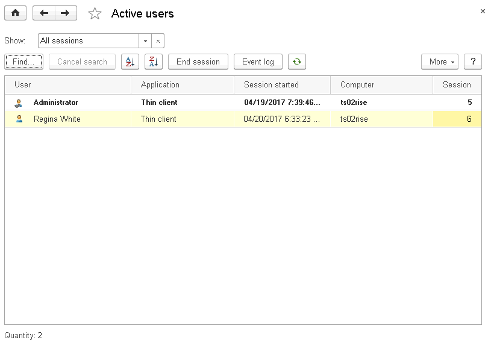
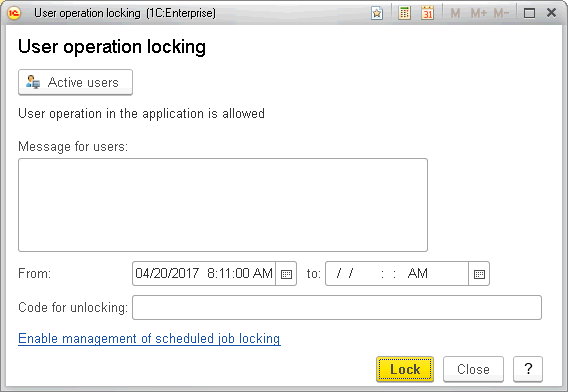
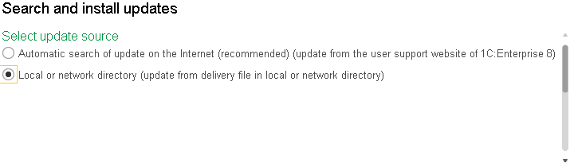
.. |image1521153994530742| image:: media/image370.png
   :width: 4.5in
   :height: 2.47917in
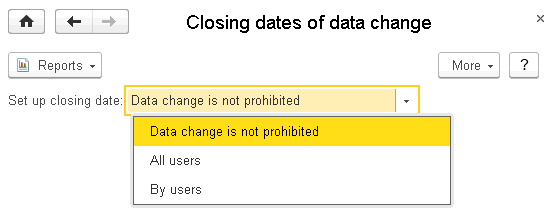
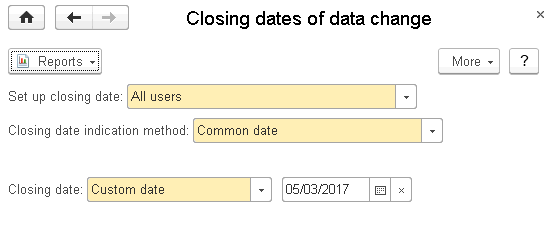
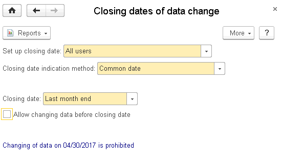
.. |image1521153992931923| image:: media/image374.png
   :width: 4.34375in
   :height: 3.86458in
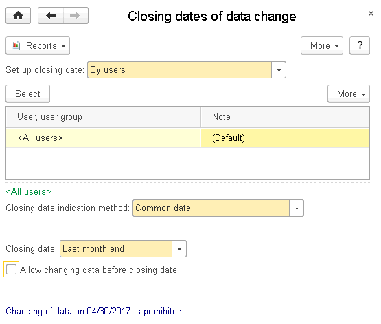
.. |image1521154001309418| image:: media/image376.png
   :width: 3.46875in
   :height: 2.47917in
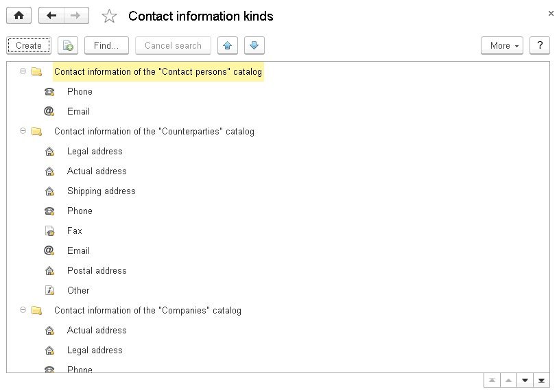
.. |image1521154001333511| image:: media/image378.png
   :width: 4.3125in
   :height: 3.09375in
.. |image1521154001359044| image:: media/image379.png
   :width: 4.52083in
   :height: 2.94792in
.. |image1521154001387620| image:: media/image380.png
   :width: 4.33333in
   :height: 3.28125in
.. |image1521153994578733| image:: media/image381.png
   :width: 4.63542in
   :height: 3.33333in
.. |image1521153991195902| image:: media/image382.png
   :width: 4.48958in
   :height: 3.5in
.. |image1521154001414002| image:: media/image383.png
   :width: 4.33333in
   :height: 2.94792in
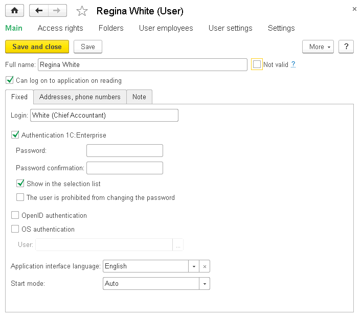
.. |image1521154001466450| image:: media/image385.png
   :width: 2.8125in
   :height: 1.11458in
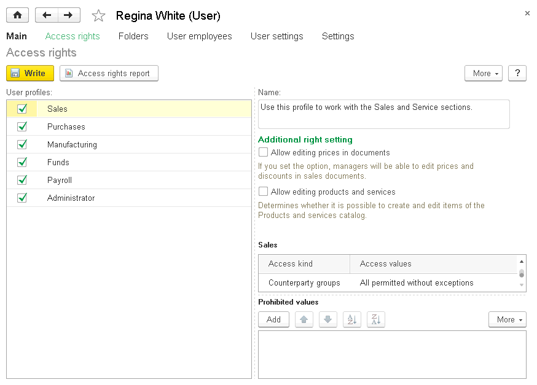
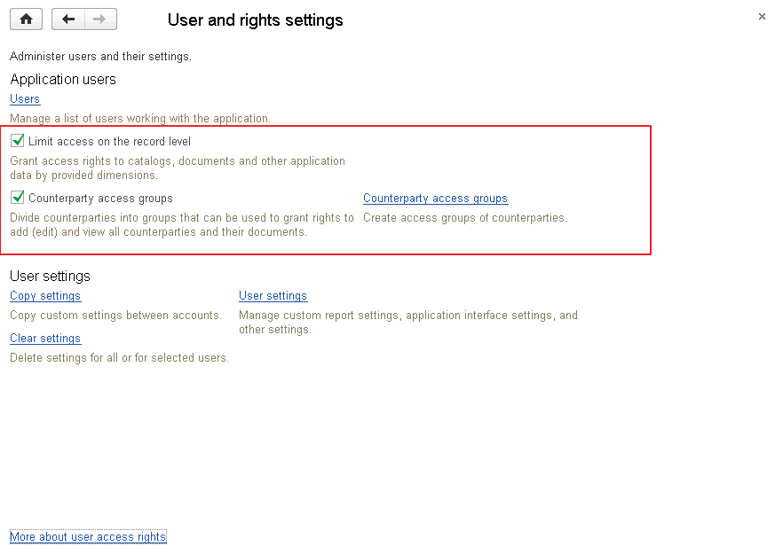
.. |image1521153994630971| image:: media/image388.png
   :width: 4.63542in
   :height: 3.51042in
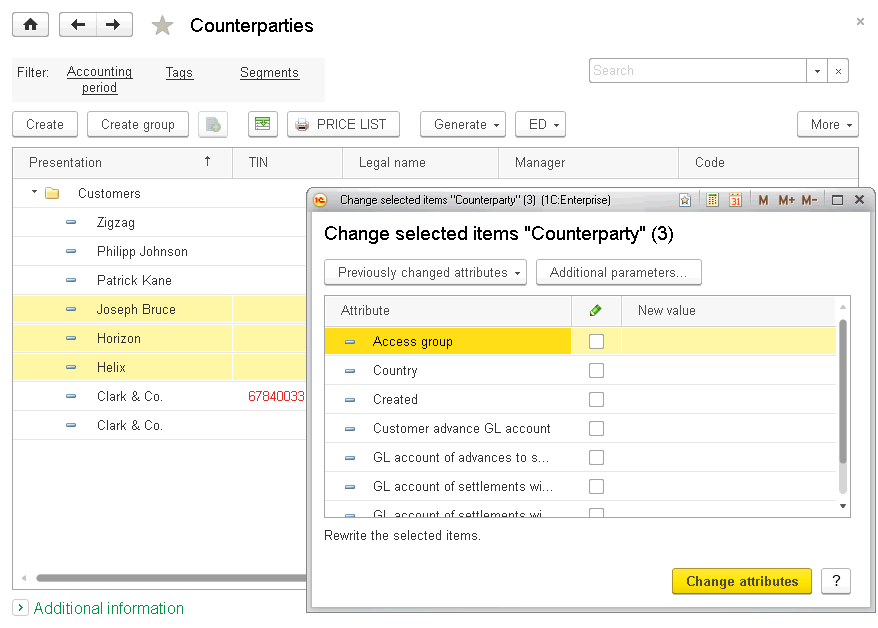

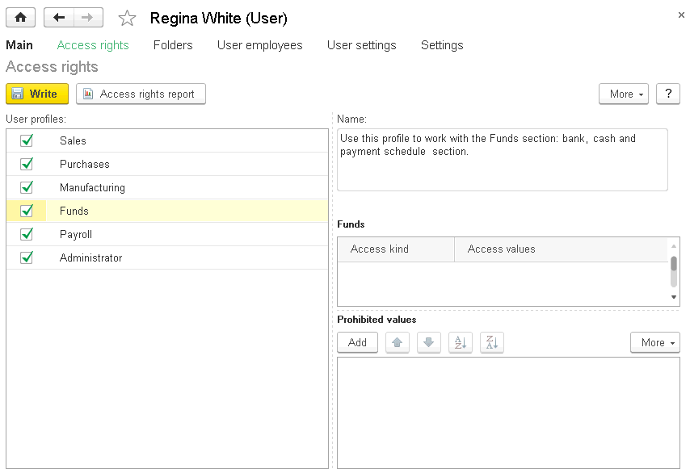
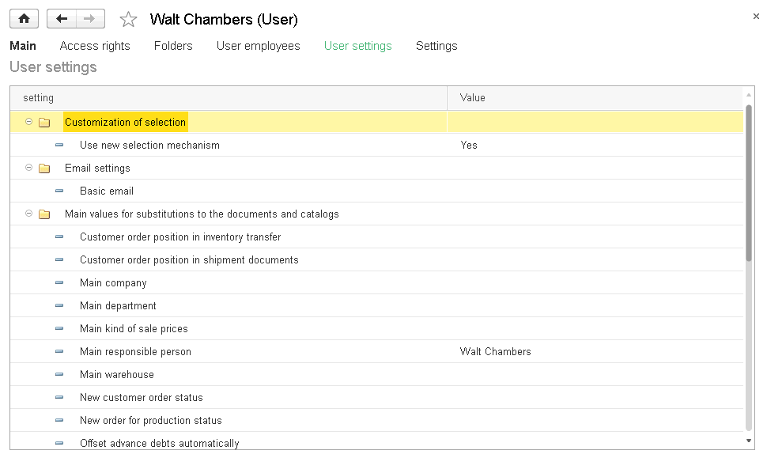
.. |image1521153995727137| image:: media/image393.png
   :width: 4.63542in
   :height: 4in
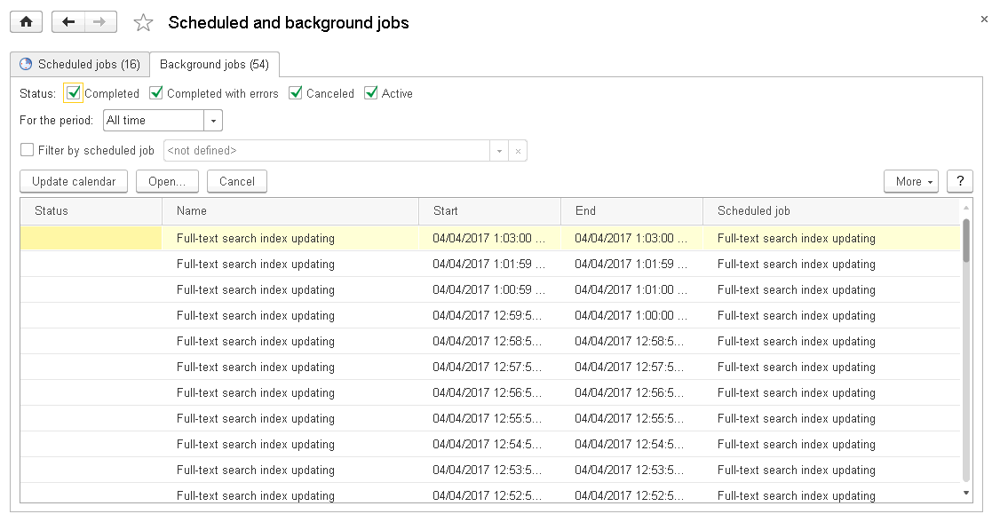
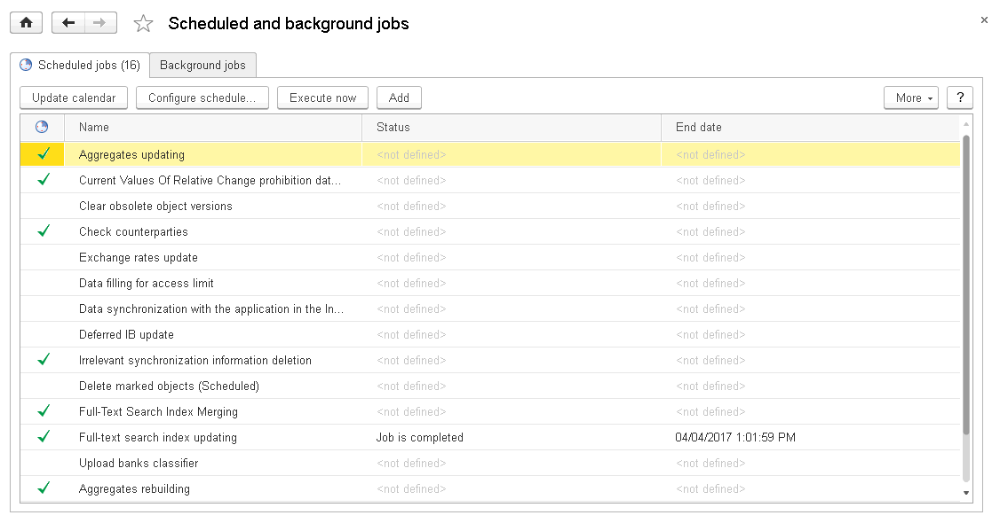
.. |image1521153990687627| image:: media/image396.png
   :width: 4.51042in
   :height: 2.98958in
.. |image1521154001574411| image:: media/image397.png
   :width: 4.33333in
   :height: 2.97917in
.. |image1521154001600653| image:: media/image398.png
   :width: 4.33333in
   :height: 2.875in
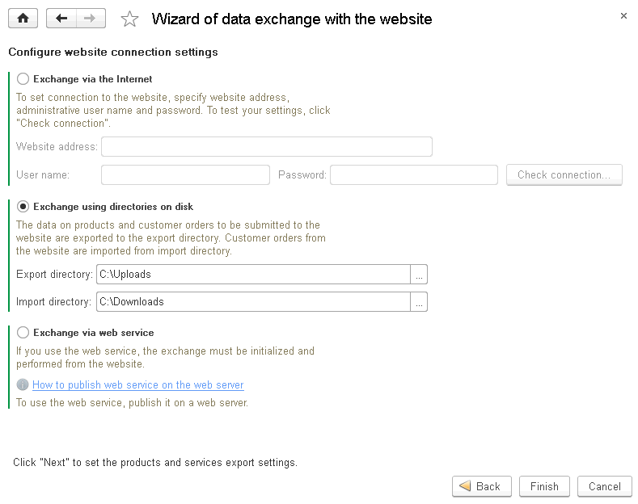
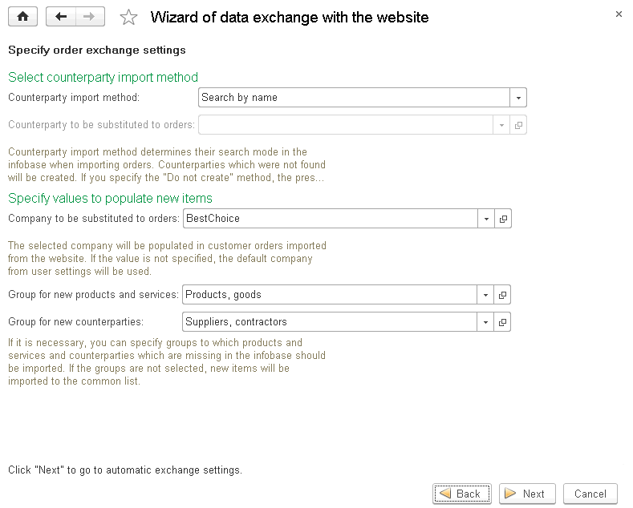
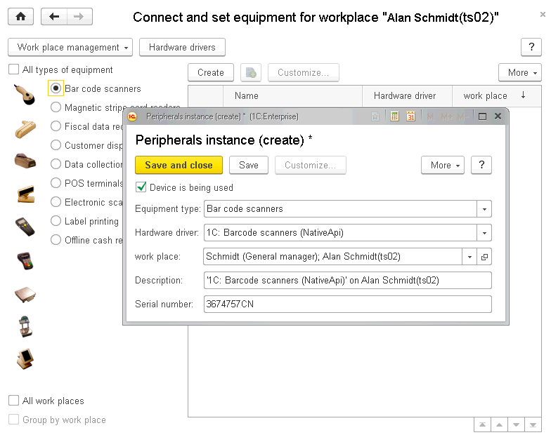
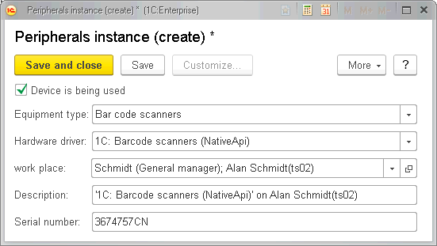
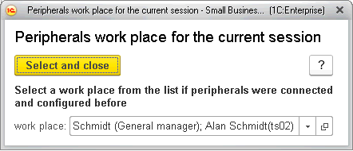
.. |image1521154001751527| image:: media/image404.png
   :width: 4.07292in
   :height: 3.41667in
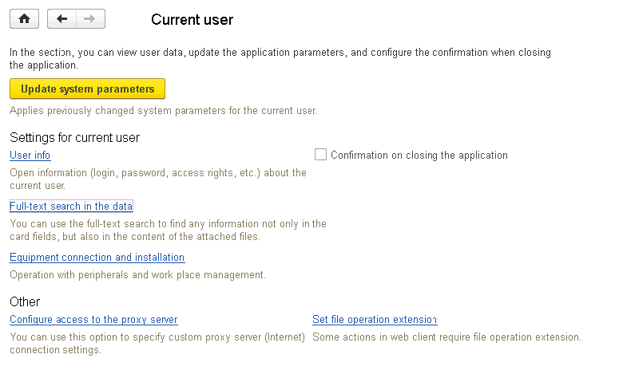
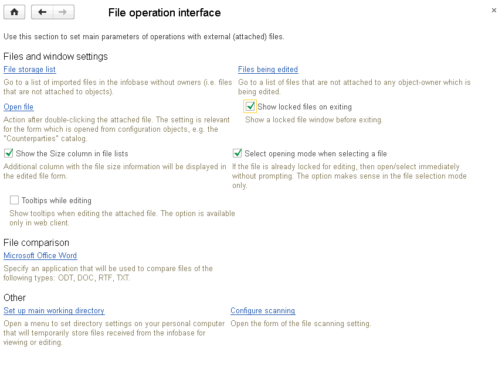
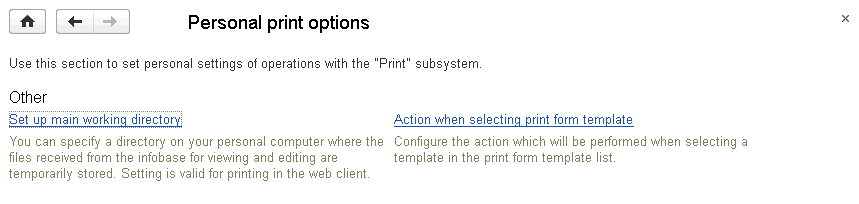
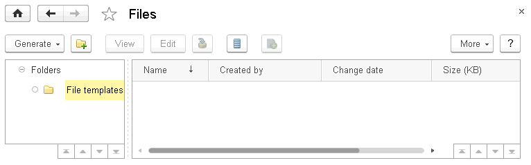
.. |image1521153994659951| image:: media/image409.png
   :width: 4.42708in
   :height: 2.89583in
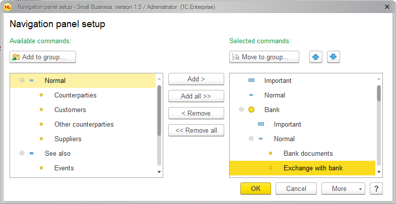
.. |image1521153994814790| image:: media/image411.png
   :width: 4.42708in
   :height: 2.16667in

.. |image1521153999825769| image:: media/image413.png
   :width: 0.27083in
   :height: 0.21875in
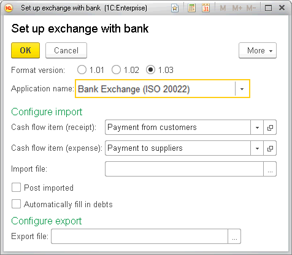
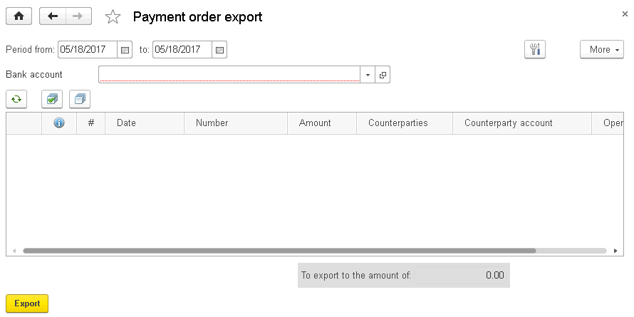
.. |image1521153999877746| image:: media/image416.png
   :width: 4.40625in
   :height: 2.35417in
