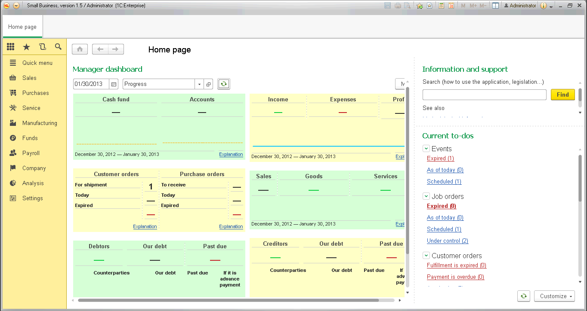
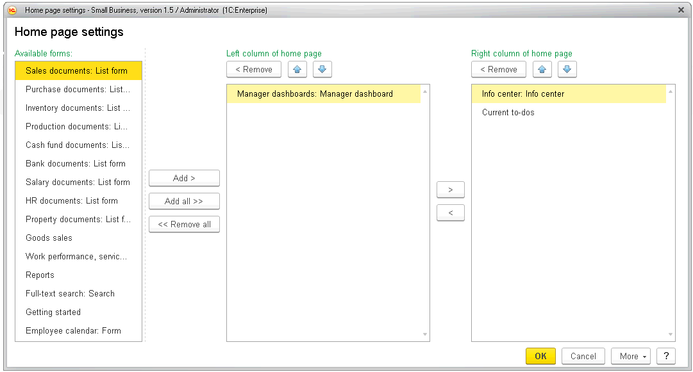
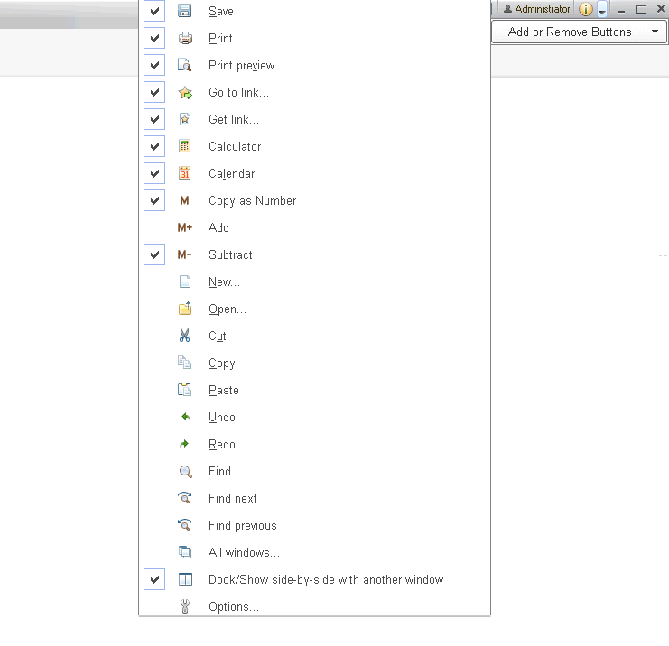
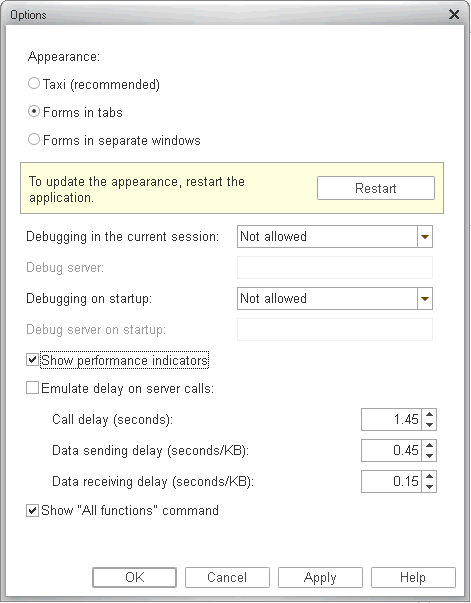
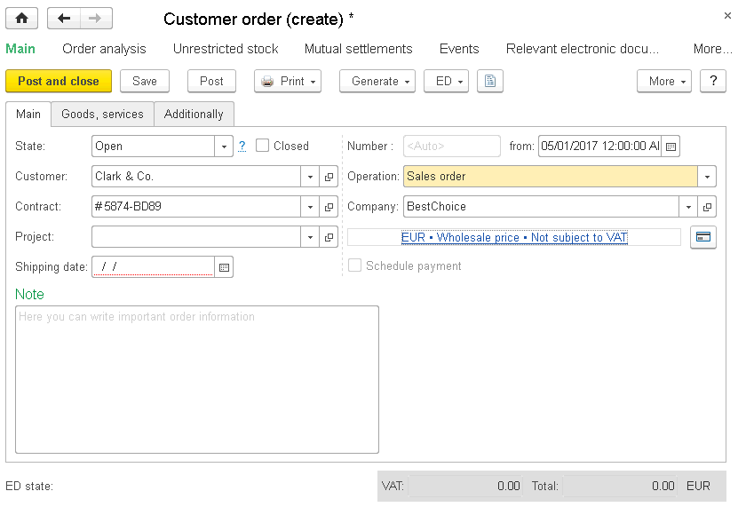
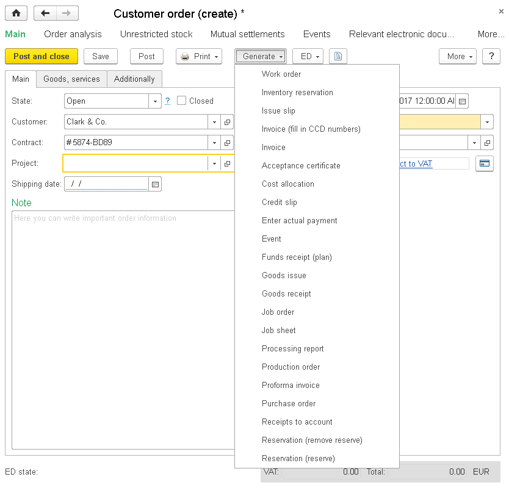
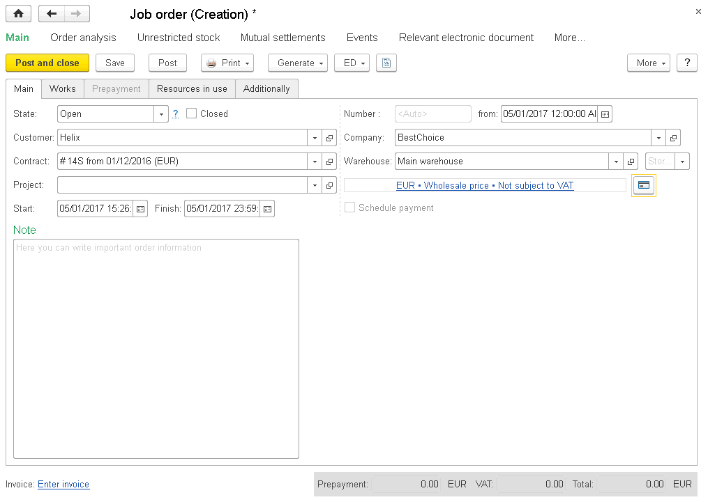
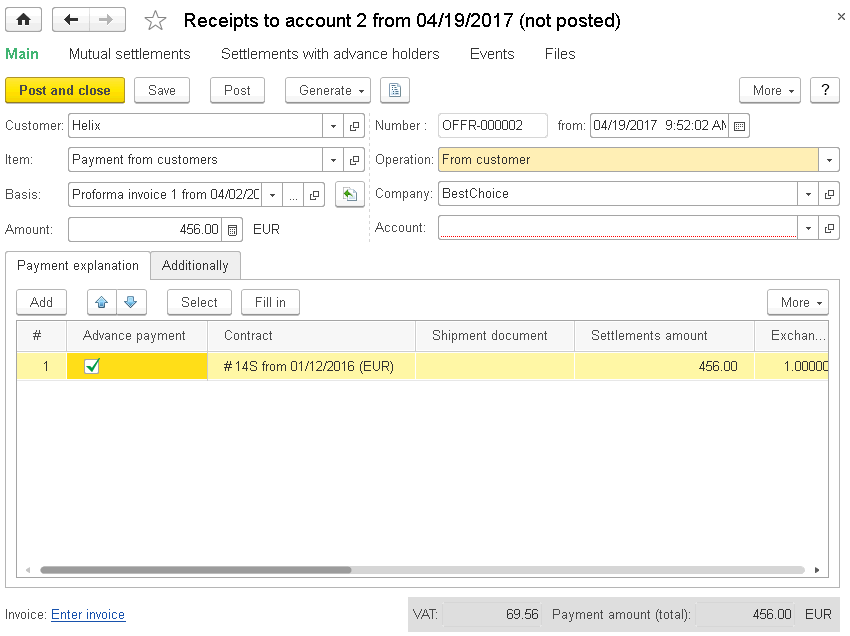

CHAPTER 13
==========

APPLICATION
~~~~~~~~~~~

APPLICATION INTERFACE
~~~~~~~~~~~~~~~~~~~~~

Starting from version 1.5, the application has the Taxi interface. The
interface key features are:

-  Large font

-  Maximum workspace on monitors with different resolution

-  Up-to-date interface design

-  Extended user friendliness

-  User-friendly navigation due to the following panels: Tools,
Favorites, History, and Full-text search

-  Simple and convenient search in lists, search management

-  Workspace customization

You can use the application main window to navigate through the
application, call commands, work with infobase objects (for example,
documents and list items). Use secondary windows to access the following
system functions: a calendar, a calculator and other.

To open a form, find an appropriate command in the interface (to open a
list, enter a document and other) and run it (click or press Enter).

|image1521154001799857|

The window design allows you to easily navigate through the application,
between areas, switch between opened windows and forms.

You can change the main window size by dragging the window edge.

Customizing workspace
~~~~~~~~~~~~~~~~~~~~~

With the Taxi interface, you can customize your workspace and locate
panels in the screen areas. To open the panel settings, in the **Main
menu** |image1521154001823198|,
click **View**, and then click **Panel settings**.

|image1521154001849227|

Drag panels to change their location in the screen areas.

In the bottom of the screen, you can see panels which are not shown in
the application window but can be added to the interface.

In the upper side of the window, you can see gray areas to which you can
drag the panels.

To add a panel to the interface, drag it to the area of available
panels. If there is another panel in the area, the new panel will be
displayed next to it. You can change an area of displayed panels by
dragging.

To remove a panel from the interface, drag it from the area of displayed
panels to the area of unused panels. To restore the default location of
panels, click **Default**.

To see the location change results, click **Apply**.

To finish editing the panel displaying, click **OK**.

Home page
~~~~~~~~~

When you start operating in the application, you can see Home page with
the **Getting started** form. Once you fill in information about the
company and enter opening balance, the home page forms will change. They
depend on a user profile. For instance, if you are a user with full
rights, you will see the **Manager dashboard** form and a list of
current to-dos on the home page.

|image1521154001871946|

Press **F6** to switch between home page forms.

In the application, you can select forms to display on the home page.
You can manage only those forms which are located on the home page.

To customize the home page, in the main menu, click **View**, and then
click **Home page setup**.

There are the following lists in the dialog box: **Available forms** and
column groups **Left column**, **Right column**. In the **Available
forms** list, you can see forms used neither in the left nor in the
right column.

|image1521154001898099|

You can drag forms from one list to another by clicking **Add >** and
**Add all >>**. You also can move them between columns by clicking **>**
and **<**. To remove a form from the column (return it to the list of
available forms), select it in the list, and then click **< Remove** or
double-click the form name in the list. To remove all forms from the
home page, click **<< Remove all**. You can also change the form
sequence in the columns using buttons. The forms are displayed on the
home page in the sequence set in the |image1521154001922573| settings.

During customization you can cancel changes made in this session or
earlier and restore the default settings. To restore the default
settings, in the **More** menu, click **Set default settings**. This
command does not immediately change the command interface. Once it is
completed, you can continue customization. To apply the settings, click
**OK**.

Customizing panels
~~~~~~~~~~~~~~~~~~

To configure or hide panels, use corresponding commands of the **View**
main menu.

|image1521154001947033|

From this submenu, you can control panel visibility and content of
sections panel, form navigation panels, and start page. With this
submenu, you can enlarge the form space. To hide all panels, in the main
menu, click **View**, and then click **Hide all panels** or press **Ctrl
+ Shift + `**.

Sections panel
~~~~~~~~~~~~~~

While customizing the sections panel, you can set a list of commands to
navigate to sections.

To open a dialog box of the sections panel, in the main menu, click
**View** – **Sections panel setup...**

|image1521154001976154|

To add a section to the panel, select it in a list of available sections
and then click **Add >**. In the dialog box, you can drag the list items
and select several lines.

To add all available sections to the panel, click **Add all >>**. You
can also move sections between the lists by double-clicking the section
in the list.

To delete all commands from the panel, click **Remove** and **Remove
all**.

You can change the section sequence in the panel using buttons in the
list command bar.

You can customize a presentation for any section. To do this, select an
item and set the required display method in the **Show** list:
**Picture**, **Text**, **Picture and text**.

To apply the selected settings and close the form, click **OK**. The
settings are saved in the infobase.

During customization you can cancel changes made in this session or
earlier and restore the default settings. To restore the default
settings, click **More**, and then click **Set default settings**. The
command interface will not be changed immediately. You can continue
customization.

Area of system commands of main and secondary window
~~~~~~~~~~~~~~~~~~~~~~~~~~~~~~~~~~~~~~~~~~~~~~~~~~~~

To add or remove standard command bar buttons of main or secondary
window, click a button |image1521154002003522|
(**Other buttons**) in the upper right side of the screen. A menu
appears. In this menu, hover the mouse pointer over the **Add or delete
buttons** item. A menu opens. In this menu, select or clear a check box
for the required command.

|image1521154002029975|

Command for which the check box is selected will be displayed in the
system command area of the window. Command for which the check box is
cleared will disappear from the area. To restore the settings, click
**Reset panel**.

Customizing form
~~~~~~~~~~~~~~~~

In the application, you can customize forms. To open the form editor, in
the form command bar, click **More**, and then click **Change form**.

|image1521154002054088|

In the left side of the window, you can see the form items as a tree. In
the right side, you can see a list of properties of the selected form
item.

Content and appearance of the form depend on the form items of several
kinds.

-  Groups (several kinds)

-  Tables

-  Fields (several kinds)

-  Buttons

These items have properties influencing their displaying on the form.
Hierarchical organization of the items determines their position on the
form.

You can change content, position, grouping and properties of the items.

To change position of the items in the hierarchy, click **Move up** and
**Move down** or drag the item to the required position.

You can set up properties for each item in the form item properties.
Whenever you select a property, its description is displayed in the
lower panel side.

To change item visibility on the form (hide or show), use check boxes
opposite the items. You cannot control visibility of the **Form** root
item and form setting button. Also you cannot change visibility of the
command bar with the **Change form...** button.

To add a group to the form, select the **Form** root item in the
structure tree, and then click **Add group**. In the group properties,
set the required kind (**Standard group**, **Pages**, **Command bar**).

The **Add fields** button is available for some fields. It means that
the data displayed in the field/column has attributes that can also be
displayed in the field/column. To add field attributes to the form,
select a form item, click **Add fields**, and then select the required
attributes in the window.

If you exit the editor, apply the settings by clicking **OK** or
**Apply**. The settings are saved in the infobase, so that later you can
apply them while opening the form.

You can cancel changes made both in this session and earlier and restore
the default configuration settings. To restore the default settings, in
the **More** menu, click **Set standard settings**. This command does
not immediately change the form. Once it is completed, you can continue
customization. To apply the settings, click **OK** or **Apply**.

System parameters
~~~~~~~~~~~~~~~~~

Developers and administrators can use the system parameters dialog box
to customize the application and configure a debugging mode.

To call a dialog box to configure parameter settings, in the main menu,
click **Tools**, and then click **Options**.

|image1521154002079741|

In the dialog box, you can set up the following parameters:

-  **Appearance**. To apply this parameter, restart the application.
This parameter depends on the application settings. The following
options are available:

-  **Taxi (recommended)**. Availability of this appearance depends on
the application settings.

-  **Forms in tabs**. For more information on this mode, see
«1C:Enterprise» 8.3 Guide. User Guide.

-  **Forms in separate windows**. For more information on this mode, see
«1C:Enterprise» 8.3. User Guide.

-  **Allow debugging in the current session**. If you select the check
box, debugging will be allowed in the executable copy of
«1C:Enterprise».

-  **Allow debugging on startup**. If you select the check box,
debugging will be allowed on the next restart of the application
copies.

-  **Show performance indicators**. If you select the check box,
performance indicators will be displayed in the window in the lower
left corner of the screen.

-  **Emulate delay on server calls**. Use this parameter to check the
configuration on slow connection.

-  **Show "All functions" command**. If you select the check box, the
**All functions** item gets available in the menu. You can see all
the configuration objects in the list no matter whether they are
included in the application interface. This option is available if a
user is authorized to use the **All functions** mode.

For more information about system parameters, see «1C:Enterprise» 8.3.
Developer Guide.

Managing windows
~~~~~~~~~~~~~~~~

You can open several secondary windows besides the main one during the
operation. The application allows you to manage and switch windows.

To manage windows, in the main menu, click **Windows**, and then click
**All windows**. The dialog box shows a list of opened windows.

To go to the required window, select it from the list and click **Go
to**. The dialog box will be closed automatically.

To close several windows, click them holding down **Shift**, and then
click **Close windows**. The main window cannot be closed from this
dialog box.

To switch between windows of the same session, press **Ctrl + Tab, Ctrl
+ Shift + Tab, Ctrl + Shift + F6**. To go to the next active window,
press **Ctrl + Tab** or **Ctrl + F6**. To go to the previous window,
press **Ctrl + Shift + Tab** or **Ctrl + Shift + F6**. Take into account
opened modal and blocking windows. Window covered by blocking window
will not be activated.

Windows of text and spreadsheet documents
~~~~~~~~~~~~~~~~~~~~~~~~~~~~~~~~~~~~~~~~~

Besides using accounting forms, with «1C:SimpleERP», you can work with
text and spreadsheet documents (reports and spreadsheet documents
created by users). Extended menu features for viewing and editing are
available for these windows.

Resetting window position
~~~~~~~~~~~~~~~~~~~~~~~~~

You can change position, size, and state of a window. When you close a
window, display settings will be saved and shown next time.

To reset the default position, size and state of a window, in the main
menu, click **Windows**, and then click **Reset main window size and
position**. The default display parameters will be restored.

KEY BUSINESS PROCESS EXAMPLE
~~~~~~~~~~~~~~~~~~~~~~~~~~~~

Let's have a look at a key business process example using the demobase
data.

WIND company assembles, sells, and installs air conditioners. Data on
products and services is already been entered into the infobase.

A customer contacts the company to order an air conditioner and have it
set up and installed.

New customer registration
~~~~~~~~~~~~~~~~~~~~~~~~~

To register a new customer, in the **Sales** section, in the actions
panel, click **Counterparty**. A customer information input form
appears.

|image1521153993199687|

If a customer is an individual, enter their last name and name in the
**Name** field.

Registering customer order and contract
~~~~~~~~~~~~~~~~~~~~~~~~~~~~~~~~~~~~~~~

To register a customer order, generate the corresponding document. You
can generate this document from a counterparty card just after
registration.

|image1521153992486731|

Specify a contract in the document, then fill in payment period fields.

|image1521153993128863|

Registering air conditioner release
~~~~~~~~~~~~~~~~~~~~~~~~~~~~~~~~~~~

A user selects a demand satisfaction source under the customer order.
The following sources are available in the application: production order
in the warehouse or in a company department, purchase order, warehouse
stock. In this case, divide the order into two parts as it is fulfilled
by different departments (one is responsible for assembly, and the other
is responsible for mounting).

You can generate the **Production order** document on the basis of the
**Customer order** document with the **Sales order** operation kind. The
new document is addressed to the **Assembly shop** department.

|image1521153992522009|

|image1521153996342099|

Air conditioner assembly is registered with the **Manufacturing**
document. You can generate it on the basis of the **production order**
document. To move the released air conditioner from the shop to a
warehouse to ship to the customer, you can enter the **Inventory
movement** document (on the basis of the **Manufacturing** document).
Specify a storage location which is a warehouse to move the air
conditioner to in the **Recipient** field. Or you can specify target and
source warehouses on the **Manufacturing** document form.

|image1521153994425361|

Proforma invoice
~~~~~~~~~~~~~~~~

You can create the **Proforma invoice** document on the basis of a
customer order.

|image1521153996522431|

Registering installation works
~~~~~~~~~~~~~~~~~~~~~~~~~~~~~~

You can register air conditioner installation and work acceptance either
with **Acceptance certificate** or **Job order**.

You can create an acceptance certificate on the basis of a customer
order (in this case, it contains all works and services ordered by the
customer and not related to air conditioner assembly including
installation and mounting) or on the basis of **Proforma invoice**.

|image1521153991675061|

The **Job order** document is entered independently. It is used as a
customer order, a proforma invoice, an acceptance certificate, and a
goods issue for the services sector with writing off direct material and
labor costs to it.

|image1521153995548272|

Receiving payment
~~~~~~~~~~~~~~~~~

To register payment for service in cash, use the **Credit slip**
document created based on the **Acceptance certificate** or **Customer
order** with the **Job order** operation kind. You can populate the
table field of the document form which displays payment details using
selection.

|image1521153993252185|

To register payment for service in non-cash, use the **Receipt to
account** document. You can enter it based on a customer order, an
invoice issued to a customer, or an acceptance certificate.

|image1521153996753191|

Using reports
~~~~~~~~~~~~~

You can generate reports at all stages of a business process.
Information from table fields of the **Customer order** documents is
shown in the **Settlements with customers** report.

Summary data on work performance and product manufacturing is shown in
the **Product release** report.

.. |image1521154001799857| image:: media/image417.png
   :width: 4.30208in
   :height: 2.61458in
.. |image1521154001823198| image:: media/image418.png
   :width: 0.10417in
   :height: 0.125in
.. |image1521154001849227| image:: media/image419.png
   :width: 3.46875in
   :height: 2.44792in

.. |image1521154001922573| image:: media/image422.png
   :width: 0.25in
   :height: 0.125in
.. |image1521154001947033| image:: media/image423.png
   :width: 4.0625in
   :height: 2.89583in
.. |image1521154001976154| image:: media/image424.png
   :width: 4.25in
   :height: 2.98958in
.. |image1521154002003522| image:: media/image425.png
   :height: 0.11458in

.. |image1521154002054088| image:: media/image427.png
   :width: 4.22917in
   :height: 3.80208in

.. |image1521153993199687| image:: media/image429.png
   :width: 4.63542in
   :height: 3.875in

.. |image1521153993128863| image:: media/image431.png
   :width: 4.625in
   :height: 3.91667in

.. |image1521153996342099| image:: media/image203.png
   :width: 4.63542in
   :height: 2.92708in
.. |image1521153994425361| image:: media/image90.png
   :width: 4.625in
   :height: 3.21875in
.. |image1521153996522431| image:: media/image433.png
   :width: 4.64583in
   :height: 3.88542in
.. |image1521153991675061| image:: media/image82.png
   :width: 4.63542in
   :height: 3.28125in

.. |image1521153993252185| image:: media/image434.png
   :width: 4.63542in
   :height: 3.46875in

