CHAPTER 2
=========

CONFIGURING USER SETTINGS
~~~~~~~~~~~~~~~~~~~~~~~~~

When you start working with the application, populate the company data
and enter opening balance. Use the **Company information filling**
**wizard** and **Opening balance input** **wizard** which allow you to
set up all the necessary parameters to start working immediately. You
can access the wizards from the **Quick menu** section.

|image1521153997883264|

To populate the company information, open the **Company information
filling** **wizard**, specify required data and create the company.

To enter balance for key accounting sections, use the **Opening balance
input wizard**. For remaining goods, settlements with suppliers, and
settlements with customers you can import data from spreadsheets (for
example: Microsoft Office Excel, OpenOffice Calc, and other) besides
manual input.

In this chapter, you will find more about initial application
customization.

Before starting using the application, populate main catalogs and set up
user operations:

-  Define a user list

-  Assign user roles and select the interface

-  Set the default attribute values

-  Create a list of responsible persons

You can populate main classifiers, define a user list and assign user
roles in the **Settings** section.

Setting up accounting
~~~~~~~~~~~~~~~~~~~~~

In the **Settings** section, you can access accounting settings of the
following sections:

-  Company

-  Sales

-  Purchases

-  Service

-  Manufacturing

-  Funds

-  Payroll

Company settings section
~~~~~~~~~~~~~~~~~~~~~~~~

There are the following accounting settings in the **Company** settings
section:

-  Companies

-  Departments

-  Business areas

-  Company resources

-  Other settings

|image1521153993051115|

Companies
~~~~~~~~~

Click **Set up company accounting** to access check boxes which allow
you to keep accounting of several companies and for the company as a
whole:

-  If you keep accounting by several companies in the application,
select the **Keep accounting by several companies in the infobase**
check box.

-  If you keep accounting by a company (association of several
companies, one of them operates as the company), select the **Keep
accounting by "Company – subsidiaries"** check box and specify the
company in the selection field.

To access a company card or the **Companies** catalog, click **Companies
catalog**. Use the catalog to store the company structure. The company
may include several business entities held by one owner or owner group
acting together to profit.

The following entities may act as companies:

-  Legal entities

-  Individuals

You can use the catalog for storing static information identifying
companies and additional data required to keep accounting in the unified
infobase. There is also static data that identifies the company in terms
of company management accounting.

You can use the **Companies** catalog to keep an unlimited list of
companies.

|image1521153992855473|

Enter company information in a dialog box.

|image1521153992043999|

Enter an abbreviated company name in the **Short name** field. Use the
radio button to specify whether the company is a legal entity or an
individual. Depending on the company, there are different attributes to
fill in.

Set a document prefix (the **Prefix** field) for each company that will
be used in the company name when registering documents.

In the **Full name** field, specify an official company name that will
be used when printing documents.

On the **Attributes** tab, you can specify attributes to fill in the
company classification codes, a business calendar, accounts, cash fund.

**Business calendar** is integrated in the application and can be
updated as the calendar is approved or holidays are transferred. You can
keep several business calendars.

On the basis of the business calendar, you can make calculations,
establish schedules for departments and employees.

|image1521153991920416|

On the **Addresses** tab, you can see legal and actual addresses and
arbitrary contact information. For the company, you can specify, for
example, Director mobile phone number, Supply Department phone number,
security phone number, and other.

|image1521153990835985|

On the **Print settings** tab, you can select the company's logo and
facsimile from the attached files to use them in the **Proforma
invoice** document print form. You can also use the logo in a print form
of the company's price list.

Company accounts
~~~~~~~~~~~~~~~~

You can enter information on company accounts into the **Bank accounts**
catalog subordinate to the **Companies** catalog. You can access the
catalog by clicking the corresponding link in the navigation panel of
the catalog. In the **Bank account** field of the **Attributes** tab,
specify a bank account that will be used by default for the company. To
do it, click the |image1521153997908714|
button and select **Show all**. A dialog box appears showing a list of
available bank accounts. You can add a bank account to it by clicking
**Create**.

|image1521153997932054|

In the bank account card, specify its number, kind (current, loan,
deposit, or other), and currency. Select an account kind according to
the requirements for account statements.

Specify attributes of the **Bank** tab using the **Banks** catalog. You
can add a new bank when entering the account data.

If you select the **Payments are conducted via correspondent account
opened in other bank (settlement bank)** check box, an attribute group
where you can enter information on the correspondent bank will become
available.

On the **Print settings** tab, you can set print options of payment
orders.

On the **Additionally** tab, specify dates when the account was
opened/closed, and edit GL accounts.

Responsible persons
~~~~~~~~~~~~~~~~~~~

You can specify a list of company's responsible persons for automatic
insertion into document print forms. Use the **Responsible persons**
information register subordinate to the **Companies** catalog.

|image1521153997958530|

The register contains a list of employees assigned as company
responsible persons. For each employee, in the **Period** field, specify
a date since they are assigned as responsible persons, a company, a
position. You can also select a responsible person type from the
drop-down list. There are the following types of responsible persons:

-  Manager

-  Chief Accountant

-  Cashier

-  Storekeeper

Positions
~~~~~~~~~

Value of the **Position** attribute of the **Responsible persons**
information register is an item of the **Positions** catalog. You can
use the **Positions** catalog to store a list of employee positions.

|image1521153998283790|

Employees
~~~~~~~~~

The **Employee** attribute value of the **Responsible persons**
information register is an item of the **Employees** catalog. Use the
**Employees** catalog to store information on company employees.

|image1521153997987965|

Information related to individual's labor activity is specified in the
catalog.

|image1521153998014657|

The list of individuals is stored in the **Individuals** catalog. Every
employee corresponds to an individual. You can specify an employment
type (primary or secondary) and GL accounts of salary settlements for an
employee.

To register an individual as a company employee, register the **Hiring**
document. To access this document later, click **Employee information**
in the navigation panel of an employee card.

Individuals
~~~~~~~~~~~

You can use the **Individuals** catalog to store information on
employees and counterparties not related to employment duties, for
example, last name, name, date of birth and other. To access the
catalog, in the **Payroll** section, in the navigation panel, click the
corresponding link.

|image1521153998039265|

The catalog items can be divided into arbitrary groups and subgroups
with unlimited nesting levels. You can also divide individuals by
additional characteristics. On the **Addresses** tab, you can specify
contact information of an individual.

|image1521153995193513|

Information on identity documents can be populated on a separate form.

You can also use a separate form to fill in an individual's full name.

|image1521153998065539|

If additional attributes or additional information are specified for an
individual, the corresponding tab or button for opening additional
information list appears. When populating the individual's card, you can
specify values of these attributes and information besides general
information.

Additional attributes and information and their possible values are
defined in catalogs **Additional attributes** and **Additional
information** if the **Additional information and attributes** check box
is selected in general settings of the **Settings** section.

Departments
~~~~~~~~~~~

To access the department list, click **Business units** catalog. Enter
this data for each company.

|image1521153998091969|

On the **Main** tab, specify a name and department type for each
business unit.

|image1521153998117928|

In the **Addresses** section, specify an actual address and phone of the
department.

Click **View and edit parameters of inventory auto movement** in the
business unit form to access the dialog box for entering and changing
parameters of inventory movement for default insertion into inventory
accounting documents.

|image1521153995444332|

Business areas
~~~~~~~~~~~~~~

If you keep accounting for several business areas in the application,
select the **Accounting by business areas** check box.

To access information on the company's business areas, click **Business
areas** catalog.

|image1521153990886820|

You can use the catalog items as income and expense accounting
dimensions, financial result.

Specify GL accounts for business areas to record revenue, sales cost,
and account of profit (loss).

Chart of accounts
~~~~~~~~~~~~~~~~~

Use **Chart of accounts** when entering business areas to specify GL
accounts of income and expenses.

|image1521153998143192|

To access chart of accounts, click **Chart of accounts** in the
navigation panel of the **Company** section. The link is available in
the **Company** group.

Company resources
~~~~~~~~~~~~~~~~~

In the **Company resources** catalog, you can store information about
company resources used to perform job orders and production orders. To
access the catalog, in the **Settings** section, in the **Company**
accounting parameter settings, click **Company resources catalog**.

|image1521153993075966|

Other
~~~~~

In the **Other** section, you can configure the following company
accounting settings:

-  If you plan to keep accounts of income and expenses using cash method
(acc. to payment) in addition to accrual method (acc. to shipment),
select the **Cash method of income and expenses accounting** check
box.

-  If you plan to register company budget in the application, select the
**Use budgeting** check box.

-  If you plan to include products and services SKU in print forms,
select the **Include products and services SKU in print forms** check
box.

-  If you plan to keep accounting of capital assets and calculate
monthly depreciation in the application, select the **Use property
accounting** check box.

Sales settings section
~~~~~~~~~~~~~~~~~~~~~~

Use this section to set up parameters of sales and configure settings
for accounting of retail sales and commission trade.

In this section, you can set maximum payable deferral period used for
insertion into the corresponding attribute of a contract with customer.
Select check boxes to use discounts and markups, receive and transfer
goods for commission, store information about projects and group
customer orders into projects.

|image1521153996985613|

Retail
~~~~~~

You can select the corresponding check boxes to keep accounting of
retail sales, archive and delete non-issued cash receipts when closing a
register shift, control remaining goods when issuing cash receipts.

Cash registers
~~~~~~~~~~~~~~

You can use the **Cash registers** catalog to store information on
company cash registers. To access the catalog, in accounting parameter
settings, click **Cash registers catalog**. The catalog is available if
the **Retail sales accounting** check box is selected.

|image1521153998168296|

POS terminals
~~~~~~~~~~~~~

You can use the **POS terminals** catalog to store information on
company POS terminals. To access the catalog, in the form of accounting
parameter settings, click **POS terminals catalog**. The catalog is
available if the **Retail sales accounting** check box is selected.

Customer orders
~~~~~~~~~~~~~~~

In the application, you can keep records of order states using main or
simplified scheme (recommended option). If you use simplified scheme,
the following order states are available: **In progress**, **Completed**
and **Open**. To change them, click a corresponding command in the
order. Main scheme is used when the above mentioned states are not
enough. In this case, select a required state in the order manually.

To keep records of customer order states using simplified scheme, fill
in fields "**In progress" state** and "**Completed" state** without
selecting the **Several customer order states** check box. By default,
the fields are populated with the recommended values.

If the **Several customer order states** check box is selected, you can
open the catalog and fill in information on production order states that
will be used in the company by clicking **Customer order states
catalog**.

|image1521153992551014|

Purchases settings section
~~~~~~~~~~~~~~~~~~~~~~~~~~

Use this section to set up accounting parameters of purchases and
inventory in company warehouses and production.

By selecting check boxes, you can start using the following advanced
options:

-  Accounting by several warehouses

-  Accounting in various units of measure

-  Accounting by characteristics

-  Accounting by batches

-  Accounting by bins

-  Two-phase warehouses

-  Inventory reservation in warehouses and expected receipts

-  Several purchase order states

-  Inventory receipt and transfer for safe custody

-  Transfer of raw materials and materials to processing, etc.

In this section, you can set up a default due date of payment to
supplier used for insertion into the corresponding attribute of a
contract with supplier.

|image1521153996726666|

Warehouses
~~~~~~~~~~

To access the catalog with business units of the company, in the form of
accounting parameter settings, click **Business units catalog**.

|image1521153997804620|

On the **Main** tab, specify a type, a retail price kind, an inventory
custodian for every business unit.

|image1521153995624780|

In the **Addresses** section, specify a warehouse address and phone
number.

Click **View and edit parameters of inventory auto movement** in the
business unit form to access the dialog box for entering and changing
parameters of inventory movement for default insertion into inventory
accounting documents.

|image1521153995444332|

For every business unit, you can assign an arbitrary number of storage
bins. To assign bins, navigate to the **Warehouse bins** catalog form.
Specify a name for every bin, unlimited nesting levels are allowed.

|image1521153997754466|

Purchase order states
~~~~~~~~~~~~~~~~~~~~~

In the application, you can keep records of purchase order states using
main or simplified scheme (recommended option). If you use simplified
scheme, there are the following purchase order states: **In progress**,
**Completed** and **Open**. You can change them by clicking a
corresponding command in the order. Main scheme is used when the above
mentioned states are not enough. In this case, select a required state
in the order manually.

To keep records of purchase order states using simplified scheme, fill
in fields **"In progress" state** and **"Completed" state** without
selecting the **Several purchase order states** check box. By default,
the fields are populated with the recommended values.

If the **Several purchase order states** check box is selected, you can
open the **Purchase order states catalog** and fill in information on
purchase order states that will be used in the company.

|image1521153996024849|

Service settings section
~~~~~~~~~~~~~~~~~~~~~~~~

In the section, you can specify accounting settings of job order states.

|image1521153997141759|

In the application, you can keep records of job order states using main
or simplified scheme (recommended option). If you use simplified scheme,
the following job order states are available: **In progress**,
**Completed** and **Open**. To change them, click a corresponding
command in the order. Main scheme is used when the above mentioned
states are not enough. In this case, select a required state in the
order manually.

To keep records of job order states using simplified scheme, fill in
fields "**In progress"** **state** and "**Completed"** **state** without
selecting the **Several job order states** check box. By default, the
fields are populated with the recommended values.

If the **Several job order states** check box is selected, you can open
the **Job order states** catalog and fill in information on job order
states that will be used in the company.

Manufacturing settings section
~~~~~~~~~~~~~~~~~~~~~~~~~~~~~~

The section contains settings of product manufacturing accounting.

By selecting check boxes, you can start using the following advanced
options:

-  Several production order states

-  Technological operations in bill of materials and job sheets

-  Processing of supplier's raw materials

|image1521153995751392|

Production order states
~~~~~~~~~~~~~~~~~~~~~~~

In the application, you can keep records of production order states
using main or simplified scheme (recommended option). If you use
simplified scheme, the following production order states are available:
**In progress**, **Completed** and **Open**. To change them, click a
corresponding command in the order. Main scheme is used when the above
mentioned states are not enough. In this case, select a required state
in the order manually.

For accounting of production order states using simplified scheme, fill
in fields "**In progress" state** and "**Completed" state** without
selecting the **Several production order states** check box. By default,
the fields are populated with the recommended values.

If the **Several production order states** check box is selected, you
can open the **Production order states catalog** and fill in information
on production order states that will be used in the company.

|image1521153996315875|

Funds settings section
~~~~~~~~~~~~~~~~~~~~~~

Use this section to access cash accounting settings. By selecting the
corresponding check boxes, you can enable the following options: keeping
multi-currency accounting, keeping a payment calendar, automatic advance
and debts set-off when posting documents.

|image1521153994034030|

If you keep records in foreign currency different from the national one
in the application, select the **Keep records in foreign currency**
check box and select the accounting currency.

From the **Funds** settings section you can access the following
catalogs:

-  **Currencies**

-  **Cash funds**

Currencies
~~~~~~~~~~

Use the **Currencies** catalog to store information about currencies
used in the company. For more information, see the Currencies section.

Cash funds
~~~~~~~~~~

With the solution, you can keep cash accounting in several cash funds of
the company.

Use the **Cash funds** catalog to record actual cash storage locations
and cash flow (cash offices, department manager safe-deposit boxes).

|image1521153998192592|

The same cash fund can be used by different companies. Funds in
different currencies can be kept in the same cash fund.

Tooltip

To automatically insert currencies in cash documents, you can specify
the default currency for the cash fund.

Information on a new cash fund is entered in a dialog box. You can
specify the following information on each cash fund: name (for example,
**Director cash fund**, **Main cash fund**), default cash currency of
the cash fund, and GL account of funds. You can select currency from the
drop-down list whose options depend on the **Currencies** catalog.

|image1521153998220490|

When registering documents accompanying receipt and issue of cash
(credit and debit slips), in the catalog, select a cash fund that
received or issued cash.

Payroll settings section
~~~~~~~~~~~~~~~~~~~~~~~~

In this section, you can configure HR recordkeeping and payroll
settings. Select the corresponding check boxes to enable accounting of
internal secondary job employees, staff list, income tax recording.

|image1521153996185544|

.. _positions-1:

Positions
~~~~~~~~~

You can use the **Positions** catalog to store a list of employee
positions. To access the catalog, in the **Payroll** section, in the
**See also** group, click **Positions**.

|image1521153998256992|

Working time kinds
~~~~~~~~~~~~~~~~~~

You can use the **Working time kinds** catalog to designate used working
time kind in a timesheet. To access the catalog, in the **Payroll**
section, in the **See also** group, click **Working time kinds**.

|image1521153997727675|

Document kinds of individuals
~~~~~~~~~~~~~~~~~~~~~~~~~~~~~

You can use the **Document kinds** **of individuals** catalog to store a
list of identity document kinds. To access the catalog, in the
**Payroll** section, in the **Catalogs** group, click **Document kinds**
**of individuals**.

|image1521153995163977|

 

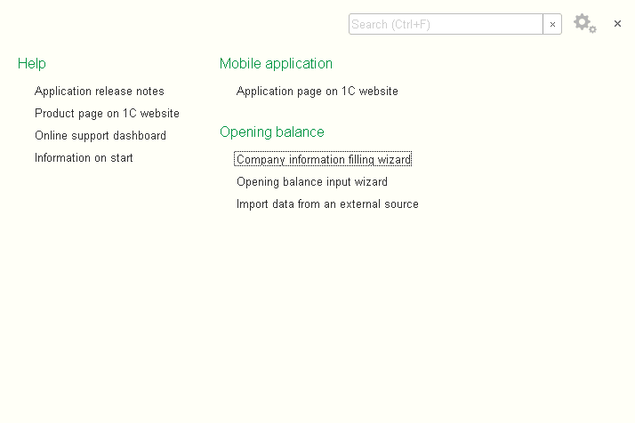
.. |image1521153993051115| image:: media/image2.png
   :width: 4.63542in
   :height: 4.375in
.. |image1521153992855473| image:: media/image3.png
   :width: 4.63542in
   :height: 1.36458in
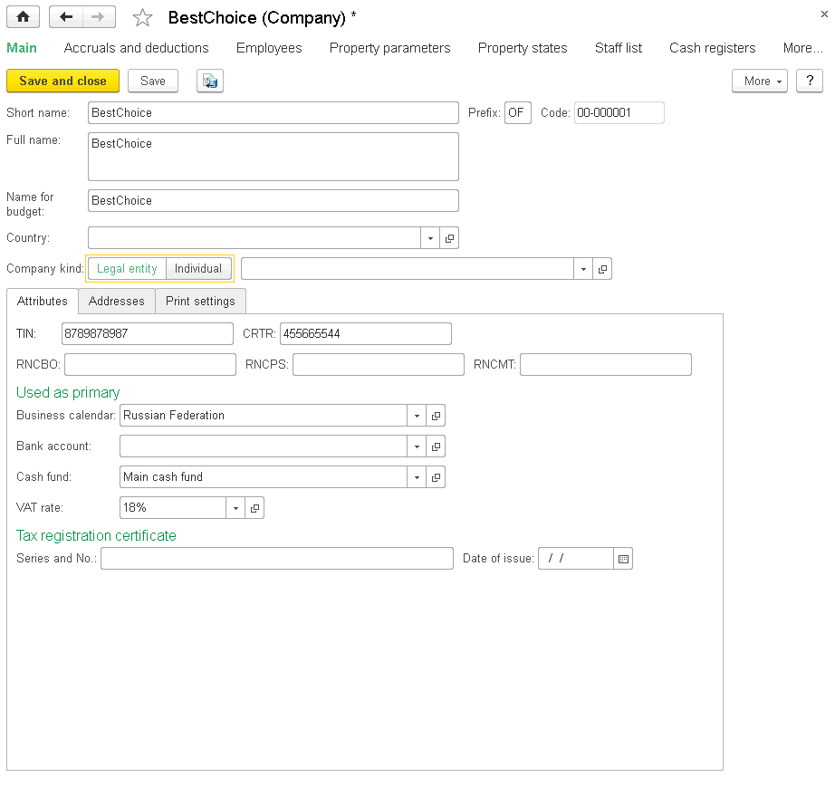
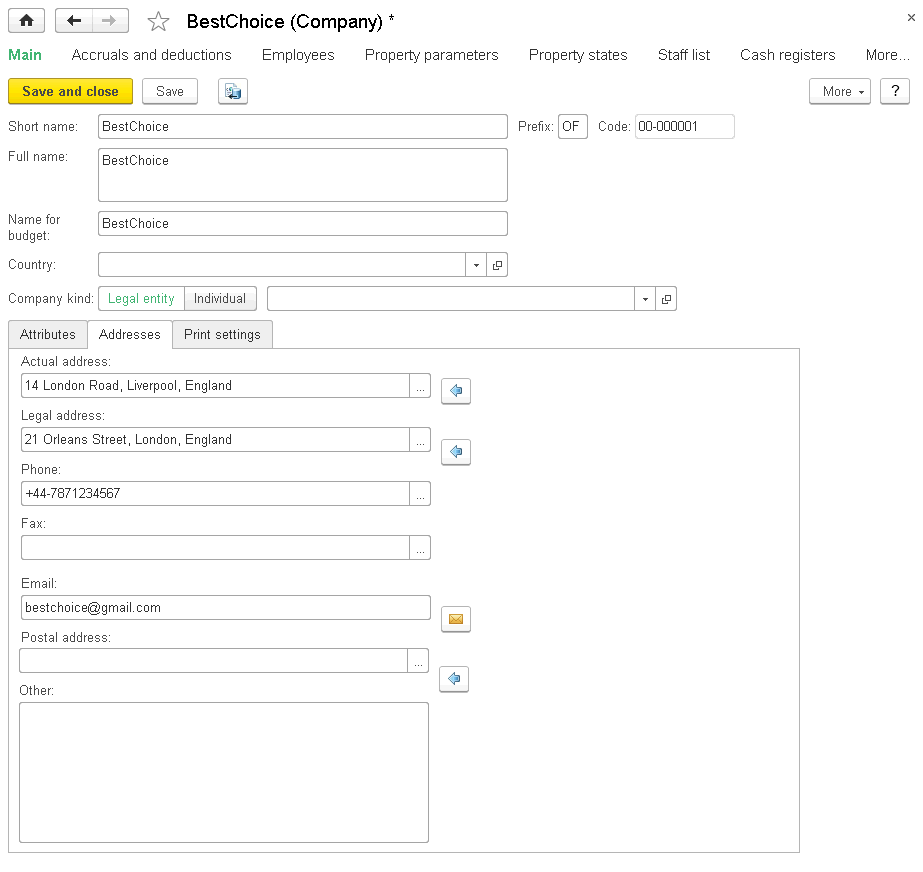
.. |image1521153990835985| image:: media/image6.png
   :width: 4.63542in
   :height: 2.52083in

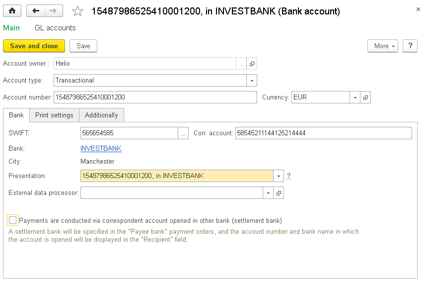

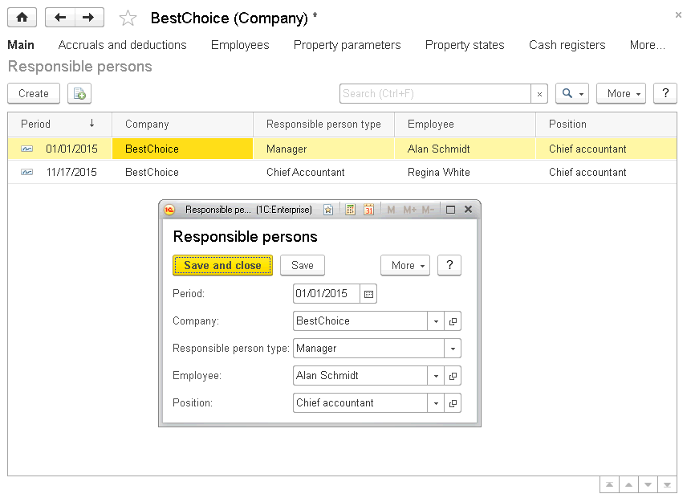
.. |image1521153998283790| image:: media/image10.png
   :width: 3.69792in
   :height: 3.53125in
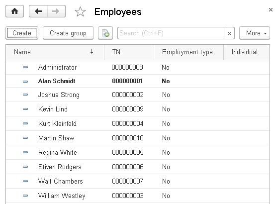
.. |image1521153998014657| image:: media/image12.png
   :width: 3.875in
   :height: 2.04167in
.. |image1521153998039265| image:: media/image13.png
   :width: 3.9375in
   :height: 3.20833in
.. |image1521153995193513| image:: media/image14.png
   :width: 4.63542in
   :height: 5.28125in
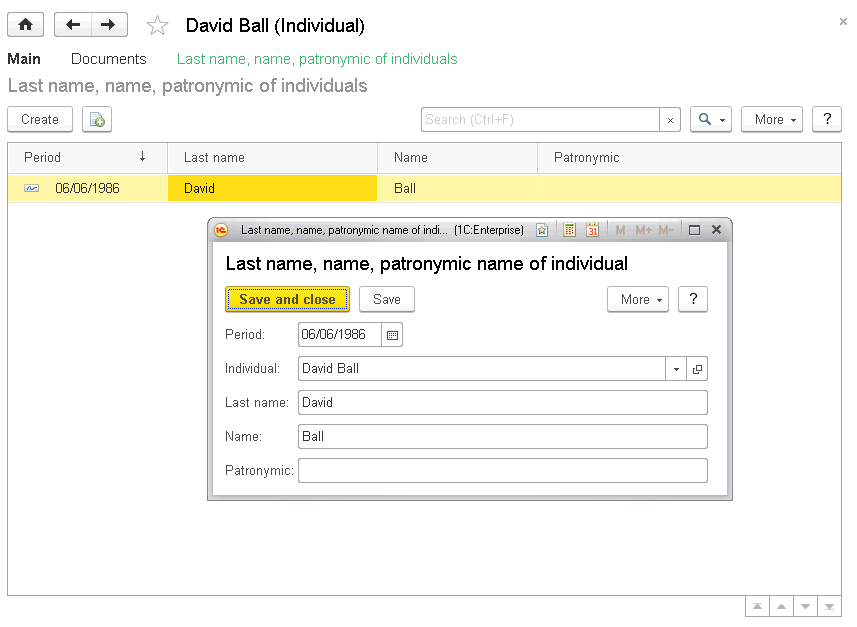
.. |image1521153998091969| image:: media/image16.png
   :width: 3.96875in
   :height: 2.04167in
.. |image1521153998117928| image:: media/image17.png
   :width: 4.33333in
   :height: 2.75in
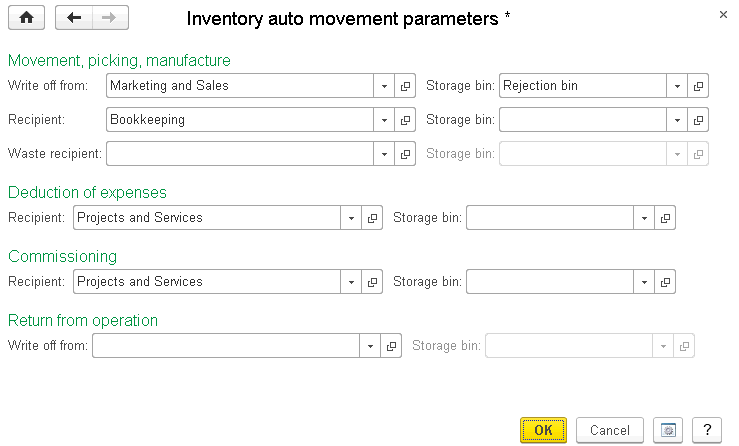
.. |image1521153990886820| image:: media/image19.png
   :width: 4.44792in
   :height: 3.08333in
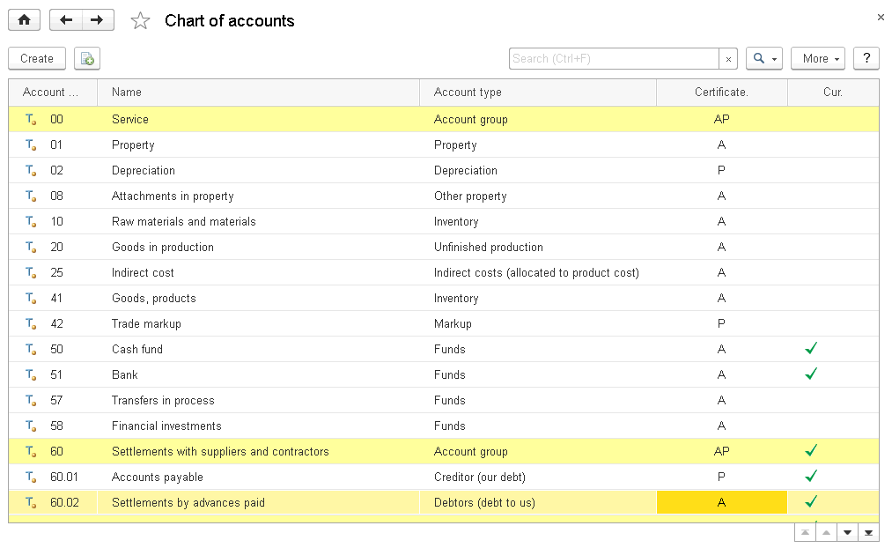
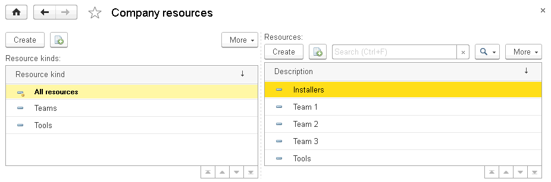
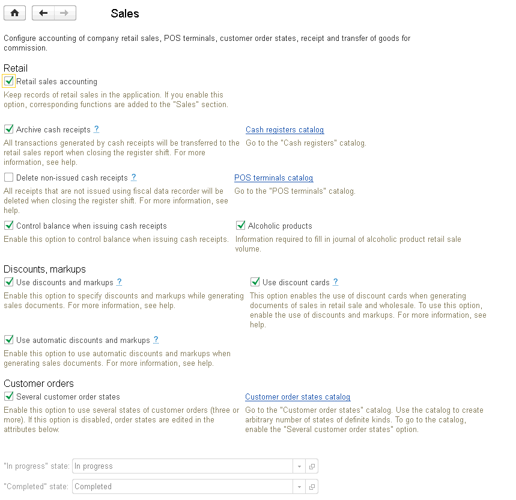
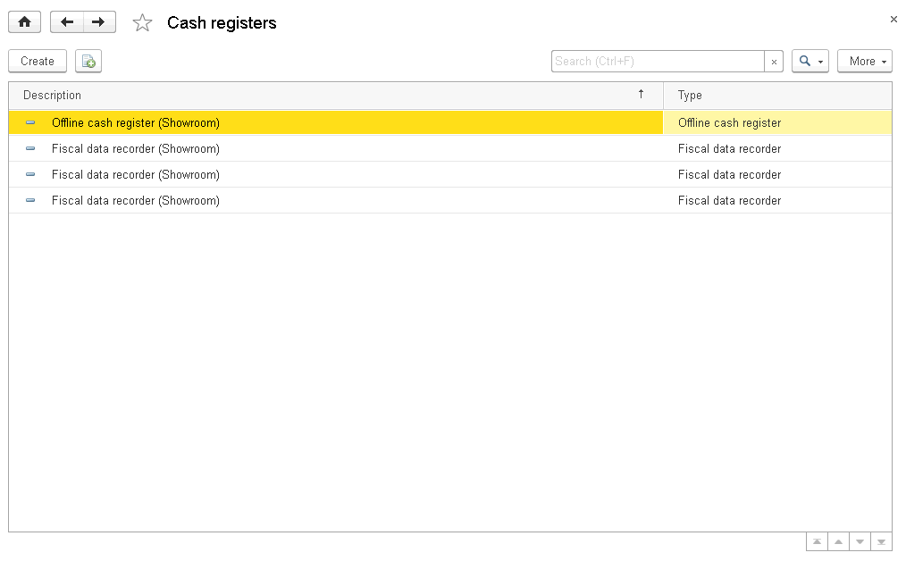
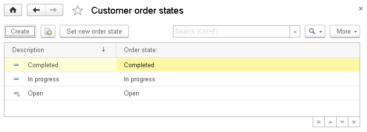
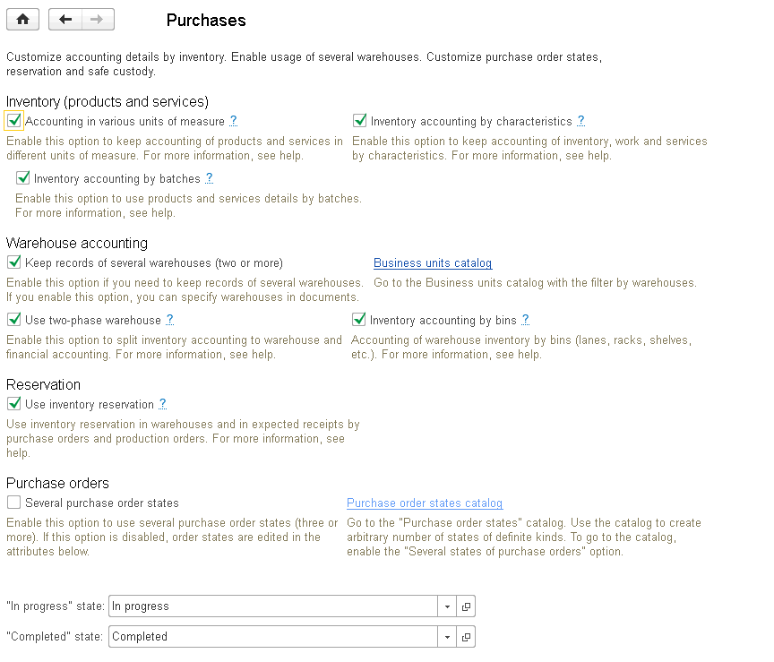
.. |image1521153997804620| image:: media/image26.png
   :width: 4.63542in
   :height: 1.34375in
.. |image1521153995624780| image:: media/image27.png
   :width: 4.63542in
   :height: 3.4375in

.. |image1521153997754466| image:: media/image28.png
   :width: 4.63542in
   :height: 1.9375in
.. |image1521153996024849| image:: media/image29.png
   :width: 4.63542in
   :height: 1.94792in
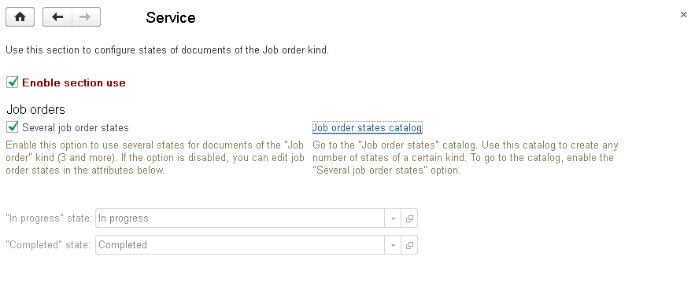
.. |image1521153995751392| image:: media/image31.png
   :width: 4.67708in
   :height: 2.75in
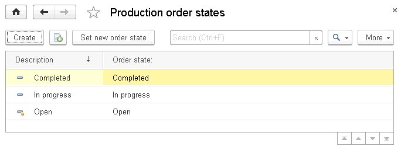
.. |image1521153994034030| image:: media/image33.png
   :width: 4.625in
   :height: 2.15625in
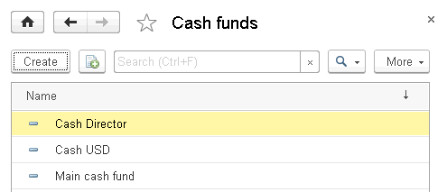
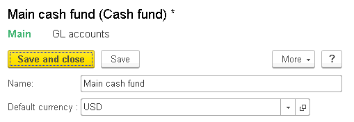
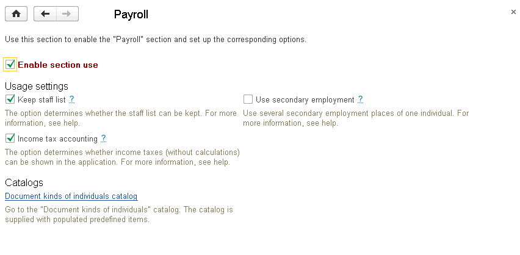
.. |image1521153998256992| image:: media/image10.png
   :width: 3.66667in
   :height: 3.75in
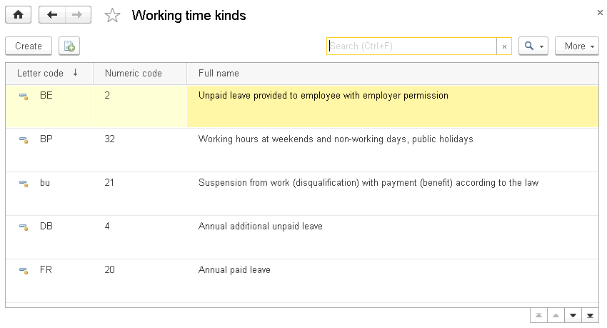
.. |image1521153995163977| image:: media/image38.png
   :width: 4.63542in
   :height: 3.76042in
