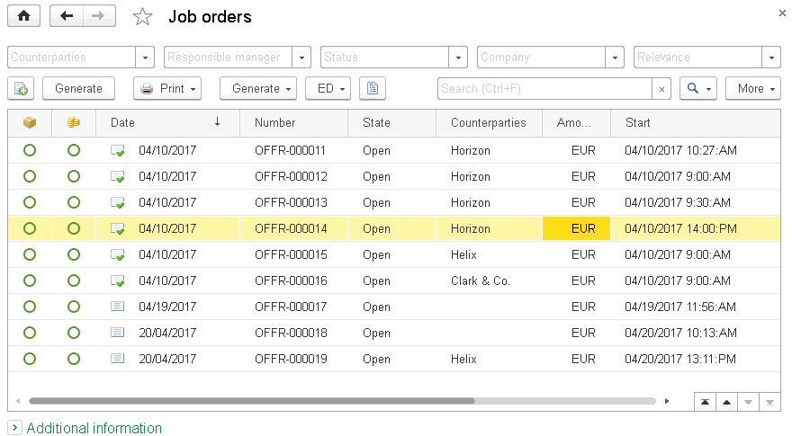
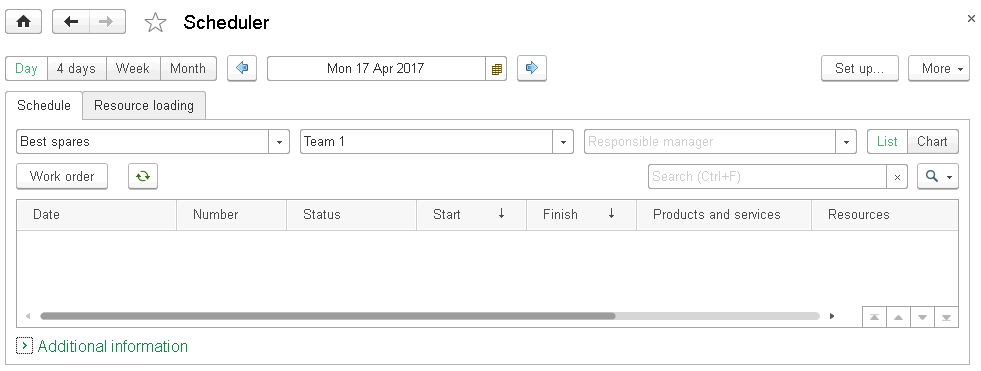
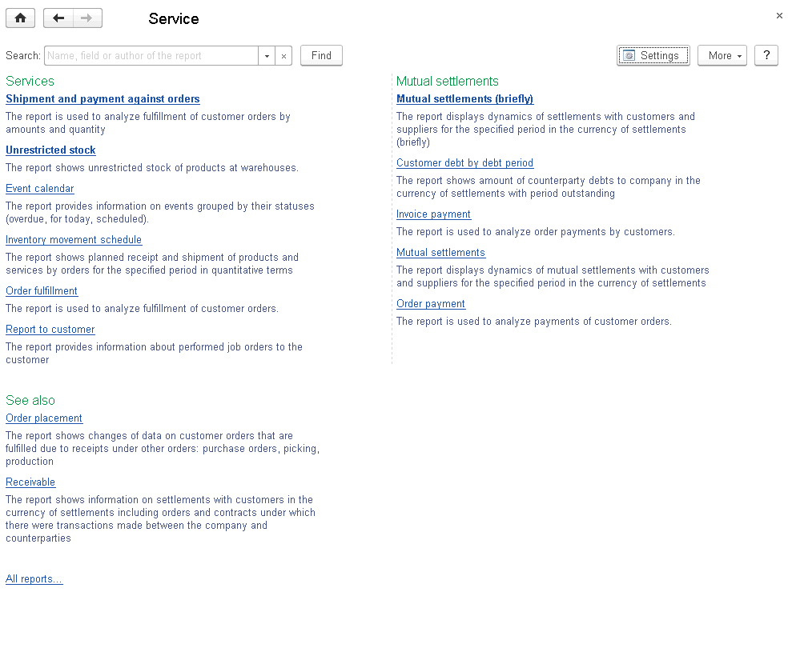
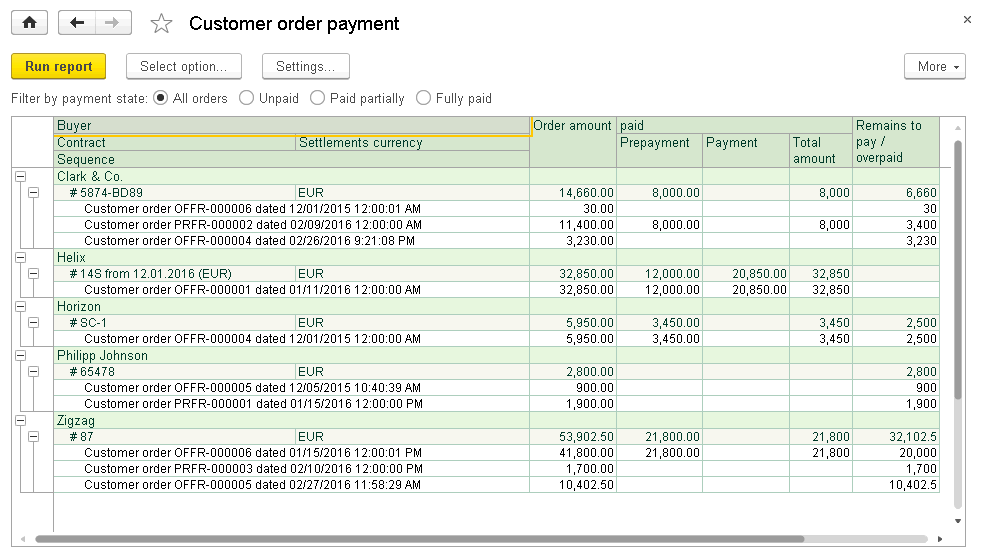

CHAPTER 5
=========

.. _service-2:

SERVICE
~~~~~~~

With «1C:SimpleERP», you get automated recording of business
transactions related to maintenance services. To operate with the
**Service** subsystem, go to the corresponding section.

WORK PLANNING
~~~~~~~~~~~~~

Job order
~~~~~~~~~

**Job order** is a document combining functions of a customer order, a
proforma invoice, an acceptance certificate, and a goods issue for the
services sector with writing off direct material and labor costs to it.

You can use job orders to record operations of planning and accounting
of works and services, such as hairdressing services, shoe repairing,
clothes tailoring, car washing, and other works and services with short
production cycle.

|image1521153995469389|

In the job order list, you can see information on job order performance,
state and payment percent.

Order fulfillment details are shown as the order lines.

**Gray** line shows that the order has a request status, in other words,
it is not accepted for work yet. **Green** line shows that the order is
fulfilled. **Blue** line shows that the order is in progress.
**Strikeout** line shows that the order is closed.

Level of shipment and payment are shown using pie charts.

Using the job order, you can both order and sell works (services).
Material and labor costs (only for works) can be attributed to them.
Besides works (services), associated goods, such as spare parts,
consumable materials can be sold using a job order. In the job order,
you can specify customer materials used for performing works (for
reference). You can also specify company resources used to fulfill this
order. You can specify used resources on the corresponding tab. Resource
planning is optional. You can set it up in the **Company** accounting
settings of the **Settings** section.

|image1521153995548272|

Material and labor costs can be recorded only for products and services
items with the **Work** type. You cannot record manufacturing costs for
products and services items with the **Service** type.

You can also record a list of tangible assets received from the customer
to fulfill the order in the job order. The specified details are for
information only. They are not recorded in inventory accounting
registers.

Material costs are written off to the job order and salary is accrued
for fulfilled and closed job orders on the finish date. Demand for
materials and goods is planned on the start date. Specify planned work
start and end dates for the job order on the **Main** tab.

The job order is considered fulfilled only when you set a state with the
**Completed** status for it. In this case, actual movements, such as
write-off from warehouse, sales of goods, and other will be performed on
the fulfillment date. To close a job order, you do not need to register
a goods issue and acceptance certificates using which you close a common
customer order.

.. _company-resources-1:

Company resources
~~~~~~~~~~~~~~~~~

In the **Company resources** catalog, you can store information about
company resources used to perform job orders and production orders.

You can access the catalog if the **Plan company resource loading**
check box is selected in the **Company** settings of the **Settings**
section. To access the catalog, in the **Service** or **Manufacturing**
section, in the dashboard, click **Company resources**.

|image1521153993075966|

A resource can belong to one or several resource kinds. Each resource
always belongs to a special resource kind – **All resources**.

|image1521153997442337|

A resource can be associated with an employee, a team or has no
connections.

You can enter capacity for a resource that is a value of the resource
availability in the time interval. The default capacity is 1. It means
that if you plan this resource work in the specified interval, it will
be fully occupied in this interval.

Enter work schedule for the resource. You can assign resource a work
schedule from the existing **Work schedules**. If there is any variance
from the work schedule, enter variances into the resource card.

Scheduled plan of works, services
~~~~~~~~~~~~~~~~~~~~~~~~~~~~~~~~~

You can generate a **scheduled plan** against job orders to analyze a
schedule of works performed and services rendered over a specified
period (day, week or month).

|image1521153997010401|

To set up display parameters on the scheduler setting form, click **Set
up** in the right side of the command bar.

Company resource loading
~~~~~~~~~~~~~~~~~~~~~~~~

In the **Resource loading** mode, you can timely track and plan a
particular resource loading. To track the resource loading, double-click
a calendar line with required time in the selected resource field. The
**Job order** document form appears.

|image1521153995520119|

Work planning using orders
~~~~~~~~~~~~~~~~~~~~~~~~~~

You can plan work performance or service rendering on **Resources in
use** tab using the **Job order** documents.

Set the **In progress** order status. Specify planned dates of work
start and end in the **Start** and **Finish** fields on the **Main**
tab.

|image1521153995548272|

If you select the **Schedule payment** check box, the **Payment
calendar** tab appears on the document form where you can schedule
payment for the order (specify planned dates of payment, percent that
must be paid by the specified date, and so on).

|image1521153995496055|

Once the work is performed, set the **Completed** order status, set off
prepayment, and enter cash receipt to cash fund based on the job order.

Service section reports
~~~~~~~~~~~~~~~~~~~~~~~

You can access the **Service** section reports by clicking **Service
reports** in a separate panel.

|image1521153997112419|

Work orders
~~~~~~~~~~~

The report is not displayed by default. To access the report from the
**Reports** list, click **More**, and then click **All reports**.

You can use the report to carry out variance analysis by all work kinds.
Counterparty orders are displayed for external jobs in the report.

.. _customer-order-fulfillment-1:

Customer order fulfillment
~~~~~~~~~~~~~~~~~~~~~~~~~~

You can use the report to analyze customer order content and
fulfillment.

|image1521153990736930|

.. _order-payment-1:

Order payment
~~~~~~~~~~~~~

You can use the report to analyze customer order fulfillment concerning
payment.

|image1521153999850499|

Report to customer
~~~~~~~~~~~~~~~~~~

In the report, you can see information on works performed under a job
order or a customer order.

|image1521153999906156|

.. |image1521153995548272| image:: media/image190.png
   :width: 4.63542in
   :height: 3.29167in
.. |image1521153993075966| image:: media/image21.png
   :width: 4.625in
   :height: 1.53125in
.. |image1521153997442337| image:: media/image191.png
   :width: 4.63542in
   :height: 3.20833in

.. |image1521153995520119| image:: media/image193.png
   :width: 4.63542in
   :height: 3.66667in
.. |image1521153995548272| image:: media/image190.png
   :width: 4.63542in
   :height: 3.29167in
.. |image1521153995496055| image:: media/image194.png
   :width: 4.625in
   :height: 3.01042in

.. |image1521153990736930| image:: media/image196.png
   :width: 4.53125in
   :height: 2.46875in

.. |image1521153999906156| image:: media/image198.png
   :width: 3.9375in
   :height: 2.875in
