CHAPTER 6
=========

.. _manufacturing-1:

MANUFACTURING
~~~~~~~~~~~~~

Use the **Manufacturing** section to plan and keep records of work
execution, service provision, manufacturing. To access the production
document journal, click **Production documents** in the navigation
panel.

Add the **Production documents** link to the **Manufacturing** section
navigation panel if it is missing. To add it, click **Navigation
settings**. The **Navigation panel setup** form opens. Move the
**Production documents** link from the left side of the form (items
which you can add to the navigation panel) to the right side (items
shown in the navigation panel) using the **Add >** button.

|image1521153996495607|

Product content and release technology
~~~~~~~~~~~~~~~~~~~~~~~~~~~~~~~~~~~~~~

To manage data about the content of products, works and the release
technology, use bills of materials. Bills of materials are set for every
product kind and reflect different manufacturing methods. Bills of
materials are stored in the **Bills of materials** catalog subordinate
to the **Products and services** catalog. To access the catalog, use a
product card of the **Inventory** or **Work** type.

|image1521153999935030|

The **Bills of materials** catalog item form includes the following tabs
– **Content** (to enter the list of materials and semi-finished products
which are raw materials for product manufacturing, or to enter products
received due to disassembly, breaking) and **Operations** (to enter the
list of manufacturing operations which should be completed to receive
required products). The **Content** tab is filled in with products and
services of the **Inventory** or **Expense** type. In the **Cost share**
column, specify the cost share of initial products and services for
products received due to assembly, breaking.

|image1521153999964821|

Fill in the **Operations** tab with products and services of the
**Operation** type.

|image1521153992018636|

In the **Product quantity** column, specify products and services
quantity for which expense limits are specified in the operations of
this bill of materials.

Production activity planning
~~~~~~~~~~~~~~~~~~~~~~~~~~~~

Production orders
~~~~~~~~~~~~~~~~~

Production order is an order to production department or warehouse for
assembly (production) or disassembly (dismantling) of the specified
products, semi-finished product, or material. To generate a production
order, use a document with the same name.

You can also use the production order for works and services to generate
an internal work schedule. Production order generates release schedule
and registers demand for materials for works and services.

Normally, a production order is entered by the person responsible for
planning the company production activity for the department where
finished or semi-finished products will be released. Registered
production orders can be demand satisfaction sources against customer
orders. Demands generated against new customer orders can be placed to
already open production orders.

Use the **Production order** document to register product manufacturing
(disassembly, dismantling). Demand for materials and components is
calculated against production orders.

**Production order** documents are stored in the journal. To access
them, click **Production orders** (**Manufacturing** group) in the
navigation panel. You can enter production orders based on the
**Customer order** document or another production order.

|image1521153996342099|

When registering the **Production order** document, specify the
following:

-  Planned start and end dates of execution in the document title

-  On the **Goods** tab – data on finished product (in case of
disassembly – source raw materials), its quantity, characteristics,
bill of materials.

-  On the **Materials** tab – data on components (in case of disassembly
– released product) You can determine necessary quantity and quantity
to reserve (column **To reserve**) for components and source raw
materials. You can also specify a bill of materials for some
components (if a component is also a manufacturing product).

In the document, you can specify the company resources which are planned
to be used for this order fulfillment. You can specify used resources on
the corresponding tab. Resource planning is optional. You can configure
it in the **Manufacturing** settings of the **Settings** section.

If a production order is created based on a customer order or another
production order, you can specify a basis document in the **Customer
order** field or the **Basis** field and automatically populate the
document fields by |image1521153999990228|
clicking the button to the right from the attribute.

To auto populate by the released product BOM, on the **Materials** tab,
click **Fill in with BOM**.

.. _company-resources-2:

Company resources
~~~~~~~~~~~~~~~~~

You can access the catalog if the **Plan company resource loading**
check box is selected in the **Company** settings of the **Settings**
section. To access the catalog, in the **Service** or **Manufacturing**
section, in the dashboard, click **Company resources**.

In the **Company resources** catalog, you can store information about
company resources used to perform job orders and production orders.

|image1521153993075966|

A resource can belong to one or several resource kinds. Each resource
always belongs to a special resource kind – **All resources**.

|image1521153997442337|

A resource can be associated with an employee, a team or has no
connections.

You can enter capacity for a resource that is a value of the resource
availability in the time interval. The default capacity is 1. It means
that if you plan this resource work in the specified interval, it will
be fully occupied in this interval.

Enter work schedule for the resource. You can assign a resource work
schedule from the existing work schedules. If there is any variance from
the work schedule, enter variances into the resource card.

Manufacturing scheduled plan
~~~~~~~~~~~~~~~~~~~~~~~~~~~~

The scheduled plan is generated against production orders. With the
scheduled plan, you can analyze schedule of release of products and
semi-finished products over the specified period (day, week, month).

|image1521153997010401|

Display parameters are set in the scheduler setup form. To access the
scheduler, in the right side of the command bar, click **Set up**.

.. _company-resource-loading-1:

Company resource loading
~~~~~~~~~~~~~~~~~~~~~~~~

In the **Resource loading** mode, you can timely track and plan a
particular resource loading. To access resource loading, open, for
example, a special form of the **Production order** document by
double-clicking a line in the calendar with the required time in the
field of the selected resource.

|image1521153995973930|

Production planning using orders
~~~~~~~~~~~~~~~~~~~~~~~~~~~~~~~~

You can schedule product manufacturing on the **Planning schedule** or
**Resource loading** tab. To schedule manufacturing:

-  Open a corresponding production order from the list

-  Set the order status to **In progress**

-  Specify planned start and end dates of works in the **Start** and
**Finish** fields.

|image1521153991043879|

Employee work planning
~~~~~~~~~~~~~~~~~~~~~~

To plan employee activities, you can use the following options:

-  Job sheets

-  Planning of working hours using work orders

You can use information on job sheets and work orders to:

-  Calculate salary

-  Assess work efficiency and carry out variance analysis of employees

Teams
~~~~~

Employees working on a specific manufacturing task can be grouped into
**teams**. To form teams and store the team list, use the **Teams**
catalog. To access the catalog, in the **Catalogs** group, in the
navigation panel, click **Teams**.

|image1521153991071634|

On the catalog item form, specify a team name and its staff – employees
selected from the **Employees** catalog.

Job sheet for performed works
~~~~~~~~~~~~~~~~~~~~~~~~~~~~~

Use the **Job sheet** document to plan execution of technological
operations by a team or an employee. Use job sheets to assign jobs for
execution of manufacturing technological operations to performers
receiving wage. You can generate an analytical report on issued job
sheets.

To access the **Job sheets** document journal, in the **Manufacturing**
section, in the navigation panel, in the **Jobs and job sheets** group,
click **Job sheets**.

|image1521153990916516|

The document contains information on contracted works and performers
responsible for these works. A separate employee or a team may be a
performer. In the latter case, the **Team staff** additional tab appears
on the document form. The table field of the tab is filled in with
employees included in the team. To fill in the table field automatically
with the **Teams** catalog data, click **Fill in team members**.

|image1521153990943777|

If you select the **Closed** check box, salary will be accrued to
performers on closing date.

.. _work-orders-1:

Work orders
~~~~~~~~~~~

Use the **Work order** document to plan employee workload. You can
generate a report for planning and performing jobs according to work
orders.

To register actual output, you can enter the **Time-keeping** document.

On the document form, specify an operation kind for the work order:
external or internal. It is required to specify **Employee** who is a
job performer and **Department**. Other attributes depend on the
selected operation kind.

The work order can include an arbitrary number of table field rows
available when clicking **List**.

External job
~~~~~~~~~~~~

External job is a job associated with interaction between the company
and counterparties. In a document with the **External** operation kind,
fill in the following attributes: **Activity kind** (the attribute value
is an item of the **Products and services** catalog with the **Activity
kind** type), **Customer, Work, service** to specify data on the order
related to the job execution and on work (service) to execute (deliver)
under this order.

|image1521153997855922|

In the **Planning** attribute group, you can define the work order
parameters including execution time period. Some parameters such as
price and description can be filled in automatically according to the
information defined for a work order in the **Products and services**
catalog.

Internal job
~~~~~~~~~~~~

The **Work order** document form with the **Internal** operation kind
does not contain attribute groups **Customer, work (service)**.
Otherwise, fill in the document in the same manner as for external job.

|image1521153997674069|

.. _employee-calendar-1:

Employee calendar
~~~~~~~~~~~~~~~~~

You can view work orders assigned to an employee and plan new ones in
the employee calendar.

Time-keeping
~~~~~~~~~~~~

You can use the **Time-keeping** document to register performed works
under the **Work order** document or record output.

|image1521153997393917|

The document contains information on the time spent by an employee to
perform assigned jobs during the working week. For external jobs,
specify the following information in a table field: a customer, i.e. a
counterparty for whom the job is performed, an order or a contract and
work (service) to perform (deliver) against this order.

In the **Rate** and **Total hours** fields, you can specify a price per
work unit, or standard hour price for a work kind, and automatically
calculated total number of hours spent by an employee to complete the
job.

PRODUCT RELEASE ACCOUNTING
~~~~~~~~~~~~~~~~~~~~~~~~~~

The production order is fulfilled if all finished products
(semi-finished products) specified in the order are released. You can
register product release against the order with the **Manufacturing**
document which is entered based on the **Production order** document.

|image1521153995679561|

You can specify data on manufactured (dismantled) products and
components used for product release in the **Manufacturing** document.
It is optional to specify this data for each release (but not
dismantling). You can allocate materials to release later using the
**Cost allocation** document, for example, over the day or shift. If you
create a document based on the production order, you can auto populate
it by clicking the button |image1521153999990228| to
the right from the **Basis** field.

Released (dismantled) product BOM can also be used for auto population
by clicking **Populate with BOM** on the **Materials** tab.

In the **Manufacturing** document, there are attributes for specifying a
business unit – product manufacturer (warehouse or department); storage
location of materials used for product manufacturing; storage location
of finished products and recyclable waste received from the production
operation.

List of documents allows you to record product release including against
open production orders.

|image1521153996289076|

You can register documents against one or several selected production
orders.

In the list, you can analyze states of the selected production orders.

You can use "simple" and "advanced" schemes of product release recording
– without recording separate material movement operations from warehouse
in production and finished product transfer to warehouse, and using
separate material movement operations, finished products and waste
accordingly.

"Advanced" scheme of product release recording
~~~~~~~~~~~~~~~~~~~~~~~~~~~~~~~~~~~~~~~~~~~~~~

If you specify a manufacturing department as a storage location of
materials and finished products, then to register product release,
transfer the materials to this department with the **Inventory
movement** document. After the product release recording, it will be
moved to the manufacturing department. To transfer the products to a
warehouse of finished products, register separate **Inventory movement**
document. You will also need to register movement of recyclable waste
separately.

"Simple" scheme of product release recording
~~~~~~~~~~~~~~~~~~~~~~~~~~~~~~~~~~~~~~~~~~~~

If you specify a warehouse or another business unit different from a
manufacturing department as a storage location, materials will be auto
transferred (with the **Manufacturing** document) to the manufacturing
department and attributed to the released product cost when recording
the release. If you specify a business unit – product recipient
different from the manufacturer, manufactured products will be auto
transferred to the finished product recipient.

For example, a customer order is registered and all components required
to fulfill it are delivered to the main company warehouse to the
corresponding bin.

|image1521153995650657|

Product assembly operation (for example, of an air-conditioner) is
recorded with the **Manufacturing** document with the **Assembly**
operation kind. In the document, on the **Materials** tab, in the
**Write off from** and **Bin** fields, specify the warehouse and the bin
from which the components are being written off. In the document title,
in the **Manufacturer** and **Bin** fields, specify the department and
the bin to which the components are transferred for assembly. Finally,
on the **Products** tab, in the **Recipient** and **Bin (recipient)**
fields, specify the warehouse and the bin of finished product receipt.

You can auto populate the above listed fields. To specify default values
see in the **Manufacturing** document, in the **Company business units**
catalog, click **View and edit parameters of inventory auto transfer**.
To access the catalog, in the **Company** section, in the **Reference
information** panel, click **Departments**.

|image1521153995444332|

Specify receiving warehouses and target bins for the inventory receipt.

ALLOCATING MATERIAL AND INTANGIBLE COSTS
~~~~~~~~~~~~~~~~~~~~~~~~~~~~~~~~~~~~~~~~

Use the **Cost allocation** document to enter in the books direct
material and intangible costs of inventory assembly and disassembly, and
work performance over a specified period, for example, over a shift or a
week. On the **Main** tab, specify a company, a department, and a period
start for which costs are allocated. Period end is equal to the document
date.

Goods tab
~~~~~~~~~

In the table field of the **Goods** tab, specify data on released
products and performed works. To enter the data automatically, click
**Fill in according to release**.

|image1521153992323650|

Inventory tab
~~~~~~~~~~~~~

In the upper table field, you can specify information about products and
materials spent for product release and work performance. To auto
populate the field, use the **Fill in** menu commands – **According to
standards** or **According to balance**.

|image1521153992273042|

To auto populate the **Inventory allocation** field which contains
information about material costs allocation to release of the products
(works) specified on the **Goods** tab, use the **Allocate** menu
commands – **According to standards** or **According to quantity**.

Costs tab
~~~~~~~~~

On the **Costs** tab, in the **Costs** table field, specify information
about costs for products release and work performance. To auto populate
it, click **Fill in by balance**.

|image1521153992298578|

In the **Cost allocation** table field, you can see information about
cost allocation to release of products (works). The information depends
on the upper table field of the tab. To auto allocate costs to product
cost, click **Allocate acc. to quantity**.

In the lower right side of the form, you can see allocation results as
populated fields unavailable for editing.

SUPPLIER'S RAW MATERIALS PROCESSING
~~~~~~~~~~~~~~~~~~~~~~~~~~~~~~~~~~~

To record operations of receipt of third party inventory for processing,
in the **Settings** section, in the **Manufacturing** settings, select
the **Use supplier's raw materials processing** check box. To use
products and services batches, in the **Settings** section, in the
**Purchases settings**, select the **Inventory accounting by batches**
check box. With the application, you can use the following options of
processing of raw materials and materials:

1. Transfer of own raw materials to processing:

-  Transfer of own raw materials and materials to processing

-  Registration of processor reports on used materials, manufactured
products and processing cost

2. Receipt and processing of supplier's raw materials:

-  Receipt of raw materials and materials for processing

-  Manufacturing of products from supplier's raw materials

-  Report to raw material supplier on used materials, manufactured
products and processing of supplier's raw materials

All operations related to manufacturing of products from supplier's raw
materials are recorded in the application with specification of a
processing order and a batch of raw materials and materials received for
processing. To register such order:

-  Create a raw material supplier record in the **Counterparties**
catalog.

-  Register a contract to keep mutual settlements for processing
services.

-  Create the **Customer order** document with the **Processing order**
operation kind.

Processing report
~~~~~~~~~~~~~~~~~

With the **Processing report** document, you can report to raw material
supplier who transferred raw materials and materials to processing.

The document contains information about products and semi-finished
products manufactured from supplier's raw materials and transferred to
raw material supplier, as well as raw materials and materials used for
product manufacturing and waste from processing. The data is placed in
table fields on tabs **Goods**, **Materials**, and **Waste**.

On the **Goods** tab, specify the quantity of reserved products and
semi-finished products received during processing. Set a price, a
discount, and a manufacturing bill of materials for each product or
semi-finished product.

|image1521153996675394|

On the **Materials** tab, specify information about consumed materials
and raw materials accepted for processing. As supplier's raw materials
are not our own, specify batches of materials with the **Supplier's raw
materials status**.

|image1521153996626922|

On the **Waste** tab, enter the processing waste list. Data specified
for waste is the same as for materials except for prices. Recyclable
waste is not our inventory. Specify a batch of inventory with the
**Supplier's raw material** status if waste from supplier's raw
materials is generated or returned. The generated waste cost is zero.

|image1521153996650222|

MANUFACTURING REPORTS
~~~~~~~~~~~~~~~~~~~~~

With **Manufacturing** reports, you can analyze data of the section. You
can access the reports in the report panel of the section.

|image1521153995703773|

Work performance, product release
~~~~~~~~~~~~~~~~~~~~~~~~~~~~~~~~~

The report on actual work performance, service rendering, and product
release provides information about quantity of released products,
performed works, and rendered services over a specified period. In the
report, you can see a list of released products and services with
specification of the **Manufacturing** documents created on the report
basis that record product release, as well as **Acceptance
certificates** and **Job orders** recording works performed for a
customer.

|image1521154000017274|

.. _production-orders-1:

Production orders
~~~~~~~~~~~~~~~~~

With the report, you can analyze company production department orders
received over the specified period. Orders are grouped by departments.
Specify products and services and their turnovers, such as opening and
closing balance, receipt and outflow for every order.

|image1521154000053397|

Standard bill of materials
~~~~~~~~~~~~~~~~~~~~~~~~~~

With the report, you can access data on content and manufacturing
technology of products according to bill of materials.

|image1521153997287572|

The report displays a list of components required for the selected
product manufacture with specified quantity. Components to be produced
according to its own bills of materials are highlighted with a different
color.

In the lower side of the report, you can see a list of technological
operations required for production of such components, the product
itself and standard time (hours) per single operation.

In the report, you can also calculate cost of the specified product
quantity by the specified price kind on the specified date.

Production variance analysis
~~~~~~~~~~~~~~~~~~~~~~~~~~~~

The report contains data on planned and actual product release, work
performance, provision of services over the specified period.

|image1521154000089602|

Production cost variance analysis
~~~~~~~~~~~~~~~~~~~~~~~~~~~~~~~~~

With the report, you can analyze the ratio between actual and planned
quantity and cost of expenses for product release, work execution,
service provision.

Job sheets
~~~~~~~~~~

Use this report for variance analysis of manufacturing operations
performed by employees under job sheets. The data is grouped by
performers.

|image1521153995573505|

 

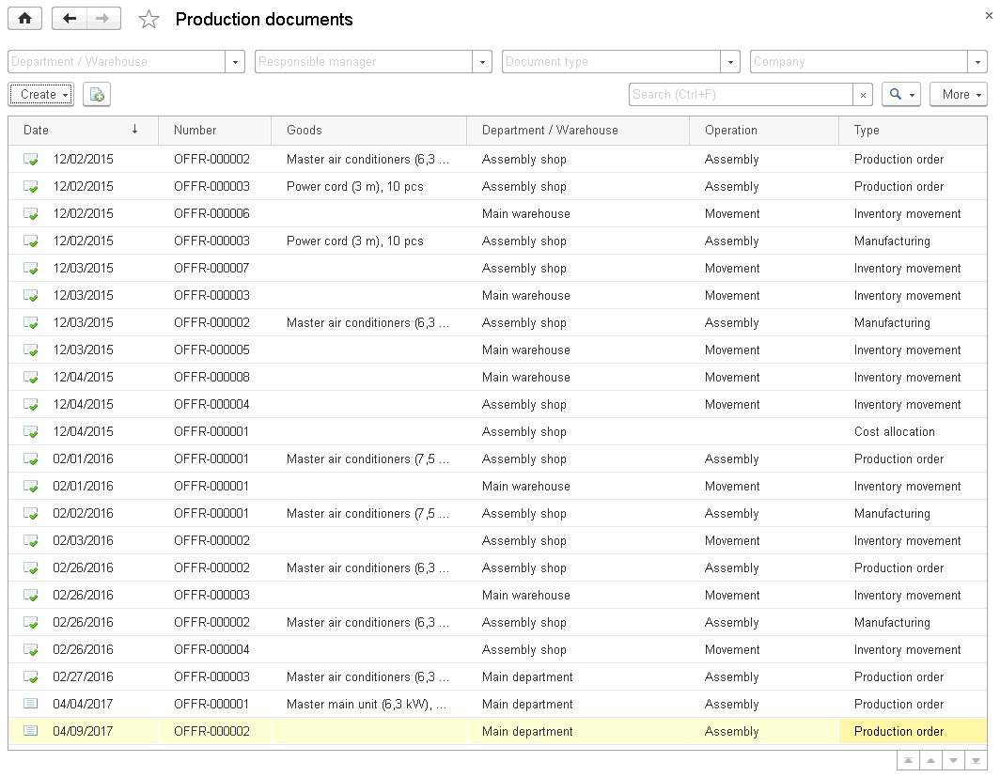
.. |image1521153999935030| image:: media/image200.png
   :width: 3.9375in
   :height: 1.63542in
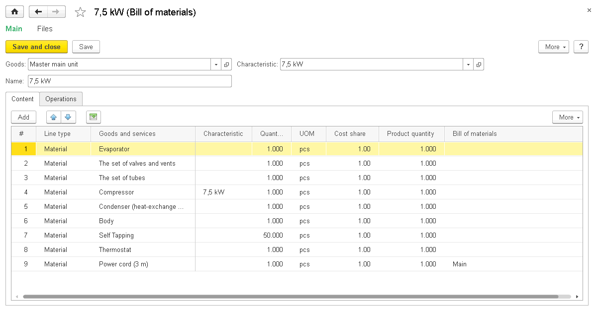
.. |image1521153992018636| image:: media/image202.png
   :width: 4.625in
   :height: 1.80208in
.. |image1521153996342099| image:: media/image203.png
   :width: 4.63542in
   :height: 2.92708in
.. |image1521153999990228| image:: media/image204.png
   :width: 0.14583in
   :height: 0.125in
.. |image1521153993075966| image:: media/image21.png
   :width: 4.625in
   :height: 1.53125in
.. |image1521153997442337| image:: media/image191.png
   :width: 4.63542in
   :height: 3.20833in
.. |image1521153997010401| image:: media/image192.png
   :width: 4.625in
   :height: 1.75in
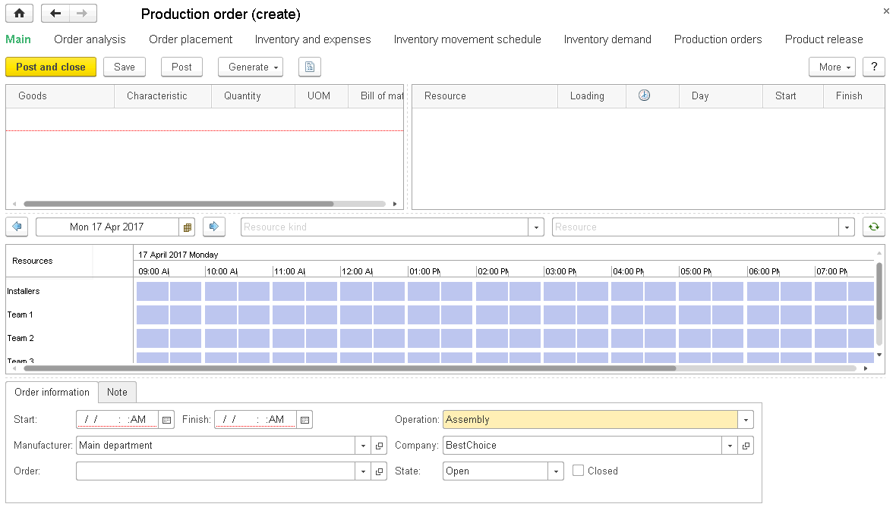
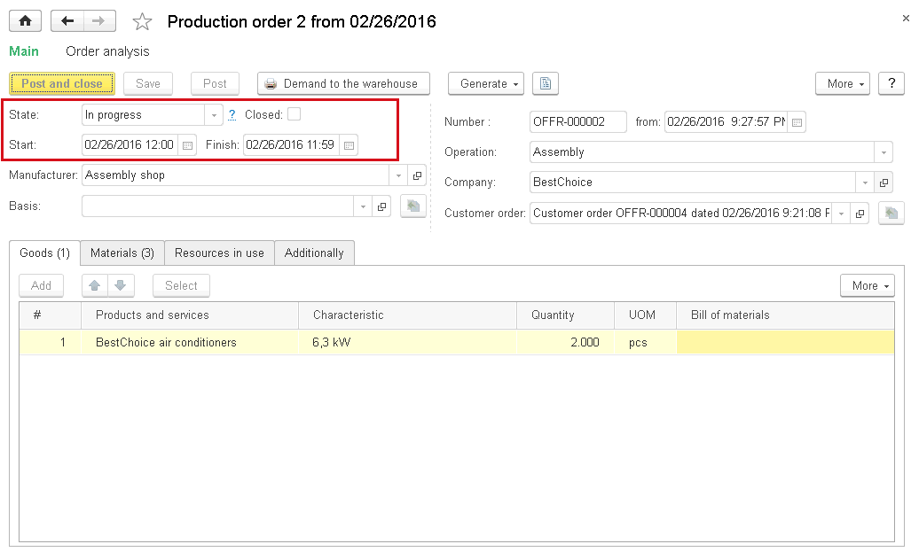
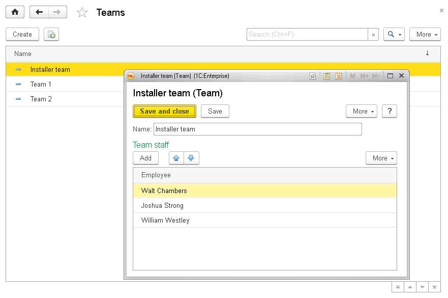
.. |image1521153990916516| image:: media/image208.png
   :width: 4.59375in
   :height: 3.15625in
.. |image1521153990943777| image:: media/image209.png
   :width: 4.63542in
   :height: 3.19792in
.. |image1521153997855922| image:: media/image210.png
   :width: 4.63542in
   :height: 3.6875in
.. |image1521153997674069| image:: media/image211.png
   :width: 4.63542in
   :height: 3.66667in
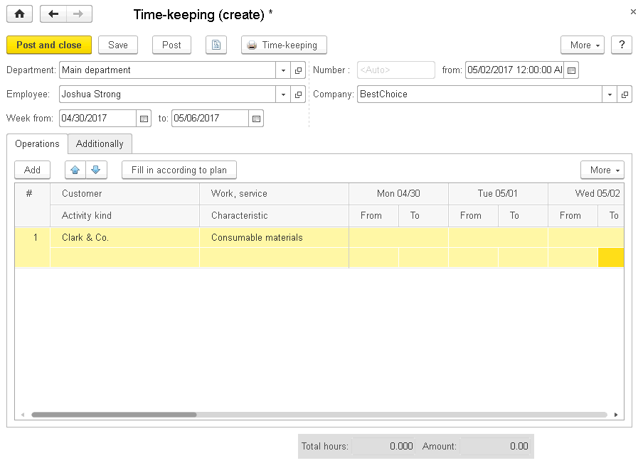
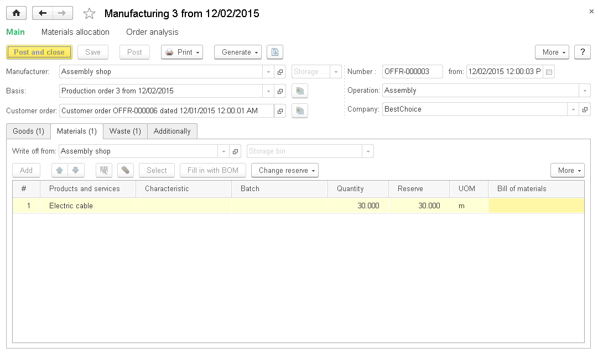
.. |image1521153999990228| image:: media/image204.png
   :width: 0.14583in
   :height: 0.125in
.. |image1521153996289076| image:: media/image214.png
   :width: 4.63542in
   :height: 2.73958in
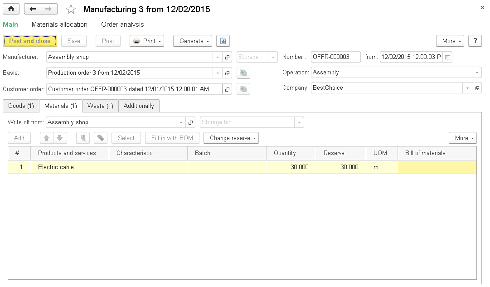
.. |image1521153995444332| image:: media/image18.png
   :width: 4.63542in
   :height: 2.79167in
.. |image1521153992323650| image:: media/image216.png
   :width: 4.63542in
   :height: 2.73958in
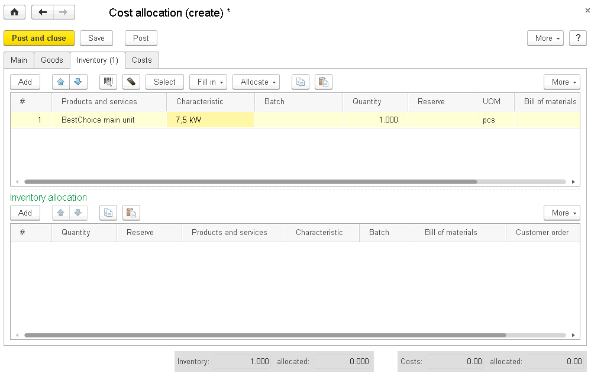
.. |image1521153992298578| image:: media/image218.png
   :width: 4.63542in
   :height: 2.92708in
.. |image1521153996675394| image:: media/image219.png
   :width: 4.63542in
   :height: 2.92708in
.. |image1521153996626922| image:: media/image220.png
   :width: 4.63542in
   :height: 2.90625in
.. |image1521153996650222| image:: media/image221.png
   :width: 4.63542in
   :height: 2.9375in
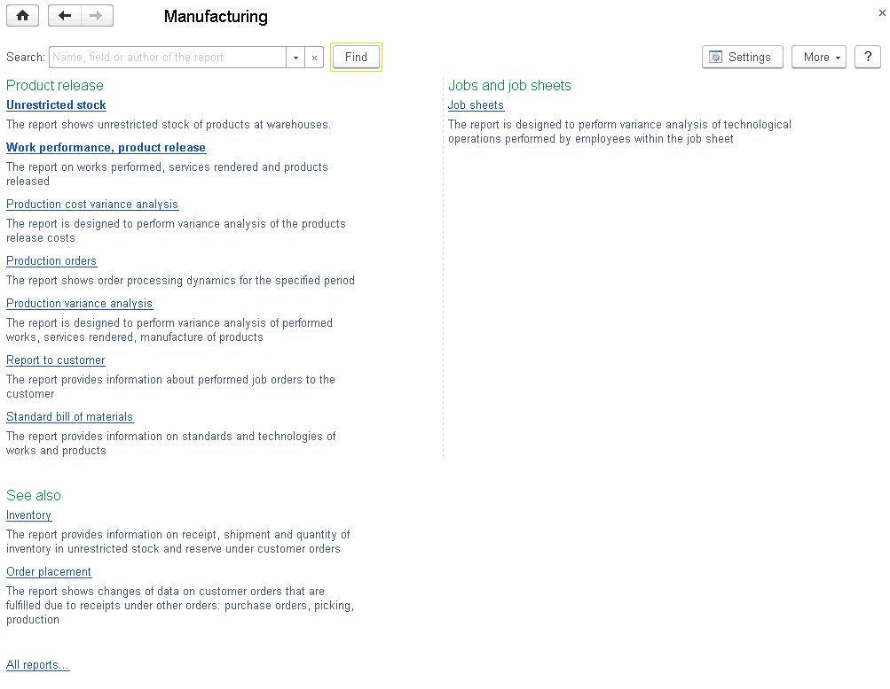
.. |image1521154000017274| image:: media/image223.png
   :width: 4.42708in
   :height: 3.11458in
.. |image1521154000053397| image:: media/image224.png
   :width: 4.33333in
   :height: 3.33333in
.. |image1521153997287572| image:: media/image225.png
   :width: 4.625in
   :height: 2.10417in
.. |image1521154000089602| image:: media/image226.png
   :width: 4.32292in
   :height: 2.96875in
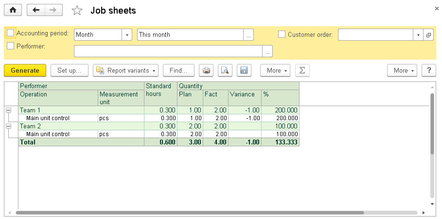
