CHAPTER 7
=========

.. _funds-1:

FUNDS
~~~~~

In the **Funds** section, you can keep records of funds and manage them.
You can access general document journals of the section by clicking
**Cash fund documents** or **Bank documents** in the navigation panel.

|image1521154000126316|

.. _currencies-1:

Currencies
~~~~~~~~~~

With the application, you can register cash flow in different
currencies. First, add the currency list to the **Currencies** catalog.
To access the catalog, in the navigation panel of the **Funds** section
in the **Catalogs** group, click the corresponding link. Previously
select the **Keep records in foreign currency** check box in the
**Funds** settings of the **Settings** section.

|image1521154000152773|

|image1521154000180893|

Exchange rates
~~~~~~~~~~~~~~

To convert currencies, you can use exchange rate data.

If your computer is connected to the Internet, exchange rates can be
updated automatically. In the **Exchange rate** attribute group on the
**Main data** tab, set the radio button to **Imported from the
Internet** in the forms of currencies whose exchange rates should be
updated in this way.

Before updating, fill in the currency list form with the currencies
whose exchange rate requires updating. To do it, click **Import exchange
rates**. Delete the currencies whose exchange rates do not require
updating from the list manually.

To import currencies, in the currency list form, specify currencies and
the period for which you need to fill in new exchange rates, and then
click **Import**.

|image1521154000206587|

BANKS
~~~~~

A list of banks with accounts including those of the trade company
itself and of counterparties is stored in the Banks catalog. To access
it, in the **Company** section, in the navigation panel, click
**Banks**.

|image1521154000232633|

To specify new bank details, use a form of the catalog item. It contains
the following information: bank name, bank code, correspondent account,
bank location, bank phone numbers, zip code and address. The catalog has
a multi-level structure.

CASH FLOW ITEMS
~~~~~~~~~~~~~~~

Use this catalog to keep analytical accounting of funds, analyze
received funds and effected payments by movement directions. To access
the catalog, in the navigation panel of the **Funds** section
(**Catalogs** group), click the corresponding link. It contains the
following predefined items – **Negative exchange rate difference**,
**Positive exchange rate difference**, **Customer payment**, **Payment
to suppliers**, and **Other**.

|image1521154000257960|

You can add your cash items of receipt and expense of funds, for
example, **Loan receipt**, **Credit receipt**, **Stationery purchase**,
etc. You can specify these items in payment documents.

Cash flow items specified in documents allow you to detail cash flow in
reports up to the directions level.

Transactions with funds are accounted by cash flow items. To open the
item list, click the corresponding link in the navigation panel.

Cash storage locations (cash funds) are registered in the **Cash funds**
catalog.

You can register cash receipts and payments from the cash fund using
documents **Credit slip** and **Cash payment** documents.

CREDIT SLIP
~~~~~~~~~~~

Use the **Credit slip** document to display the following kinds of
operations (payments):

-  **From customer**

-  **From supplier**

-  **From advance holder**

-  **Retail revenue**

-  **Retail revenue (value accounting)**

-  **Foreign exchange buying**

-  **Other**

Specify an operation kind in the corresponding field. The form
attributes depend on the selected kind.

Payment amount with currency is displayed at the bottom of the form.

From customer
~~~~~~~~~~~~~

If you select the **From customer** operation kind, specify the
following information on the document form: a customer, a counterparty
from whom funds are received, a contract with them, cash flow item and
payment amount data. If the document is created on the basis of another
document, its link will be displayed in the Basis field (for example,
**Goods issue** or **Acceptance certificate** can be a basis).

If payment from a customer is an advance, select the check box in the
**Advance** column. Otherwise, specify a document under which the
payment is received.

The **Select** button is located above the table field of the document
with the **From customer** operation kind. Click the button to open the
customer debt selection form.

|image1521153993323792|

Note

Attributes of the **Credit slip** document with the **From supplier**
operation kind is similar to the **Cash payment** document with the **To
supplier** operation kind except for the debt selection form button.

From advance holder
~~~~~~~~~~~~~~~~~~~

If you select the **From advance holder** operation kind on the document
form, specify an advance holder, an employee to whom the funds were
issued, and an issue document. Table field to enter several payments is
not available on this form.

|image1521153993299686|

.. _other-1:

Other
~~~~~

If you select the **Other** operation kind, you will see the following
attributes on the document form:

-  On the **Payment explanation** tab, there is attribute
**Correspondence** – payment attribution account.

-  On the **Planning** tab – the **Planning document** attribute
selected from a list of documents **Funds movement (plan)** and
**Funds receipt (plan)**.

|image1521153993274960|

CASH PAYMENT
~~~~~~~~~~~~

Use the **Cash payment** document to register cash payments. With the
document, you can record the following kinds of operations (payments):

-  **To supplier**

-  **To customer**

-  **To advance holder**

-  **Salary against pay sheet**

-  **Employee salary**

-  **Transfer to cash register**

-  **Other**

-  **Taxes**

Specify an operation kind in the corresponding field. The form
attributes depend on the selected kind.

 Payment amount with currency is displayed at the bottom of the form.

To supplier
~~~~~~~~~~~

If you select the **To supplier** operation kind on the document form,
specify a supplier, i.e. a counterparty to whom cash is paid, cash flow
item and information about payment amount. In the table field, you can
specify a contract with the supplier or paid order. If the document is
created based on the other document, its link will be displayed in the
**Basis** field (**Goods receipt** can be a basis).

|image1521153992796528|

The table field is similar to the table field of the **Cash fund
receipt** document with the **From customer** operation kind.

If payment to a supplier is an advance, select the check box in the
**Advance** column. Otherwise, specify a document under which the
payment is received.

Above the table field of the document with the **To supplier** operation
kind, there is the **Select** button. Click it to open a selection form
of debts to suppliers.

|image1521153997338483|

To customer
~~~~~~~~~~~

If you select the **To customer** operation kind on the document form,
specify a customer to whom funds are returned. The table field is
similar to the field of the **Credit slip** document with the **From
customer** operation kind except for the **Select** button.

To advance holder
~~~~~~~~~~~~~~~~~

If you select the **To advance holder** operation kind on the document
form, specify an employee to whom the funds were issued. If the issued
amount is overspent by the employee according to the expense report,
specify the expense report. Table field to enter several payments is not
available on this form.

|image1521154000289065|

Salary against pay sheet
~~~~~~~~~~~~~~~~~~~~~~~~

If you select the **Salary against pay sheet** operation kind, the table
field to specify data on pay sheets and a payment amount against every
pay sheet is shown on the document form.

|image1521153992769880|

Employee salary
~~~~~~~~~~~~~~~

If you select the **Employee salary** operation kind, the table field to
specify an employee and a payment amount appears on the document form.

Transfer to cash register
~~~~~~~~~~~~~~~~~~~~~~~~~

If you select the **Transfer to cash register** operation kind, fields
to fill in a cash register and moved amount will be shown on the
document form.

.. _other-2:

Other
~~~~~

If you select the **Other** operation kind, the following attributes are
shown on the document form: **Correspondence (payment account)**,
**Planning document** (it is selected from the document list), **Funds
movement (plan)** or **Funds receipt (plan)**.

|image1521153992740679|

Taxes
~~~~~

If you select the **Taxes** operation kind, fill in **Tax kind** on the
document form. You can select the attribute value from the **Taxes**
catalog.

|image1521153992821991|

Cash fund documents
~~~~~~~~~~~~~~~~~~~

You can find cash accounting documents in the **Cash fund documents**
journal.

|image1521154000314759|

FUNDS MOVEMENT
~~~~~~~~~~~~~~

To move funds, use the **Funds movement** document.

Its main purpose is to move funds between cash funds. You can also use
it to move funds between bank accounts, and funds and bank accounts.

|image1521153993926902|

NON-CASH
~~~~~~~~

Use the **Bank accounts** catalog to register bank accounts on which the
company non-cash is kept.

Non-cash flow is registered by documents grouped to the **Bank
documents** journal.

Receipt to account
~~~~~~~~~~~~~~~~~~

To register cash receipts to the company accounts, you can use the
**Receipt to account** document. Operation kind specified in the
document defines its attributes. For the **Receipt to account**
document, the same operation kinds as for the **Credit slip** document
are used excluding retail revenue.

|image1521153991019950|

Expense from account
~~~~~~~~~~~~~~~~~~~~

To register non-cash debiting, you can use the **Expense from account**
document. Operation kind specified in the document defines its
attributes. For the **Expense from account** document, the same
operation kinds as for the **Cash payment** document are used.

|image1521153993614566|

Expense report
~~~~~~~~~~~~~~

Use the **Expense report** document to record advance holder expenditure
of issued cash or non-cash.

|image1521153993700596|

The document form has tabs for entering information on issued advances,
inventory, services, and payments.

In the table field of the **Issued advances** tab, you can specify a
list of cash issue documents (**Cash payment** or **Expense from
account**). Specify an amount for each document.

On the **Inventory** tab, enter inventory list (products and services)
purchased by an advance holder using issued funds and capitalized by the
company. Quantity and cost are specified for each products and services
item.

|image1521153993642213|

On the **Services** tab, specify additional advance holder expenses. For
example, payment for courier delivery by third party counterparty.

|image1521153993670627|

On the **Payments** tab, specify information on advance holder payments
to suppliers.

Bank documents
~~~~~~~~~~~~~~

You can find non-cash accounting documents in the **Bank documents**
journal.

|image1521154000337741|

PAYMENT CALENDAR
~~~~~~~~~~~~~~~~

Payment calendar includes expenditure requests and planned cash
receipts. When generating the calendar, the application checks
automatically whether there is enough cash in its storage locations.

You can generate the calendar using customer orders, purchase orders,
proforma invoices, supplier invoices for the orders with the Schedule
payment check box selected, and using the following kinds of plan
documents: **Expenditure requests**, **Funds receipt (plan),** and
**Funds movement (plan)**. You can access the documents by clicking the
corresponding links in the navigation panel of the **Funds planning**
group.

Expenditure request
~~~~~~~~~~~~~~~~~~~

You can use the **Expenditure request** document to plan funds
expenditure.

|image1521153993733291|

In the document, specify an amount and cash flow items to plan
expenditure. You can use the radio button to specify a payment method.
Depending on the selected radio button, the **Cash fund** or **Bank
account** attribute is specified for cash or non-cash payment
accordingly. In the **Undefined** state, the document will not be posted
until you select one of the payment methods.

The document can also have status **Approved** or **Not approved**. Use
the radio button to select the status.

Actual payment under document **Expense from account** or **Cash
payment** can be entered on the basis of the **Expenditure request**
document.

Funds receipt (plan)
~~~~~~~~~~~~~~~~~~~~

You can use the **Funds receipt (plan)** document to plan funds receipt.

|image1521153993951590|

Fill in the document in the same manner as the **Funds expense (plan)**
document. Actual payment under document **Receipt to account** or
**Credit slip** can be entered on the basis of the **Funds receipt
(plan)** document.

Funds movement (plan)
~~~~~~~~~~~~~~~~~~~~~

Use the **Funds movement (plan)** document to plan funds movement.

|image1521153993904054|

Fill in the document in the same manner as documents **Funds expense
(plan)** and **Funds receipt (plan)**, but instead of a payment method
specify moved funds type for the source and recipient. You can move
non-cash from the company account to cash fund to receive as cash and
vice versa.

Funds planning documents
~~~~~~~~~~~~~~~~~~~~~~~~

The **Funds planning documents** journal contains documents of real-time
planning of funds.

|image1521154000363421|

FUNDS SECTION REPORTS
~~~~~~~~~~~~~~~~~~~~~

You can analyze data of the **Funds** section using reports. You can
access them in the report panel of the section.

|image1521154000387521|

.. _funds-2:

Funds
~~~~~

The **Funds** report displays cash and non-cash flow. To access the
report, in the actions panel, click the corresponding link.

|image1521154000411889|

You can generate the report in the following modes: **Statement** and
**Balance**. In the **Statement** mode, the report allows you to display
all cash flow with details up to cash funds and bank accounts over the
specified period. In the **Balance** mode, the report does not display
information on receipt and expenses. It shows only cash balance amount
on company accounts and cash funds on the specified date.

Funds forecast
~~~~~~~~~~~~~~

The report displays information on planned cash flow over the specified
period for the selected company. The report is generated based on data
of the **Budget** documents.

|image1521154000439791|

It can be generated in the following modes: **Main**, **In currency**,
**Variance analysis**, and **Variance analysis (cur.)**. **In Main** and
**In currency** modes, the report allows you to display data on all
planned cash flow in the management accounting currency and in currency.
Variance analysis allows you to display data on planned and actual
movements, an absolute value and variance percent in the management
accounting currency and in currency.

|image1521154000465687|

.. |image1521154000126316| image:: media/image228.png
   :width: 4.33333in
   :height: 2.95833in
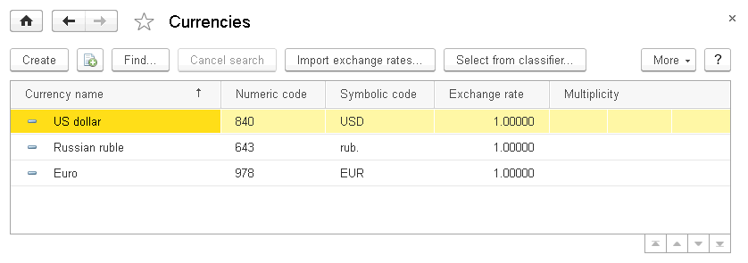
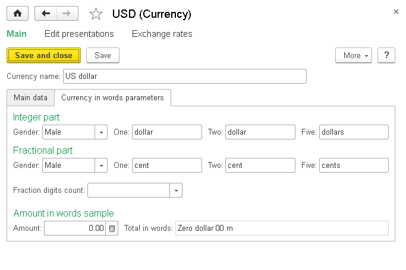
.. |image1521154000206587| image:: media/image231.png
   :width: 4.33333in
   :height: 1.19792in
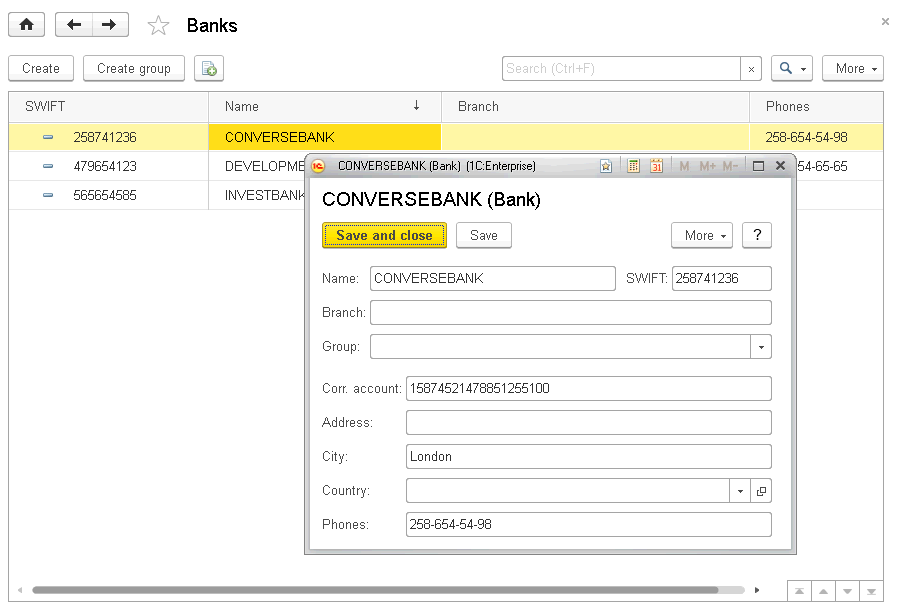
.. |image1521154000257960| image:: media/image233.png
   :width: 4.25in
   :height: 3.21875in
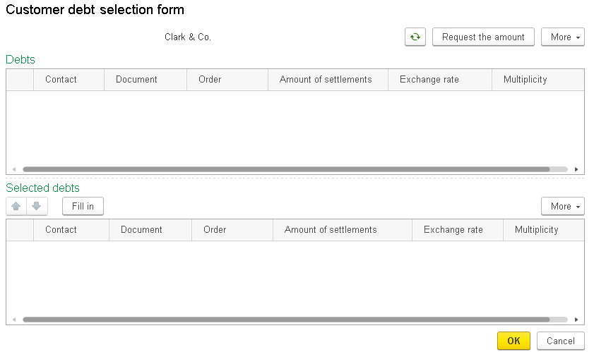
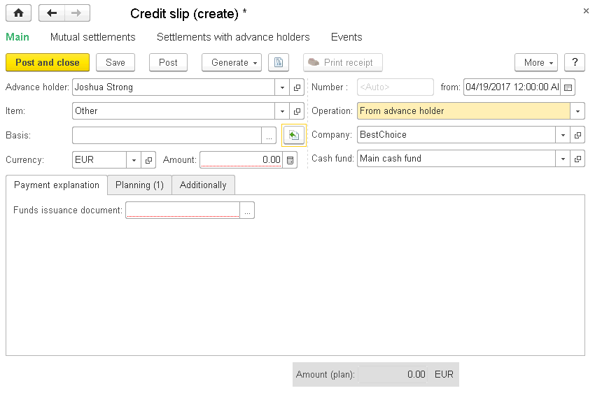
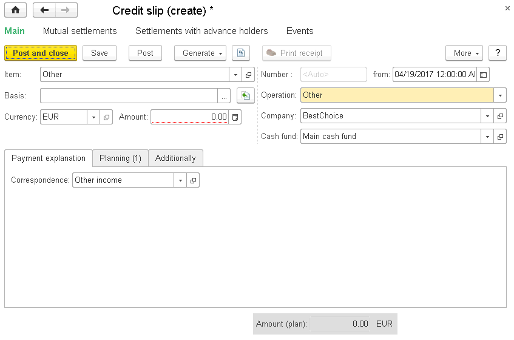
.. |image1521153992796528| image:: media/image237.png
   :width: 4.625in
   :height: 3.08333in
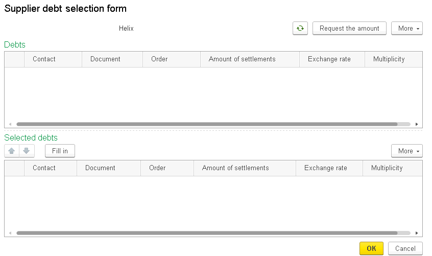
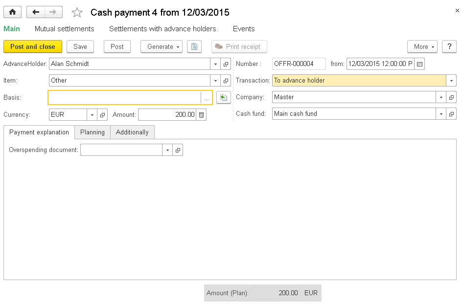
.. |image1521153992769880| image:: media/image240.png
   :width: 4.625in
   :height: 3.07292in
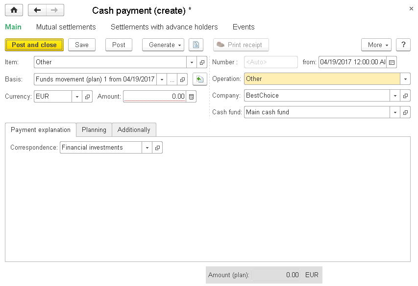
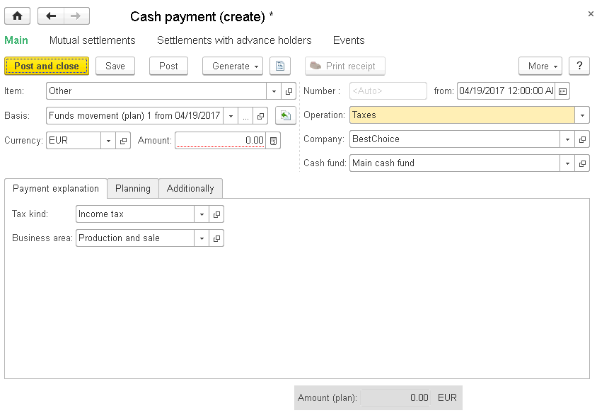
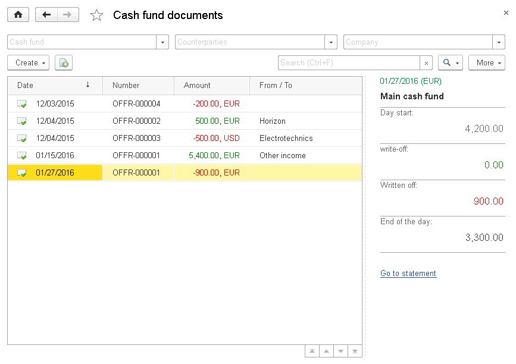
.. |image1521153993926902| image:: media/image244.png
   :width: 4.63542in
   :height: 2.28125in
.. |image1521153991019950| image:: media/image245.png
   :width: 4.63542in
   :height: 3.02083in
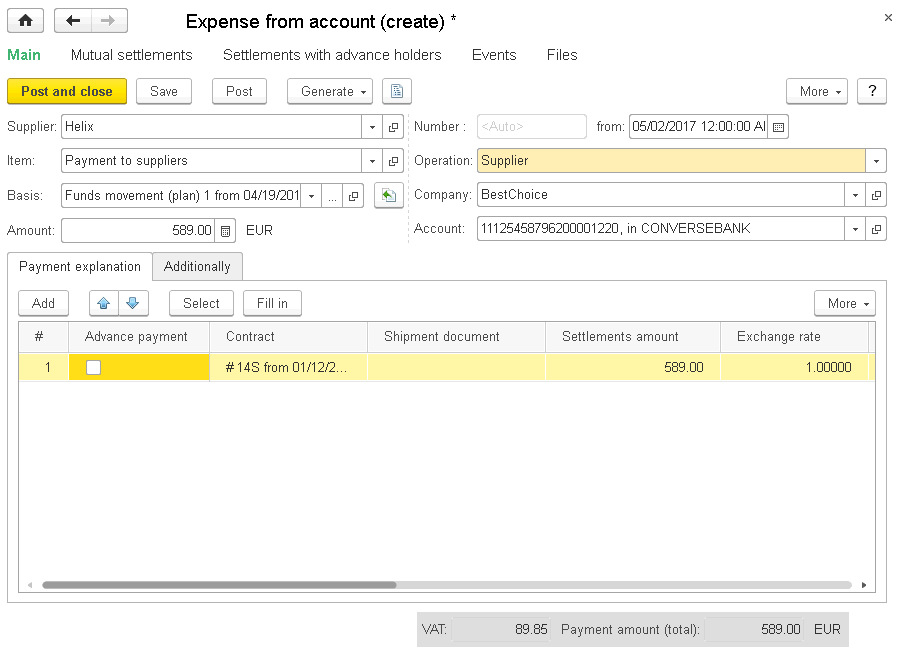
.. |image1521153993700596| image:: media/image247.png
   :width: 4.63542in
   :height: 3.01042in
.. |image1521153993642213| image:: media/image248.png
   :width: 4.63542in
   :height: 3.01042in
.. |image1521153993670627| image:: media/image249.png
   :width: 4.63542in
   :height: 3.03125in
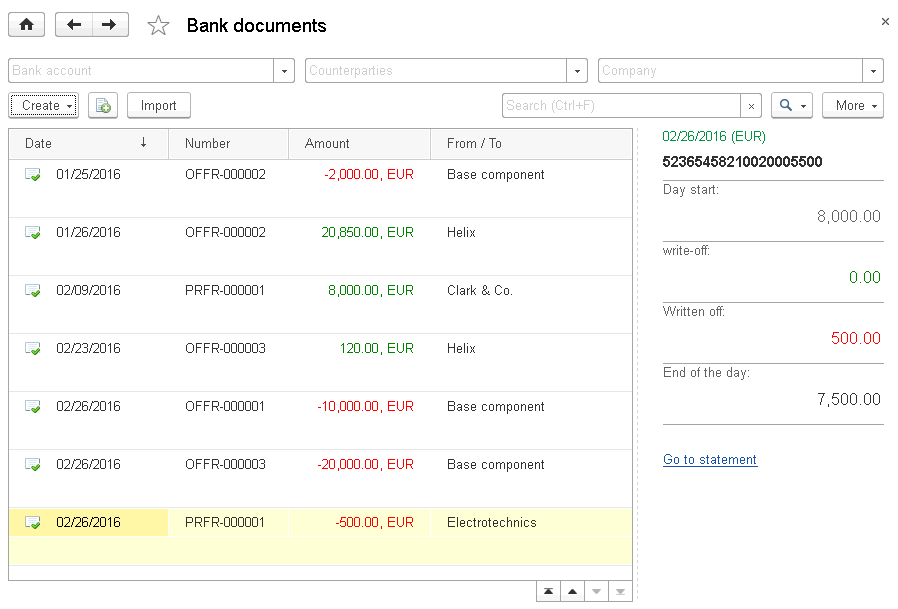
.. |image1521153993733291| image:: media/image251.png
   :width: 4.625in
   :height: 2.33333in
.. |image1521153993951590| image:: media/image252.png
   :width: 4.63542in
   :height: 1.95833in
.. |image1521153993904054| image:: media/image253.png
   :width: 4.63542in
   :height: 2in
.. |image1521154000363421| image:: media/image254.png
   :width: 4.33333in
   :height: 2.38542in
.. |image1521154000387521| image:: media/image255.png
   :width: 3.95833in
   :height: 3.76042in
.. |image1521154000411889| image:: media/image256.png
   :width: 4.33333in
   :height: 3.41667in
.. |image1521154000439791| image:: media/image257.png
   :width: 4.33333in
   :height: 2.38542in
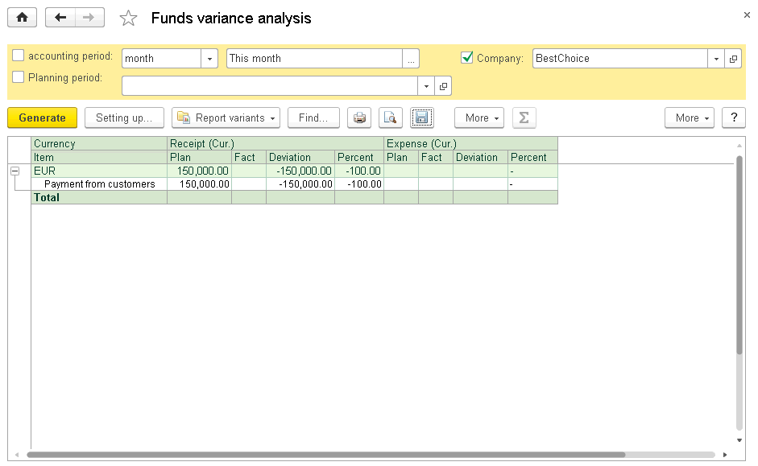
