CHAPTER 8
=========

.. _payroll-1:

PAYROLL
~~~~~~~

With the **Payroll** section, you can keep records of human resources
and accrue payroll.

HR recordkeeping involves registration of employee transfer and
dismissal, staff list, work schedules and time recording sheet.

Accrual of salary, including for time-based and piece work payment
systems is automated.

Tax calculations, tax reporting and reporting to funds are not available
in the applied solution but you can record accrued income tax amount. To
use this functionality, select the **Income tax accounting** check box
in the **Payroll** settings of the **Settings** section.

You can see employee information not related to employment duties in the
**Individuals** catalog.

Information used for description of working conditions is stored in
catalogs **Positions**, **Kinds of accruals and deductions** and in the
**Staff list** information register. Besides, work schedules are used in
the applied solution.

Settlements with advance holders
~~~~~~~~~~~~~~~~~~~~~~~~~~~~~~~~

The report displays debt state and changes over the specified period on
settlements with advance holders. The debt is changed by the **Expense
report** document and cash settlements documents.

|image1521153997264050|

The report allows you to group debts by employees and currencies. There
are the following modes of report generation: **Statement** and
**Balance**. In the **Balance** mode, data on cash issue and return will
be excluded from the report and only debts on the specified date will be
shown.

ACCRUAL AND DEDUCTION KINDS
~~~~~~~~~~~~~~~~~~~~~~~~~~~

In the **Accrual and deduction kinds** catalog, you can store a list of
accrual and deduction kinds used in the company. You can access the
catalog by clicking **Accrual and deduction kinds** in the navigation
panel in the **See also** group.

|image1521154000493399|

By selecting a radio button, you can set a type for each catalog item:
**Accrual**, **Deduction** or **Tax**. Specify a cost account for
accruals and deductions. Click icon |image1521154000529175|
to open a dialog box for editing a calculation formula of accruals and
deductions.

|image1521154000554072|

In the formula, there can be items of the **Calculation parameters**
catalog, numbers, functions.

Specify a tax kind from the **Tax kinds** catalog for taxes. The
calculation formula is not set – the amount of accrued tax is specified
manually in the **Salary accounting** document on the **Income taxes**
tab.

STAFF LIST
~~~~~~~~~~

You can access the **Staff list** information register by clicking the
corresponding link in the navigation panel. Using staff list is
optional. You can enable it by selecting the **Keep staff list** check
box in the **Payroll settings** of the **Settings** section.

|image1521153997311029|

The form consists of two parts. On the left side, you can see a
department tree of the company specified in the list above the field. On
the right side, you can see a list of positions of the selected
department. The following information is specified for each staff list
position:

-  Number of rates

-  Kind of accrual or deduction

-  Labor compensation range and currency

Summary information on the staff list and vacancies is shown in the
**Staff list** report. You can open the report by clicking the
corresponding link in the section report panel.

|image1521154000577047|

Employee occupation change accounting
~~~~~~~~~~~~~~~~~~~~~~~~~~~~~~~~~~~~~

You can register individuals' duties and labor compensation terms with
the **Hiring** and **Employee occupation change** documents.

Hiring
~~~~~~

Using the **Hiring** document, you can register employee hiring and
whether it is required to calculate accruals and deductions for these
employees.

|image1521154000602258|

In the document title, specify an employer. On the **Employees** tab,
specify a list of employees from the **Employees** catalog. Unique
personnel number is assigned to every new employee whenever they are
added to the catalog. Numbers are displayed in the **PN** column.
Besides, a department, a position, a number of occupied rates and work
schedule are specified for every employee. You can use the radio button
to specify employment type: primary or secondary employment. You can
select secondary employment if the **Use secondary employment** option
is enabled in the **Payroll** settings of the **Settings** section.

|image1521153991448385|

On the **Accruals and deductions** tab, you can see accruals and
deductions of the employee selected on the previous tab and specify
planned amount, currency and cost account.

Individuals who hold secondary employment can be employed unlimited
number of times. To employ them multiple times, create several items in
the **Employees** catalog.

Employee occupation change
~~~~~~~~~~~~~~~~~~~~~~~~~~

Use the **Employee occupation change** documents to register changes in
labor compensation terms and employee transfers for employed personnel.
Before filling in a new document, specify the operation kind: **Change
of payment conditions** or **Change of occupation** **and payment
conditions** respectively.

|image1521153993533522|

On the **Employees** tab, specify a list of employees and their new
working conditions.

|image1521153993508177|

On the **Accruals and deductions** tab, you can see a list of accruals
and deductions for the employee selected on the previous tab.

Dismissal
~~~~~~~~~

Register employee dismissal with the **Dismissal** documents.

|image1521153991425114|

Enter a list of dismissed employees to the table field of the document
form and specify a date and a cause of dismissal for each of them.
Automatic accruals and deductions will be canceled for the dismissed
employee starting from the specified date.

PAYROLL AND SALARY ACCOUNTING
~~~~~~~~~~~~~~~~~~~~~~~~~~~~~

Below you can see an interaction scheme of documents used in payroll and
salary accounting.

|image1521154002103400|

Consider hours worked by employees for accrual kinds with time-based
payment. Use the **Time recording sheet** document for this purpose.

Take into account output for accrual kinds with piece work payment
system. Use documents **Job sheet** and **Job order** for this purpose.
Wage is accrued under these documents.

You can automatically fill in the **Employee salary accounting**
document according to time recording sheet. To prepare payments, fill in
the **Pay sheet** document based on which you can register payments to
employees by entering the **Cash payment** document.

Timesheet
~~~~~~~~~

Use the **Timesheet** documents to enter information on working hours.
To access the document list, in the navigation panel, click
**Timesheets**.

|image1521153997600524|

In the document, specify a department and a registration period (date in
a month for which you enter the timesheet). Specify how to enter data,
by days or for the whole period, by selecting one of the following radio
button options (**By days** or **By period**).

Enter a department employee list to the table field of the document and
specify information on hours worked for every employee. To fill in the
document automatically, click **Fill in**.

If you select the **By** **period** option to enter data, in the
timesheet, you will see a total number of hours with used time kind over
the specified period. You can specify up to six used time kinds for
every employee. Used time kinds are stored in the corresponding
classifier.

If you select **Enter data by days**, enter data on used working hours
every day. You can specify up to three used time kinds for a day.
Specify time in hours.

Employee salary accounting
~~~~~~~~~~~~~~~~~~~~~~~~~~

Use the **Salary accounting** document to accrue labor compensation (at
the month end) and allocate it to costs.

|image1521154000623452|

In the document, specify a registration period (a month date for which
the labor compensation is accrued), a company, and a department. Fill in
the table field with the employee list specifying a position, an accrual
kind and amount, and a paid work period. For every row of the table
field, specify a cost allocation account. You can also specify a
business area and a customer order to which this accrual or deduction is
connected.

To enter the data automatically, click **Fill in** in the command bar.
To calculate the paid (deducted) amount automatically, click
**Calculate**. Calculation parameters are stored in the corresponding
catalog. To access the catalog, in the **Catalogs** group, in the
navigation panel, click **Calculation** parameters.

On the **Income taxes** tab, you can specify amounts of income tax
deducted from employees. The application does not calculate tax amounts.

Use the **Pay sheet** document to prepare employee salary for payment.
In the table field of the document, fill in a list of employees and
specify accrued amount for each of them.

The **Cash payment** document registers paid salary. Specify the
**Payroll** operation kind in the document. You can pay salary via bank
transfer.

Calculation parameters
~~~~~~~~~~~~~~~~~~~~~~

Use the **Calculation parameters** catalog to store data selection rules
used for payroll.

|image1521153992661603|

Every catalog item contains a query template to receive a value from the
infobase. You can generate the query using the following methods. If you
select the **Arbitrary query** check box, the query text and parameters
become available for editing, and query designer becomes available in
thick client. If the check box is cleared, specify a data source, a
filter period, an indicator, and set data filters. In this case, the
query is generated automatically. If you select the **Specify value on
payroll** check box, then you do not need to set up the item. Set the
parameter value before calculation in the **Salary accounting**
document.

On the **Data** tab, specify a data selection period and select an
indicator.

On the **Filter** tab, set the data selection filter.

|image1521154000647991|

On the **Query** tab, you can view results of the calculation parameter
setup and edit it if necessary. To edit the query, click **Edit query**.

|image1521154000670043|

In thick client, you can use the query designer by clicking **Query
designer**:

-  **Query** is a query text

-  **Parameters** are query parameters:

-  **Parameter name** is inserted from the query text, it does not
contain spaces.

-  **Parameter presentation** is displayed in the **Salary accounting**
document.

-  **Parameter value**.

You can specify the query parameters on the additional **Parameters**
tab.

|image1521154000693930|

You can fill in the parameter values using the following methods:

-  You can specify fixed values of the query parameters on the
**Filters** tab, or, if you select the **Arbitrary query** check box,
on the **Parameters** tab.

-  The query parameter values are inserted automatically from the
**Salary accounting** document. Such parameters are **Company**,
**Currency**, **Department**, **BusinessUnit**,
**RegistrationPeriod**, **TimePoint**, **PeriodStart**,
**PeriodEnd**, **Employee**, **EmploymentType**, **PersonnelNumber**,
**PersNumber**, **Performer**, **Individual**, **Position**,
**AccrualDeductionKind**, **CustomerOrder**, **Order**, **Project**,
**CostAccount**, **BusinessArea**, **Amount**, **DaysWorked**,
**HoursWorked**.

Fill in the following attributes:

-  **ID** – calculation parameter presentation in the formula.

-  **Data selection source**

-  **Specify value on payroll** if you enter the parameter value on
payroll.

-  **Arbitrary query**. Select the check box if you are going to edit
the query and its parameters manually.

You can also fill in the catalog item from template. To fill it in from
template, click **Fill in from template** and select one of the
following options:

-  Normal working days

-  Normal working hours

-  Days worked

-  Hours worked

-  Hours worked by jobs

-  Tariff rate

-  Fixed amount

After you select the option, the catalog item will be set up according
to the selected template. Then you can add your settings to the item.

Note that there must be not more than three parameters in the formula
whose values are specified for payroll. Parameters **TariffRate**,
**DaysWorked**, and **HoursWorked** are excluded from this number.

Work schedules
~~~~~~~~~~~~~~

The **Work schedules** catalog contains a list of all company work
schedules assigned to employees. Work schedules are created based on a
business calendar. You can use them for the whole company and for its
departments (for example, a warehouse work schedule).

|image1521153997700116|

Specify a name, a period, a population method, and a population template
for a work schedule.

Pay sheet
~~~~~~~~~

Use the document to generate a print form of the pay sheet for salary
(advance) payment to company employees.

|image1521154000718028|

You can fill in the document automatically by clicking **Fill in by
balance** in the command bar.

Payroll reports
~~~~~~~~~~~~~~~

You can analyze the **Payroll** section information using reports. You
can access the reports in the report panel of the section.

|image1521153996106484|

Employee list
~~~~~~~~~~~~~

In the report, you can see information about HR data, scheduled employee
accruals, passport data and individuals' contact information. There are
the following modes in the report: **Employee list**, **Scheduled
accruals**, **Passport data** and **Contact information**.

|image1521153993485805|

Accruals and deductions
~~~~~~~~~~~~~~~~~~~~~~~

With the report, you can see data on accruals and deductions of
employees with details up to an accrual/deduction kind. Data is grouped
by departments.

|image1521154000742856|

Settlements with employees
~~~~~~~~~~~~~~~~~~~~~~~~~~

The report displays salary debt to employees over a specified period of
time.

|image1521154000766125|

Hours worked
~~~~~~~~~~~~

In the report, you can see summary data on time-keeping of working hours
based on the **Timesheet** documents. You can generate the report in two
modes: **By days** and **Total**.

In the **By days** mode, you can see information about daily hours
worked over the specified period. Data is grouped by departments.

|image1521153994294939|

In the **Total** mode, you can see information about total hours worked
detailed up to working time kind on a specific date. Data is grouped by
employees and departments.

|image1521154000792858|

.. |image1521153997264050| image:: media/image259.png
   :width: 4.63542in
   :height: 2.0625in
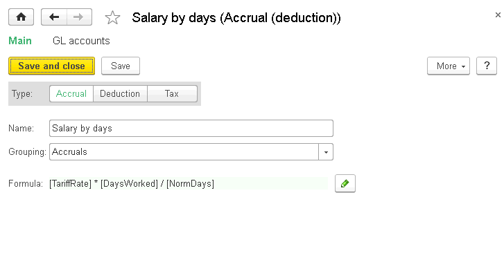
.. |image1521154000529175| image:: media/image261.png
   :width: 0.13542in
   :height: 0.11458in
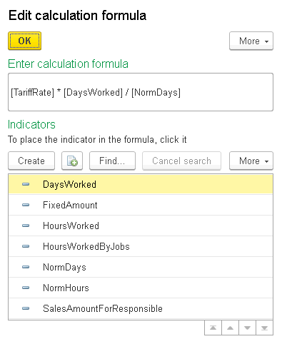
.. |image1521153997311029| image:: media/image263.png
   :width: 4.63542in
   :height: 3.47917in
.. |image1521154000577047| image:: media/image264.png
   :width: 4.29167in
   :height: 2.78125in
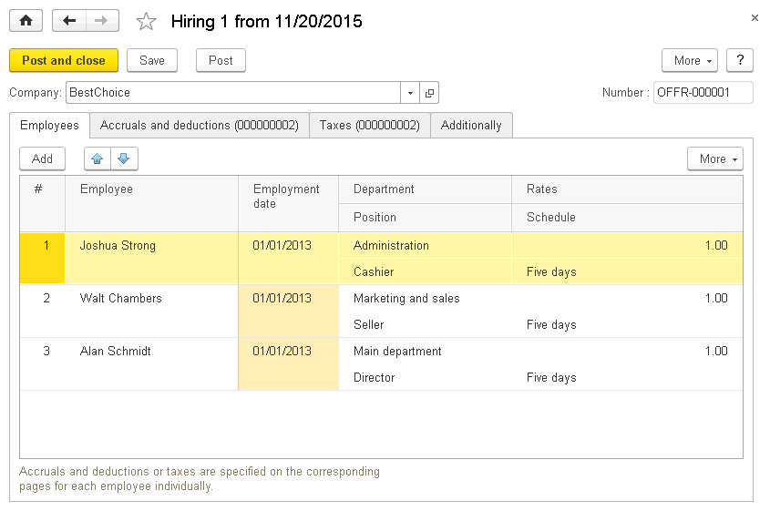
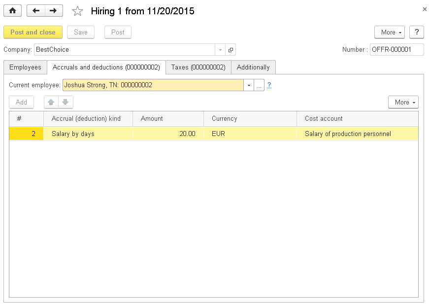
.. |image1521153993533522| image:: media/image267.png
   :width: 4.63542in
   :height: 2.77083in
.. |image1521153993508177| image:: media/image268.png
   :width: 4.63542in
   :height: 2.80208in
.. |image1521153991425114| image:: media/image269.png
   :width: 4.51042in
   :height: 3.21875in
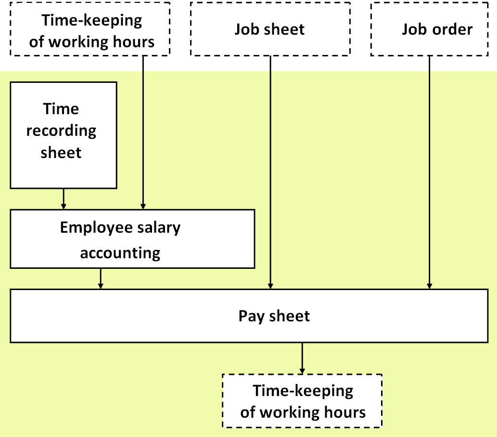
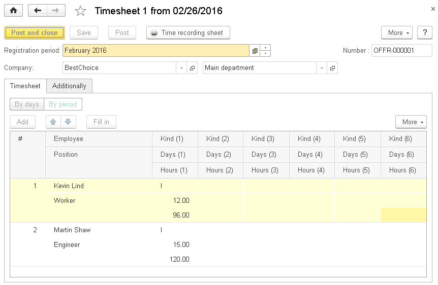
.. |image1521154000623452| image:: media/image272.png
   :width: 4.33333in
   :height: 2.70833in
.. |image1521153992661603| image:: media/image273.png
   :width: 4.63542in
   :height: 2.85417in
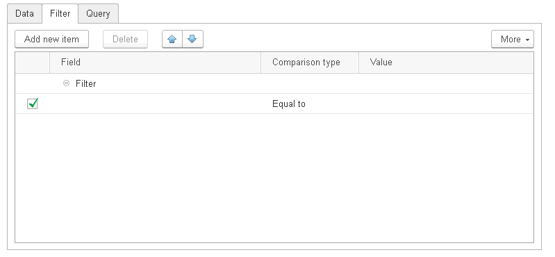
.. |image1521154000670043| image:: media/image275.png
   :width: 4.34375in
   :height: 2.02083in
.. |image1521154000693930| image:: media/image276.png
   :width: 4.63542in
   :height: 2.15625in
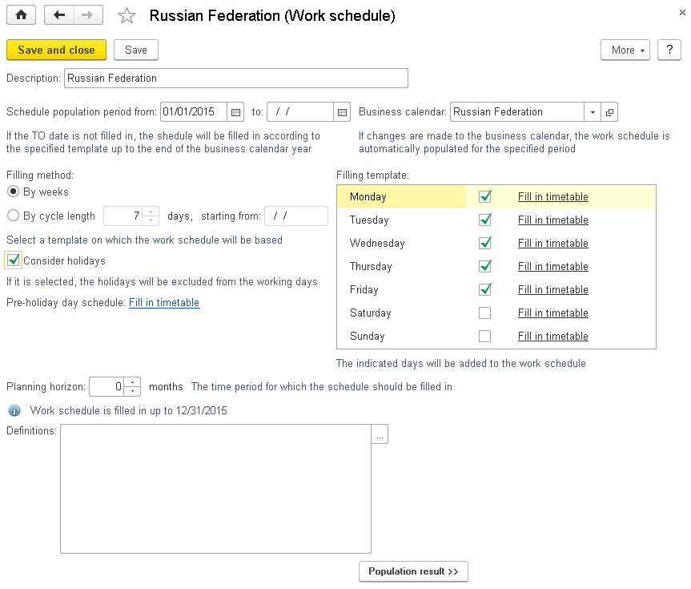
.. |image1521154000718028| image:: media/image278.png
   :width: 4.33333in
   :height: 2.32292in
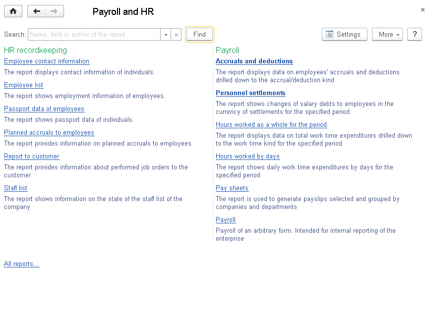
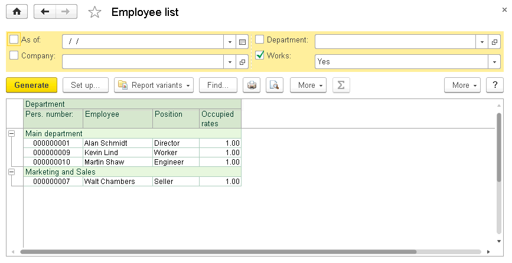
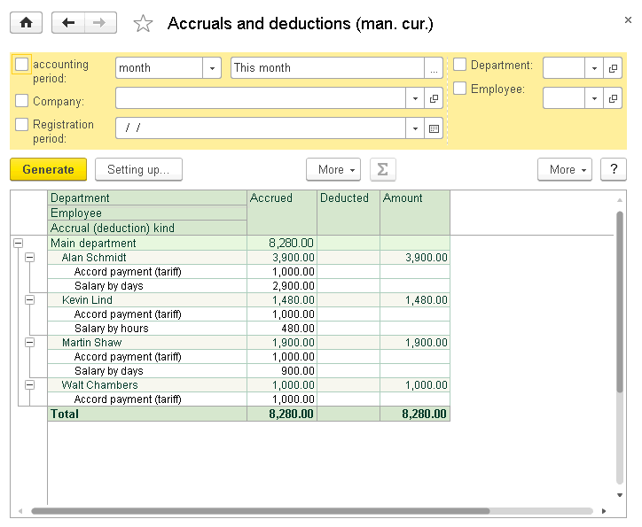
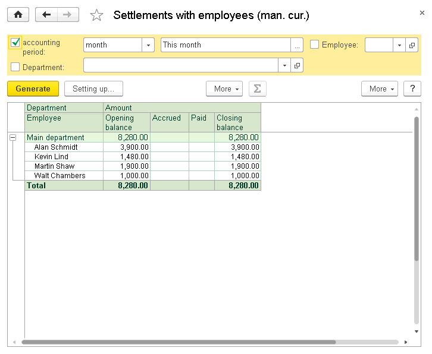
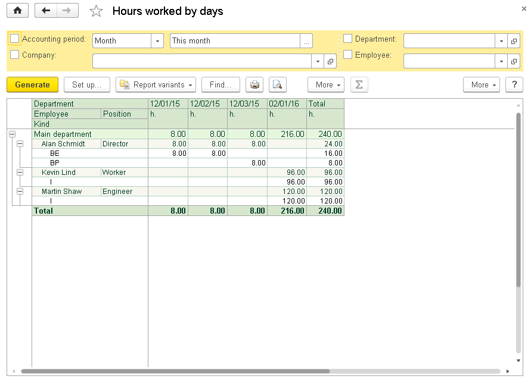
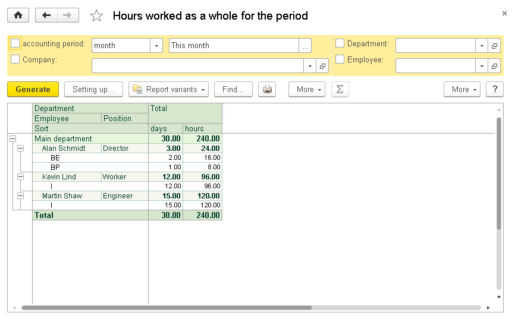
