CHAPTER 9
=========

.. _company-1:

COMPANY
~~~~~~~

Use «1C:SimpleERP» to keep management accounting. Book-keeping and tax
accounting are not available in the application.

Management accounting entries are generated automatically when posting
documents. Use the following objects to store management accounting
records:

-  Accumulation registers – for main accounting sections

-  **Management** accounting register – for generating postings and
balance sheet statement

Note

Records of **Management** accounting register can be called management
accounting postings or just postings.

POSTING DOCUMENTS
~~~~~~~~~~~~~~~~~

When posting a document, the following actions are performed:

-  Accumulation register (movement) records are generated using the
application algorithms.

-  Based on posting generation rules of accumulation register records,
postings are generated in the **Management** accounting register.

|image1521154000817466|

Accumulation register and accounting register data is used to
automatically populate reports.

DIRECT ENTERING OF POSTINGS
~~~~~~~~~~~~~~~~~~~~~~~~~~~

The solution generates a posting automatically when posting a document.
However, you can use manual posting adjustment. To adjust postings
manually, use the **Operation** document. Use the document to record
business transactions not automated with other documents. Otherwise, it
is not recommended to use the document. Select accounts from
**Management accounting chart of accounts**.

|image1521153995892210|

In the document header, specify a company from the corresponding
catalog. In the table field, enter posting entries.

.. _chart-of-accounts-1:

CHART OF ACCOUNTS
~~~~~~~~~~~~~~~~~

Management «Chart of Accounts» is accessible in the «Company» group from
navigation panel, by clicking the corresponding link.

|image1521153992881187|

The chart of accounts is filled in automatically with accounts and
subaccounts on the first launch of a new infobase. The chart of accounts
is based on the chart of accounts according to RAS. You can change the
chart of accounts, enter accounts and subaccounts, set their kinds
(**Asset**, **Liability**, or **Asset/Liability**), types, allocation
method, and whether currency accounting is kept.

For a service account or account groups, specify special account type
**Account group**.

MUTUAL SETTLEMENTS RECONCILIATION DOCUMENT
~~~~~~~~~~~~~~~~~~~~~~~~~~~~~~~~~~~~~~~~~~

Use the **Mutual settlements** reconciliation document to control and
register mutual settlements reconciliation. To access the document, in
the navigation panel of the **Company** section, click **Mutual
settlements** reconciliation. Members of mutual settlements
reconciliation are a trading company and a counterparty (partner's legal
entity or individual). Mutual settlements reconciliation is carried out
in several stages. In the document, the following statuses of
reconciliation document are registered for each stage: created, on
reconciliation, reconciled.

|image1521153995600044|

**Created** – mutual settlements reconciliation is created. You can
create the document manually or using the reconciliation creation wizard
(batch document input). The document is printed and transferred to the
counterparty.

**On reconciliation** – the document is transferred to the counterparty.
The counterparty reconciles the data sent by the company with their own
data. Information about discrepancies by mutual settlements debts is
filled in on the **Information from counterparty page**.

**Reconciled** – members of mutual settlements approved mutual claims
and signed the document.

The counterparty may initiate the document creation. In this case,
create a document in which information about counterparty debts is
registered according to the sent printed form of reconciliation
statement. Set the **On reconciliation** for the document. Use the
reports to compare information about the debt amount according to the
data of counterparty with our information. You can also print detailed
information with a list of documents by which the debts arouse according
to our information and counterparty information. For this purpose, use
the corresponding print form.

DEBT ADJUSTMENT
~~~~~~~~~~~~~~~

You can use the document to setoff and assign a debt with
counterparties.

|image1521153993352736|

Depending on the set operation kind, use this document to record the
following:

-  **Setoff**

-  **Customer debt assignment**

-  **Debt assignment to supplier**

-  **Customer debt adjustment**

-  **Adjustment of debt to supplier**

Use **Setoff** to record setoff with a counterparty.

If you register customer debt assignment, set the **Customer debt
assignment** operation kind.

If you register debt assignment to supplier, set the **Debt assignment
to supplier** operation kind.

With operation kinds **Customer debt assignment** and **Debt assignment
to supplier**, the **Payee details** tab is available for population.

For debt adjustment operations, fill in the **Correspondence** attribute
which is an adjustment attribution account.

OTHER COSTS (EXPENSES)
~~~~~~~~~~~~~~~~~~~~~~

Use the **Other costs (expenses)** document to record intangible
expenses of the company business activities in accounting. Using the
document, you can capitalize intangible costs for further allocation.

|image1521154000840023|

In the document, specify own company, a department, and an offsetting
account with the **Other income**, **Other current assets**, **Credits
and loans**, or **Long-term liabilities** type to identify an expense
source. In the table field, specify a GL account and a customer order to
which expenses are allocated, and a business area within which the
expenses are incurred.

TAX ACCOUNTING
~~~~~~~~~~~~~~

Tax calculation is not available in the application. To register company
tax amounts calculated outside the application in management accounting,
use the **Tax accrual** document. To access the document, in the
navigation panel of the **Financial transactions** group, click **Tax
accrual**.

|image1521154000864335|

In the document, specify operation type **Accrual** or **Compensation**.
Enter a tax list from the **Tax kinds** catalog into the table field.
Specify accrued amount for each tax. In the **Cost account** column,
specify an account to allocate accrued tax amounts to.

Document **Cash payment** or **Expense from account** with the **Taxes**
operation kind records tax payment to budget.

Tax accruals and payments are shown in the **Tax settlements** report.

|image1521154000892579|

MONTH-END CLOSING
~~~~~~~~~~~~~~~~~

Use the Month-end closing data processor to perform regulatory
operations of period-end closing in management accounting. To access it,
in the **Financial transactions** group, in the navigation panel, click
**Month-end closing**.

|image1521154000922465|

The data processor automatically performs the following regulatory
operations:

-  **Depreciation accrual**

-  **Direct cost calculation**

-  **Cost allocation**

-  **Actual cost calculation**

-  **Retail cost (value accounting)**

-  **Exchange rate difference calculation**

-  **Financial result calculation**

Specify all data related to the month being closed for correct automatic
calculation.

You can use a special tool for automatic error detection and correction
in accounting for the **Month-end closing** operation.

Accounting correctness is checked for the following sections:
settlements with suppliers, settlements with customers, exchange rate
differences, products and services without bills of materials,
purchasing price analysis, control of companies and contracts in
documents, cash flow items.

To access the wizard, on the month-end closing form, click **Preliminary
analysis**.

|image1521153991651839|

.. _property-1:

Property
~~~~~~~~

In the **Property** subsection, you can access data on accounting of
capital assets which include fixed assets (FA) and intangible assets
(IA). The section is available only if the **Use property accounting**
check box is selected in the settings of accounting policy parameters.

Property information
~~~~~~~~~~~~~~~~~~~~

Information on company property is stored in the **Property** catalog.

|image1521153996599653|

The following property information is shown in the catalog: an inventory
number, initial cost, accrued depreciation, residual value, and state.

On the list form, you can quickly filter property by the specified state
and company, view information on the last period of depreciation
accrual, and calculate property depreciation if necessary.

On the list form, you can also register all available property
operations or access the property document journal.

|image1521153996574529|

To access information on parameters and state of the current asset,
click the link in the navigation panel of the catalog item form.

|image1521153990967966|

Specify the following information for property: a type (**Fixed asset**
or **Intangible asset**), a depreciation method (**Proportionally to
product volume** or **Linear**), initial cost, a unit of measure. To
specify GL and depreciation accounts, click **More**.

Actions with property starting from new asset registration are
registered with documents grouped into the **Property documents**
journal.

|image1521154000947397|

Registering a new asset
~~~~~~~~~~~~~~~~~~~~~~~

To register a new property item:

-  Register receipt of new products and services

-  Enter the products and services in the books as property

Receipt of new products and services is registered with the **Goods
receipt** document.

|image1521153994152388|

To register products and services as property, enter the **Property
recognition** document.

|image1521153994971019|

On the **Attachment object data** document tab, specify the following
information on products and services: a name, quantity, characteristics,
amount. In the table field of the **Property** tab, specify information
on property related to this products and services item including the
following information: volume of products to manufacture for full asset
output, useful life, a department accepting the asset, a business area.
Specify product volume only for assets with the **Proportionally to
product volume** depreciation method in the corresponding catalog.

When posting a document, its data is stored in special information
registers. You can access this data from the **Property** catalog item.

Changing parameters
~~~~~~~~~~~~~~~~~~~

You can change property parameters specified on registration. To
register such changes, use the **Change of parameters** document.

|image1521153994922717|

In the table field of the document form, specify a list of assets and
new values of changed parameters.

Depreciation
~~~~~~~~~~~~

Property depreciation is accrued automatically according to the
information specified in documents **Property recognition** and **Change
of parameters**. It is required to enter the **Property depreciation**
document at the end of the month.

|image1521153996547666|

Specify output volume manually before automatic accrual for the asset
with depreciation accrual method **Proportionally to product volume**.
Use the **Property output** document for showing information on asset
output. Enter a list of assets in the tabular field of the document form
and specify the output volume in the **Quantity** column.

|image1521153991123230|

Property outflow
~~~~~~~~~~~~~~~~

In the application, you can use the following methods of taking property
off the books:

-  Sale is registered with the **Property sale** document.

-  Write-off due to physical depreciation is registered with the
**Property write-off** document.

Property sale
~~~~~~~~~~~~~

Use the **Property sale** document to register property sale to a third
party counterparty.

|image1521153995080831|

The document automatically accrues depreciation additionally for the
month of the sale. In the **Total depreciation** column, specify
depreciation amount for the whole operation period. In the
**Depreciation for the current month** field, specify calculated
depreciation amount for the current month. In general, the document is
similar to the **Goods sale document**.

Property write-off
~~~~~~~~~~~~~~~~~~

Use the **Property write-off** document to register write-off of fixed
assets and intangible assets. The document automatically accrues
depreciation for the current month before writing-off.

|image1521153995108744|

In the document header, in the **Correspondence** field, specify GL
account to which the property residual value will be allocated.

In the **Property** table field, specify written off assets and their
parameters, such as initial cost, residual value, and depreciation (for
full operation period and for the last month).

Budgeting
~~~~~~~~~

To register planned financial indicators of company operations, use the
**Budget** document. To access it, in the **Planning** group, in the
navigation panel, click the corresponding link.

With this document, you can register budget of direct manufacturing
costs, indirect costs, budget of income and expenses, cash flow budget,
and other planned operations.

Planning is based on value indicators.

In the document, specify own company for which the budget is generated,
a planning period (select the value from the corresponding catalog, it
defines an interval, budget start and end).

When entering data in the **Planning date** column of the document table
field, a date of planned period start is set automatically.

Cash flow is planned by cash flow items. Income and expenses are planned
by business areas.

When you post a document, indirect costs budget is automatically closed
for unfinished production costs to the account specified in the account
of indirect costs as a closing account.

Direct manufacturing costs are closed to GL account of products,
semi-finished products and works in unfinished production specified as a
closing account of GL account of direct manufacturing costs. GL account
of products, semi-finished products and works is closed to GL account of
inventory specified in GL account of products, semi-finished products
and works as a closing account.

Income and expenses are closed to GL account of income and expenses
specified in the business area. Closing is similar to closing of income
and expense GL accounts in the **Month-end closing** document.

Opening balance
~~~~~~~~~~~~~~~

On the **Opening balance** tab, you can specify cash balance amount on
company accounts on the planned period start date.

|image1521153992069303|

Costs
~~~~~

You can use the **Costs** tab to store information on direct and
indirect company costs over the specified period.

|image1521153992092577|

.. _funds-3:

Funds
~~~~~

On the **Funds** tab, you can store data on cash flow budgets over the
specified period.

|image1521153992171503|

Income and expenses
~~~~~~~~~~~~~~~~~~~

You can use the **Income and expenses** tab to store income and expense
budget over the specified period for a specific department of own
company. Specify the following information in table fields: GL account,
a business area, and a customer order to allocate income or expense to.

|image1521153992118269|

Operations
~~~~~~~~~~

You can use the tab to store data on other budget operations.

|image1521153992144107|

Company section reports
~~~~~~~~~~~~~~~~~~~~~~~

In the **Company** section, you can see reports that use accumulation
register data and the **Management** accounting register that contains
management accounting records as a whole (see the scheme in the
beginning of the chapter). Use the accounting register to generate the
**Trial balance** report.

You can access the reports in the report panel available by clicking the
corresponding link in the navigation panel of the section.

|image1521153990810418|

Non-allocated costs
~~~~~~~~~~~~~~~~~~~

The report provides data on direct and indirect company production
costs. The data is provided by departments with details by customer
orders.

|image1521154000973273|

You can generate the report in two modes – **Statement** and
**Balance**. Data on funds receipts and expenses is not shown in the
**Balance** mode.

|image1521154000999923|

Trial balance
~~~~~~~~~~~~~

With the **Trial balance** report, you can see summary data on
management accounting.

|image1521154001025963|

The report is generated as a table. Every row of the table contains
information on a specific management accounting account. Accounts are
sorted in increasing order of numbers. Amount balance as of the report
period start and end (debit and credit balance), and debit and credit
turnover amounts are recorded for every account.

Before generating the report, in the settings panel, specify a period
and a planning period (for generating the report on planned data). The
default planning period is Actual. You can generate the report for the
whole company or for a specific company.

Property output
~~~~~~~~~~~~~~~

Summary information on property output over the specified period is
shown in **Property output** report.

|image1521153994999015|

Sales plans
~~~~~~~~~~~

The **Sales plans** report shows information on planned sales of
products and services grouped by departments. For all products and
services planned for sale, the report shows quantity, amount, and total
for each department and for all departments.

|image1521154001052561|

.. |image1521154000817466| image:: media/image285.png
   :width: 3.30208in
   :height: 2in
.. |image1521153995892210| image:: media/image286.png
   :width: 4.63542in
   :height: 3.625in
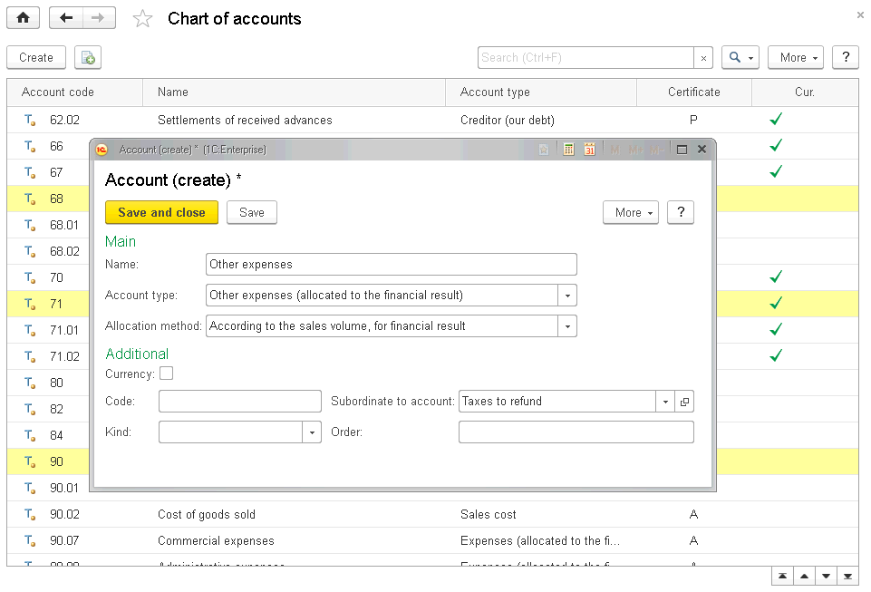
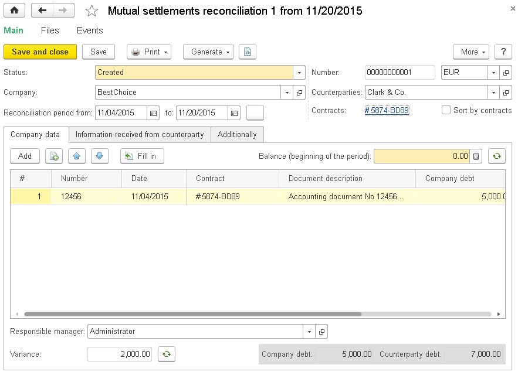
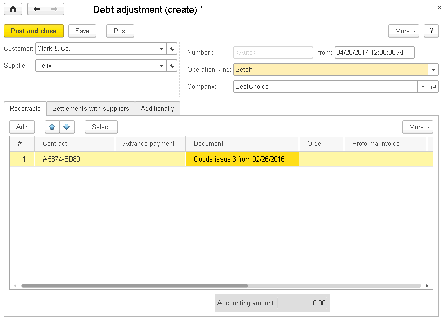
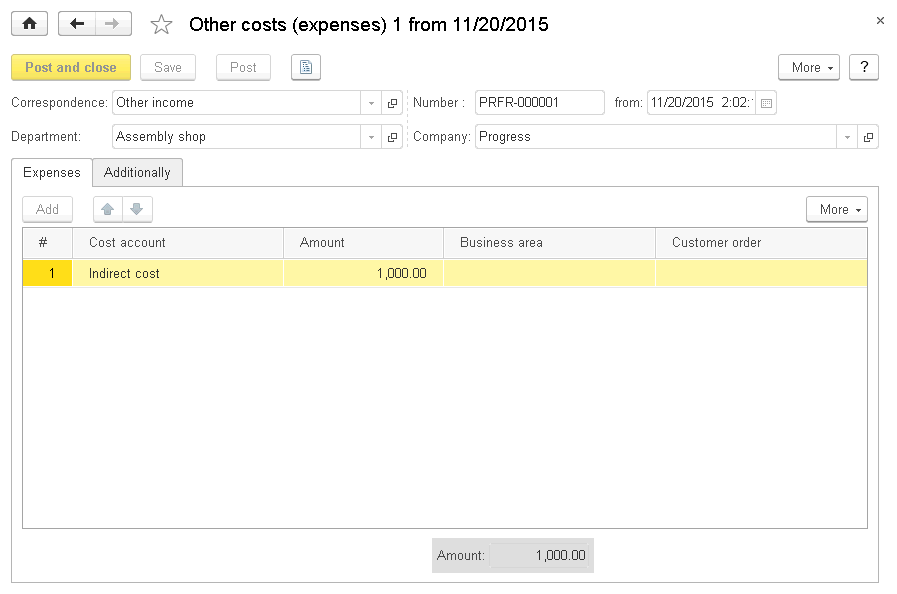
.. |image1521154000864335| image:: media/image291.png
   :width: 4.33333in
   :height: 2.5625in
.. |image1521154000892579| image:: media/image292.png
   :width: 4.25in
   :height: 2.20833in
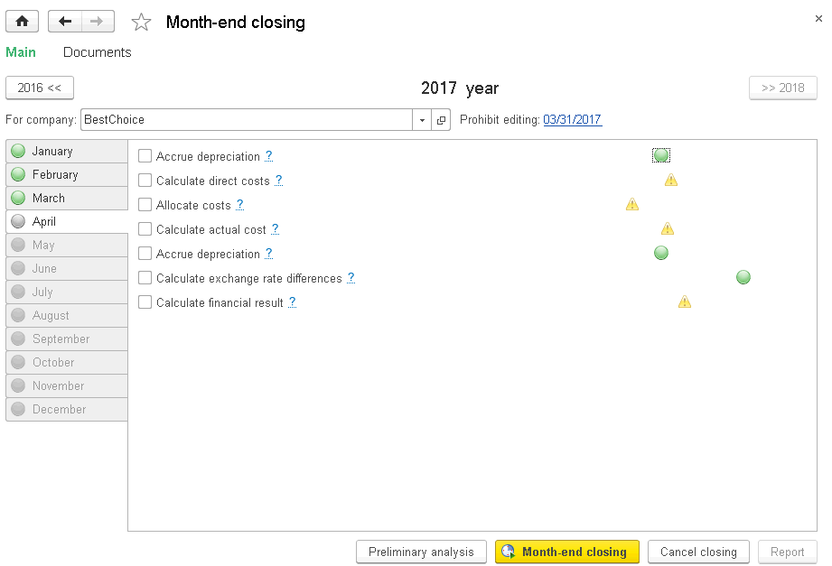
.. |image1521153991651839| image:: media/image294.png
   :width: 4.625in
   :height: 2.92708in
.. |image1521153996599653| image:: media/image295.png
   :width: 4.63542in
   :height: 2.09375in
.. |image1521153996574529| image:: media/image296.png
   :width: 4.63542in
   :height: 2.08333in
.. |image1521153990967966| image:: media/image297.png
   :width: 4.20833in
   :height: 2.98958in
.. |image1521154000947397| image:: media/image298.png
   :width: 3.85417in
   :height: 2.51042in
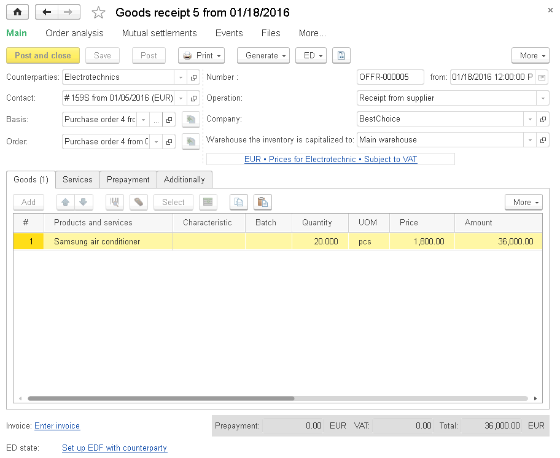
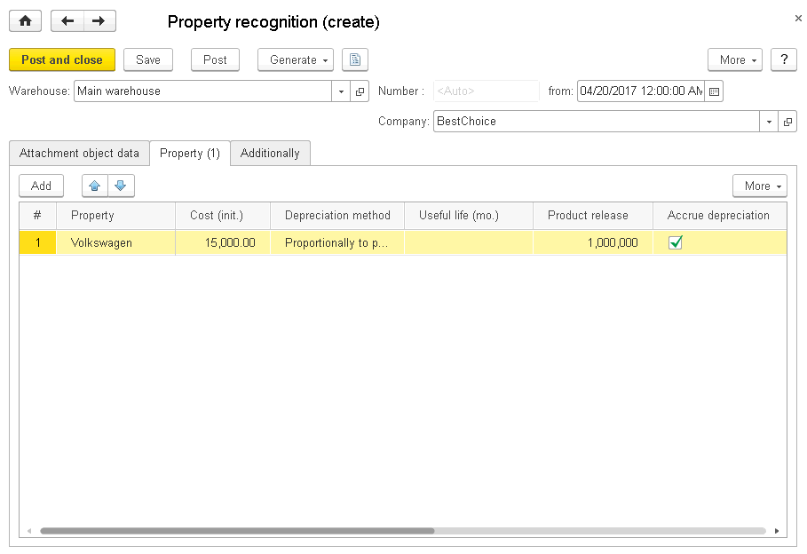
.. |image1521153994922717| image:: media/image300.png
   :width: 4.625in
   :height: 2.79167in
.. |image1521153996547666| image:: media/image301.png
   :width: 4.625in
   :height: 1.38542in
.. |image1521153991123230| image:: media/image302.png
   :width: 4.67708in
   :height: 2.86458in
.. |image1521153995080831| image:: media/image303.png
   :width: 4.63542in
   :height: 2.79167in
.. |image1521153995108744| image:: media/image304.png
   :width: 4.625in
   :height: 2.80208in
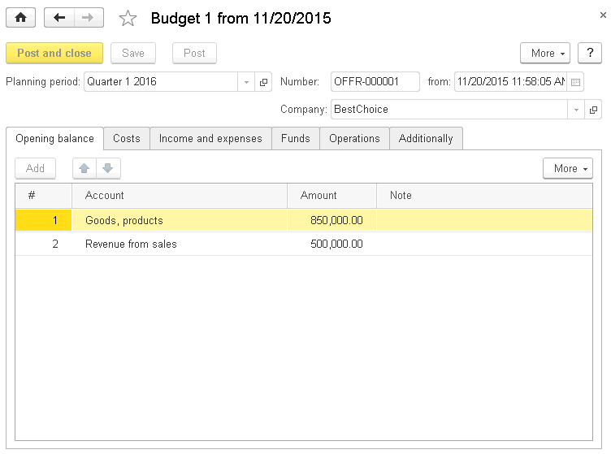
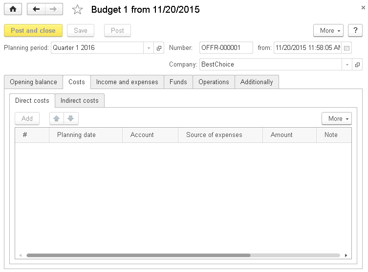
.. |image1521153992171503| image:: media/image307.png
   :width: 4.63542in
   :height: 3.3125in
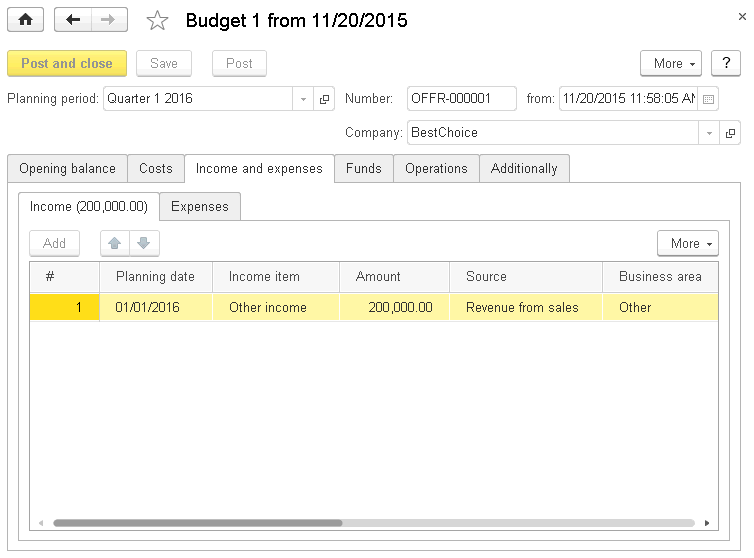
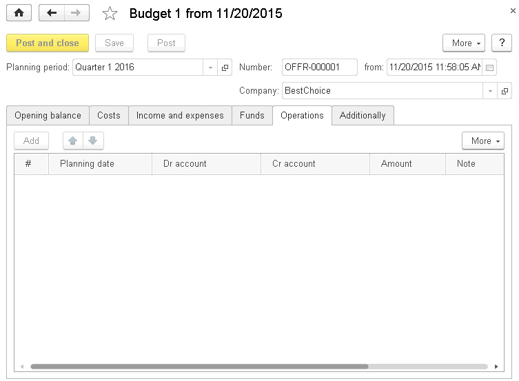
.. |image1521153990810418| image:: media/image310.png
   :width: 4.63542in
   :height: 3.01042in
.. |image1521154000973273| image:: media/image311.png
   :width: 4.44792in
   :height: 2.95833in
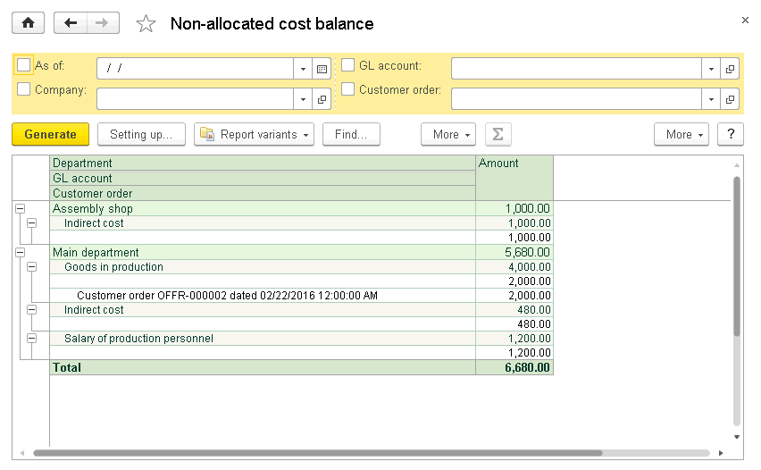
.. |image1521154001025963| image:: media/image313.png
   :width: 4.15625in
   :height: 2.91667in
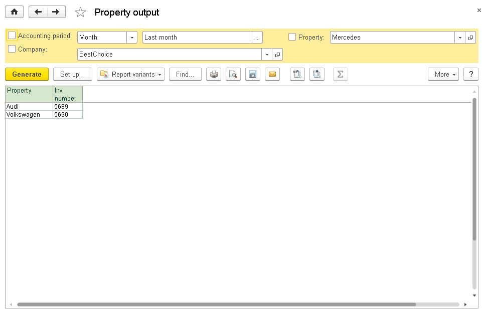
.. |image1521154001052561| image:: media/image315.png
   :width: 4.29167in
   :height: 3.25in
