**1C:ENTERPRISE 8**

«1C:SimpleERP»
==============

**Version 1.0.0.6**

 

 

 

 

EUROPE

1C Company

2017

 

**1C COMPANY
IS AUTHORIZED TO DISTRIBUTE SOFTWARE AND DOCUMENTATION**

Having acquired «1C:Enterprise» application, you agree to prevent the
applications and documentation from being copied without «1C» Company
written permission.

© 1C LLC, 2017

123056, PO box 64, Moscow, «1C» Company

Sales Department: 21 Seleznevskaya st.

tel.: +7 (495) 737-92-57

fax: +7 (495) 681-44-07

Email: 1c@1c.ru

URL: `www.1c.ru, <http://www.1c.ru/>`__ v8.1c.ru

Developing group: – Aghabekyan Karen («Risecompany», Armenia), Akulov
Pavlo («1C-Poland», Poland), Aripov Nikita («1C», Russia), Asarowski
Dimitri («Edv-Lotse», Germany), Baydikov Igor («Marco», Azerbaidjan),
Bugaevsky Timofey («1C», Russia), Gabdrakhmanov Ildar («1C», Vietnam),
Ientts Vladyslav («1C-Poland», Poland), Jascin Olga («1Attimo», Italy),
Kiselyov Ilya («ELMI», Latvia), Kondratyev Alexey («1C», Vietnam),
Koriakovskaia Anna («AnaSoft», Dubai), Kovalev Sergey («1C-Germany»,
Germany), Lavrov Maxim («1C-Poland», Poland), Nikolaev Nikolay («ACNC»,
Estonia), Osypenko Serhii (Lithuania), Paraschiv Rares («1C-Romania»,
Romania), Pintov Vasily (Russia), Polikarpov Sergei («1C», Russia),
Ponomarenko Eugene (Ukraine), Popov Nikita («Risecompany», Russia),
Ryabko Vitaly (Hungary), Sargsyan Sevak («Risecompany», Armenia), Serb
Adelin («1C-Romania», Romania), Shcherbakov Dmitry (Ukraine), Shihov
Ilya («Risecompany», Russia), Shilkin Nick («Raycon», Russia),
Snitkovski Alexei («1C-Romania», Romania), Sosna Yevhen (Ukraine),
Stupakovski Maxim («Program Solutions», Moldova), Suschevici Sergei
(«1C-Account Timbal», Moldova), Tarabanov Roman (Russia), Teravainen
Andrei («ELMI», Latvia), Timbal Evghenii («1C-Account Timbal», Moldova),
Tomsa Dan («Previa», UK), Zakirov Alexey («1C», Vietnam)

Translation: Baydikov Igor («Marco», Azerbaidjan), Bugaevsky Timofey
(«1C», Russia), Jascin Olga («1Attimo», Italy), Khafizova Evgeniya
(«Risecompany», Russia), Koriakovskaia Anna («AnaSoft», Dubai), Kovalev
Sergey («1C-Germany», Germany), Paraschiv Rares («1C-Romania», Romania),
Polikarpov Sergei («1C», Russia), Popov Nikita («Risecompany», Russia),
Shilkin Nick («Raycon», Russia), Serb Adelin («1C-Romania», Romania),
Snitkovski Alexei («1C-Romania», Romania), Teravainen Andrei («ELMI»,
Latvia)

Documentation: Khafizova Evgeniya («Risecompany», Russia), Nagaeva Irina
(«1C-Account Timbal», Moldova), Popov Grigori («Risecompany», Russia),
Shihov Ilya («Risecompany», Russia), Snitkovski Alexei («1C-Romania»,
Romania), Snitkovski Mihail («1C-Romania», Romania), Teravainen Andrei
(«ELMI», Latvia)

Testing group: Koriakovskaia Anna («AnaSoft», Dubai), Nagaeva Irina
(«1C-Account Timbal», Moldova), Shilkin Nick («Raycon», Russia),
Snitkovski Alexei («1C-Romania», Romania), Stupakovski Maxim («Program
Solutions», Moldova), Teravainen Andrei («ELMI», Latvia)

Consulting support group: Bugaevsky Timofey («1C», Russia), Nagaeva
Irina («1C-Account Timbal», Moldova), Polikarpov Sergei («1C», Russia),
Shihov Ilya («Risecompany», Russia), Shilkin Nick («Raycon», Russia),
Sosna Yevhen (Ukraine)

Proofreader: Khafizova Evgeniya («Risecompany», Russia), Popov Grigori
(«Risecompany», Russia), Snitkovski Alexei («1C-Romania», Romania)

 

+-----------------+-----------------------------------------+
| Guide name:     | «1C:Enterprise 8».                      |
|                 |                                         |
|                 | «1C:SimpleERP» application, Version 1.0 |
+=================+=========================================+
| Release number: | 1.0.0.6                                 |
+-----------------+-----------------------------------------+

**HOTLINE**

Only registered application users can receive support via email or by
phone. For registration, complete the application form and send it to 1C
Company by email.

For more information about support, phone number, and email address, see
the application registration card.

Contact 1C Company hotline from 9:30 A.M. to 6:30 P.M. Moscow Time
except for Saturdays, Sundays, and public holidays (according to the
schedule of Moscow companies).

If you contact the hotline, be near your computer, have at hand the
present Guide and your part of the application form. Make sure you know
a type of your computer and printer.

Dial the hotline number. Wait for an answer. Then provide the hotline
operator with your company name, number of the application copy, and
other information if required. This information will be checked against
the data from the application form sent to 1C Company.

When answering your questions, the hotline operator can reproduce the
same issue on their computer. They will give you recommendations at once
or after discussion with the developer. Any hotline operator can provide
assistance, there is no need to ask for a specific employee. Hotline
activities are recorded, so if you have the same issue again, refer to
the date and time of your previous call.

**WE ARE ALWAYS GLAD TO HELP YOU!**

Use this guide to find out how to operate in «1C:SimpleERP», an
application which includes «1C:Enterprise 8» platform and «1C:SimpleERP»
solution. With this guide, you can learn how to take advantage of the
application features and tools.

This guide is not a complete «1C:SimpleERP» documentation. To use it,
you will require other guides included in the software delivery sets:

-  «1C:Enterprise» 8.3. User Guide. The guide describes how to operate
   with the applications included in 1C:Enterprise 8.

-  «1C:Enterprise» 8.3. Administrator Guide. The guide includes
   information on the platform installation and the configuration setup.

-  «1C:Enterprise» 8.3. Developer Guide (in two parts). The guide
   contains information on development of applications in
   «1C:Enterprise» including description of syntax of «1C:Enterprise»
   script and query language. The guide is required for changing the
   configuration according to accounting of a specific company.

CHAPTER 1
=========

Getting started
~~~~~~~~~~~~~~~

Use this guide to find out how to operate in «1C:SimpleERP», an
application which includes «1C:Enterprise 8» platform and «1C:SimpleERP»
solution.

«1C:SimpleERP» is a multifaceted solution covering main tasks of small
and middle company’s management and accounting. With «1C:SimpleERP», you
can organize a unified information system to manage various company
activities:

-  Sales and retail sales

-  Purchasing

-  Service

-  Manufacturing

-  Funds

-  Payroll and human resources

-  Finance including property

With this configuration, you can keep only management accounting.

Management accounting is kept by data recorded in documents.
Transactions are entered once and recorded in various management
accounting sections with balance sheet statement generation.

«1C:SimpleERP» solution provides the following benefits:

-  Top management and business development managers can analyze, plan
   and manage company resources to improve the company competitiveness.

-  Department managers, managers, and employees engaged in production,
   sales, supply and other production support activities can improve
   work efficiency in their areas.

«1C:SimpleERP» solution implementation is particularly beneficial for
small and middle companies engaged in the following activities:

-  Contracted (project) works

-  Provision of services

-  Product manufacturing

-  Trade

These companies have the following features:

-  Employees from one to several dozen

-  Line organizational structure

-  Simple management processes

-  Multiple role holding by the same employee

-  Demand for automation – from one to fifteen work places

Features
~~~~~~~~

«1C:SimpleERP» is an integrated solution with simple functionality
suitable for small and middle companies.

The application can register and generate the following company source
documents: trading and purchasing, financial, warehouse, production. You
can use electronic versions of paper documents to register business
transactions in the application.

You can keep monitoring management accounting by all company
organizations or by a separate organization.

Analytical reports of the solution allow users to receive information on
all accounting sections.

You can adjust a detail level, grouping parameters, and filter criteria
of data in reports depending on a particular task. You can also generate
your own report variants and settings.

See information on each section of «1C:SimpleERP» below.

Sales
~~~~~

With «1C:SimpleERP», you can keep product range, prices, and discounts
of the company, plan sales and work with customers.

The following operations with the product range are automated in the
application:

-  Registration and storage of company products and services

-  Registration and storage of different products and services price
   kinds; printing of price list

-  Registration of discount and markup kinds

-  Setting and changing of prices, price calculation according to the
   basic price kind, prices of products and services, or a counterparty
   price; rounding off

With the application, you can do the following:

-  Store a price calculation method (basic price kind and markup
   percent), support dynamic and calculated prices

-  Store a format for products and services price kind used to display a
   price in the price list

-  Store information about a user who changed products and services
   price

You can generate sales plans in terms of quantity and value, by company
as a whole or by separate departments.

To analyze sales efficiency, you can generate variance analysis of sales
by separate departments, products and services groups, and goods.

You can prepare sales and work with customers using the following
operations:

-  Registration and storage of customer contact information

-  Registration and storage of counterparties' contact person list and
   their contact information

-  Registration of events on interactions with customers, such as
   incoming and outgoing calls, emails, meetings, and other

-  Registration of contracts with customers

-  Registration of customer orders (an order is actually a contract
   specification in which product kinds, work kinds, delivery due dates
   or fulfillment period, and cost are recorded)

-  Registration of job orders (a job order is a planning document for
   work performance and service rendering. It also confirms work
   performance, service rendering, goods sales, accounting of material
   and labor costs)

-  Grouping customer orders into projects

-  Generation of a schedule of goods shipment, work performance, service
   rendering

-  Satisfying demand for goods, works, and services under customer
   orders by reserving unrestricted stock of goods in warehouses, and
   placing in purchase orders and/or production orders

-  Tracking customer order supply with goods, products, works, and
   services

The application supports the following sales schemes:

-  Sales from warehouse and under order

-  Shipment on credit or prepaid

-  Sale of goods accepted for commission

-  Goods transfer to agent for selling

You can document sales of goods, works, and services with packing slips,
acceptance certificates, and job orders. You can generate invoices based
on sale documents.

Retail sales
~~~~~~~~~~~~

Wholesale companies often have automated and non-automated retail
stores. Retail stores can be located remotely (in a market, a shopping
mall, etc.) or directly in the company building.

Quantitative and value accounting or value accounting can be kept in
sales outlets. For quantitative and value accounting you can use:

-  Accounting systems of the main office (when the store is located in
   the company area or has remote online access)

-  A copybook where sellers regularly make sales entries manually

If the company does not have automation devices to keep quantitative and
value accounting of goods, or the company cannot carry out physical
inventory on a regular basis, value accounting is kept in the sales
outlet.

With the subsystem, activities of the following sales outlet kinds can
be automated:

-  Retail stores in a wholesale company building with a fiscal data
   recorder (online cash register)

-  Sales outlets with an offline cash register ("copybook" accounting,
   accounting with periodic physical inventory)

-  Sales outlets with value accounting

With the subsystem, you can generate the following reporting:

-  Against receipt/movement documents – packing slips in retail prices

-  Report on goods movements and stock in retail prices

-  Report on sales in retail prices

-  Printing of price tags and labels

Purchases
~~~~~~~~~

With «1C:SimpleERP», you can manage the company inventory.

Supply department timely receives information to identify and satisfy
internal and external demands for goods and services. In particular, it
receives the following information: actual non-satisfied demands for
inventories, works and services; actual purchases; open purchase and
production orders.

To satisfy demands, use goods reservation in unrestricted stock in
storage locations, or placement in purchase and production orders.

To provide goods and services purchase and work with suppliers, you can
use the following automated operations:

-  Registration of suppliers and contact information

-  Storage of supplier and competitor prices

-  Storage of a price kind, discount kind, counterparty price kind under
   the contract

-  Storage of information on the user who changed counterparty products
   and services price

-  Registration and storage of counterparties' contact person list and
   their contact information

-  Registration of events when interacting with suppliers and
   contractors such as incoming and outgoing calls, emails, meetings,
   and other

-  Registration of purchase orders and control of their fulfillment

-  Generation of supply schedule

-  Inventory demand planning, inventory shortage determination,
   generation of recommendations for inventory replenishment by
   generating production or purchase orders

To record inventory receipt to the company, use the following schemes:

-  Receipt on counterparty payment

-  Purchase by advance holder

-  Acceptance for sales from an agent

-  Receipt of supplier's raw materials and materials for processing

Registration of additional expenses for inventory purchase is supported.

To keep inventory accounting in multiple warehouses, you can use the
following options:

-  Separate inventory accounting of the following items: own goods,
   materials, products, goods received and transferred for commission,
   and materials received and transferred for processing

-  Accounting of arbitrary products and services characteristics (color,
   size, and other) and inventory batches

-  Accounting by storage location bins (areas, racks, shelves, and
   other)

-  Inventory movement (between storage locations, putting into operation
   and return from operation, write-off for internal needs)

-  Inventory reservation (inventory and expenses accounting by customer
   orders)

-  Inventory accounting by CCD

-  Inventory accounting two-phase scheme (receipt and issue slips)

-  Printing of price tags and labels

The application supports physical inventory and recording of its results
(inventory capitalization and write-off).

Service
~~~~~~~

With «1C:SimpleERP», you can sell works that include material write-off
and labor compensation cost accounting. Service provision is registered
using job orders. Job order is a planning document of work performance
and service provision. It also confirms work performance, service
delivery, sales of goods, accounting of material expenses and labor
costs.

Job orders support company resource planning. You can access this option
using automated working station Scheduler.

Manufacturing
~~~~~~~~~~~~~

With «1C:SimpleERP», you can manage product manufacture, work
performance, service provision.

Use bills of materials to manage data about executed works and
manufactured products.

Manufacturing scheduled plan is created against production orders; a
scheduled plan of work execution and service provision – against
production and job orders.

Company resource loading is planned against production and job orders.

Registered production orders have the following features:

-  You can use the orders as demand satisfaction sources against
   customer orders.

-  You can calculate demand for materials and components against
   production orders.

-  You can include demands against new customer orders in open
   production orders.

With «1C:SimpleERP», you can register product manufacturing. You can
register release both in the manufacturing department and in the
warehouse (for example, packaging, set assembly). Products are assigned
to the business unit. You can move products to another business unit,
for example, to a warehouse for further sale or next shop according to
technological route.

Work execution (service provision) and its delivery to the customer are
recorded with the acceptance certificate and job orders.

To plan employee activities, use the following functions:

-  You can use job sheets to assign jobs for execution of manufacturing
   technological operations to wage performers. These sheets can be
   individual and team-based.

-  You can use job orders to plan employee loading within internal or
   external projects.

Registration of actual data on work execution against job orders and
jobs is required. You can use this information to calculate salary,
evaluate work efficiency and carry out variance analysis of employee
work.

To keep records of company costs and calculate actual cost, use the
following functions:

-  Actual cost accounting is kept in required dimensions in value and
   actual terms.

-  Allocation of tangible and intangible costs for release. You can
   allocate both over the specified period and based on a specific
   release document.

-  Regulatory calculation of actual release cost on period-end closing.

-  Report on cost of released products and completed works.

Funds
~~~~~

Use «1C:SimpleERP» to keep records of cash and generate real-time
payment calendar.

Funds management includes:

-  Cash flow accounting in cash fund and bank accounts

-  Creation of source bank and cash fund documents

-  Settlements with advance holders

-  Payment calendar generation

-  Integration with bank systems

Payroll
~~~~~~~

In this section, you can keep HR records, including employees holding
secondary employment, time-keeping of working hours (timesheet),
registering the results of automatic salary calculation of company
employees.

HR recordkeeping includes:

-  Hiring registration

-  Employee occupation change

-  Employee dismissal

Salary calculation includes:

-  Salary calculation by accrual and deduction kinds

-  Generation of pay sheets and advance pay sheets

-  Time-keeping of working hours. Use a time recording sheet to record
   time by days or summarily over a period.

You can generate analytical reports on settlements with employees,
employees' accruals and deductions.

Company
~~~~~~~

Use this section to keep accounting of transactions related to a company
as a whole: edit chart of accounts of management accounting, keep
accounting of property. You can also use tools for tax accrual, entering
and allocation of other expenses, call of month-end closing procedure to
automatically generate financial result.

Property
~~~~~~~~

With the application, you can keep property accounting for fixed and
intangible assets of the company.

You can use the following options:

-  Keep property accounting and calculate depreciation

-  Enter property in the books, change its parameters

-  Sell and write off property

Analysis
~~~~~~~~

With «1C:SimpleERP», you can keep management accounting, receive balance
sheet statement, generate and analyze financial result.

To take advantage of the above mentioned options, use management chart
of accounts and management document postings generation tool.

With the solution, you can get financial reporting over an arbitrary
period of time using such reports as trial balance.

For income and expenses accounting use accrual method or accrual and
cash methods.

Analytical accounting of income and expenses is kept by business areas,
departments, customer orders, income and expense items (accounts) using
the accrual method.

With management accounting data, you can generate key financial reports:

-  Balance sheet statement

-  Profit and loss statement

-  Cash flow statement

With the solution, you can register the following financial plans
(budgets):

-  Budgeted balance sheet

-  Profit and loss budget

-  Сash flow budget

Performance indicators
~~~~~~~~~~~~~~~~~~~~~~

Top management can track company activities using Manager dashboard that
displays main consolidated indicators:

-  Cash balance on accounts and cash funds of the company

-  Sales dynamics

-  Total and overdue receivable

-  Total and overdue payable

-  Profits and losses

-  Outstanding liabilities for shipping goods and rendering services to
   customers

-  Outstanding liabilities of suppliers and contractors for shipping
   goods and rendering services

Additionally you can receive the following information:

-  General indicators: sales, income and expenses, state of floating
   assets (funds, inventory, and receivable)

-  Funds: cash balance and cash flow by items over a period

-  Receivable: balance and dynamics over a period, by debt deadlines

-  Payable: balance and dynamics over a period, by debt deadlines

CHAPTER 2
=========

CONFIGURING USER SETTINGS
~~~~~~~~~~~~~~~~~~~~~~~~~

When you start working with the application, populate the company data
and enter opening balance. Use the **Company information filling**
**wizard** and **Opening balance input** **wizard** which allow you to
set up all the necessary parameters to start working immediately. You
can access the wizards from the **Quick menu** section.

|image001|

To populate the company information, open the **Company information
filling** **wizard**, specify required data and create the company.

To enter balance for key accounting sections, use the **Opening balance
input wizard**. For remaining goods, settlements with suppliers, and
settlements with customers you can import data from spreadsheets (for
example: Microsoft Office Excel, OpenOffice Calc, and other) besides
manual input.

In this chapter, you will find more about initial application
customization.

Before starting using the application, populate main catalogs and set up
user operations:

-  Define a user list

-  Assign user roles and select the interface

-  Set the default attribute values

-  Create a list of responsible persons

You can populate main classifiers, define a user list and assign user
roles in the **Settings** section.

Setting up accounting
~~~~~~~~~~~~~~~~~~~~~

In the **Settings** section, you can access accounting settings of the
following sections:

-  Company

-  Sales

-  Purchases

-  Service

-  Manufacturing

-  Funds

-  Payroll

Company settings section
~~~~~~~~~~~~~~~~~~~~~~~~

There are the following accounting settings in the **Company** settings
section:

-  Companies

-  Departments

-  Business areas

-  Company resources

-  Other settings

|Companies|

Companies
~~~~~~~~~

Click **Set up company accounting** to access check boxes which allow
you to keep accounting of several companies and for the company as a
whole:

-  If you keep accounting by several companies in the application,
   select the **Keep accounting by several companies in the infobase**
   check box.

-  If you keep accounting by a company (association of several
   companies, one of them operates as the company), select the **Keep
   accounting by "Company – subsidiaries"** check box and specify the
   company in the selection field.

To access a company card or the **Companies** catalog, click **Companies
catalog**. Use the catalog to store the company structure. The company
may include several business entities held by one owner or owner group
acting together to profit.

The following entities may act as companies:

-  Legal entities

-  Individuals

You can use the catalog for storing static information identifying
companies and additional data required to keep accounting in the unified
infobase. There is also static data that identifies the company in terms
of company management accounting.

You can use the **Companies** catalog to keep an unlimited list of
companies.

|Catalog|

Enter company information in a dialog box.

|BaseChoice|

Enter an abbreviated company name in the **Short name** field. Use the
radio button to specify whether the company is a legal entity or an
individual. Depending on the company, there are different attributes to
fill in.

Set a document prefix (the **Prefix** field) for each company that will
be used in the company name when registering documents.

In the **Full name** field, specify an official company name that will
be used when printing documents.

On the **Attributes** tab, you can specify attributes to fill in the
company classification codes, a business calendar, accounts, cash fund.

**Business calendar** is integrated in the application and can be
updated as the calendar is approved or holidays are transferred. You can
keep several business calendars.

On the basis of the business calendar, you can make calculations,
establish schedules for departments and employees.

|Addresses|

On the **Addresses** tab, you can see legal and actual addresses and
arbitrary contact information. For the company, you can specify, for
example, Director mobile phone number, Supply Department phone number,
security phone number, and other.

|Image 1|

On the **Print settings** tab, you can select the company's logo and
facsimile from the attached files to use them in the **Proforma
invoice** document print form. You can also use the logo in a print form
of the company's price list.

Company accounts
~~~~~~~~~~~~~~~~

You can enter information on company accounts into the **Bank accounts**
catalog subordinate to the **Companies** catalog. You can access the
catalog by clicking the corresponding link in the navigation panel of
the catalog. In the **Bank account** field of the **Attributes** tab,
specify a bank account that will be used by default for the company. To
do it, click the |image013.png|
button and select **Show all**. A dialog box appears showing a list of
available bank accounts. You can add a bank account to it by clicking
**Create**.

|image015|

In the bank account card, specify its number, kind (current, loan,
deposit, or other), and currency. Select an account kind according to
the requirements for account statements.

Specify attributes of the **Bank** tab using the **Banks** catalog. You
can add a new bank when entering the account data.

If you select the **Payments are conducted via correspondent account
opened in other bank (settlement bank)** check box, an attribute group
where you can enter information on the correspondent bank will become
available.

On the **Print settings** tab, you can set print options of payment
orders.

On the **Additionally** tab, specify dates when the account was
opened/closed, and edit GL accounts.

Responsible persons
~~~~~~~~~~~~~~~~~~~

You can specify a list of company's responsible persons for automatic
insertion into document print forms. Use the **Responsible persons**
information register subordinate to the **Companies** catalog.

|image017|

The register contains a list of employees assigned as company
responsible persons. For each employee, in the **Period** field, specify
a date since they are assigned as responsible persons, a company, a
position. You can also select a responsible person type from the
drop-down list. There are the following types of responsible persons:

-  Manager

-  Chief Accountant

-  Cashier

-  Storekeeper

Positions
~~~~~~~~~

Value of the **Position** attribute of the **Responsible persons**
information register is an item of the **Positions** catalog. You can
use the **Positions** catalog to store a list of employee positions.

|image080|

Employees
~~~~~~~~~

The **Employee** attribute value of the **Responsible persons**
information register is an item of the **Employees** catalog. Use the
**Employees** catalog to store information on company employees.

|image021 (2)|

Information related to individual's labor activity is specified in the
catalog.

|image023.png|

The list of individuals is stored in the **Individuals** catalog. Every
employee corresponds to an individual. You can specify an employment
type (primary or secondary) and GL accounts of salary settlements for an
employee.

To register an individual as a company employee, register the **Hiring**
document. To access this document later, click **Employee information**
in the navigation panel of an employee card.

Individuals
~~~~~~~~~~~

You can use the **Individuals** catalog to store information on
employees and counterparties not related to employment duties, for
example, last name, name, date of birth and other. To access the
catalog, in the **Payroll** section, in the navigation panel, click the
corresponding link.

|image025.png|

The catalog items can be divided into arbitrary groups and subgroups
with unlimited nesting levels. You can also divide individuals by
additional characteristics. On the **Addresses** tab, you can specify
contact information of an individual.

|Individual|

Information on identity documents can be populated on a separate form.

You can also use a separate form to fill in an individual's full name.

|image030.png|

If additional attributes or additional information are specified for an
individual, the corresponding tab or button for opening additional
information list appears. When populating the individual's card, you can
specify values of these attributes and information besides general
information.

Additional attributes and information and their possible values are
defined in catalogs **Additional attributes** and **Additional
information** if the **Additional information and attributes** check box
is selected in general settings of the **Settings** section.

Departments
~~~~~~~~~~~

To access the department list, click **Business units** catalog. Enter
this data for each company.

|image036|

On the **Main** tab, specify a name and department type for each
business unit.

|image038|

In the **Addresses** section, specify an actual address and phone of the
department.

Click **View and edit parameters of inventory auto movement** in the
business unit form to access the dialog box for entering and changing
parameters of inventory movement for default insertion into inventory
accounting documents.

|Inv|

Business areas
~~~~~~~~~~~~~~

If you keep accounting for several business areas in the application,
select the **Accounting by business areas** check box.

To access information on the company's business areas, click **Business
areas** catalog.

|Image 3|

You can use the catalog items as income and expense accounting
dimensions, financial result.

Specify GL accounts for business areas to record revenue, sales cost,
and account of profit (loss).

Chart of accounts
~~~~~~~~~~~~~~~~~

Use **Chart of accounts** when entering business areas to specify GL
accounts of income and expenses.

|image044|

To access chart of accounts, click **Chart of accounts** in the
navigation panel of the **Company** section. The link is available in
the **Company** group.

Company resources
~~~~~~~~~~~~~~~~~

In the **Company resources** catalog, you can store information about
company resources used to perform job orders and production orders. To
access the catalog, in the **Settings** section, in the **Company**
accounting parameter settings, click **Company resources catalog**.

|CompanyResources|

Other
~~~~~

In the **Other** section, you can configure the following company
accounting settings:

-  If you plan to keep accounts of income and expenses using cash method
   (acc. to payment) in addition to accrual method (acc. to shipment),
   select the **Cash method of income and expenses accounting** check
   box.

-  If you plan to register company budget in the application, select the
   **Use budgeting** check box.

-  If you plan to include products and services SKU in print forms,
   select the **Include products and services SKU in print forms** check
   box.

-  If you plan to keep accounting of capital assets and calculate
   monthly depreciation in the application, select the **Use property
   accounting** check box.

Sales settings section
~~~~~~~~~~~~~~~~~~~~~~

Use this section to set up parameters of sales and configure settings
for accounting of retail sales and commission trade.

In this section, you can set maximum payable deferral period used for
insertion into the corresponding attribute of a contract with customer.
Select check boxes to use discounts and markups, receive and transfer
goods for commission, store information about projects and group
customer orders into projects.

|Sales|

Retail
~~~~~~

You can select the corresponding check boxes to keep accounting of
retail sales, archive and delete non-issued cash receipts when closing a
register shift, control remaining goods when issuing cash receipts.

Cash registers
~~~~~~~~~~~~~~

You can use the **Cash registers** catalog to store information on
company cash registers. To access the catalog, in accounting parameter
settings, click **Cash registers catalog**. The catalog is available if
the **Retail sales accounting** check box is selected.

|image050|

POS terminals
~~~~~~~~~~~~~

You can use the **POS terminals** catalog to store information on
company POS terminals. To access the catalog, in the form of accounting
parameter settings, click **POS terminals catalog**. The catalog is
available if the **Retail sales accounting** check box is selected.

Customer orders
~~~~~~~~~~~~~~~

In the application, you can keep records of order states using main or
simplified scheme (recommended option). If you use simplified scheme,
the following order states are available: **In progress**, **Completed**
and **Open**. To change them, click a corresponding command in the
order. Main scheme is used when the above mentioned states are not
enough. In this case, select a required state in the order manually.

To keep records of customer order states using simplified scheme, fill
in fields "**In progress" state** and "**Completed" state** without
selecting the **Several customer order states** check box. By default,
the fields are populated with the recommended values.

If the **Several customer order states** check box is selected, you can
open the catalog and fill in information on production order states that
will be used in the company by clicking **Customer order states
catalog**.

|COstates|

Purchases settings section
~~~~~~~~~~~~~~~~~~~~~~~~~~

Use this section to set up accounting parameters of purchases and
inventory in company warehouses and production.

By selecting check boxes, you can start using the following advanced
options:

-  Accounting by several warehouses

-  Accounting in various units of measure

-  Accounting by characteristics

-  Accounting by batches

-  Accounting by bins

-  Two-phase warehouses

-  Inventory reservation in warehouses and expected receipts

-  Several purchase order states

-  Inventory receipt and transfer for safe custody

-  Transfer of raw materials and materials to processing, etc.

In this section, you can set up a default due date of payment to
supplier used for insertion into the corresponding attribute of a
contract with supplier.

|Purchases|

Warehouses
~~~~~~~~~~

To access the catalog with business units of the company, in the form of
accounting parameter settings, click **Business units catalog**.

|Warehouses|

On the **Main** tab, specify a type, a retail price kind, an inventory
custodian for every business unit.

|MainWarehouse|

In the **Addresses** section, specify a warehouse address and phone
number.

Click **View and edit parameters of inventory auto movement** in the
business unit form to access the dialog box for entering and changing
parameters of inventory movement for default insertion into inventory
accounting documents.

|Inv|

For every business unit, you can assign an arbitrary number of storage
bins. To assign bins, navigate to the **Warehouse bins** catalog form.
Specify a name for every bin, unlimited nesting levels are allowed.

|WarehouseBins|

Purchase order states
~~~~~~~~~~~~~~~~~~~~~

In the application, you can keep records of purchase order states using
main or simplified scheme (recommended option). If you use simplified
scheme, there are the following purchase order states: **In progress**,
**Completed** and **Open**. You can change them by clicking a
corresponding command in the order. Main scheme is used when the above
mentioned states are not enough. In this case, select a required state
in the order manually.

To keep records of purchase order states using simplified scheme, fill
in fields **"In progress" state** and **"Completed" state** without
selecting the **Several purchase order states** check box. By default,
the fields are populated with the recommended values.

If the **Several purchase order states** check box is selected, you can
open the **Purchase order states catalog** and fill in information on
purchase order states that will be used in the company.

|POStates|

Service settings section
~~~~~~~~~~~~~~~~~~~~~~~~

In the section, you can specify accounting settings of job order states.

|ServiceSettings|

In the application, you can keep records of job order states using main
or simplified scheme (recommended option). If you use simplified scheme,
the following job order states are available: **In progress**,
**Completed** and **Open**. To change them, click a corresponding
command in the order. Main scheme is used when the above mentioned
states are not enough. In this case, select a required state in the
order manually.

To keep records of job order states using simplified scheme, fill in
fields "**In progress"** **state** and "**Completed"** **state** without
selecting the **Several job order states** check box. By default, the
fields are populated with the recommended values.

If the **Several job order states** check box is selected, you can open
the **Job order states** catalog and fill in information on job order
states that will be used in the company.

Manufacturing settings section
~~~~~~~~~~~~~~~~~~~~~~~~~~~~~~

The section contains settings of product manufacturing accounting.

By selecting check boxes, you can start using the following advanced
options:

-  Several production order states

-  Technological operations in bill of materials and job sheets

-  Processing of supplier's raw materials

|Manuf|

Production order states
~~~~~~~~~~~~~~~~~~~~~~~

In the application, you can keep records of production order states
using main or simplified scheme (recommended option). If you use
simplified scheme, the following production order states are available:
**In progress**, **Completed** and **Open**. To change them, click a
corresponding command in the order. Main scheme is used when the above
mentioned states are not enough. In this case, select a required state
in the order manually.

For accounting of production order states using simplified scheme, fill
in fields "**In progress" state** and "**Completed" state** without
selecting the **Several production order states** check box. By default,
the fields are populated with the recommended values.

If the **Several production order states** check box is selected, you
can open the **Production order states catalog** and fill in information
on production order states that will be used in the company.

|PrOStates|

Funds settings section
~~~~~~~~~~~~~~~~~~~~~~

Use this section to access cash accounting settings. By selecting the
corresponding check boxes, you can enable the following options: keeping
multi-currency accounting, keeping a payment calendar, automatic advance
and debts set-off when posting documents.

|Funds|

If you keep records in foreign currency different from the national one
in the application, select the **Keep records in foreign currency**
check box and select the accounting currency.

From the **Funds** settings section you can access the following
catalogs:

-  **Currencies**

-  **Cash funds**

Currencies
~~~~~~~~~~

Use the **Currencies** catalog to store information about currencies
used in the company. For more information, see the Currencies section.

Cash funds
~~~~~~~~~~

With the solution, you can keep cash accounting in several cash funds of
the company.

Use the **Cash funds** catalog to record actual cash storage locations
and cash flow (cash offices, department manager safe-deposit boxes).

|image074|

The same cash fund can be used by different companies. Funds in
different currencies can be kept in the same cash fund.

Tooltip

To automatically insert currencies in cash documents, you can specify
the default currency for the cash fund.

Information on a new cash fund is entered in a dialog box. You can
specify the following information on each cash fund: name (for example,
**Director cash fund**, **Main cash fund**), default cash currency of
the cash fund, and GL account of funds. You can select currency from the
drop-down list whose options depend on the **Currencies** catalog.

|image076|

When registering documents accompanying receipt and issue of cash
(credit and debit slips), in the catalog, select a cash fund that
received or issued cash.

Payroll settings section
~~~~~~~~~~~~~~~~~~~~~~~~

In this section, you can configure HR recordkeeping and payroll
settings. Select the corresponding check boxes to enable accounting of
internal secondary job employees, staff list, income tax recording.

|Payroll|

.. _positions-1:

Positions
~~~~~~~~~

You can use the **Positions** catalog to store a list of employee
positions. To access the catalog, in the **Payroll** section, in the
**See also** group, click **Positions**.

|image080.png|

Working time kinds
~~~~~~~~~~~~~~~~~~

You can use the **Working time kinds** catalog to designate used working
time kind in a timesheet. To access the catalog, in the **Payroll**
section, in the **See also** group, click **Working time kinds**.

|WTK|

Document kinds of individuals
~~~~~~~~~~~~~~~~~~~~~~~~~~~~~

You can use the **Document kinds** **of individuals** catalog to store a
list of identity document kinds. To access the catalog, in the
**Payroll** section, in the **Catalogs** group, click **Document kinds**
**of individuals**.

|IndDK|

 

CHAPTER 3
=========

.. _sales-1:

SALES
~~~~~

In «1C:SimpleERP», business transactions related to trading activities
of the company are recorded automatically. To start operating with the
**Sales** subsystem, go to the **Sales** section.

COUNTERPARTIES
~~~~~~~~~~~~~~

**Counterparties** involve suppliers and customers, companies and
individuals. The catalog has hierarchical structure. All counterparties
can be divided into catalog classifier groups, for example,
**Suppliers**, **Customers**, **Agents**.

To access the **Counterparties** catalog, in the **Sales** section, in
the navigation panel, click **Counterparties**. Enter counterparty data
on the counterparty card form.

|Helix|

Specify a company type (legal entity or individual) for each
counterparty using the **Counterparty kind** radio button. Depending on
the selected option, you will see different fields in the card: there is
an additional field **Individual** for an individual. Values of this
attribute are selected from the **Individuals** catalog.

Specify default values of a contract with the counterparty and a bank
account in the **Used as primary** group of the counterparty's card.

In the **Mutual settlements accounting** group, select one (simple mode)
or several (advanced mode) dimensions of keeping mutual settlements with
a counterparty. Depending on your selection, there is different number
of dimensions in documents to be filled in to generate a report on
mutual settlements with counterparties by corresponding sections.

|Helix2|

To quickly enter addresses, use the address classifier. Enter addresses
and phones using a special dialog box.

|image094.png|

|image096.png|

Counterparty contact persons
~~~~~~~~~~~~~~~~~~~~~~~~~~~~

You can register interactions between a counterparty and a company as
events (for example, phone calls, emails received from counterparty
representatives or vice versa addressed to them) in the infobase. A list
of such representatives is stored in the infobase, in the **Counterparty
contact persons** catalog subordinate to the **Counterparties** catalog.

|image098.png|

Specify a full name and a role for each counterparty. You can edit
information on contact persons of a counterparty in a separate window.
You can open it from the list form of the **Contact persons** catalog.

In the **Individual** attribute, specify an individual that corresponds
to a contact person by selecting the required value from the
corresponding catalog. Thus, you can store complete information about
each contact person including passport data.

In the **Responsible person** field, specify a person responsible for
entering information. Select them from the **Employees** catalog.

In the lower side of the form, specify dates of registration and end of
interaction with the contact person.

On the **Roles** tab, specify a role of each contact person. Role values
are selected from the corresponding catalog.

|image100|

On the contact person form, the **Additionally** (for entering an
arbitrary employee comment) and **Addresses** (for specifying contact
information of a counterparty: an email, a phone number) tabs are
available.

In the application, you can print contact information of counterparties.

|CountList|

To print contact information, in a counterparty list, perform the
following steps:

-  Select required counterparties. You can select either a single
   counterparty or an entire group.

-  Expand the **Additional information** group.

-  Click **Print contact information**.

Depending on the specified option (**List** or **Card**), contact
information can be displayed as a line for each counterparty or as a
separate area.

Events such as a phone call, sending email to a contact person of a
counterparty or personal meeting with them are registered and planned
with the **Event** document. |ContPerson4|

Each event has one of the following states: **Planned**, **Completed**,
**Canceled**. Specify start and end dates (planned and actual) for an
event. You can also specify values of additional attributes whose
content is specified by user. On the basis of an event, you can generate
the following documents:

-  **Work order**

-  **Customer order**

-  **Job order**

-  **Purchase order**

-  **Supplier invoice**

-  **Proforma invoice**

-  **Event**

A user can view history of interaction with the selected counterparty
any time from their card. To display history, click **Events**.

|Events|

From a counterparty card you can display a list of all documents related
to a specific counterparty. In the navigation panel, click
**Counterparty documents**.

|Documents|

Sending emails
~~~~~~~~~~~~~~

To send an email to a counterparty, in the counterparty card, click
**More**, and then click **Send email**.

|SendEmail0|

To email a generated print document to a counterparty from the document
form, click **Send**.

|image112.png|

The sent email is recorded automatically by the application by
generating the **Event** document.

|SendEmail3|

You can receive information on sent emails:

-  If you operate with a document, in the navigation menu of the
   document, click **Event**.

-  In the event list, filter by the **Email** value.

Employee calendar
~~~~~~~~~~~~~~~~~

To manage events on interaction with counterparties, you can use
**Employee calendar**. To access it, in the **See also** group, click
**Employee calendar**. Use **Employee calendar** to analyze events and
job orders planned for the current period (day, week, month), and
schedule the new ones. On the **My agenda** tab, you can analyze planned
events and jobs.

|image116|

To plan events and jobs (both for you and other employees), use
**Employee schedule**.

|EmplCal|

To plan a new event, on the **Day** schedule form, double-click or
right-click the schedule scale to open document form **Event** or **Job
order**.

You can also view events in the **Month** presentation. To view it,
сlick **Month**.

|image120.png|

PRICING
~~~~~~~

Company price list
~~~~~~~~~~~~~~~~~~

With the application, you can sell goods at different prices depending
on conditions. You can generate a price list for every price.

To generate, view, and configure a price list, in the **Prices** group,
click **Counterparty price lists**.

|CPL|

The price list structure depends on price kinds and price groups. Price
kinds form columns of the price list. Price groups divide the price list
into hierarchical groups.

Using the attributes above the command bar, you can generate the price
list with data filter by prices, price groups, and specific products.

|CPLFilter|

Besides, you can use advanced filters. To set advanced filters, click
**Setting** and specify the required conditions.

|Image 2|

You can also add, delete, and set products and services prices using the
price list.

Price kinds
~~~~~~~~~~~

To specify price kinds for products and services, use the **Price
kinds** catalog. You can access the catalog by clicking **Price kinds**
in the **Prices** group. There are the following predefined items in the
catalog: **Wholesale price** and **Accounting price**. Users can edit
them and add other price kinds to the catalog.

|image128.png|

In the document, specify the following for every price kind: a name, a
currency, and set whether this price kind will be rounded off.

On the **Main data** tab, specify a price calculation method:

-  Manually

-  Calculated

-  Calculated dynamically

When selecting a value, a help text appears and the form attributes
change.

If you select the **Calculated** or **Calculated dynamically** price
calculation method, required attribute **Basic price kind** appears on
the form. To calculate the price, you can specify a markup percent.

|image130.png|

On the **Price format** tab, specify a format for the selected price
kind using a special dialog box available by clicking **Change**.

|Image 22|

The format is used to display a price in the price list.

Price groups
~~~~~~~~~~~~

Company's products and services can be allocated by price groups. You
can specify a price group value in the products and services card of any
type on the **Main parameters** tab. You can access a price group list
in the **Price groups** catalog by clicking **Price groups** on the
price list form.

|image134.png|

Discounts and markups
~~~~~~~~~~~~~~~~~~~~~

When registering sales, you can set discounts and markups. Their amounts
and terms are stored in the **Markup and discount kinds** catalog. You
can access the catalog by clicking the corresponding link of the
**Prices** group.

|image136.png|

Specify a discount name and its percent (specify a markup percent with
minus sign) for every item of the catalog. You can add an arbitrary
comment.

Using price kinds, discounts and markups
~~~~~~~~~~~~~~~~~~~~~~~~~~~~~~~~~~~~~~~~

Company provides customers with discounts which are set, for example,
while registering a sale using the **Goods issue** document based on the
information specified in the table field of the document form. To access
a list of goods issues, in the **Sales** group in the navigation panel,
click **Goods issues**.

|GI10|

To set a discount for the specified product, on the document form, click
the corresponding hyperlink shown in the picture. Select a price kind.
Select a discount kind from the **Discounts and markups** catalog, then
select the **Refill prices** check box and click **OK**.

|image140.png|

.. _pricing-1:

Pricing
~~~~~~~

Using the **Pricing** data processor sales representatives set prices on
the current date considering new information about prices. You can
access the data processor from the command bar of a price list. The data
processor can set values only for price kinds of products and services
with calculation method **Manually** or **Calculated**.

In attribute group **Step 3. Edit prices**, click **Execute**. Table
field of the data processor is filled in with new price values of the
specified goods. The group attributes depend on the method of changing
prices in the **Fill in price** field:

-  **By prices**

-  **By counterparty prices**

-  **By goods receipt**

-  **Calculate**

-  **Change by %**

-  **Change to the amount**

-  **Round off**

-  **Delete**

-  **Clear relevance**

In this example, you set relevant wholesale prices for the selected
products and services using the **Pricing** data processor. The prices
are changed according to the selected document, a goods receipt.

|Pricing|

Click **Set** in **Step 4** attribute group to set prices for the goods
specified in the table field of the data processor and selected with
check boxes. You can clear some check boxes before setting prices.
Prices specified in the cleared rows will not be set.

CUSTOMER SERVICE
~~~~~~~~~~~~~~~~

Customer service can be simply described as product sale or service
rendering to a customer. Product sale is registered with the **Goods
issue** document, work performance or service rendering – with the
**Acceptance certificate** document.

Main business process of customer service includes the following steps:

-  Registration of customers and their demands – new customers are
   registered in the **Counterparties** catalog

-  Registration of customer orders:

-  New item is entered into the **Counterparty** **contracts** catalog

-  **Customer order** document is generated

-  Order fulfillment

Customer order
~~~~~~~~~~~~~~

You can use the **Customer order** document to register customer
intention to purchase goods, works or services. You can find a customer
order list in the order book. To access the order book, in the **Sales**
navigation panel, click **Customer orders**.

|CO|

In the order list, you can see information about order fulfillment,
state, and order payment percent.

Order fulfillment details are shown as the order lines.

Order states are determined by font color of the line:

-  Black shows that the order has a request status.

-  Blue shows that the order is in progress.

-  Green shows that the order is fulfilled.

-  Strikeout line shows that the order is closed.

Level of shipment and payment are shown using pie charts.

The **Customer order** document includes information on the order
content and its cost. On the **Main** tab, specify a counterparty
contract under which the document is registered. If the contract itself
does not exist, enter a fictitious contract, for example, **Main
contract**.

Specify a project for which the order is planned in the **Project**
field (only if you enable accounting by projects in accounting parameter
settings).

|CO10|

To assign a discount for the selected product, on the document form,
click the link highlighted in the picture.

|Image 24|

An additional form appears. On this form, specify a price kind, select a
discount kind from the **Markup and discount kinds** catalog, select the
**Refill prices** check box, and then click **OK**.

You can select one of the following operation types for the order: sales
order and processing order. When registering a processing order, you can
specify a list of raw materials and materials that the customer will
provide to the company for manufacturing products.

You can select a value of the **State** attribute on the order form.
Possible values depend on the **Customer order states** catalog. To
access the catalog, in the **Settings** section, in the **Sales**
accounting settings, click **Customer order states** catalog.

|image150.png|

Users can create any required state values. Assign a status for every
state: **Open**, **In progress**, or **Completed**. The document
behavior depends on the status assigned for the selected order state. If
you specify a state with the **Open** status, for example, **Request**,
the order will become a customer request or a preliminary cost estimate
without movements by registers.

Specify a state value with the **In progress** status for an order being
fulfilled. In this case, the order data is recorded in the payment
calendar and taken into account when calculating inventory demand. When
the order is fulfilled, set the **Completed** value for the **State**
attribute.

To cancel an order having the **Request** or **In progress** state,
select the **Closed** check box.

Users can specify a font color of order states for displaying in the
order list.

For orders having the **In progress** or **Completed** state, you can
schedule payment on the **Payment calendar** tab. You can specify
planned dates, payment method, and percent to be paid not later than the
specified date. Payment (percent) amount and VAT will be auto
calculated.

|2|

Payment data can be represented as a list so that you can schedule
payment in a few steps. To view and edit it, click **As a list**.

|3|

You can configure the customer order. To do it, click the button of the
command bar on the **Setup** form. A dialog box appears. Here you can
specify location of a shipping date of the customer order: in the header
(the order is for the same date) or in the tabular section, for every
row of the document.

|DocSetup|

If you want the application to remember these settings for the current
user, click **Remember my choice**. After that, the settings will be
used for insertion into new documents. If it is a one-time operation,
there is no need to remember the settings.

Contract with customer
~~~~~~~~~~~~~~~~~~~~~~

If the **By contracts** check box is not selected in the counterparty
card in the **Mutual settlements accounting** group on the **For
documents** tab, there is no counterparty document dimension by
contracts, and the **Contract** field in the customer order will be
missing. If you select a counterparty document dimension by contracts,
specify a contract when entering the **Customer order** document. You
can store data on contracts in the **Counterparty contracts** catalog
subordinate to the **Counterparties** catalog.

|image158.png|

You can enter a new contract both from counterparty card and when
populating the **Customer order** document.

|image160.png|

Specify a counterparty, a contract number, a date, and a settlements
currency in the catalog item form. The **Name** field is auto populated
based on the contract number and date.

On the **Pricing** tab, you can specify:

-  Allowable number of payable deferral days under the contract with a
   customer and a supplier accordingly

-  Values of kinds of prices, discounts, markups, and counterparty
   prices. If you select a contract, this data will be inserted into
   documents by default.

On the **Contract text** tab, you can select a contract form based on
which a print form will be generated and record values of the list
fields to populate in the selected form.

When editing contract forms, you can insert the following into the form:

-  Branch ID and correspondent bank account of counterparty or own
   company

-  Passport data of a counterparty, an individual

-  Company facsimile and logo

-  Document attributes based on which the contract (number, date) is
   created

-  Page break

If you create additional attributes for the document based on which the
contract is printed, you can also add these attributes to the contract
form.

You can attach files to the contract (for example, scanned copy of the
printed contract). Files are attached after saving the contract. To
attach files, in the navigation panel of the contract card, click
**Files**. The **Attached files** form will open. In this form, click
**Create** and select a file.

|CC3|

Before saving the file, you can rename it, add a note, and specify the
author.

If you use digital signature, commands to operate with it become
available on the tab with the same name.

Proforma invoices
~~~~~~~~~~~~~~~~~

After generating an order, a proforma invoice is issued to the customer
to pay for the ordered goods. You can find a list of proforma invoices
in a journal. To access the journal, in the **Sales** navigation panel,
click **Proforma invoices**.

|image164.png|

You can register the document based on an order, a goods issue, or an
acceptance certificate. In the proforma invoice, you can see information
on ordered goods and services, their quantity, and prices.

|PI|

In the **Proforma invoice** document, you can schedule payment. To
schedule payment, on the document form, select the **Schedule payment**
check box. The **Payment calendar** tab appears on the document form
where you can specify planned dates, a payment method, and a percent
that must be paid not later than the specified date. Payment (percent)
amount and VAT will be auto calculated. To record expected funds receipt
in the payment calendar, set the **Payment method** radio button to the
required value to specify whether the invoice will be paid in cash or
via bank transfer. If you do not know the payment method, select
**Undefined**.

If you use both a customer order and a proforma invoice to register a
transaction, schedule payment either in the customer order or in the
proforma invoice. Or you can schedule payment partially in the customer
order and partially in the proforma invoice to avoid duplication of
scheduled receipts of funds in the payment calendar.

Inventory reservation
~~~~~~~~~~~~~~~~~~~~~

You can reserve a customer-ordered product with the **Inventory** type
in a warehouse, place in an opened purchase order or a production order
by creating the **Inventory reservation** document based on the order.

You can access the document only if you select the **Use inventory
reservation** check box in the **Purchases** accounting settings of the
**Settings** section.

|Inventory|

In columns **Original location** and **New location**, specify business
units to which the reserved product is placed before and after
reservation, or documents **Customer order**, **Purchase order**, or
**Production order**. For example, if you need to reserve a
customer-ordered product available in a warehouse or ordered from a
supplier, do not specify anything as an original location. Specify a
warehouse, a purchase order or a production order as a new location. If
you need to cancel reservation of a customer-ordered product, specify
the current reservation location (a warehouse or an order) as an
original location, and leave the new location column empty.

You can reserve inventory immediately from the customer order. To
reserve it, specify a reserve warehouse in the document header, and
quantity of reserved inventories in the **Reserve** column of the
tabular section.

Goods issue
~~~~~~~~~~~

To record sales of goods to an external counterparty in accounting, you
can use the **Goods issue** document.

|GI10|

You can create the document based on the **Customer order** document.
The documents are mainly identical in content. In contrast to the order,
the **Project** field and the **Shipping date** column are missing in
the goods issue. But there you can find the **Basis** attribute to
specify an invoice or a goods receipt based on which the goods issue was
created. If you set the **Customer order position in shipment
documents** radio button to **In header (for the whole document)**, the
**Order** attribute appears on the form to specify a customer order. To
access the document setting form, click **More**, and then click the
required command.

On the **Additionally** tab, you can specify a contractor department and
an employee responsible for entering the document. 

You can create the following documents based on the **Goods issue**
document:

-  **Goods receipt** to register return (the **Return from customer**
   value will be set automatically in the **Operation kind** field)

-  **Invoice**

-  **Invoice** (**Fill in CCD numbers**)

-  **Proforma invoice**

-  **Event**

-  **Issue slip** (if a two-phase warehouse is used)

-  **Funds receipt (plan)** (if a payment calendar is used)

-  **Credit slip** (if a customer pays for goods in cash)

-  **Receipt to account** (if a payment was made via bank transfer)

The document list allows you to record whether goods are shipped and
services are rendered, including customer orders which are in progress.

|GI2|

You can register documents based on one or several selected customer
orders.

Using the list, you can analyze state of the selected customer orders,
inventory demand, and mutual settlements state.

Invoice
~~~~~~~

You can register the **Invoice** document based on one of the following
documents: a job order or a goods issue when selling goods, or
**Acceptance certificate** when selling works and services, and
receiving an advance (prepayment) from a customer.

|Invoice|

Information from the corresponding goods issue is transferred to the
document. When saving the document, its number and date are assigned
automatically.

For imported goods, specify a country of origin and a CCD number in the
table field of the document form. If there is CCD balance, the
corresponding columns can be filled in automatically by clicking **CCD
numbers**.

Goods return
~~~~~~~~~~~~

Use the **Goods receipt** document with the **Return from customer**
kind to register return of products and services items that were shipped
to the customer earlier.

|GoodsReceipt|

You can enter the document based on the goods issue. In this case, the
table field will be filled in with the basis document data.
Additionally, you can specify cost of the returned goods in the table
field.

Acceptance certificate
~~~~~~~~~~~~~~~~~~~~~~

Use the **Acceptance certificate** document to record sales of services
(works) in accounting.

|AcceptCert2|

The document is mostly similar to a goods issue. However, in the table
field, you can specify products and services with either **Work** or
**Service** type only.

The document list allows you to record services rendered to customers,
including for the customer orders in progress.

|AcceptCert|

You can create the documents using either one or several selected
customer orders.

Using the list, you can analyze state of the selected customer orders,
inventory demand, and mutual settlements state.

COMMISSION SALES
~~~~~~~~~~~~~~~~

With «1C:SimpleERP», you can take advantage of automated recording of
business transactions of acceptance and transfer of goods for
commission. You can access functionality of commission sales in the
**Sales** section.

Goods transfer for commission
~~~~~~~~~~~~~~~~~~~~~~~~~~~~~

To register our company's (principal's) goods transfer for commission to
a counterparty (agent), in accounting policy settings of the **Sales**
section, select the **Use goods transfer for commission** check box.

Goods transfer for commission is registered using the **Goods issue**
document with the **Transfer for commission** operation kind.

|GI|

When posting the document, our goods transfer to the counterparty is
registered. In the table field, specify a list of transferred goods and
the order document under which the goods are transferred.

Agent report
~~~~~~~~~~~~

Use the **Agent report** document to register goods sold by the agent.
To access the document, in the **Sales** group, in the navigation panel,
click **Agent reports**.

|AR|

The **Agent report** document contains two tabular sections.

On the **Inventory** tab, specify customers of the principal's
inventory, cost of the inventory sold to customers, and information
about the issued invoice.

The second **Inventory** tabular section is subordinate to the
**Customers** tabular section. Several rows of the **Inventory** tabular
section can correspond to one row of the **Customers** tabular section.

Information on prices and amounts of transfer and sale is specified in
columns **Transfer price**, **Movement amount**, **Price**, **Amount**,
and **Total**. Specify VAT amount, amount of sale, transfer, and
commission in the corresponding columns.

In the **Order** column, specify a sales order against which goods
received for commission are sold. In the **Commission amount** column,
specify an amount that the agent keeps, it is calculated on the
**Additionally** tab.

|AgentReport2|

On the **Additionally** tab, specify a commission calculation method:

-  If the commission amount is specified individually, select the **Not
   calculated** calculation method.

-  If the commission is calculated as a sales percent, select the **Sale
   percent** calculation method and specify a value in the **Commission
   percent** field.

-  If the commission is calculated as a percent of difference between
   receipt amount and sales amount, select the **Percent of difference
   between receipt amount and sale amount** method and specify a value
   in the **Commission percent** field.

You can set off prepayment on the **Prepayment** tab. Click **Select**
to open the **Prepayment setoff** form. On this form, fill in a tabular
section with the information on advance offset received from the agent
earlier.

Goods acceptance for commission
~~~~~~~~~~~~~~~~~~~~~~~~~~~~~~~

To record goods accepted for commission in accounting, use the **Goods
receipt** document with the **Acceptance for commission** operation
kind. You can access the document in the **Purchases** section.

|AcceptanceForC|

In the table field, you can specify an order document under which
acceptance is carried out for each product. You can return goods
accepted for commission to the principal in the same manner as you
return goods received from the supplier. To register commission goods
return, use the **Goods issue** document with the **Return to
principal** operation kind

To distinguish between own inventory on the company's balance sheet and
received inventory which is not on the company's balance sheet, specify
a delivery batch on acceptance and keeping records of goods for
commission, processing, or safe custody. For each type of inventory
there can be one batch with the corresponding status or several batches.
For example, for each delivery there is its own batch.

Sales report to principal
~~~~~~~~~~~~~~~~~~~~~~~~~

Use the **Report to principal** document to report to principal on sold
goods and calculate the commission.

|ReportToPrincipal|

In the table field of the **Inventory** tab, you can see all information
from the table field of the goods receipt using which you can register
goods acceptance for commission. In the table field, you can also see
information about prices and amounts of receipts and sales. In the
**Order** column, specify a sales order against which the goods received
for commission were sold. In the **Commission amount** column, specify
our company commission amount calculated using the information specified
on the **Additionally** tab.

.. _goods-return-1:

Goods return
~~~~~~~~~~~~

Sold goods, goods transferred to commission, for processing, or safe
custody can be returned. You can register goods return using goods issue
and goods receipt with the **Return from customer** (from processor,
from agent, from safe custody) operation kind.

.. _retail-sales-1:

Retail sales
~~~~~~~~~~~~

You can access the **Retail sales** subsystem in the corresponding
subsection of the **Sales** section. To activate the subsystem, select
the **Retail sales accounting** check box in accounting settings. The
**Retail sales** group appears in the navigation panel.

If cash equipment is used in the sales outlet, in the **Settings**
section, on the **Peripherals** form, select the **Use peripherals**
check box. The **Peripherals** link gets active. You can use it to
configure peripherals and work places. For more information about
peripherals settings, see chapter.

To add a sales outlet with quantitative and value accounting to the
application, create a new item in the **Company business units**
catalog. Select **Retail** in the **Type** attribute. Specify a retail
price kind by selecting from the **Price kinds** catalog. To access the
catalog, in reference information of the **Company** section, click
**Warehouses**.

|4|

Inventory movement to retail outlet
~~~~~~~~~~~~~~~~~~~~~~~~~~~~~~~~~~~

Inventory used for further movement to a retail outlet is received to
the main company warehouse. You can register this procedure with the
**Goods receipt** document.

|IM|

To move the received inventory from the main warehouse to a retail
outlet, use the **Inventory movement** document. If a retail price is
not set for the product, the document will not be posted. You will
receive an error message and a tooltip. 

To post the document, set retail prices for the inventory to move. To
set retail prices, use the **Company price list** or **Pricing** data
processor.

Once you set retail prices, the inventory will be successfully moved to
the required retail outlet.

Receiving goods to retail
~~~~~~~~~~~~~~~~~~~~~~~~~

Goods can be received to a sales outlet directly from a supplier. In
this case, register receipt using goods receipt with a sales outlet
specified as a receiving warehouse.

|GRRetail|

If you do not set retail prices for the received goods, the document
will not be posted.

Sales outlets which use quantitative-value accounting
~~~~~~~~~~~~~~~~~~~~~~~~~~~~~~~~~~~~~~~~~~~~~~~~~~~~~

In quantitative-value accounting, you keep accounting of products in a
warehouse and in accounting system of retail companies both by quantity
in physical terms and by cost in monetary terms.

You can use quantitative-value accounting of products in retail sale
only when using necessary automation technology. With that, product
accounting by purchasing prices causes no problems. Manufacturers mark
packaging with the sales ticket or mark the product with barcode. A
barcode contains information about manufacturing or seller country,
manufacturing company, and product characteristics (name, size, etc). On
products receipt to a store, you can write information about their name,
features, quantity, and purchasing prices to the infobase using scanning
device. If there is no manufacturer barcode on the product, write this
information manually to the infobase, and the product receives an
internal code.

On product sale, write the information about it to the infobase the same
way. A customer gives a cashier bought product with a barcode. The
product information is read using a scanner. On cash registering
receipt, you can see the name, quantity, price, and cost of the sold
product in retail prices. Such a receipt is an analog of a packing slip.

Data on sold products cost in purchasing prices is generated based on
data on names and quantity of sold products.

Sales outlet with fiscal data recorder connected to accounting system
~~~~~~~~~~~~~~~~~~~~~~~~~~~~~~~~~~~~~~~~~~~~~~~~~~~~~~~~~~~~~~~~~~~~~

Before you start, enter the information about fiscal data recorder
installed in the sales outlet into the **Cash registers** catalog. To
access it, in the **Settings** section in accounting parameter setting,
click **Cash registers**. To add a cash fund with the **Fiscal data
recorder** type, click **Create**.

|image205.png|

Also specify business unit, company department, and GL account for the
cash register. If the **Without connection** check box is not selected,
in the list of configured peripherals, select a value of the
**Peripherals** attribute. By default, the cash fund name is assigned by
the [Cash fund type] ([Company business unit]) template, but you can
change it.

Use the **Inventory movement** and **Goods receipt** documents to
register product receipt to sales outlet area (for example, from head
office warehouses or directly from the supplier). To access the logs of
movement documents and goods receipts, in the **Purchases** section, in
the navigation panel, click the corresponding links.

To open the shift:

-  Open the **Cash receipts** log: in the **Sales** section, click
   **Cash receipts**.

-  In the log navigation panel, select the cash register.

-  Click the **Open shift** button.

|5|

Then it registers the **Cash receipt** documents in the accounting
system during the shift.

|image209.png|

The products are sold from the sales outlet area (the products are on
shelves) at retail prices with quantity discounts if appropriate.
Payments are accepted in cash or with payment card.

After creating a new receipt, a cashier clicks **Reserve**. Then payment
fields become available in accordance with the value specified in the
**Payment method** field. A customer can pay in cash, with payment card,
or partly in cash, partly with payment card.

Note

Payment card is accepted if a POS terminal is connected to the user work
place. Before you start, enter the POS terminal information into the
**POS terminal** catalog.

|image211|

In the table field of the terminal form, specify the list of payment
cards accepted by the device.

You can see the data on payment with payment card in cash receipts and
on the **Payment with payment cards** tab in the **Retail sales report**
document.

Specify the data on payment with payment card in the corresponding tab
of the **Cash register** document form.

To finish payment input, a cashier clicks **Issue receipt**.

To register a return on the same day basis, register refund receipt
using the **Refund receipt** document. To create the receipt, in the
command bar of the **Cash receipts** document log, click **Return**.

|6|

To register product return on another day basis, use the **Goods
receipt** document with the **Return from customer** operation kind.

A customer must be registered in the **Counterparties** and
**Individuals** catalogs of the accounting system.

To receive a Z report which registers shift closing, in the command bar,
click **Close shift.**

|RetailSales|

Then a cashier passes revenue to the operating cash, and a cashier of
the operating cash receives it and makes entries in the cashier log. To
register revenue pass and receipt, use the **Credit slip** document with
the **Retail revenue** operation kind.

To deposit cash to the cash register, in the command bar, click **Cash
deposit**. Specify the amount of deposited cash in the dialog box.

To withdraw cash from the cash register, click **Cash withdrawal**. Both
buttons can only be used to manage fiscal data recorder.

Sales outlet with an offline cash register
~~~~~~~~~~~~~~~~~~~~~~~~~~~~~~~~~~~~~~~~~~

Procedure of starting operation with Offline cash registers is similar
to the previous case. The only difference is that when you enter data
into the **Cash registers** catalog, the **Offline cash register** value
is specified in the **Cash register type** attribute.

During the shift, a cashier operates with an offline cash register
without creating any records in the accounting system. At the shift end,
they generate the Z report from the cash register, make entries to the
cashier log, and fill in a retail report manually (using entries in a
copybook or physical inventory results).

In the **Retail sales report** document, on the **Payment with payment
cards** tab, information on payment for goods with a payment card is
shown.

To view and edit retail sales reports, use the corresponding log. To
access it, in the navigation panel, click the corresponding link. In the
log, you can filter data by shift status. Also you can archive cash
receipts by clicking **Archive cash receipts**.

Accounting in a "copybook"
~~~~~~~~~~~~~~~~~~~~~~~~~~

During the shift, a cashier registers sales in a "copybook". To register
revenue in the accounting system, use the **Credit slip** document.

|CreditSlipAcc|

To register sales based on entries in the "copybook", use the **Retail
sales report** document.

Accounting with periodic physical inventory
~~~~~~~~~~~~~~~~~~~~~~~~~~~~~~~~~~~~~~~~~~~

As previously, to register revenue in the accounting system, use the
**Credit slip** document. To register sales, use the **Retail sales
report** document based on data of physical inventory made in the sales
outlet (product number decrease due to the sales).

|image219.png|

Sales outlets with value accounting
~~~~~~~~~~~~~~~~~~~~~~~~~~~~~~~~~~~

When you use value accounting, you keep accounting of product receipt
and outflow only in monetary terms. When using product value accounting
in retail sale, sales prices are usually used as accounting prices.

You can keep accounting of the goods flow in a sales outlet with value
accounting in the following way:

-  On product receipt to a store warehouse, register the number of
   received products in the product card or register. To release
   products to departments, use picking lists. With that, product
   outflow from the warehouse is registered in cards or registers. Thus,
   you organize quantitative accounting on the warehouse level.

-  In the accounting system, you can record product receipt in cost
   terms (in sales prices) as entries on GL accounts of products.

-  Write off products in the accounting system on the basis of cash
   receipts where daily revenue, which is the cost of sold products in
   sales (retail) prices, is registered.

The cost is calculated in direct ratio to sales revenue (by average) and
at the same time as posting the **Credit slip** document with the
**Retail revenue (value accounting)** operation kind.

To add a sales outlet with value accounting to the system, in the
**Business units** catalog, create a new item. In the **Type** field,
select the **Retail (value accounting)** value and retail price kind
from the **Price kinds** catalog. On the **GL accounts** tab, specify
the retail GL account and markup GL account.

|7|

As the operation starts, move products from wholesale warehouse to the
sales outlet with value accounting. To do that, register the **Inventory
movement** document in the accounting system.

|IM|

As a result, products are written off from the wholesale warehouse, and
balance of the sales outlet increases in sales (retail) and cost prices.

You can also use the **Inventory movement** document to return products
from sales outlet to warehouse.

To change sales (retail) prices in sales outlet, use the **Inventory
revaluation in retail (value accounting)** document. With that, in the
**Inventory** table field, register actual product quantity in the sales
outlet, new and old retail prices.

|RetailRevaluation|

In this case, use the **Physical inventory** document only to prepare a
form with prices (goods are recounted in the store, their cost is
calculated and compared with the accounting cost).

There are the following cases for setting new prices:

-  On new batch receipt (in this case the difference in prices of
   remaining products of the previous batch is profit/loss of the
   seller)

-  On revaluation of actual quantity of remaining products in sales
   outlet (in this case, it is possible to understate/overstate actual
   product quantity on purpose to get profit).

To write off remaining products at the sales outlet in sales prices and
receive cash to the company cash fund, use the **Credit slip** document.

Peripherals dashboards
~~~~~~~~~~~~~~~~~~~~~~

In the application, convenient dashboards for some peripheral kinds are
available, for example, POS terminal and fiscal data recorder. To open
dashboards, use the command bar of cash receipt register.

On the **POS terminal management** dashboard, there are the following
button groups: **Main operations** and **Additional operations**.

|image227.png|

Using the buttons, a cashier can perform different operations related to
payment for products with payment card. In the right part of the
dashboard, you can see the result (printed receipt) as the operation is
over.

On the fiscal data recorder dashboard, there are only two buttons. They
are intended to print fiscal data recorder reports with or without
clearance.

|image229.png|

Sales reports
~~~~~~~~~~~~~

With the application reports, you can analyze efficiency of trading
activity. Click **Sales reports** to access all reports of the **Sales**
section. Use the section report panel to open the section report
variants divided by subsystems.

|MandS|

To open a form of selection and report panel settings, click **All
reports**. In the left side of the form, you can see a tree of sections
and command interface groups. As you navigate through the tree nodes, a
report list in the **Description** column is automatically filtered by
the selected section.

If a list of report variants is quite big, you can quickly find the
required report variant using search tools. To search for a required
report variant, type the required value in the **Search** field, and
then click **Find**. Search is carried out in the selected section
(group).

You can search for reports using a word (part of the word) or several
words. The search is carried out in:

-  Report names

-  Report variant descriptions

-  Presentations of report variant fields

-  Presentations of report variant parameters and filters

-  Names of user settings of the report variant

-  Names of sections and groups of the application and report panel

In the **Author** field, you can select a report variant author from the
list.

|Reports|

In the setting form, you can generate any report from the tree and
determine which reports will be available for quick selection, i.e.
placed directly to the report panel.

Customer order fulfillment
~~~~~~~~~~~~~~~~~~~~~~~~~~

Use the **Customer order** **fulfillment** report to analyze content and
progress of customer orders.

|image235.png|

The report is grouped by orders. Missing (not provided with sources)
quantity of products and services items is calculated for each order.
Using the report you can identify demand for purchase or production of
products and services item required for order fulfillment.

You can satisfy the demand for products and services using the following
methods:

-  Reservation in warehouse

-  Placement in a purchase order

-  Placement in a production order

Reservation and placement are registered by documents generated based on
the **Customer order** document. In the report, you can also see
quantity of items reserved in the warehouse.

Unrestricted stock
~~~~~~~~~~~~~~~~~~

Use the **Unrestricted stock** report to receive information about
unrestricted stock of products by warehouses. In the report, you can
also see summary data on balance, reserves, and unrestricted stock for
the company as a whole.

|image237.png|

Customer order payment
~~~~~~~~~~~~~~~~~~~~~~

Using the report, you can analyze customer order payment.

|image239.png|

The report data is grouped by counterparties, companies, and contracts.

Invoice payment
~~~~~~~~~~~~~~~

In the report, you can see information on invoices paid by
counterparties.

|image241.png|

The report data is grouped by customers and contracts.

Receivable by periods
~~~~~~~~~~~~~~~~~~~~~

With the **Receivable by periods** report, you can see amounts of
counterparty debts to the company with periods – less than a week, 1-2
weeks, 2 weeks – a month, 1-2 months, over two months.

The report also shows information about total debt, overdue receivable
amount and number of overdue days. Overdue receivable and number of
overdue days are calculated considering a customer payment due date
specified in the counterparty contract or parameter settings if the
payment due date is not set in the contract.

|1|

The report is generated for a specific date or the current one if the
date is not set.

Shipment and payment against customer orders
~~~~~~~~~~~~~~~~~~~~~~~~~~~~~~~~~~~~~~~~~~~~

Use the report to analyze states of customer orders in terms of payment
and shipment.

You can see planned payment amount (order amount), amount paid against
the order, and amount that should be paid off to pay for the order in
full.

As for shipment against the order, you can see quantity of goods for
shipment, shipped and reserved goods, and remaining goods to be shipped
against the order.

|2|

Mutual settlements
~~~~~~~~~~~~~~~~~~

With the **Mutual settlements** report, you can see state and dynamics
of mutual settlements with counterparties (customers, suppliers, etc.)
over the specified period.

|MutualSettlements|

Data is displayed with grouping by counterparties, contracts and orders.
There are the following available modes in this report: **Mutual
settlements list**, **Mutual settlements list in foreign currency
(briefly)** and **Mutual settlements balance**. In the **Mutual
settlements balance** mode, you can see only information about mutual
settlements balance on the specified date.

|image249.png|

Cash in cash registers
~~~~~~~~~~~~~~~~~~~~~~

In the report, you can see information on cash in cash registers:
inflow, outflow, and balance.

|CashInCashRegisters|

You can generate the report in the following modes: **Statement**,
**Statement in currency**, **Balance**, **Balance in currency**. The
**Statement** mode is the most complete. In this report, all information
on cash in cash registers – inflow, outflow, and balance both in
currency and management accounting currency is displayed.

Value accounting in retail outlet
~~~~~~~~~~~~~~~~~~~~~~~~~~~~~~~~~

In the report, you can see information about retail funds in currency
and management accounting currency, and data on product cost in a retail
outlet. The report displays data on opening and closing balance,
receipt, and expense.

|ValAccInRetail|

You can generate the report in the following modes: **Statement**,
**Statement in currency**, **Balance**, **Balance in currency**.

CHAPTER 4
=========

.. _purchases-1:

PURCHASES
~~~~~~~~~

Use the **Purchases** subsystem to identify and satisfy internal and
external demands for goods and services. To access the subsystem, in the
sections panel, click **Purchases**.

Products and services groups
~~~~~~~~~~~~~~~~~~~~~~~~~~~~

Products and services are classified by groups depending on the company
needs. It is better to classify them before adding information about
products and services items to the catalog. With the classification, you
can speed up operations and quickly find the required item in the
catalog. Besides, with products and services groups, you can aggregate
target indicators.

The list of products and services groups is an hierarchical list with no
nesting level limit.

To access the catalog, in the navigation panel of the **Company**
section, click **Catalogs**.

Products and services group can consist of an unlimited number of
products and services, but one item can be included only in one products
and services group.

Products and services
~~~~~~~~~~~~~~~~~~~~~

You can store information on all inventory, services and works included
in the company documents in the **Products and services** catalog. To
access the catalog, click the corresponding link in the navigation panel
in the **Sales**, **Purchases**, **Service**, and **Manufacturing**
sections.

|PandS|

All items in the **Products and services** catalog are classified by
groups. You can find the list of groups in the **Products and services
groups** catalog.

|image259.png|

Entering information on products and services
~~~~~~~~~~~~~~~~~~~~~~~~~~~~~~~~~~~~~~~~~~~~~

You can edit and enter information on a catalog item (a products and
services item) on a separate form (product card).

|PandSCard|

Specify a short and full name (for print document forms) of the product,
and its type. The following types of products and services are available
in the application:

-  **Inventory** includes material inventories subject to warehouse
   accounting.

-  **Service** includes various services, for example, tourism services,
   hairdressing services, legal services or third party services
   attributed to company expenses, for example, rental of rooms or
   equipment.

-  **Work** includes manufacturing contracted works, for example,
   building a construction, tailoring.

-  **Operation** includes technological operations performed during work
   performance, service rendering, or product manufacturing.

-  **Activity kind** includes work (job) kinds performed by employees
   for which you can set rates.

The card has the **Main parameters** tab and may contain several
additional tabs. Attributes on the **Main parameters** tab depend on the
selected products and services type. After saving the item, you cannot
change the products and services type and the tab kind.

The catalog also contains attributes that can be applied to all forms at
the same time, regardless of the products and services type, for
example, **SKU**. You can find most common attributes on the **General
information** tab.

For more information on different products and services types, see
chapters below.

Inventory
~~~~~~~~~

Use a card with the **Inventory** products and services type to enter
information about goods, materials and products which can be shown to
customers in the trade floor or sample room.

-  On the **Main parameters** tab, specify a products and services
   group, a price group, customer order fulfillment deadline for these
   products and services in days. You can also set VAT rate, inventory
   self-cost estimation method when it is written off from the warehouse
   (the **Write-off method** attribute), business area to which these
   products and services are linked.

-  On the **Storage and purchasing** **parameters** tab, the following
   attribute groups are available: **Storage**, **Production and
   purchase**, **Use**:

   In the **Storage** group, specify inventory storage location
   (warehouse and bin). In the **Production and purchase** group,
   specify a method and term of this inventory replenishment. You can
   replenish inventory from production, purchasing of new inventory from
   supplier or ordering inventory from processor. Replenishment period
   is set in days. These days are counted from the date of purchase
   order registration until receipt of the ordered products and services
   to the company warehouse. In the group, you can also specify a
   supplier (for inventory replenished by purchase) and/or a bill of
   materials (if inventory is replenished by production). You can also
   specify a country where the inventory is produced.

   In the **Use** group, you can enable additional accounting sections
   such as batches and characteristics by selecting check boxes. You can
   use characteristics for products and services types **Inventory**,
   **Service**, **Work** and **Consumption**. Use batches only for the
   **Inventory** type.

In the products and services card of the **Inventory** type on the
**General information** tab, you can insert an image of products and
services. You can add a new file from the existing file on the disk.

To add a file from the disk, after saving the item, click Catalog
navigation panel **files**, then open the corresponding form and click
**Create**. When you select a file, a form appears. In the form, you can
change a name and an author of the attached file. Click **Save** or
**Save and close** to see an image in the products and services card.

|Warehouses4|

Click **More...** in the navigation panel of the form to specify
additional information:

-  In the **GL account** attribute group:

-  Inventory GL accounts for accounting of own and transferred or
       received for processing goods of the **Inventory** type

-  GL account of products and services as costs in unfinished production

-  Click **Inventory management** to set maximum or minimum inventory
   level for the selected goods.

|InvMan|

.. _service-1:

Service
~~~~~~~

Use a card with the **Service** products and service type to enter data
on services that the company renders to counterparties. The attributes
of the card are similar to Inventory, but some attribute groups are
missing as they cannot be used for services.

|Service|

You can fill in attributes on the **Main parameters** tab in the same
way as for Inventory, only the **Write-off method** attribute is
missing.

Work
~~~~

Use a card with the **Work** products and services type to enter data on
works performed by the company. Cards of the **Service** and **Work**
types have almost identical attributes.

|Inst|

To determine how work cost is calculated in job orders – by hourly cost
according to the price list or by standard hour cost specified for this
work kind, use the **Work cost calculation method** radio button on the
**Main parameters** tab.

The **Bill of materials** additional attribute is available on the
**Storage and purchasing parameters** tab in a card of the **Work**
type. You can specify a corresponding document related to this work
performance in this attribute.

Operation
~~~~~~~~~

Use a card with the **Operation** products and services type to enter
data on technological operations of product manufacturing and work
performance.

|Operation|

VAT rate, deadline, and business area are not specified for
technological operations, but GL account of costs is specified. The
**Standard time** attribute is available on the **Storage and purchasing
parameters** tab. You can enter standard time to execute an operation to
this attribute.

Activity kind
~~~~~~~~~~~~~

Use a card of the **Activity kind** products and services type to enter
data on activity kinds performed by company employees. Unlike for
operations, you do not need to specify a GL account of costs, or storage
and purchasing parameters for the activity kind.

|ActivityKind|

UOM classifier
~~~~~~~~~~~~~~

To access the catalog, in the navigation panel of the **Company**
section, click **Catalogs**. Enter a list of units of measure (pieces,
containers, boxes, etc.) used by the company into the catalog. The
catalog has one-level structure. You can edit and enter new items
directly in the catalog list form. You can use All-Russian Classifier of
Measurement Units (OKEI) for filling in.

|image275.png|

The catalog contains two predefined values of unit of measure: **Piece**
and **Hour**.

Warehouse bins
~~~~~~~~~~~~~~

You can keep records of inventory by storage place structure (racks,
areas, etc) united by the same name of a **warehouse bin**. To enable
warehouse accounting by bins, in the **Settings** section, on the
**Purchases** accounting parameters form, select the **Inventory
accounting by bins** check box. Any number of bins is allowed in the
application. Do not specify bins for the business unit which is a
two-phase warehouse in financial documents.

To keep a bin list, use the **Warehouse bins** catalog. To access it, on
a **Business units** catalog item form, in the navigation panel, click
**Warehouse bins**. Before starting operation, enter data on bins into
the catalog.

Each catalog item contains data on a warehouse bin.

|image277.png|

If accounting by companies is set in the accounting policy settings,
warehouse inventory of a small or middle company is managed in terms of
warehouse physical location and its products and services range, not
considering product formal ownership to a company, that is, warehouses
are common for the whole company. Otherwise, remaining products in
warehouses are considered to be the property of different companies.

You can use the **Warehouse bins** catalog items almost in all documents
which register inventory movement. The items determine the place in the
warehouse where inventory movement is actually made. Batch accounting is
available in the application. The list of batches is stored in the
**Products and services batches** catalog subordinate to the **Products
and services** catalog. A batch is intended to select certain product
groups which have some common properties. You can receive the products
of the same batch from the supplier by several goods receipts.

Purchase order
~~~~~~~~~~~~~~

Use the **Purchase order** document to record prearrangements of
products and services item purchase. The order can be a basis document
for payment and product receipt.

|PO|

In the order list, you can see information about order fulfillment,
state, and order payment percent.

Order fulfillment details are shown as the order lines.

**Black** line shows that the order is an advance request. **Blue**
shows that the order is in progress, **Green** shows completed orders.
**Strikeout** line shows that the order is closed.

Level of shipment and payment are shown using pie charts.

|POcard|

When you register the **Purchase order** document, specify the order
fulfillment date, a counterparty – the product supplier, and a contract
with the supplier. In the **Customer order** field, you can specify an
order for which you will use products purchased from the supplier (i.e.
place the customer order to the purchase order). Enter data on the
ordered products and services in the table field.

When you create a purchase order, specify an operation type – a
purchasing order or a processing order.

To schedule payment for orders with states **In progress** or
**Completed**, select the **Schedule payment** check box. The **Payment
calendar** tab appears on the document form where you can specify
planned dates, a payment method, and a percent that must be paid not
later than the specified date. Payment (percent) amount and VAT will be
auto calculated.

|5|

Payment data can be represented as a list so that you can schedule
payment in a few steps. To view and edit it, click **As a** **list**.

|6|

Supplier invoice
~~~~~~~~~~~~~~~~

In the application, you can register proforma invoices received from
suppliers. It can be entered based on the purchase order. To access a
list of proforma invoices received from suppliers, in the **Purchases**
navigation panel, click **Supplier invoices for payment**.

In the document, you can see information about purchased products and
services, their quantity and price.

|SupplierInvoice|

As in the order, to plan payment in the supplier invoice, select the
corresponding check box and populate the **Payment calendar** tab. In
the payment calendar, you can select a **payment method** – cash or
non-cash. If you do not know the payment method, select **Undefined**.

Receiving goods
~~~~~~~~~~~~~~~

To record goods receipts from suppliers, use the **Goods receipt**
document. You can register the document based on the **Purchase order**
document. You can register supplier prices using the goods receipt.

|GRRetail|

In the goods receipt, specify the **Receipt from supplier** operation
type, enter information about the supplier and contract, a goods receipt
warehouse, and a certain storage bin if necessary.

On the **Services** tab, record receipt of third party services, for
example, lease or goods delivery. If the **Include services in the
inventory cost** check box is selected, before posting the document,
allocate expenses to the purchased goods cost. To allocate the expenses,
on the **Goods** tab, click **Allocate services**. When you click the
button, a menu to select one of allocation options (by quantity or by
cost) appears.

On the **Additionally** tab, you can specify a number and a date of the
incoming document, a performer department, and an employee responsible
for entering the document.

|Additionally|

With the document list, you can record receipt of goods and services
(expenses) from suppliers including against open purchase orders.

|GR|

You can register documents both against one and several selected
purchase orders.

You can analyze payment state of the selected purchase orders and mutual
settlements.

Returning products to supplier
~~~~~~~~~~~~~~~~~~~~~~~~~~~~~~

You can return received products to the supplier counterparty. To
register return, use the **Goods issue** document generated based on the
goods receipt. In the document, specify the **Return to supplier**
operation type.

|GI11|

Attributes of the goods issue for return to supplier are the same as
goods receipt attributes. In the document, you can see information about
the returned products. You cannot return the third party services.

Received invoice
~~~~~~~~~~~~~~~~

You can create the **Received invoice** document based on the goods
receipt.

|ReceivedInvoice|

Use the document to register invoices received from suppliers and keep
records of numbers of customs cargo declarations.

Goods movements
~~~~~~~~~~~~~~~

Goods can be moved among warehouses, departments and its bins. You can
register such movement using documents **Inventory movement** and
**Movement among bins**. If a two-phase warehouse is used, additionally
register documents **Debit slip** and **Credit slip** on goods shipment
and receipt.

Movement among bins
~~~~~~~~~~~~~~~~~~~

Use the **Movement among bins** document to register transfer of
products and services items among different bins of the same business
unit. It is available only if the **Inventory accounting by bins** check
box is selected in accounting parameters.

To access the document list, in the **Purchases** section, in the
**Warehouse** subsection, click **Movement among bins**.

|Movement|

In the document, specify a starting and final destination for the goods
being moved with precision to a warehouse bin. You can use the following
operation kinds of movement among bins:

-  Movement from one bin to several

-  Movement from several bins to one

Specify standard information about moved goods (name, characteristic,
quantity, and other) in the table field of the form.

Inventory movement
~~~~~~~~~~~~~~~~~~

Use the **Inventory movement** document to register movement of products
and services items between different storage locations, as well as to
write off inventory for internal consumption.

You can access a list of documents by clicking **Inventory movements**
in the **Warehouse** subsection in the **Purchases** section.

|IM|

As a shipping warehouse, specify a warehouse from which goods are
shipped and if required its bin (attributes **Sender** and **Storage
bin** accordingly). As a receiving warehouse (the **Recipient**
attribute), specify a department to which goods are received.

Depending on the selected operation kind (**Movement**, **Write off as
expenses**, **Commissioning** or **Return from operation**), use the
document to display:

-  Inventory movement between warehouses

-  Inventory movement between production departments

-  Inventory movement from warehouse to production

-  Inventory movement (return) from production to warehouse

-  Inventory write-off for internal consumption

-  Inventory transfer to operation

-  Inventory return from operation

Option selection is also determined by the type of source business unit
and recipient.

Registering product movement based on release document
~~~~~~~~~~~~~~~~~~~~~~~~~~~~~~~~~~~~~~~~~~~~~~~~~~~~~~

Use the **Manufacturing** document to register product release. Enter
this document based on the **Production order** document. The entered
document is a basis for the **Inventory movement** document using which
you can register movement of manufactured products to a new storage
location.

Registering movement of goods reserved against customer order
~~~~~~~~~~~~~~~~~~~~~~~~~~~~~~~~~~~~~~~~~~~~~~~~~~~~~~~~~~~~~

To register movement of the goods reserved against a customer order, in
the **Inventory movement** document, specify a warehouse to move the
goods to as a receiving warehouse. Specify a warehouse where the goods
were reserved as a shipping warehouse. Fill in table field of the
document form with all items reserved against customer order in the
shipping warehouse taking into account the real product balance in
warehouse. For each item, you can specify quantity of reserved goods
intended for movement in the **Reserve** column.

You can create a single movement document for several orders. In this
case, specify information about each order in the **Customer order**
column of the table field of the document form.

Example

Goods were reserved against customer order in the **Main warehouse**. It
is more convenient for customer to take a part of the goods from another
warehouse (e.g. **temporary storage warehouse**). In the **Inventory
movement** document, specify the corresponding order in the **Customer
order** column. In the **Reserve** column, specify the quantity of
product units the customer wants to take from the shop. Specified
quantity of the goods reserved against order will be shipped from
temporary storage warehouse. On posting the **Goods issue** document,
the reserve shipped against customer order is removed automatically.

Additional expenses
~~~~~~~~~~~~~~~~~~~

You can use the **Additional expenses** document to record in accounting
additional expenses that increase the cost of inventory received from
counterparties. To access the document, in the **Purchases** section, in
the navigation panel, click **Additional expenses**.

|AddExpenses|

In the document table field, specify goods receipts for registering
goods receipt with additional expenses and goods to which cost these
expenses will be allocated. To allocate cost, click **Allocate
expenses**, and then click **By quantity** or **By amount**. Based on
the document, a separate invoice with additional expense list is
generated.

Power of attorney
~~~~~~~~~~~~~~~~~

You can use the **Power of attorney** document to register powers of
attorney for receipt of goods. To access the document, in the **See
also** group, in the navigation panel, click **Powers of attorney**.

|image305.png|

In the document, specify a goods supplier and an individual to whom
their receipt is trusted. You can specify a document for receiving goods
in the **Basis** field, i.e. **Purchase order**. Specify a goods list in
the table field.

Surplus and shortage
~~~~~~~~~~~~~~~~~~~~

You can access a journal of warehouse acts of physical inventory,
inventory capitalization and write-off by clicking **Warehouse acts** in
the navigation panel in the **Surplus and shortage** subsection of the
**Purchases** section.

|image307|

Physical inventory
~~~~~~~~~~~~~~~~~~

You can use the **Physical inventory** document to carry out physical
inventory in a production department or a warehouse. The document does
not generate movements.

You can access the document by clicking **Physical inventory** in the
navigation panel in the **Surplus and shortage** group of the
**Purchases** section.

|PhysicalInventory|

In the document, it is required to specify a warehouse or a production
department in which physical inventory is carried out. You can
additionally specify a storage bin which belongs to this storage
location if accounting by bins is kept in the application.

In the table field of the document form, enter information about the
product. Specify a product name, its characteristic, unit of measure,
quantity and amount (accounting and actual), and price. If batch
accounting is kept, specify a batch.

To automatically fill in a product list with remaining goods in the
warehouse, click **Fill in**, and then click the corresponding command
in the menu. To specify only accounting data in the table field without
filling in columns for actual product quantity, click **Fill in only
accounting data**.

Based on the **Physical inventory** document, you can generate documents
**Inventory capitalization** for surplus, **Inventory write-off** for
shortage write-off and **Entry of opening balance**. Table fields of
these documents depend on the carried out physical inventory. Enter
surplus of products and services items detected during physical
inventory into the **Inventory capitalization** document. Enter the
detected shortage into the **Inventory write-off** document.

You can enter opening balance for the **Inventory** section based on the
physical inventory document.

After posting these documents, quantity of products and services items
in the warehouse will be equal to the actual quantity.

Inventory capitalization
~~~~~~~~~~~~~~~~~~~~~~~~

To register capitalization of tangible assets to the warehouse or
production department, you can use the **Inventory capitalization**
document.

The document can be registered based on the carried out physical
inventory or an unlinked document in case of arbitrary goods
capitalization.

You can access the capitalization document journal by clicking
**Inventory capitalization** in the navigation panel (the **Surplus and
shortage** group) of the **Purchases** section.

If there is no **Inventory capitalization** link in the navigation
panel, add it. Click **Navigation settings** in the upper right corner
of the navigation panel. The **Navigation panel setup** form opens. Move
the **Inventory capitalization** link from the left side (objects which
you can add to the navigation panel) to the right side (objects which
you see in the navigation panel) by clicking **Add**.

|InvCap|

In the document, fill in the **Correspondence** attribute to specify an
offsetting GL account, as well as main attributes (information about
company on whose behalf the document is registered, business unit and
storage bin to which goods are capitalized). In the **Basis** field,
specify the physical inventory document based on which capitalization is
carried out.

In the table field of the document form, specify information about
goods. This information is fully consistent with the information of the
**Physical inventory** document. If capitalization is carried out based
on this document, the table field will contain information about goods
surplus detected during physical inventory, including prices.

Specify information about goods with different characteristics as
separate lines of the capitalization document.

Inventory write-off
~~~~~~~~~~~~~~~~~~~

Use the **Inventory write-off** document to register write-off of
tangible assets from a warehouse or a production department from its
storage bin. The document can be registered based on carried out
physical inventory or an unlinked document in case of arbitrary product
write-off.

You can access the write-off document journal by clicking **Inventory
write-off** in the navigation panel (the **Surplus and shortage** group)
in the **Purchases** section.

If there is no **Inventory write-off** link in the navigation panel, add
it. Click **Navigation settings** in the upper right corner of the
navigation panel. The **Navigation panel setup** form opens. Move the
**Inventory write-off** link from the left side (objects which you can
add to the navigation panel) to the right side (objects which you can
see in the navigation panel) by clicking **Add**.

|InvWriteOff|

Fill in the document form in the same manner as for the **Inventory
capitalization** document. The only difference is that the product is
written off but not capitalized.

If you register the document based on the **Physical inventory**
document, a table field of the form is filled in automatically according
to shortage information detected during the physical inventory.

Inventory acceptance for commission
~~~~~~~~~~~~~~~~~~~~~~~~~~~~~~~~~~~

With «1C:SimpleERP», you can take advantage of automated recording of
business transactions of acceptance and transfer of goods for
commission.

.. _goods-acceptance-for-commission-1:

Goods acceptance for commission
~~~~~~~~~~~~~~~~~~~~~~~~~~~~~~~

To record goods receipt for commission in accounting, use the **Goods
receipt** document with the **Acceptance for commission** operation
kind.

|AcceptanceForC|

In the table field, you can specify an order document under which
acceptance is carried out for each product. You can return goods
accepted for commission to the principal in the same manner as you
return goods received from the supplier. To register commission goods
return, use the **Goods issue** document with the **Return to
principal** operation kind.

To distinguish between own inventory on the company's balance sheet and
received inventory which is not on the company's balance sheet, specify
a delivery batch on acceptance and keeping records of goods for
commission, processing, or safe custody. For each type of inventory
there can be one batch with the corresponding status or several batches.
For example, for each delivery there is its own batch.

.. _sales-report-to-principal-1:

Sales report to principal
~~~~~~~~~~~~~~~~~~~~~~~~~

Use the **Report to principal** document to report to principal on sold
goods and calculate the commission.

|ReportToPrincipal|

In the table field of the **Inventory** tab, you can see all information
from the table field of the goods receipt using which you can register
goods acceptance for commission. In the table field, you can also see
information about prices and amounts of receipts and sales. In the
**Order** column, specify a sales order against which the goods received
for commission were sold. In the **Commission amount** column, specify
our company commission amount calculated using the information specified
on the **Additionally** tab.

Accepting for processing and safe custody
~~~~~~~~~~~~~~~~~~~~~~~~~~~~~~~~~~~~~~~~~

With the application, you can receive goods for processing and safe
custody (it is sale of customer goods processing and storage). These
receipt kinds are carried out using goods receipts for which the
**Receipt for processing** (**Receipt for safe custody**) operation kind
is set. To access the **Goods receipt** document form, in the
**Purchases** group, in the navigation panel, click **Goods receipts**.
The documents are registered in the same manner as commission trade
documents.

Transferring for processing and safe custody
~~~~~~~~~~~~~~~~~~~~~~~~~~~~~~~~~~~~~~~~~~~~

With the application, you can transfer goods for processing and safe
custody (in fact, it is the purchase of services of processing and
storage of company goods). To enable this option, in the **Settings**
section, in the **Purchases** accounting settings, select the
**Inventory receipt for safe custody** and **Inventory transfer for safe
custody** check boxes. These transfer kinds are executed using the goods
issues for which the **Transfer to processing** (**Transfer for safe
custody**) operation kind is specified. To access the **Goods issue**
document form, in the **Sales** section navigation panel, click **Goods
issues**. The documents are registered in the same manner as commission
trade documents.

Use the **Processor report** document to enter processing of raw
materials and materials transferred to the processor in accounting. To
access the document, in the **Purchases** section, in the **Processing**
group, click **Processor reports**. The document form looks like:

|ProcessorReport|

The document contains information about the processor and concluded
contact. Enter data about products received due to processing into the
**Products** attribute group: finished product name according to the
**Products and services** catalog, quantity, unit of measure,
characteristic, production bill of materials. The list of goods
transferred to processing and consumed for manufacturing is specified on
the **Materials** tab.

The **Waste** tab contains the list of side products, i.e., products and
services manufactured due to processing. Waste is capitalized at zero
cost.

|Waste|

Information about processor services is specified on the **Services**
tab: service name, its cost and VAT amount.

|Services|

Selling goods from two-phase warehouse
~~~~~~~~~~~~~~~~~~~~~~~~~~~~~~~~~~~~~~

To enable separation of inventory accounting to warehouse and financial
accounting, select the **Use two-phase warehouse** check box in the
**Purchases** accounting settings of the **Settings** section.

Register the **Goods issue** document when selling goods from a
warehouse.

To access the document list, in the **Sales** section, in the **Sales**
subsection, click **Goods issues**.

Mutual settlements and remaining goods in warehouses change after
posting the document. If goods are shipped from a two-phase warehouse,
register the **Issue slip** document for shipment.

Another option of write-off from a warehouse is to return goods which
were received to the warehouse and create financial receipt documents.
In this case, the scheme will be similar to sale of goods.

You can enter the document based on a customer order, a proforma invoice
or a goods receipt.

|Retail|

In the document table field, specify information about products and
services for sale, including previously entered **Customer order** if
the sale is carried out against the order.

Prepayment setoff
~~~~~~~~~~~~~~~~~

On the **Prepayment** tab, you can see a tabular section to fill in with
information on setoff of advances from customer or setoff of advances to
supplier if a return operation is recorded with the document. Click
**Select** to open a dialog box for editing the **Prepayment setoff**
tabular section.

|Prepayment|

In the dialog box, you can enter information about setoff of advances
received earlier from a customer.

|PrepaymentSetoff|

The field in the upper side of the dialog box (the **Advances** group)
is automatically filled in with a list of this customer advances that
are not set off. In the lower side of the dialog box, specify which
payments of this customer recorded with documents **Credit slip** and
**Cash receipt to account** are to be set off as an advance.

Issue slip
~~~~~~~~~~

You can enter the document based on the goods issue. Use the document to
register shipment from a two-phase warehouse. To access the document
list, in the **Purchases** section, in the **Warehouse** subsection,
click **Issue slips**.

If there is no **Issue slips** link in the navigation panel, add it. To
add it, click **Navigation settings** in the **Purchases** panel. The
**Navigation panel setup** form opens. Move the **Issue slips** link
from the left side (items which you can add to the navigation panel) to
the right side (items which you can see in the navigation panel) by
clicking **Add**.

|image331.png|

In the form table field, enter a list of products and services items
shipped from a two-phase warehouse. For each item, specify a name, a
characteristic, a unit of measure and quantity.

Receiving goods to a two-phase warehouse
~~~~~~~~~~~~~~~~~~~~~~~~~~~~~~~~~~~~~~~~

Use the **Goods receipt** document to record receipt of goods to a
warehouse.

To access the document list, in the **Purchases** section, click **Goods
receipts**. When you post this document, remaining goods in the
accounting system and mutual settlements state change. If goods are
received to a two-phase warehouse, create the **Receipt slip** document.

You can enter the goods receipt based on the **Purchase order**
document. Inventories earlier written off from a warehouse can also be
returned to the warehouse. In this case, financial sale documents are
registered. Document flow scheme will be similar to receipt.

|GRRetail|

In the document on the **Goods** tab, specify standard information about
received inventory – a name, a characteristic, quantity, a price, and an
amount. In the **Order** column, you can see a link to the **Purchase
order** basis document.

Receipt slip
~~~~~~~~~~~~

Use the document to register receipt of tangible assets to a two-phase
warehouse. You can create a goods receipt document based on this
document.

To access the document list, in the **Purchases** section, in the
**Warehouse** subsection, click **Receipt slips**.

If there is no **Receipt slips** link in the navigation panel of the
**Purchases** section, add it. To add it, click **Navigation settings**
in the **Purchases** section. The **Navigation panel setup** form opens.
Move the **Receipt slips** link from the left side (items which you can
add to the navigation panel) to the right side (items which you can see
in the navigation panel) by clicking **Add**.

|image335.png|

In the document table field, enter a list of products and services items
received to a two-phase warehouse. For each item, specify a name, a
characteristic, a unit of measure and quantity.

If you register inventory movement to a two-phase warehouse, enter
**Receipt slip** as the inventory movement document does not generate
receipt movements by a two-phase warehouse.

Calculating inventory demand
~~~~~~~~~~~~~~~~~~~~~~~~~~~~

The application includes a specific data processor calculating company
inventory demand (shortage). To open the data processor, in the
**Purchases** section, click **Demand calculation**.

|IDC|

The data processor form contains a tree of products and services items
and information about them.

In table field columns of the data processor, you can specify products
and services, characteristics and overdue demand (in products and
services units) on the current date, and demand forecast by dates.

If you select an item in the tree and expand it, you can receive
information on the calculation basis: forecasted inventory balance,
expected receipt and consumption, minimum and maximum inventory levels
(the latter is specified in the **Inventory management** information
register. You can access it from a products and services card). Basis
can be detailed up to orders, which are sources of inventory receipt and
consumption.

On the **Recommendations** tab, you can see a list of products and
services items with shortage and inventory replenishment methods.
Replenishment method main for products and services is represented as
"…(main)".

|IDC2|

For each products and services item, in the **Characteristic/Source**
column, specify products and services characteristic with suppliers. The
main supplier is defined on the basis of the products and services card
data and information on suppliers using which prices for these products
and services were registered. Besides, in the table field, you can
specify a receipt date, i.e. inventory demand date with possible receipt
dates. The latest date from inventory demand date and the current date
including replenishment deadline is specified.

Select a check box for the products and services item to be included in
the order. By default, check boxes are selected for the items whose
demand dates are greater than or equal to the date of expected receipt.

Besides, for every products and services item, specify shortage amount,
a price registered on products and services receipt from a counterparty
(according to the counterparty price list), cost, a currency and a price
kind from the counterparty price list.

On the **Orders** tab, click **Generate orders**. Orders including
products and services items with selected check boxes will be generated
automatically.

|IDC3|

Orders are generated according to the following rules:

-  Order type is defined by replenishment method of products and
   services item (for purchase, the **Purchase order** document with the
   **Purchasing order** operation kind is generated. For production, the
   **Production order** document is generated. For processing, the
   **Purchase order** document with the **Processing order** operation
   kind is generated).

-  If a supplier is known, the default counterparty contract is
   automatically inserted into the order.

-  Products and services items with the same indicators, for example, a
   replenishment method, a counterparty, a currency, a receipt date (if
   the **Specify planned receipt date in the tabular section** radio
   button is set in the accounting parameter settings) are grouped into
   a single order.

Use buttons of the command bar |image343.png|
to post the order selected in the list or cancel the order posting. You
can mark for deletion orders generated by mistake.

Counterparty price lists
~~~~~~~~~~~~~~~~~~~~~~~~

With the application, you can generate and print a counterparty price
list using the **Counterparty price lists** data processor.

|CPL|

Prices are registered in the application by posting the **Goods
receipt** document with the counterparty price kind and the selected
**Register supplier prices** check box. This data is displayed in the
**Counterparty price lists** data processor. You can change the data
using the **Counterparty products and services price** dialog box.

|image347.png|

The application saves information about all users who changed the price
of products and services or counterparty products and services.

Counterparty price kinds
~~~~~~~~~~~~~~~~~~~~~~~~

In the application, you can store prices of suppliers and company
competitors, as well as print a price list of the selected counterparty.
You can automatically insert counterparty prices into goods receipts and
purchase orders and register them by goods receipts.

You can change company own prices (to percent or amount), calculate them
according to the basic price kind, products and services prices or
counterparty prices, round off products and services prices, or delete
price values. Specify price calculation methods in the **Price kinds**
catalog. Prices are recalculated dynamically in the document (dynamic
prices) or in a special data processor (calculated prices).

Data on price kinds, discounts, counterparty prices under the contract,
price kind format used when displaying prices in the price list is
stored in the infobase. When you select a contract, default values are
automatically inserted into the document and company own prices are
recalculated.

Purchasing reports
~~~~~~~~~~~~~~~~~~

You can access **Purchasing** reports by clicking **Inventory and
purchasing reports** in the panel.

|image349|

Inventory demand
~~~~~~~~~~~~~~~~

With the **Inventory demand** report, you can identify demands for raw
materials and materials required for production (both from own and
supplier's raw materials) and for transferring for processing.

|image351.png|

The report shows demand for products and services and how to satisfy the
demand by displaying unsatisfied demand.

You can satisfy demand for products and services using the following
methods:

-  Reservation in storage location

-  Placement in a purchase order

-  Placement in a production order

The selected option is registered by documents generated on the basis of
the **Customer order** document.

Inventory movement schedule
~~~~~~~~~~~~~~~~~~~~~~~~~~~

In the **Inventory movement schedule** report, you can see planned
receipts and shipments of products and services in quantitative terms
over the selected time period.

|IMS|

You can display the schedule with details by dates.

Order placement
~~~~~~~~~~~~~~~

To access the **Order placement** report, in the **More** menu, click
**All reports**, and then click **Order placement**. The **Order
placement** report contains data on orders that are fulfilled due to
receipts under other orders. The report is generated with details up to
products and services. It can be generated in the following modes:
**Statement** and **Balance**.

|OrderPlacement|

Inventory turnover
~~~~~~~~~~~~~~~~~~

Use the report to analyze the **Turnover** and **Average inventory
storage time (days)** indicators.

The **Turnover** indicator is calculated as ratio between inventory
consumption over the period and average remaining inventory over the
period. The **Average inventory storage time (days)** indicator is
calculated as ratio between a number of period days and inventory
turnover.

|InvTurnover|

You can manage the indicator calculation precision by setting the
calculation frequency. It is not recommended to generate the report if
the period end and start are not set.

Payable by periods
~~~~~~~~~~~~~~~~~~

To access the **Order placement** report, in the **More** menu, click
**All reports**, and then click **Order placement**. In the **Payable by
periods** report, you can see an amount of company debt to
counterparties with debt periods – less than a week, 1-2 weeks, 2 weeks
– a month, 1-2 months, over two months.

The report also shows information about total debt, overdue receivable
amount and number of overdue days.

The report is generated for a specific date or the current one if the
date is not set.

Purchase orders
~~~~~~~~~~~~~~~

Use the report to analyze company purchase orders. You can access the
report by clicking **All reports...**. There are the following modes of
the report generation: **Statement** and **Balance**.

In the **Statement** mode, you can see information about purchase orders
registered over the specified period. Orders are grouped by suppliers
(counterparties). For each order, specify products and services listed
in it and products and services turnover: **Opening balance** and
**Closing balance**, **Ordered** and **Received**.

|POReport|

In the **Balance** mode, the report contains information about
allocation of order balance for purchase on the specified date. Data is
grouped by suppliers.

|image363.png|

Order payment
~~~~~~~~~~~~~

With the report, you can analyze purchase order payment. To access the
report, in the **Mutual settlements** report group, click **Order
payment**.

|image365.png|

The report data is grouped by suppliers, companies and contracts.

.. _invoice-payment-1:

Invoice payment
~~~~~~~~~~~~~~~

In the report, you can see data on supplier invoice payment. To access
the report, in the **Mutual settlements** report group, click **Invoice
payment**.

|image367.png|

The report data is grouped by suppliers and contracts.

.. _purchases-2:

Purchases
~~~~~~~~~

With the **Purchases** report, you can analyze products and services
purchased by the company over the specified period. You can access the
report by clicking **Purchases** in the **All reports** group. In the
report, you can see information about quantity and amount of purchase.
Data is grouped by orders and products and services.

|Purchases1|

Settlements with suppliers
~~~~~~~~~~~~~~~~~~~~~~~~~~

Use the **Settlements with suppliers** report to see dynamics of
settlements with counterparties over the specified period. You can
access the report by clicking the corresponding link in the **All
reports** group. You can generate the report in the following modes:
**Statement** and **Balance**.

In the **Statement** mode, you can see information about settlements
with suppliers, including orders and contracts under which there were
transactions between the company and counterparties.

|SettlSup|

The report is generated over the specified period. The report data is
grouped by counterparties, contracts and orders.

In the **Balance** mode, you can see information about balance of
settlements with suppliers, including orders and contracts under which
there were transactions between the company and counterparties.

In the **Balance** mode, there are the same data groups as in the
**Statement** mode.

.. _mutual-settlements-1:

Mutual settlements
~~~~~~~~~~~~~~~~~~

With the **Mutual settlements** report, you can see state and dynamics
of mutual settlements with counterparties (customers, suppliers, etc.)
over the specified period.

.. _inventory-1:

Inventory
~~~~~~~~~

With the **Inventory** report, you can receive full information about
receipt, shipment and current quantity of inventory in unrestricted
stock and reserve under customer orders. To access the report, in the
**See also** report group, click Inventory. Data is additionally grouped
by warehouses.

Below, you can see an example of the report with a filter set by company
and products and services. The report contains information about opening
and closing balance in the company and counterparty warehouses. The
report data is presented in quantitative and value terms.

|image373|

You can generate the report in the following modes: **Statement** and
**Balance**. In the **Balance** mode, the report does not display
information on receipt and consumption and shows only closing balance.

|8|

Inventory by CCD
~~~~~~~~~~~~~~~~

You can analyze inventories imported from foreign countries using the
**Inventory by CCD** report. You can access the report from the **See
also** report group. In the **Statement** mode, the report allows you to
receive full information about receipt, shipment and current quantity of
any imported product having the CCD number, in the selected storage
location. The report data is presented in quantitative terms.

|InvByCCD|

In the **Balance** mode, the report does not display information on
receipt and consumption. It shows only closing balance.

|9|

Received inventory
~~~~~~~~~~~~~~~~~~

The report allows you to receive full information about inventory
received for commission, processing or safe custody. You can access the
report from the **See also** report group.

|ReceivedInventory|

The report contains information about opening and closing balance of
counterparty inventory in the company warehouses. The report data is
presented in quantitative and value terms.

You can generate the report in the following modes: **Statement** and
**Balance**. In the **Balance** mode, the report does not display
information on receipt and consumption and shows only closing balance.

|10| 

Transferred inventory
~~~~~~~~~~~~~~~~~~~~~

The report allows you to receive full information about inventory
transferred for commission, processing or safe custody by a third party
counterparty. You can access the report from the **See also** report
group.

|TranferredInv|

The report contains information about opening and closing balance of
counterparty inventory. The report data is presented in quantitative and
value terms.

You can generate the report in the following modes: **Statement** and
**Balance**. In the **Balance** mode, the report does not display
information on receipt and consumption. It shows only closing balance.

Remaining quantity in warehouse
~~~~~~~~~~~~~~~~~~~~~~~~~~~~~~~

To access the report, in the **Purchases** section, click **More**, and
then click **All reports**.

The report does not display information about receipt and consumption.
It shows only closing balance in storage locations.

|image387.png|

Receipt and payment under orders
~~~~~~~~~~~~~~~~~~~~~~~~~~~~~~~~

Use the report to analyze state of purchase order payments and receipt.
To access the report, in the **Purchases** section, in the **More**
menu, click **All reports**.

|11|

The data is grouped by products and services and purchase orders.

The report presents the following information about payment for goods
under order: order amount, paid amount and amount for repayment to fully
pay for the order.

The report presents information about goods receipt displaying the
following goods quantity in base units: specified in the order,
received, and quantity to receive. You can also see goods quantity under
the customer order placed in this purchase order.

Goods movement among warehouses
~~~~~~~~~~~~~~~~~~~~~~~~~~~~~~~

Use the report to get information about receipt, shipment and current
quantity of goods in the selected storage location. Data is grouped by
warehouses.

Below, you can see an example of the report with a filter set by company
and products and services. In the report, you can see information about
opening and closing balance in warehouses and counterparty-processors.
The report data is presented in quantitative and value terms.

|image391.png|

If a two-phase scheme is used for corresponding warehouses, you can see
information about inventory quantity to be written off with issue slips
and inventory quantity to be capitalized with goods receipts.

Serial numbers and guarantee periods
~~~~~~~~~~~~~~~~~~~~~~~~~~~~~~~~~~~~

In «1C:SimpleERP» you can use serial numbers and guarantee periods.

Who will benefit from this solution? First of all, electronic stores and
other trading companies which keep accounting of goods using serial
numbers.

It can also be useful for manufacturing companies which assign serial
numbers to finished products or use components with serial numbers.

By specifying a serial number on sale, you record the sale of a specific
product unit and print a guarantee card.

Guarantee period and sale date are registered in products and services
card, and based on this data the application helps to control the
guarantee period.

A user can quickly determine a sale date on return by generating a
report by the serial number.

To make serial numbers and guarantee period available, in the
**Settings** section, click **Purchases**, and then select the **Use
serial numbers** check box.

|C:DesktopImage 1.png|

You can specify serial numbers for reference and also control balance
considering these numbers.

If you use serial numbers for reference, they are optional. Serial
numbers are entered in the sale documents when a product is transferred
to a customer to register a guarantee period start.

**Important!** Serial numbers are unique for each products and services
item.

You can determine whether accounting by serial numbers is kept for this
specific products and services item for each products and services item.

If serial numbers are required for the product, select the **Use serial
numbers** check box in the products and services card.

|image178|

If you need to control product guarantee period, fill in the following
parameters on the **Production and procurement** tab of the products and
services card:

|image179|

Select the **Write out guarantee card** check box to print a guarantee
card on sale.

Accounting of goods with serial numbers
~~~~~~~~~~~~~~~~~~~~~~~~~~~~~~~~~~~~~~~

If you enable serial numbers, the **Serial numbers** column will appear
in the **Products** tabular section of all receipt documents (supplier
invoice, entry of opening balance, receipt slip, production).

If balance control by numbers is used, the column is required. Users can
use a selection form to facilitate serial number input:

|image180|

In this form, you can:

|https://its.1c.ru/db/content/updinfo/src/smallbusiness/1.6.6/40.png?_=1496991668|
– Read a serial number with a barcode scanner.

When registering serial numbers using a scanner, a number and a barcode
of this serial number will be recorded in the application.

|image182| – Select a serial number from those created earlier.

|image183| – Enter manually using a keyboard. If number template is
specified, unchanged part will be inserted automatically.

|image184| – Create a serial number.

|image185| – Create a required quantity of serial numbers. Available
actions are **Generate numbers in order** and **Fill with numbers from
the range**.

Serial number shall include not more than 25 characters. The number can
be created from template or in free format.

|image186|

If balance control is enabled, serial numbers are required in all goods
movement documents.

Serial numbers in shipment and movement documents are selected according
to the current availability status.

|image187|

While scanning a barcode, all data about the scanned product as well as
a serial number are filled out in documents.

Barcode can be generated both for products and services item and for a
separate serial number of a product. Barcodes in 1C shall be unique.

Reports
~~~~~~~

Use the following reports to control balance and turnovers with serial
numbers:

-  Serial number movements

-  Serial number balances

-  Record serial number by warehouses

These reports can be found in the report list using the Serial numbers
tag.

|image188| 

CHAPTER 5
=========

.. _service-2:

SERVICE
~~~~~~~

With «1C:SimpleERP», you get automated recording of business
transactions related to maintenance services. To operate with the
**Service** subsystem, go to the corresponding section.

WORK PLANNING
~~~~~~~~~~~~~

Job order
~~~~~~~~~

**Job order** is a document combining functions of a customer order, a
proforma invoice, an acceptance certificate, and a goods issue for the
services sector with writing off direct material and labor costs to it.

You can use job orders to record operations of planning and accounting
of works and services, such as hairdressing services, shoe repairing,
clothes tailoring, car washing, and other works and services with short
production cycle.

|JOList|

In the job order list, you can see information on job order performance,
state and payment percent.

Order fulfillment details are shown as the order lines.

**Gray** line shows that the order has a request status, in other words,
it is not accepted for work yet. **Green** line shows that the order is
fulfilled. **Blue** line shows that the order is in progress.
**Strikeout** line shows that the order is closed.

Level of shipment and payment are shown using pie charts.

Using the job order, you can both order and sell works (services).
Material and labor costs (only for works) can be attributed to them.
Besides works (services), associated goods, such as spare parts,
consumable materials can be sold using a job order. In the job order,
you can specify customer materials used for performing works (for
reference). You can also specify company resources used to fulfill this
order. You can specify used resources on the corresponding tab. Resource
planning is optional. You can set it up in the **Company** accounting
settings of the **Settings** section.

|JobOrder|

Material and labor costs can be recorded only for products and services
items with the **Work** type. You cannot record manufacturing costs for
products and services items with the **Service** type.

You can also record a list of tangible assets received from the customer
to fulfill the order in the job order. The specified details are for
information only. They are not recorded in inventory accounting
registers.

Material costs are written off to the job order and salary is accrued
for fulfilled and closed job orders on the finish date. Demand for
materials and goods is planned on the start date. Specify planned work
start and end dates for the job order on the **Main** tab.

The job order is considered fulfilled only when you set a state with the
**Completed** status for it. In this case, actual movements, such as
write-off from warehouse, sales of goods, and other will be performed on
the fulfillment date. To close a job order, you do not need to register
a goods issue and acceptance certificates using which you close a common
customer order.

.. _company-resources-1:

Company resources
~~~~~~~~~~~~~~~~~

In the **Company resources** catalog, you can store information about
company resources used to perform job orders and production orders.

You can access the catalog if the **Plan company resource loading**
check box is selected in the **Company** settings of the **Settings**
section. To access the catalog, in the **Service** or **Manufacturing**
section, in the dashboard, click **Company resources**.

|CompanyResources|

A resource can belong to one or several resource kinds. Each resource
always belongs to a special resource kind – **All resources**.

|Team1|

A resource can be associated with an employee, a team or has no
connections.

You can enter capacity for a resource that is a value of the resource
availability in the time interval. The default capacity is 1. It means
that if you plan this resource work in the specified interval, it will
be fully occupied in this interval.

Enter work schedule for the resource. You can assign resource a work
schedule from the existing **Work schedules**. If there is any variance
from the work schedule, enter variances into the resource card.

Scheduled plan of works, services
~~~~~~~~~~~~~~~~~~~~~~~~~~~~~~~~~

You can generate a **scheduled plan** against job orders to analyze a
schedule of works performed and services rendered over a specified
period (day, week or month).

|Scheduler|

To set up display parameters on the scheduler setting form, click **Set
up** in the right side of the command bar.

Company resource loading
~~~~~~~~~~~~~~~~~~~~~~~~

In the **Resource loading** mode, you can timely track and plan a
particular resource loading. To track the resource loading, double-click
a calendar line with required time in the selected resource field. The
**Job order** document form appears.

|JOScheduler|

Work planning using orders
~~~~~~~~~~~~~~~~~~~~~~~~~~

You can plan work performance or service rendering on **Resources in
use** tab using the **Job order** documents.

Set the **In progress** order status. Specify planned dates of work
start and end in the **Start** and **Finish** fields on the **Main**
tab.

|JobOrder|

If you select the **Schedule payment** check box, the **Payment
calendar** tab appears on the document form where you can schedule
payment for the order (specify planned dates of payment, percent that
must be paid by the specified date, and so on).

|JOPaymCal|

Once the work is performed, set the **Completed** order status, set off
prepayment, and enter cash receipt to cash fund based on the job order.

Service section reports
~~~~~~~~~~~~~~~~~~~~~~~

You can access the **Service** section reports by clicking **Service
reports** in a separate panel.

|ServiceReports|

Work orders
~~~~~~~~~~~

The report is not displayed by default. To access the report from the
**Reports** list, click **More**, and then click **All reports**.

You can use the report to carry out variance analysis by all work kinds.
Counterparty orders are displayed for external jobs in the report.

.. _customer-order-fulfillment-1:

Customer order fulfillment
~~~~~~~~~~~~~~~~~~~~~~~~~~

You can use the report to analyze customer order content and
fulfillment.

|12|

.. _order-payment-1:

Order payment
~~~~~~~~~~~~~

You can use the report to analyze customer order fulfillment concerning
payment.

|image417.png|

Report to customer
~~~~~~~~~~~~~~~~~~

In the report, you can see information on works performed under a job
order or a customer order.

|image419.png|

CHAPTER 6
=========

.. _manufacturing-1:

MANUFACTURING
~~~~~~~~~~~~~

Use the **Manufacturing** section to plan and keep records of work
execution, service provision, manufacturing. To access the production
document journal, click **Production documents** in the navigation
panel.

Add the **Production documents** link to the **Manufacturing** section
navigation panel if it is missing. To add it, click **Navigation
settings**. The **Navigation panel setup** form opens. Move the
**Production documents** link from the left side of the form (items
which you can add to the navigation panel) to the right side (items
shown in the navigation panel) using the **Add >** button.

|ProductionDocuments|

Product content and release technology
~~~~~~~~~~~~~~~~~~~~~~~~~~~~~~~~~~~~~~

To manage data about the content of products, works and the release
technology, use bills of materials. Bills of materials are set for every
product kind and reflect different manufacturing methods. Bills of
materials are stored in the **Bills of materials** catalog subordinate
to the **Products and services** catalog. To access the catalog, use a
product card of the **Inventory** or **Work** type.

|image423.png|

The **Bills of materials** catalog item form includes the following tabs
– **Content** (to enter the list of materials and semi-finished products
which are raw materials for product manufacturing, or to enter products
received due to disassembly, breaking) and **Operations** (to enter the
list of manufacturing operations which should be completed to receive
required products). The **Content** tab is filled in with products and
services of the **Inventory** or **Expense** type. In the **Cost share**
column, specify the cost share of initial products and services for
products received due to assembly, breaking.

|image425.png|

Fill in the **Operations** tab with products and services of the
**Operation** type.

|BOM|

In the **Product quantity** column, specify products and services
quantity for which expense limits are specified in the operations of
this bill of materials.

Production activity planning
~~~~~~~~~~~~~~~~~~~~~~~~~~~~

Production orders
~~~~~~~~~~~~~~~~~

Production order is an order to production department or warehouse for
assembly (production) or disassembly (dismantling) of the specified
products, semi-finished product, or material. To generate a production
order, use a document with the same name.

You can also use the production order for works and services to generate
an internal work schedule. Production order generates release schedule
and registers demand for materials for works and services.

Normally, a production order is entered by the person responsible for
planning the company production activity for the department where
finished or semi-finished products will be released. Registered
production orders can be demand satisfaction sources against customer
orders. Demands generated against new customer orders can be placed to
already open production orders.

Use the **Production order** document to register product manufacturing
(disassembly, dismantling). Demand for materials and components is
calculated against production orders.

**Production order** documents are stored in the journal. To access
them, click **Production orders** (**Manufacturing** group) in the
navigation panel. You can enter production orders based on the
**Customer order** document or another production order.

|PrO|

When registering the **Production order** document, specify the
following:

-  Planned start and end dates of execution in the document title

-  On the **Goods** tab – data on finished product (in case of
   disassembly – source raw materials), its quantity, characteristics,
   bill of materials.

-  On the **Materials** tab – data on components (in case of disassembly
   – released product) You can determine necessary quantity and quantity
   to reserve (column **To reserve**) for components and source raw
   materials. You can also specify a bill of materials for some
   components (if a component is also a manufacturing product).

In the document, you can specify the company resources which are planned
to be used for this order fulfillment. You can specify used resources on
the corresponding tab. Resource planning is optional. You can configure
it in the **Manufacturing** settings of the **Settings** section.

If a production order is created based on a customer order or another
production order, you can specify a basis document in the **Customer
order** field or the **Basis** field and automatically populate the
document fields by |image431.png|
clicking the button to the right from the attribute.

To auto populate by the released product BOM, on the **Materials** tab,
click **Fill in with BOM**.

.. _company-resources-2:

Company resources
~~~~~~~~~~~~~~~~~

You can access the catalog if the **Plan company resource loading**
check box is selected in the **Company** settings of the **Settings**
section. To access the catalog, in the **Service** or **Manufacturing**
section, in the dashboard, click **Company resources**.

In the **Company resources** catalog, you can store information about
company resources used to perform job orders and production orders.

|CompanyResources|

A resource can belong to one or several resource kinds. Each resource
always belongs to a special resource kind – **All resources**.

|Team1|

A resource can be associated with an employee, a team or has no
connections.

You can enter capacity for a resource that is a value of the resource
availability in the time interval. The default capacity is 1. It means
that if you plan this resource work in the specified interval, it will
be fully occupied in this interval.

Enter work schedule for the resource. You can assign a resource work
schedule from the existing work schedules. If there is any variance from
the work schedule, enter variances into the resource card.

Manufacturing scheduled plan
~~~~~~~~~~~~~~~~~~~~~~~~~~~~

The scheduled plan is generated against production orders. With the
scheduled plan, you can analyze schedule of release of products and
semi-finished products over the specified period (day, week, month).

|Scheduler|

Display parameters are set in the scheduler setup form. To access the
scheduler, in the right side of the command bar, click **Set up**.

.. _company-resource-loading-1:

Company resource loading
~~~~~~~~~~~~~~~~~~~~~~~~

In the **Resource loading** mode, you can timely track and plan a
particular resource loading. To access resource loading, open, for
example, a special form of the **Production order** document by
double-clicking a line in the calendar with the required time in the
field of the selected resource.

|POLoading|

Production planning using orders
~~~~~~~~~~~~~~~~~~~~~~~~~~~~~~~~

You can schedule product manufacturing on the **Planning schedule** or
**Resource loading** tab. To schedule manufacturing:

-  Open a corresponding production order from the list

-  Set the order status to **In progress**

-  Specify planned start and end dates of works in the **Start** and
   **Finish** fields.

|Image 1|

Employee work planning
~~~~~~~~~~~~~~~~~~~~~~

To plan employee activities, you can use the following options:

-  Job sheets

-  Planning of working hours using work orders

You can use information on job sheets and work orders to:

-  Calculate salary

-  Assess work efficiency and carry out variance analysis of employees

Teams
~~~~~

Employees working on a specific manufacturing task can be grouped into
**teams**. To form teams and store the team list, use the **Teams**
catalog. To access the catalog, in the **Catalogs** group, in the
navigation panel, click **Teams**.

|Image 2|

On the catalog item form, specify a team name and its staff – employees
selected from the **Employees** catalog.

Job sheet for performed works
~~~~~~~~~~~~~~~~~~~~~~~~~~~~~

Use the **Job sheet** document to plan execution of technological
operations by a team or an employee. Use job sheets to assign jobs for
execution of manufacturing technological operations to performers
receiving wage. You can generate an analytical report on issued job
sheets.

To access the **Job sheets** document journal, in the **Manufacturing**
section, in the navigation panel, in the **Jobs and job sheets** group,
click **Job sheets**.

|Image 4|

The document contains information on contracted works and performers
responsible for these works. A separate employee or a team may be a
performer. In the latter case, the **Team staff** additional tab appears
on the document form. The table field of the tab is filled in with
employees included in the team. To fill in the table field automatically
with the **Teams** catalog data, click **Fill in team members**.

|Image 5|

If you select the **Closed** check box, salary will be accrued to
performers on closing date.

.. _work-orders-1:

Work orders
~~~~~~~~~~~

Use the **Work order** document to plan employee workload. You can
generate a report for planning and performing jobs according to work
orders.

To register actual output, you can enter the **Time-keeping** document.

On the document form, specify an operation kind for the work order:
external or internal. It is required to specify **Employee** who is a
job performer and **Department**. Other attributes depend on the
selected operation kind.

The work order can include an arbitrary number of table field rows
available when clicking **List**.

External job
~~~~~~~~~~~~

External job is a job associated with interaction between the company
and counterparties. In a document with the **External** operation kind,
fill in the following attributes: **Activity kind** (the attribute value
is an item of the **Products and services** catalog with the **Activity
kind** type), **Customer, Work, service** to specify data on the order
related to the job execution and on work (service) to execute (deliver)
under this order.

|WorkOrder|

In the **Planning** attribute group, you can define the work order
parameters including execution time period. Some parameters such as
price and description can be filled in automatically according to the
information defined for a work order in the **Products and services**
catalog.

Internal job
~~~~~~~~~~~~

The **Work order** document form with the **Internal** operation kind
does not contain attribute groups **Customer, work (service)**.
Otherwise, fill in the document in the same manner as for external job.

|WOInternal|

.. _employee-calendar-1:

Employee calendar
~~~~~~~~~~~~~~~~~

You can view work orders assigned to an employee and plan new ones in
the employee calendar.

Time-keeping
~~~~~~~~~~~~

You can use the **Time-keeping** document to register performed works
under the **Work order** document or record output.

|TK|

The document contains information on the time spent by an employee to
perform assigned jobs during the working week. For external jobs,
specify the following information in a table field: a customer, i.e. a
counterparty for whom the job is performed, an order or a contract and
work (service) to perform (deliver) against this order.

In the **Rate** and **Total hours** fields, you can specify a price per
work unit, or standard hour price for a work kind, and automatically
calculated total number of hours spent by an employee to complete the
job.

PRODUCT RELEASE ACCOUNTING
~~~~~~~~~~~~~~~~~~~~~~~~~~

The production order is fulfilled if all finished products
(semi-finished products) specified in the order are released. You can
register product release against the order with the **Manufacturing**
document which is entered based on the **Production order** document.

|ManDoc|

You can specify data on manufactured (dismantled) products and
components used for product release in the **Manufacturing** document.
It is optional to specify this data for each release (but not
dismantling). You can allocate materials to release later using the
**Cost allocation** document, for example, over the day or shift. If you
create a document based on the production order, you can auto populate
it by clicking the button |image431.png| to
the right from the **Basis** field.

Released (dismantled) product BOM can also be used for auto population
by clicking **Populate with BOM** on the **Materials** tab.

In the **Manufacturing** document, there are attributes for specifying a
business unit – product manufacturer (warehouse or department); storage
location of materials used for product manufacturing; storage location
of finished products and recyclable waste received from the production
operation.

List of documents allows you to record product release including against
open production orders.

|PrOMan|

You can register documents against one or several selected production
orders.

In the list, you can analyze states of the selected production orders.

You can use "simple" and "advanced" schemes of product release recording
– without recording separate material movement operations from warehouse
in production and finished product transfer to warehouse, and using
separate material movement operations, finished products and waste
accordingly.

"Advanced" scheme of product release recording
~~~~~~~~~~~~~~~~~~~~~~~~~~~~~~~~~~~~~~~~~~~~~~

If you specify a manufacturing department as a storage location of
materials and finished products, then to register product release,
transfer the materials to this department with the **Inventory
movement** document. After the product release recording, it will be
moved to the manufacturing department. To transfer the products to a
warehouse of finished products, register separate **Inventory movement**
document. You will also need to register movement of recyclable waste
separately.

"Simple" scheme of product release recording
~~~~~~~~~~~~~~~~~~~~~~~~~~~~~~~~~~~~~~~~~~~~

If you specify a warehouse or another business unit different from a
manufacturing department as a storage location, materials will be auto
transferred (with the **Manufacturing** document) to the manufacturing
department and attributed to the released product cost when recording
the release. If you specify a business unit – product recipient
different from the manufacturer, manufactured products will be auto
transferred to the finished product recipient.

For example, a customer order is registered and all components required
to fulfill it are delivered to the main company warehouse to the
corresponding bin.

|Man2|

Product assembly operation (for example, of an air-conditioner) is
recorded with the **Manufacturing** document with the **Assembly**
operation kind. In the document, on the **Materials** tab, in the
**Write off from** and **Bin** fields, specify the warehouse and the bin
from which the components are being written off. In the document title,
in the **Manufacturer** and **Bin** fields, specify the department and
the bin to which the components are transferred for assembly. Finally,
on the **Products** tab, in the **Recipient** and **Bin (recipient)**
fields, specify the warehouse and the bin of finished product receipt.

You can auto populate the above listed fields. To specify default values
seе in the **Manufacturing** document, in the **Company business units**
catalog, click **View and edit parameters of inventory auto transfer**.
To access the catalog, in the **Company** section, in the **Reference
information** panel, click **Departments**.

|Inv|

Specify receiving warehouses and target bins for the inventory receipt.

ALLOCATING MATERIAL AND INTANGIBLE COSTS
~~~~~~~~~~~~~~~~~~~~~~~~~~~~~~~~~~~~~~~~

Use the **Cost allocation** document to enter in the books direct
material and intangible costs of inventory assembly and disassembly, and
work performance over a specified period, for example, over a shift or a
week. On the **Main** tab, specify a company, a department, and a period
start for which costs are allocated. Period end is equal to the document
date.

Goods tab
~~~~~~~~~

In the table field of the **Goods** tab, specify data on released
products and performed works. To enter the data automatically, click
**Fill in according to release**.

|CA|

Inventory tab
~~~~~~~~~~~~~

In the upper table field, you can specify information about products and
materials spent for product release and work performance. To auto
populate the field, use the **Fill in** menu commands – **According to
standards** or **According to balance**.

|CA2|

To auto populate the **Inventory allocation** field which contains
information about material costs allocation to release of the products
(works) specified on the **Goods** tab, use the **Allocate** menu
commands – **According to standards** or **According to quantity**.

Costs tab
~~~~~~~~~

On the **Costs** tab, in the **Costs** table field, specify information
about costs for products release and work performance. To auto populate
it, click **Fill in by balance**.

|CA3|

In the **Cost allocation** table field, you can see information about
cost allocation to release of products (works). The information depends
on the upper table field of the tab. To auto allocate costs to product
cost, click **Allocate acc. to quantity**.

In the lower right side of the form, you can see allocation results as
populated fields unavailable for editing.

SUPPLIER'S RAW MATERIALS PROCESSING
~~~~~~~~~~~~~~~~~~~~~~~~~~~~~~~~~~~

To record operations of receipt of third party inventory for processing,
in the **Settings** section, in the **Manufacturing** settings, select
the **Use supplier's raw materials processing** check box. To use
products and services batches, in the **Settings** section, in the
**Purchases settings**, select the **Inventory accounting by batches**
check box. With the application, you can use the following options of
processing of raw materials and materials:

1. Transfer of own raw materials to processing:

-  Transfer of own raw materials and materials to processing

-  Registration of processor reports on used materials, manufactured
       products and processing cost

2. Receipt and processing of supplier's raw materials:

-  Receipt of raw materials and materials for processing

-  Manufacturing of products from supplier's raw materials

-  Report to raw material supplier on used materials, manufactured
       products and processing of supplier's raw materials

All operations related to manufacturing of products from supplier's raw
materials are recorded in the application with specification of a
processing order and a batch of raw materials and materials received for
processing. To register such order:

-  Create a raw material supplier record in the **Counterparties**
   catalog.

-  Register a contract to keep mutual settlements for processing
   services.

-  Create the **Customer order** document with the **Processing order**
   operation kind.

Processing report
~~~~~~~~~~~~~~~~~

With the **Processing report** document, you can report to raw material
supplier who transferred raw materials and materials to processing.

The document contains information about products and semi-finished
products manufactured from supplier's raw materials and transferred to
raw material supplier, as well as raw materials and materials used for
product manufacturing and waste from processing. The data is placed in
table fields on tabs **Goods**, **Materials**, and **Waste**.

On the **Goods** tab, specify the quantity of reserved products and
semi-finished products received during processing. Set a price, a
discount, and a manufacturing bill of materials for each product or
semi-finished product.

|ProsReport|

On the **Materials** tab, specify information about consumed materials
and raw materials accepted for processing. As supplier's raw materials
are not our own, specify batches of materials with the **Supplier's raw
materials status**.

|ProsReport2|

On the **Waste** tab, enter the processing waste list. Data specified
for waste is the same as for materials except for prices. Recyclable
waste is not our inventory. Specify a batch of inventory with the
**Supplier's raw material** status if waste from supplier's raw
materials is generated or returned. The generated waste cost is zero.

|ProsReport3|

MANUFACTURING REPORTS
~~~~~~~~~~~~~~~~~~~~~

With **Manufacturing** reports, you can analyze data of the section. You
can access the reports in the report panel of the section.

|ManReports|

Work performance, product release
~~~~~~~~~~~~~~~~~~~~~~~~~~~~~~~~~

The report on actual work performance, service rendering, and product
release provides information about quantity of released products,
performed works, and rendered services over a specified period. In the
report, you can see a list of released products and services with
specification of the **Manufacturing** documents created on the report
basis that record product release, as well as **Acceptance
certificates** and **Job orders** recording works performed for a
customer.

|image477|

.. _production-orders-1:

Production orders
~~~~~~~~~~~~~~~~~

With the report, you can analyze company production department orders
received over the specified period. Orders are grouped by departments.
Specify products and services and their turnovers, such as opening and
closing balance, receipt and outflow for every order.

|image479.png|

Standard bill of materials
~~~~~~~~~~~~~~~~~~~~~~~~~~

With the report, you can access data on content and manufacturing
technology of products according to bill of materials.

|StBOM|

The report displays a list of components required for the selected
product manufacture with specified quantity. Components to be produced
according to its own bills of materials are highlighted with a different
color.

In the lower side of the report, you can see a list of technological
operations required for production of such components, the product
itself and standard time (hours) per single operation.

In the report, you can also calculate cost of the specified product
quantity by the specified price kind on the specified date.

Production variance analysis
~~~~~~~~~~~~~~~~~~~~~~~~~~~~

The report contains data on planned and actual product release, work
performance, provision of services over the specified period.

|image483.png|

Production cost variance analysis
~~~~~~~~~~~~~~~~~~~~~~~~~~~~~~~~~

With the report, you can analyze the ratio between actual and planned
quantity and cost of expenses for product release, work execution,
service provision.

Job sheets
~~~~~~~~~~

Use this report for variance analysis of manufacturing operations
performed by employees under job sheets. The data is grouped by
performers.

|JobSheets|

 

CHAPTER 7
=========

.. _funds-1:

FUNDS
~~~~~

In the **Funds** section, you can keep records of funds and manage them.
You can access general document journals of the section by clicking
**Cash fund documents** or **Bank documents** in the navigation panel.

|image487.png|

.. _currencies-1:

Currencies
~~~~~~~~~~

With the application, you can register cash flow in different
currencies. First, add the currency list to the **Currencies** catalog.
To access the catalog, in the navigation panel of the **Funds** section
in the **Catalogs** group, click the corresponding link. Previously
select the **Keep records in foreign currency** check box in the
**Funds** settings of the **Settings** section.

|image489|

|image491.png|

Exchange rates
~~~~~~~~~~~~~~

To convert currencies, you can use exchange rate data.

If your computer is connected to the Internet, exchange rates can be
updated automatically. In the **Exchange rate** attribute group on the
**Main data** tab, set the radio button to **Imported from the
Internet** in the forms of currencies whose exchange rates should be
updated in this way.

Before updating, fill in the currency list form with the currencies
whose exchange rate requires updating. To do it, click **Import exchange
rates**. Delete the currencies whose exchange rates do not require
updating from the list manually.

To import currencies, in the currency list form, specify currencies and
the period for which you need to fill in new exchange rates, and then
click **Import**.

|image495.png|

BANKS
~~~~~

A list of banks with accounts including those of the trade company
itself and of counterparties is stored in the Banks catalog. To access
it, in the **Company** section, in the navigation panel, click
**Banks**.

|image497|

To specify new bank details, use a form of the catalog item. It contains
the following information: bank name, bank code, correspondent account,
bank location, bank phone numbers, zip code and address. The catalog has
a multi-level structure.

CASH FLOW ITEMS
~~~~~~~~~~~~~~~

Use this catalog to keep analytical accounting of funds, analyze
received funds and effected payments by movement directions. To access
the catalog, in the navigation panel of the **Funds** section
(**Catalogs** group), click the corresponding link. It contains the
following predefined items – **Negative exchange rate difference**,
**Positive exchange rate difference**, **Customer payment**, **Payment
to suppliers**, and **Other**.

|image499.png|

You can add your cash items of receipt and expense of funds, for
example, **Loan receipt**, **Credit receipt**, **Stationery purchase**,
etc. You can specify these items in payment documents.

Cash flow items specified in documents allow you to detail cash flow in
reports up to the directions level.

Transactions with funds are accounted by cash flow items. To open the
item list, click the corresponding link in the navigation panel.

Cash storage locations (cash funds) are registered in the **Cash funds**
catalog.

You can register cash receipts and payments from the cash fund using
documents **Credit slip** and **Cash payment** documents.

CREDIT SLIP
~~~~~~~~~~~

Use the **Credit slip** document to display the following kinds of
operations (payments):

-  **From customer**

-  **From supplier**

-  **From advance holder**

-  **Retail revenue**

-  **Retail revenue (value accounting)**

-  **Foreign exchange buying**

-  **Other**

Specify an operation kind in the corresponding field. The form
attributes depend on the selected kind.

Payment amount with currency is displayed at the bottom of the form.

From customer
~~~~~~~~~~~~~

If you select the **From customer** operation kind, specify the
following information on the document form: a customer, a counterparty
from whom funds are received, a contract with them, cash flow item and
payment amount data. If the document is created on the basis of another
document, its link will be displayed in the Basis field (for example,
**Goods issue** or **Acceptance certificate** can be a basis).

If payment from a customer is an advance, select the check box in the
**Advance** column. Otherwise, specify a document under which the
payment is received.

The **Select** button is located above the table field of the document
with the **From customer** operation kind. Click the button to open the
customer debt selection form.

|CustDebtSelectForm|

Note

Attributes of the **Credit slip** document with the **From supplier**
operation kind is similar to the **Cash payment** document with the **To
supplier** operation kind except for the debt selection form button.

From advance holder
~~~~~~~~~~~~~~~~~~~

If you select the **From advance holder** operation kind on the document
form, specify an advance holder, an employee to whom the funds were
issued, and an issue document. Table field to enter several payments is
not available on this form.

|CreditSlip|

.. _other-1:

Other
~~~~~

If you select the **Other** operation kind, you will see the following
attributes on the document form:

-  On the **Payment explanation** tab, there is attribute
   **Correspondence** – payment attribution account.

-  On the **Planning** tab – the **Planning document** attribute
   selected from a list of documents **Funds movement (plan)** and
   **Funds receipt (plan)**.

|CreditSlipOther|

CASH PAYMENT
~~~~~~~~~~~~

Use the **Cash payment** document to register cash payments. With the
document, you can record the following kinds of operations (payments):

-  **To supplier**

-  **To customer**

-  **To advance holder**

-  **Salary against pay sheet**

-  **Employee salary**

-  **Transfer to cash register**

-  **Other**

-  **Taxes**

Specify an operation kind in the corresponding field. The form
attributes depend on the selected kind.

 Payment amount with currency is displayed at the bottom of the form.

To supplier
~~~~~~~~~~~

If you select the **To supplier** operation kind on the document form,
specify a supplier, i.e. a counterparty to whom cash is paid, cash flow
item and information about payment amount. In the table field, you can
specify a contract with the supplier or paid order. If the document is
created based on the other document, its link will be displayed in the
**Basis** field (**Goods receipt** can be a basis).

|CashPaymentSupplier|

The table field is similar to the table field of the **Cash fund
receipt** document with the **From customer** operation kind.

If payment to a supplier is an advance, select the check box in the
**Advance** column. Otherwise, specify a document under which the
payment is received.

Above the table field of the document with the **To supplier** operation
kind, there is the **Select** button. Click it to open a selection form
of debts to suppliers.

|SupDebtSelForm|

To customer
~~~~~~~~~~~

If you select the **To customer** operation kind on the document form,
specify a customer to whom funds are returned. The table field is
similar to the field of the **Credit slip** document with the **From
customer** operation kind except for the **Select** button.

To advance holder
~~~~~~~~~~~~~~~~~

If you select the **To advance holder** operation kind on the document
form, specify an employee to whom the funds were issued. If the issued
amount is overspent by the employee according to the expense report,
specify the expense report. Table field to enter several payments is not
available on this form.

|image511.png|

Salary against pay sheet
~~~~~~~~~~~~~~~~~~~~~~~~

If you select the **Salary against pay sheet** operation kind, the table
field to specify data on pay sheets and a payment amount against every
pay sheet is shown on the document form.

|CashPaymentSalary|

Employee salary
~~~~~~~~~~~~~~~

If you select the **Employee salary** operation kind, the table field to
specify an employee and a payment amount appears on the document form.

Transfer to cash register
~~~~~~~~~~~~~~~~~~~~~~~~~

If you select the **Transfer to cash register** operation kind, fields
to fill in a cash register and moved amount will be shown on the
document form.

.. _other-2:

Other
~~~~~

If you select the **Other** operation kind, the following attributes are
shown on the document form: **Correspondence (payment account)**,
**Planning document** (it is selected from the document list), **Funds
movement (plan)** or **Funds receipt (plan)**.

|CashPaymentOther|

Taxes
~~~~~

If you select the **Taxes** operation kind, fill in **Tax kind** on the
document form. You can select the attribute value from the **Taxes**
catalog.

|CashPaymentTaxes|

Cash fund documents
~~~~~~~~~~~~~~~~~~~

You can find cash accounting documents in the **Cash fund documents**
journal.

|image519.png|

FUNDS MOVEMENT
~~~~~~~~~~~~~~

To move funds, use the **Funds movement** document.

Its main purpose is to move funds between cash funds. You can also use
it to move funds between bank accounts, and funds and bank accounts.

|FundsMov|

NON-CASH
~~~~~~~~

Use the **Bank accounts** catalog to register bank accounts on which the
company non-cash is kept.

Non-cash flow is registered by documents grouped to the **Bank
documents** journal.

Receipt to account
~~~~~~~~~~~~~~~~~~

To register cash receipts to the company accounts, you can use the
**Receipt to account** document. Operation kind specified in the
document defines its attributes. For the **Receipt to account**
document, the same operation kinds as for the **Credit slip** document
are used excluding retail revenue.

|REceiptToAccount|

Expense from account
~~~~~~~~~~~~~~~~~~~~

To register non-cash debiting, you can use the **Expense from account**
document. Operation kind specified in the document defines its
attributes. For the **Expense from account** document, the same
operation kinds as for the **Cash payment** document are used.

|ExpFrAc|

Expense report
~~~~~~~~~~~~~~

Use the **Expense report** document to record advance holder expenditure
of issued cash or non-cash.

|ExpReport|

The document form has tabs for entering information on issued advances,
inventory, services, and payments.

In the table field of the **Issued advances** tab, you can specify a
list of cash issue documents (**Cash payment** or **Expense from
account**). Specify an amount for each document.

On the **Inventory** tab, enter inventory list (products and services)
purchased by an advance holder using issued funds and capitalized by the
company. Quantity and cost are specified for each products and services
item.

|ExpReport2|

On the **Services** tab, specify additional advance holder expenses. For
example, payment for courier delivery by third party counterparty.

|ExpReport3|

On the **Payments** tab, specify information on advance holder payments
to suppliers.

Bank documents
~~~~~~~~~~~~~~

You can find non-cash accounting documents in the **Bank documents**
journal.

|image537.png|

PAYMENT CALENDAR
~~~~~~~~~~~~~~~~

Payment calendar includes expenditure requests and planned cash
receipts. When generating the calendar, the application checks
automatically whether there is enough cash in its storage locations.

You can generate the calendar using customer orders, purchase orders,
proforma invoices, supplier invoices for the orders with the Schedule
payment check box selected, and using the following kinds of plan
documents: **Expenditure requests**, **Funds receipt (plan),** and
**Funds movement (plan)**. You can access the documents by clicking the
corresponding links in the navigation panel of the **Funds planning**
group.

Expenditure request
~~~~~~~~~~~~~~~~~~~

You can use the **Expenditure request** document to plan funds
expenditure.

|ExpReq|

In the document, specify an amount and cash flow items to plan
expenditure. You can use the radio button to specify a payment method.
Depending on the selected radio button, the **Cash fund** or **Bank
account** attribute is specified for cash or non-cash payment
accordingly. In the **Undefined** state, the document will not be posted
until you select one of the payment methods.

The document can also have status **Approved** or **Not approved**. Use
the radio button to select the status.

Actual payment under document **Expense from account** or **Cash
payment** can be entered on the basis of the **Expenditure request**
document.

Funds receipt (plan)
~~~~~~~~~~~~~~~~~~~~

You can use the **Funds receipt (plan)** document to plan funds receipt.

|FundsReceipt|

Fill in the document in the same manner as the **Funds expense (plan)**
document. Actual payment under document **Receipt to account** or
**Credit slip** can be entered on the basis of the **Funds receipt
(plan)** document.

Funds movement (plan)
~~~~~~~~~~~~~~~~~~~~~

Use the **Funds movement (plan)** document to plan funds movement.

|FundsMov-t|

Fill in the document in the same manner as documents **Funds expense
(plan)** and **Funds receipt (plan)**, but instead of a payment method
specify moved funds type for the source and recipient. You can move
non-cash from the company account to cash fund to receive as cash and
vice versa.

Funds planning documents
~~~~~~~~~~~~~~~~~~~~~~~~

The **Funds planning documents** journal contains documents of real-time
planning of funds.

|image545.png|

FUNDS SECTION REPORTS
~~~~~~~~~~~~~~~~~~~~~

You can analyze data of the **Funds** section using reports. You can
access them in the report panel of the section.

|image547.png|

.. _funds-2:

Funds
~~~~~

The **Funds** report displays cash and non-cash flow. To access the
report, in the actions panel, click the corresponding link.

|image549.png|

You can generate the report in the following modes: **Statement** and
**Balance**. In the **Statement** mode, the report allows you to display
all cash flow with details up to cash funds and bank accounts over the
specified period. In the **Balance** mode, the report does not display
information on receipt and expenses. It shows only cash balance amount
on company accounts and cash funds on the specified date.

Funds forecast
~~~~~~~~~~~~~~

The report displays information on planned cash flow over the specified
period for the selected company. The report is generated based on data
of the **Budget** documents.

|image551.png|

It can be generated in the following modes: **Main**, **In currency**,
**Variance analysis**, and **Variance analysis (cur.)**. **In Main** and
**In currency** modes, the report allows you to display data on all
planned cash flow in the management accounting currency and in currency.
Variance analysis allows you to display data on planned and actual
movements, an absolute value and variance percent in the management
accounting currency and in currency.

|image553.png|

CHAPTER 8
=========

.. _payroll-1:

PAYROLL
~~~~~~~

With the **Payroll** section, you can keep records of human resources
and accrue payroll.

HR recordkeeping involves registration of employee transfer and
dismissal, staff list, work schedules and time recording sheet.

Accrual of salary, including for time-based and piece work payment
systems is automated.

Tax calculations, tax reporting and reporting to funds are not available
in the applied solution but you can record accrued income tax amount. To
use this functionality, select the **Income tax accounting** check box
in the **Payroll** settings of the **Settings** section.

You can see employee information not related to employment duties in the
**Individuals** catalog.

Information used for description of working conditions is stored in
catalogs **Positions**, **Kinds of accruals and deductions** and in the
**Staff list** information register. Besides, work schedules are used in
the applied solution.

Settlements with advance holders
~~~~~~~~~~~~~~~~~~~~~~~~~~~~~~~~

The report displays debt state and changes over the specified period on
settlements with advance holders. The debt is changed by the **Expense
report** document and cash settlements documents.

|SettlWithAdvHolder|

The report allows you to group debts by employees and currencies. There
are the following modes of report generation: **Statement** and
**Balance**. In the **Balance** mode, data on cash issue and return will
be excluded from the report and only debts on the specified date will be
shown.

ACCRUAL AND DEDUCTION KINDS
~~~~~~~~~~~~~~~~~~~~~~~~~~~

In the **Accrual and deduction kinds** catalog, you can store a list of
accrual and deduction kinds used in the company. You can access the
catalog by clicking **Accrual and deduction kinds** in the navigation
panel in the **See also** group.

|image557|

By selecting a radio button, you can set a type for each catalog item:
**Accrual**, **Deduction** or **Tax**. Specify a cost account for
accruals and deductions. Click icon |image559.png|
to open a dialog box for editing a calculation formula of accruals and
deductions.

|image561|

In the formula, there can be items of the **Calculation parameters**
catalog, numbers, functions.

Specify a tax kind from the **Tax kinds** catalog for taxes. The
calculation formula is not set – the amount of accrued tax is specified
manually in the **Salary accounting** document on the **Income taxes**
tab.

STAFF LIST
~~~~~~~~~~

You can access the **Staff list** information register by clicking the
corresponding link in the navigation panel. Using staff list is
optional. You can enable it by selecting the **Keep staff list** check
box in the **Payroll settings** of the **Settings** section.

|StaffList|

The form consists of two parts. On the left side, you can see a
department tree of the company specified in the list above the field. On
the right side, you can see a list of positions of the selected
department. The following information is specified for each staff list
position:

-  Number of rates

-  Kind of accrual or deduction

-  Labor compensation range and currency

Summary information on the staff list and vacancies is shown in the
**Staff list** report. You can open the report by clicking the
corresponding link in the section report panel.

|image565|

Employee occupation change accounting
~~~~~~~~~~~~~~~~~~~~~~~~~~~~~~~~~~~~~

You can register individuals' duties and labor compensation terms with
the **Hiring** and **Employee occupation change** documents.

Hiring
~~~~~~

Using the **Hiring** document, you can register employee hiring and
whether it is required to calculate accruals and deductions for these
employees.

|image567.png|

In the document title, specify an employer. On the **Employees** tab,
specify a list of employees from the **Employees** catalog. Unique
personnel number is assigned to every new employee whenever they are
added to the catalog. Numbers are displayed in the **PN** column.
Besides, a department, a position, a number of occupied rates and work
schedule are specified for every employee. You can use the radio button
to specify employment type: primary or secondary employment. You can
select secondary employment if the **Use secondary employment** option
is enabled in the **Payroll** settings of the **Settings** section.

|600|

On the **Accruals and deductions** tab, you can see accruals and
deductions of the employee selected on the previous tab and specify
planned amount, currency and cost account.

Individuals who hold secondary employment can be employed unlimited
number of times. To employ them multiple times, create several items in
the **Employees** catalog.

Employee occupation change
~~~~~~~~~~~~~~~~~~~~~~~~~~

Use the **Employee occupation change** documents to register changes in
labor compensation terms and employee transfers for employed personnel.
Before filling in a new document, specify the operation kind: **Change
of payment conditions** or **Change of occupation** **and payment
conditions** respectively.

|EmplOccupChange|

On the **Employees** tab, specify a list of employees and their new
working conditions.

|EmplOccupChange2|

On the **Accruals and deductions** tab, you can see a list of accruals
and deductions for the employee selected on the previous tab.

Dismissal
~~~~~~~~~

Register employee dismissal with the **Dismissal** documents.

|6001|

Enter a list of dismissed employees to the table field of the document
form and specify a date and a cause of dismissal for each of them.
Automatic accruals and deductions will be canceled for the dismissed
employee starting from the specified date.

PAYROLL AND SALARY ACCOUNTING
~~~~~~~~~~~~~~~~~~~~~~~~~~~~~

Below you can see an interaction scheme of documents used in payroll and
salary accounting.

|Картинка1|

Consider hours worked by employees for accrual kinds with time-based
payment. Use the **Time recording sheet** document for this purpose.

Take into account output for accrual kinds with piece work payment
system. Use documents **Job sheet** and **Job order** for this purpose.
Wage is accrued under these documents.

You can automatically fill in the **Employee salary accounting**
document according to time recording sheet. To prepare payments, fill in
the **Pay sheet** document based on which you can register payments to
employees by entering the **Cash payment** document.

Timesheet
~~~~~~~~~

Use the **Timesheet** documents to enter information on working hours.
To access the document list, in the navigation panel, click
**Timesheets**.

|Timesheet|

In the document, specify a department and a registration period (date in
a month for which you enter the timesheet). Specify how to enter data,
by days or for the whole period, by selecting one of the following radio
button options (**By days** or **By period**).

Enter a department employee list to the table field of the document and
specify information on hours worked for every employee. To fill in the
document automatically, click **Fill in**.

If you select the **By** **period** option to enter data, in the
timesheet, you will see a total number of hours with used time kind over
the specified period. You can specify up to six used time kinds for
every employee. Used time kinds are stored in the corresponding
classifier.

If you select **Enter data by days**, enter data on used working hours
every day. You can specify up to three used time kinds for a day.
Specify time in hours.

Employee salary accounting
~~~~~~~~~~~~~~~~~~~~~~~~~~

Use the **Salary accounting** document to accrue labor compensation (at
the month end) and allocate it to costs.

|image581.png|

In the document, specify a registration period (a month date for which
the labor compensation is accrued), a company, and a department. Fill in
the table field with the employee list specifying a position, an accrual
kind and amount, and a paid work period. For every row of the table
field, specify a cost allocation account. You can also specify a
business area and a customer order to which this accrual or deduction is
connected.

To enter the data automatically, click **Fill in** in the command bar.
To calculate the paid (deducted) amount automatically, click
**Calculate**. Calculation parameters are stored in the corresponding
catalog. To access the catalog, in the **Catalogs** group, in the
navigation panel, click **Calculation** parameters.

On the **Income taxes** tab, you can specify amounts of income tax
deducted from employees. The application does not calculate tax amounts.

Use the **Pay sheet** document to prepare employee salary for payment.
In the table field of the document, fill in a list of employees and
specify accrued amount for each of them.

The **Cash payment** document registers paid salary. Specify the
**Payroll** operation kind in the document. You can pay salary via bank
transfer.

Calculation parameters
~~~~~~~~~~~~~~~~~~~~~~

Use the **Calculation parameters** catalog to store data selection rules
used for payroll.

|CalculationParameter|

Every catalog item contains a query template to receive a value from the
infobase. You can generate the query using the following methods. If you
select the **Arbitrary query** check box, the query text and parameters
become available for editing, and query designer becomes available in
thick client. If the check box is cleared, specify a data source, a
filter period, an indicator, and set data filters. In this case, the
query is generated automatically. If you select the **Specify value on
payroll** check box, then you do not need to set up the item. Set the
parameter value before calculation in the **Salary accounting**
document.

On the **Data** tab, specify a data selection period and select an
indicator.

On the **Filter** tab, set the data selection filter.

|image585|

On the **Query** tab, you can view results of the calculation parameter
setup and edit it if necessary. To edit the query, click **Edit query**.

|image587|

In thick client, you can use the query designer by clicking **Query
designer**:

-  **Query** is a query text

-  **Parameters** are query parameters:

-  **Parameter name** is inserted from the query text, it does not
       contain spaces.

-  **Parameter presentation** is displayed in the **Salary accounting**
       document.

-  **Parameter value**.

You can specify the query parameters on the additional **Parameters**
tab.

|image589|

You can fill in the parameter values using the following methods:

-  You can specify fixed values of the query parameters on the
   **Filters** tab, or, if you select the **Arbitrary query** check box,
   on the **Parameters** tab.

-  The query parameter values are inserted automatically from the
   **Salary accounting** document. Such parameters are **Company**,
   **Currency**, **Department**, **BusinessUnit**,
   **RegistrationPeriod**, **TimePoint**, **PeriodStart**,
   **PeriodEnd**, **Employee**, **EmploymentType**, **PersonnelNumber**,
   **PersNumber**, **Performer**, **Individual**, **Position**,
   **AccrualDeductionKind**, **CustomerOrder**, **Order**, **Project**,
   **CostAccount**, **BusinessArea**, **Amount**, **DaysWorked**,
   **HoursWorked**.

   Fill in the following attributes:

-  **ID** – calculation parameter presentation in the formula.

-  **Data selection source**

-  **Specify value on payroll** if you enter the parameter value on
   payroll.

-  **Arbitrary query**. Select the check box if you are going to edit
   the query and its parameters manually.

You can also fill in the catalog item from template. To fill it in from
template, click **Fill in from template** and select one of the
following options:

-  Normal working days

-  Normal working hours

-  Days worked

-  Hours worked

-  Hours worked by jobs

-  Tariff rate

-  Fixed amount

After you select the option, the catalog item will be set up according
to the selected template. Then you can add your settings to the item.

Note that there must be not more than three parameters in the formula
whose values are specified for payroll. Parameters **TariffRate**,
**DaysWorked**, and **HoursWorked** are excluded from this number.

Work schedules
~~~~~~~~~~~~~~

The **Work schedules** catalog contains a list of all company work
schedules assigned to employees. Work schedules are created based on a
business calendar. You can use them for the whole company and for its
departments (for example, a warehouse work schedule).

|WS|

Specify a name, a period, a population method, and a population template
for a work schedule.

Pay sheet
~~~~~~~~~

Use the document to generate a print form of the pay sheet for salary
(advance) payment to company employees.

|image593.png|

You can fill in the document automatically by clicking **Fill in by
balance** in the command bar.

Payroll reports
~~~~~~~~~~~~~~~

You can analyze the **Payroll** section information using reports. You
can access the reports in the report panel of the section.

|PR|

Employee list
~~~~~~~~~~~~~

In the report, you can see information about HR data, scheduled employee
accruals, passport data and individuals' contact information. There are
the following modes in the report: **Employee list**, **Scheduled
accruals**, **Passport data** and **Contact information**.

|EmplList|

Accruals and deductions
~~~~~~~~~~~~~~~~~~~~~~~

With the report, you can see data on accruals and deductions of
employees with details up to an accrual/deduction kind. Data is grouped
by departments.

|image599|

Settlements with employees
~~~~~~~~~~~~~~~~~~~~~~~~~~

The report displays salary debt to employees over a specified period of
time.

|image601|

Hours worked
~~~~~~~~~~~~

In the report, you can see summary data on time-keeping of working hours
based on the **Timesheet** documents. You can generate the report in two
modes: **By days** and **Total**.

In the **By days** mode, you can see information about daily hours
worked over the specified period. Data is grouped by departments.

|HoursWorkedByDays|

In the **Total** mode, you can see information about total hours worked
detailed up to working time kind on a specific date. Data is grouped by
employees and departments.

|image605|

CHAPTER 9
=========

.. _company-1:

COMPANY
~~~~~~~

Use «1C:SimpleERP» to keep management accounting. Book-keeping and tax
accounting are not available in the application.

Management accounting entries are generated automatically when posting
documents. Use the following objects to store management accounting
records:

-  Accumulation registers – for main accounting sections

-  **Management** accounting register – for generating postings and
   balance sheet statement

Note

Records of **Management** accounting register can be called management
accounting postings or just postings.

POSTING DOCUMENTS
~~~~~~~~~~~~~~~~~

When posting a document, the following actions are performed:

-  Accumulation register (movement) records are generated using the
   application algorithms.

-  Based on posting generation rules of accumulation register records,
   postings are generated in the **Management** accounting register.

|image607|

Accumulation register and accounting register data is used to
automatically populate reports.

DIRECT ENTERING OF POSTINGS
~~~~~~~~~~~~~~~~~~~~~~~~~~~

The solution generates a posting automatically when posting a document.
However, you can use manual posting adjustment. To adjust postings
manually, use the **Operation** document. Use the document to record
business transactions not automated with other documents. Otherwise, it
is not recommended to use the document. Select accounts from
**Management accounting chart of accounts**.

|Oper|

In the document header, specify a company from the corresponding
catalog. In the table field, enter posting entries.

.. _chart-of-accounts-1:

CHART OF ACCOUNTS
~~~~~~~~~~~~~~~~~

Management «Chart of Accounts» is accessible in the «Company» group from
navigation panel, by clicking the corresponding link.

|Chart|

The chart of accounts is filled in automatically with accounts and
subaccounts on the first launch of a new infobase. The chart of accounts
is based on the chart of accounts according to RAS. You can change the
chart of accounts, enter accounts and subaccounts, set their kinds
(**Asset**, **Liability**, or **Asset/Liability**), types, allocation
method, and whether currency accounting is kept.

For a service account or account groups, specify special account type
**Account group**.

MUTUAL SETTLEMENTS RECONCILIATION DOCUMENT
~~~~~~~~~~~~~~~~~~~~~~~~~~~~~~~~~~~~~~~~~~

Use the **Mutual settlements** reconciliation document to control and
register mutual settlements reconciliation. To access the document, in
the navigation panel of the **Company** section, click **Mutual
settlements** reconciliation. Members of mutual settlements
reconciliation are a trading company and a counterparty (partner's legal
entity or individual). Mutual settlements reconciliation is carried out
in several stages. In the document, the following statuses of
reconciliation document are registered for each stage: created, on
reconciliation, reconciled.

|MSR|

**Created** – mutual settlements reconciliation is created. You can
create the document manually or using the reconciliation creation wizard
(batch document input). The document is printed and transferred to the
counterparty.

**On reconciliation** – the document is transferred to the counterparty.
The counterparty reconciles the data sent by the company with their own
data. Information about discrepancies by mutual settlements debts is
filled in on the **Information from counterparty page**.

**Reconciled** – members of mutual settlements approved mutual claims
and signed the document.

The counterparty may initiate the document creation. In this case,
create a document in which information about counterparty debts is
registered according to the sent printed form of reconciliation
statement. Set the **On reconciliation** for the document. Use the
reports to compare information about the debt amount according to the
data of counterparty with our information. You can also print detailed
information with a list of documents by which the debts arouse according
to our information and counterparty information. For this purpose, use
the corresponding print form.

DEBT ADJUSTMENT
~~~~~~~~~~~~~~~

You can use the document to setoff and assign a debt with
counterparties.

|DA|

Depending on the set operation kind, use this document to record the
following:

-  **Setoff**

-  **Customer debt assignment**

-  **Debt assignment to supplier**

-  **Customer debt adjustment**

-  **Adjustment of debt to supplier**

Use **Setoff** to record setoff with a counterparty.

If you register customer debt assignment, set the **Customer debt
assignment** operation kind.

If you register debt assignment to supplier, set the **Debt assignment
to supplier** operation kind.

With operation kinds **Customer debt assignment** and **Debt assignment
to supplier**, the **Payee details** tab is available for population.

For debt adjustment operations, fill in the **Correspondence** attribute
which is an adjustment attribution account.

OTHER COSTS (EXPENSES)
~~~~~~~~~~~~~~~~~~~~~~

Use the **Other costs (expenses)** document to record intangible
expenses of the company business activities in accounting. Using the
document, you can capitalize intangible costs for further allocation.

|image617.png|

In the document, specify own company, a department, and an offsetting
account with the **Other income**, **Other current assets**, **Credits
and loans**, or **Long-term liabilities** type to identify an expense
source. In the table field, specify a GL account and a customer order to
which expenses are allocated, and a business area within which the
expenses are incurred.

TAX ACCOUNTING
~~~~~~~~~~~~~~

Tax calculation is not available in the application. To register company
tax amounts calculated outside the application in management accounting,
use the **Tax accrual** document. To access the document, in the
navigation panel of the **Financial transactions** group, click **Tax
accrual**.

|image619.png|

In the document, specify operation type **Accrual** or **Compensation**.
Enter a tax list from the **Tax kinds** catalog into the table field.
Specify accrued amount for each tax. In the **Cost account** column,
specify an account to allocate accrued tax amounts to.

Document **Cash payment** or **Expense from account** with the **Taxes**
operation kind records tax payment to budget.

Tax accruals and payments are shown in the **Tax settlements** report.

|image621.png|

MONTH-END CLOSING
~~~~~~~~~~~~~~~~~

Use the Month-end closing data processor to perform regulatory
operations of period-end closing in management accounting. To access it,
in the **Financial transactions** group, in the navigation panel, click
**Month-end closing**.

|image623.png|

The data processor automatically performs the following regulatory
operations:

-  **Depreciation accrual**

-  **Direct cost calculation**

-  **Cost allocation**

-  **Actual cost calculation**

-  **Retail cost (value accounting)**

-  **Exchange rate difference calculation**

-  **Financial result calculation**

Specify all data related to the month being closed for correct automatic
calculation.

You can use a special tool for automatic error detection and correction
in accounting for the **Month-end closing** operation.

Accounting correctness is checked for the following sections:
settlements with suppliers, settlements with customers, exchange rate
differences, products and services without bills of materials,
purchasing price analysis, control of companies and contracts in
documents, cash flow items.

To access the wizard, on the month-end closing form, click **Preliminary
analysis**.

|AccAn|

.. _property-1:

Property
~~~~~~~~

In the **Property** subsection, you can access data on accounting of
capital assets which include fixed assets (FA) and intangible assets
(IA). The section is available only if the **Use property accounting**
check box is selected in the settings of accounting policy parameters.

Property information
~~~~~~~~~~~~~~~~~~~~

Information on company property is stored in the **Property** catalog.

|Property|

The following property information is shown in the catalog: an inventory
number, initial cost, accrued depreciation, residual value, and state.

On the list form, you can quickly filter property by the specified state
and company, view information on the last period of depreciation
accrual, and calculate property depreciation if necessary.

On the list form, you can also register all available property
operations or access the property document journal.

|PropertyMenu|

To access information on parameters and state of the current asset,
click the link in the navigation panel of the catalog item form.

|Image 7|

Specify the following information for property: a type (**Fixed asset**
or **Intangible asset**), a depreciation method (**Proportionally to
product volume** or **Linear**), initial cost, a unit of measure. To
specify GL and depreciation accounts, click **More**.

Actions with property starting from new asset registration are
registered with documents grouped into the **Property documents**
journal.

|image633.png|

Registering a new asset
~~~~~~~~~~~~~~~~~~~~~~~

To register a new property item:

-  Register receipt of new products and services

-  Enter the products and services in the books as property

Receipt of new products and services is registered with the **Goods
receipt** document.

|GRRetail|

To register products and services as property, enter the **Property
recognition** document.

|Image 8|

On the **Attachment object data** document tab, specify the following
information on products and services: a name, quantity, characteristics,
amount. In the table field of the **Property** tab, specify information
on property related to this products and services item including the
following information: volume of products to manufacture for full asset
output, useful life, a department accepting the asset, a business area.
Specify product volume only for assets with the **Proportionally to
product volume** depreciation method in the corresponding catalog.

When posting a document, its data is stored in special information
registers. You can access this data from the **Property** catalog item.

Changing parameters
~~~~~~~~~~~~~~~~~~~

You can change property parameters specified on registration. To
register such changes, use the **Change of parameters** document.

|Image 6|

In the table field of the document form, specify a list of assets and
new values of changed parameters.

Depreciation
~~~~~~~~~~~~

Property depreciation is accrued automatically according to the
information specified in documents **Property recognition** and **Change
of parameters**. It is required to enter the **Property depreciation**
document at the end of the month.

|PropDeprec|

Specify output volume manually before automatic accrual for the asset
with depreciation accrual method **Proportionally to product volume**.
Use the **Property output** document for showing information on asset
output. Enter a list of assets in the tabular field of the document form
and specify the output volume in the **Quantity** column.

|Image 7|

Property outflow
~~~~~~~~~~~~~~~~

In the application, you can use the following methods of taking property
off the books:

-  Sale is registered with the **Property sale** document.

-  Write-off due to physical depreciation is registered with the
   **Property write-off** document.

Property sale
~~~~~~~~~~~~~

Use the **Property sale** document to register property sale to a third
party counterparty.

|Image8|

The document automatically accrues depreciation additionally for the
month of the sale. In the **Total depreciation** column, specify
depreciation amount for the whole operation period. In the
**Depreciation for the current month** field, specify calculated
depreciation amount for the current month. In general, the document is
similar to the **Goods sale document**.

Property write-off
~~~~~~~~~~~~~~~~~~

Use the **Property write-off** document to register write-off of fixed
assets and intangible assets. The document automatically accrues
depreciation for the current month before writing-off.

|Image9|

In the document header, in the **Correspondence** field, specify GL
account to which the property residual value will be allocated.

In the **Property** table field, specify written off assets and their
parameters, such as initial cost, residual value, and depreciation (for
full operation period and for the last month).

Budgeting
~~~~~~~~~

To register planned financial indicators of company operations, use the
**Budget** document. To access it, in the **Planning** group, in the
navigation panel, click the corresponding link.

With this document, you can register budget of direct manufacturing
costs, indirect costs, budget of income and expenses, cash flow budget,
and other planned operations.

Planning is based on value indicators.

In the document, specify own company for which the budget is generated,
a planning period (select the value from the corresponding catalog, it
defines an interval, budget start and end).

When entering data in the **Planning date** column of the document table
field, a date of planned period start is set automatically.

Cash flow is planned by cash flow items. Income and expenses are planned
by business areas.

When you post a document, indirect costs budget is automatically closed
for unfinished production costs to the account specified in the account
of indirect costs as a closing account.

Direct manufacturing costs are closed to GL account of products,
semi-finished products and works in unfinished production specified as a
closing account of GL account of direct manufacturing costs. GL account
of products, semi-finished products and works is closed to GL account of
inventory specified in GL account of products, semi-finished products
and works as a closing account.

Income and expenses are closed to GL account of income and expenses
specified in the business area. Closing is similar to closing of income
and expense GL accounts in the **Month-end closing** document.

Opening balance
~~~~~~~~~~~~~~~

On the **Opening balance** tab, you can specify cash balance amount on
company accounts on the planned period start date.

|Budget1|

Costs
~~~~~

You can use the **Costs** tab to store information on direct and
indirect company costs over the specified period.

|Budget2|

.. _funds-3:

Funds
~~~~~

On the **Funds** tab, you can store data on cash flow budgets over the
specified period.

|Budget5|

Income and expenses
~~~~~~~~~~~~~~~~~~~

You can use the **Income and expenses** tab to store income and expense
budget over the specified period for a specific department of own
company. Specify the following information in table fields: GL account,
a business area, and a customer order to allocate income or expense to.

|Budget3|

Operations
~~~~~~~~~~

You can use the tab to store data on other budget operations.

|Budget4|

Company section reports
~~~~~~~~~~~~~~~~~~~~~~~

In the **Company** section, you can see reports that use accumulation
register data and the **Management** accounting register that contains
management accounting records as a whole (see the scheme in the
beginning of the chapter). Use the accounting register to generate the
**Trial balance** report.

You can access the reports in the report panel available by clicking the
corresponding link in the navigation panel of the section.

|Image 10|

Non-allocated costs
~~~~~~~~~~~~~~~~~~~

The report provides data on direct and indirect company production
costs. The data is provided by departments with details by customer
orders.

|image661|

You can generate the report in two modes – **Statement** and
**Balance**. Data on funds receipts and expenses is not shown in the
**Balance** mode.

|image663.png|

Trial balance
~~~~~~~~~~~~~

With the **Trial balance** report, you can see summary data on
management accounting.

|image665|

The report is generated as a table. Every row of the table contains
information on a specific management accounting account. Accounts are
sorted in increasing order of numbers. Amount balance as of the report
period start and end (debit and credit balance), and debit and credit
turnover amounts are recorded for every account.

Before generating the report, in the settings panel, specify a period
and a planning period (for generating the report on planned data). The
default planning period is Actual. You can generate the report for the
whole company or for a specific company.

Property output
~~~~~~~~~~~~~~~

Summary information on property output over the specified period is
shown in **Property output** report.

|Image11|

Sales plans
~~~~~~~~~~~

The **Sales plans** report shows information on planned sales of
products and services grouped by departments. For all products and
services planned for sale, the report shows quantity, amount, and total
for each department and for all departments.

|image669.png|

CHAPTER 10
==========

.. _analysis-1:

ANALYSIS
~~~~~~~~

With this section, management can track the company activities. It
includes tools for the company state analysis and assessment, such as
**Manager dashboard** and **General indicators**, **Funds**,
**Settlements with customers**, **Settlements with suppliers**.

MANAGER DASHBOARD
~~~~~~~~~~~~~~~~~

To access Manager dashboard, in the navigation panel, click the
corresponding link. It includes the items listed below.

.. _funds-4:

Funds
~~~~~

The form shows cash balance as of the specified day end by all cash
funds and accounts of the company. The charts display balance change
dynamics over the last month. To access the **Cash statement** report,
click **More**.

.. _income-and-expenses-1:

Income and expenses
~~~~~~~~~~~~~~~~~~~

On the form, you can see the following information: total amount of
earned income, incurred expenses, and aggregate profit (loss) over the
last month. The chart displays profit (loss) dynamics by days over the
last month. To access the **Statement of income and expenses** report,
click **More**.

Orders
~~~~~~

The form shows a number of non-closed customer and purchase orders
including those on the specified date, and a number of overdue orders.
To access the **Customer order analysis** report and the **Purchase
orders** report, click **More**.

.. _sales-2:

Sales
~~~~~

On the form, you can see information about company sales amounts,
quantity of goods and services names sold over the last month. The chart
displays sales dynamics by days over a month. To access the **Sales
statement** report, click **More**.

Debtors
~~~~~~~

**Debtors** is a list of counterparties having debt to the company. In
the header, you can see a total number of debtors and total debt amount
including overdue debt. Five most highly indebted debtors are
represented in a separate list. Received prepayment not allocated to
order documents is specified in the **Advance** column. To access the
**Settlements with customers** report, click **More**.

Creditors
~~~~~~~~~

**Creditors** is a list of counterparties to whom the company owes. In
the header, you can see a total number of creditors and total debt
amount including overdue debt. Five creditors with the highest debt are
represented in a separate list. Issued prepayment not allocated to order
documents is specified in the **Advance** column. To access the
**Settlements with suppliers** report, click **More**.

|Image12|

As a manager, you can display such lists for any date and company using
selection fields in the command bar. You can also change location of the
dashboard lists and fields or restrict displaying extra indicators on
the settings form. To access it, click **More**, and then click **Change
form**...

GENERAL INDICATORS
~~~~~~~~~~~~~~~~~~

You can access the **General indicators** form by clicking the
corresponding link in the navigation panel of the **Analysis** section.

On the form, you can see charts and values of the following indicators:
**Revenue**, **Cost**, **Gross profit**, **Expense**, and **Profit** for
each month over the last year.

You can display information on any date and company on the form. To
change the widget position and prevent some indicators from being
displayed, click **All actions**, click **Change form**, and then enable
the required options.

|image673.png|

.. _funds-5:

FUNDS
~~~~~

To access the **Funds** form, in the **Analysis** section, in the
navigation panel, click **Funds**. The form includes the items listed
below.

Cash balance
~~~~~~~~~~~~

The widget shows cash balance as of the specified day end by all cash
funds and accounts of the company. The chart displays balance change
dynamics over a period depending on the specified interval. To access
the **Cash statement** report, click **More.**

Funds receipt
~~~~~~~~~~~~~

The form shows cash receipt amount by cash flow items. The chart
displays receipt change dynamics over a period depending on the
specified interval. To access the **Cash flow** report, click **More**.

Funds expense
~~~~~~~~~~~~~

The form shows cash expense amount by cash flow items. The chart
displays expense change dynamics over a period depending on the
specified interval. To access the **Cash flow** report, click **More**.

Depending on the specified interval, you can change the analyzed period:

-  With intervals **Day** or **Week**, the last month is analyzed.

-  With intervals **Month** or **Quarter**, the last year is analyzed.

On this form, you can display information on any date with specified
intervals and for any company. To change the widget position and prevent
some indicators from being displayed, click **All actions**, click
**Change form**, and then enable the required options.

|FundsWidget|

SETTLEMENTS WITH CUSTOMERS
~~~~~~~~~~~~~~~~~~~~~~~~~~

To access the **Settlements with customers** form, in the **Analysis**
section, in the navigation panel, click **Settlements with customers**.
There you can see the following items.

.. _debtors-1:

Debtors
~~~~~~~

On the form, you can see an amount of counterparty debt owed to the
company and an amount of advances not allocated to order documents. With
the chart, you can assess the percentage ratio of each counterparty debt
to total debt amount of counterparties. The chart is generated on the
specified date. To go to the **Statement of settlements with customers**
report, click **More**.

.. _receivable-by-periods-1:

Receivable by periods
~~~~~~~~~~~~~~~~~~~~~

Use the form to receive information about counterparty debt periods and
percentage of old (over a month) and relatively new debts that arose
over the last week or month before the specified date. To access the
**Receivable by periods report (man. cur.)**, click **More**.

Debt dynamics and debtors with arrear
~~~~~~~~~~~~~~~~~~~~~~~~~~~~~~~~~~~~~

In the chart, you can see dynamics of debt change by days over the last
month. On the **Debtors with arrear** form, you can see data on
receivable which will be overdue on the specified date. To access the
**Receivable by periods report (man. cur.)**, click **More**.

On the form, you can display information for any date and company. To
change the widget position and prevent some indicators from being
displayed, click **All actions**, click **Change form**, and then enable
the required options.

|Receivable|

.. _settlements-with-suppliers-1:

SETTLEMENTS WITH SUPPLIERS
~~~~~~~~~~~~~~~~~~~~~~~~~~

You can access the **Settlements with suppliers** form by clicking
**Settlements with suppliers** in the navigation panel of the
**Analysis** section. There you can see the following items.

.. _creditors-1:

Creditors
~~~~~~~~~

The form shows total amount of the company debt to counterparties and an
amount of advances not allocated to order documents. Use the chart to
assess the percentage ratio of each debt to counterparty and total
amount of debt to counterparties. The chart is generated on the
specified date. Click **More** to access the **Statement of settlements
with suppliers** report.

.. _payable-by-periods-1:

Payable by periods
~~~~~~~~~~~~~~~~~~

You can use the form to receive information on periods of debt to
counterparties and percentage of old debts (over a month) and relatively
new debts over the last week or month before the specified date. Click
**More** to access the **Payable by periods (man. cur.)** report.

Debt dynamics and creditors with arrear
~~~~~~~~~~~~~~~~~~~~~~~~~~~~~~~~~~~~~~~

In the chart, you can see dynamics of debt change by days over the last
month. On the **Creditors with arrear** form, there is data on payable
that is overdue on the specified date. Click **More** to access the
**Payable by periods (man. cur.)** report.

On the form, you can display information for any date and company. To
change the window position and prevent some indicators from being
displayed, click **All actions**, click **Change form**, and then enable
the required options.

|CompDebt|

ANALYSIS SECTION REPORTS
~~~~~~~~~~~~~~~~~~~~~~~~

In the **Analysis** section, you can access reports which use data of
accumulation registers and **Management** accounting register which
contains management accounting records. You can use the accounting
register to generate the following reports: **Balance**, **Profits and
losses**, **Balance budget**, **Profit and loss budget**, and **Trial
balance**.

|image681.png|

Sales variance analysis
~~~~~~~~~~~~~~~~~~~~~~~

You can analyze ratio of planned and actual sales using the **Sales
variance analysis** report.

|Image13|

The report displays difference between quantity and amount of goods
planned for sale and sold. Variance percent value of the difference in
relation to the planned data is indicated.

Cost
~~~~

In the report, you can see data on cost of released products, works and
services with explanation of the expenses.

|image685.png|

.. _sales-3:

Sales
~~~~~

In the **Sales** report, you can see data on sold products and services
items over the specified time period in quantitative and value terms.

|Image 1|

In the report, you can use grouping by orders.

Use the **Gross profit** report variant for analysis of gross profit
from sales over the period.

|GrossProfit|

Goods in products and services prices
~~~~~~~~~~~~~~~~~~~~~~~~~~~~~~~~~~~~~

Use the report for analysis of potential inventory volume in warehouses
in quantitative and value terms.

|Image 2|

Balance
~~~~~~~

The report shows balance sheet statement over the specified period for
the selected company.

|Image 4|

Financial result
~~~~~~~~~~~~~~~~

The report contains data on financial result of company activities
calculated during month-end closing. The report data is grouped by
business areas.

|image695.png|

Financial result (forecast)
~~~~~~~~~~~~~~~~~~~~~~~~~~~

In the report, you can see information on financial result forecast over
the specified period for the selected company. The report is generated
based on data of the **Budget** documents.

|Image 5|

The report can be generated in the **Main** and **Variance analysis**
modes.

|image699.png|

Profits and losses
~~~~~~~~~~~~~~~~~~

In the report, you can see information about company profits and losses
over the specified period.

|image701.png|

The report data is grouped by common and other activity kinds. At the
bottom of the report, you can see information about income and expenses
before taxation and net profit (loss).

Cash flow
~~~~~~~~~

The report displays summary information about company cash flow over the
specified period: cash as of the period start and end, inflow and
outflow grouped by cash flow items, and total inflow (outflow) of funds.

|image703.png|

Income and expenses (cash method)
~~~~~~~~~~~~~~~~~~~~~~~~~~~~~~~~~

The report contains data on company income and expenses calculated using
cash method (acc. to payment). You can access it if you select the **Use
cash method of income and expenses accounting** check box in accounting
settings.

|image705.png|

The report data is grouped by business areas.

.. _income-and-expenses-2:

Income and expenses
~~~~~~~~~~~~~~~~~~~

The report contains data on company income and expenses calculated using
accrual method (according to shipment).

|1111111111111|

The report data is grouped by business areas.

Cash flow budget
~~~~~~~~~~~~~~~~

The report displays information about cash flow budget over the
specified period for the selected company. The report is generated based
on data of the **Cash flow budget** documents.

|CashFlowBudget|

You can generate the report in the following modes: **Main** and
**Variance analysis**. If you select the **Main** option, the report
shows information about all cash inflow and outflow. Variance analysis
allows you to display information about planned and actual inflow and
outflow, absolute value and variance percent.

Profit and loss budget
~~~~~~~~~~~~~~~~~~~~~~

The report displays information about budget of profit and loss over the
specified period for the selected company. The report is generated based
on data of the **Budget** documents.

|Image 7|

You can generate the report in the following modes: **Main** and
**Variance analysis**. If you select the **Main** option, the report
shows information about all income and expenses and total profit (loss)
considering taxation. Variance analysis allows you to display
information about planned and actual income and expenses, planned and
actual profit (loss) considering taxation, absolute value and variance
percent.

Budgeted balance sheet
~~~~~~~~~~~~~~~~~~~~~~

In the report, you can see budgeted balance sheet data over the
specified period for the selected company.

|Image 10|

You can generate the report in the following modes: **Main** and
**Variance analysis**. If you select the **Variance analysis** mode, the
report shows data on planned and actual budgeted balance sheet, an
absolute value, and variance percent.

|image719.png|

CHAPTER 11
==========

BOOKKEEPING PORTABLE
~~~~~~~~~~~~~~~~~~~~

With Bookkeeping Portable module, you can easily configure your
day-to-day accounting operations using variety of uploaded GL accounts.
Whenever a new financial document arrives, you can create postings for
it with a single click. In this chapter, you will learn how to:

-  `Enable Bookkeeping
   portable <#permanently-enabling-bookkeeping-portable>`__

-  `Upload chart of accounts <#uploading-chart-of-accounts>`__

-  `Configure postings <#configuring-postings>`__

-  `Create postings <#creating-postings>`__

-  `Keep track of your bookkeeping operations using
   reports <#bookkeeping-reports>`__

Permanently Enabling Bookkeeping portable
~~~~~~~~~~~~~~~~~~~~~~~~~~~~~~~~~~~~~~~~~

To enable Bookkeeping portable section, administrator does the
following:

1. Click the **Settings** section, and then click **Finance**:

   |EnableSection.png|

2. Select the **Enable section use** check box to active the
   functionality.

Configuring postings
~~~~~~~~~~~~~~~~~~~~

To configure postings for your day-to-day activities, you need to:

-  `Upload chart of accounts <#uploading-chart-of-accounts>`__

-  `Assign financial groups to counterparties you deal
   with <#assigning-financial-groups-to-counterparties>`__

-  `Assign financial groups to products and
   services <#assigning-financial-groups-to-products-and-services>`__

-  `Create bookkeeping templates to every document kind that requires
   postings <#creating-bookkeeping-templates>`__

Uploading chart of accounts
~~~~~~~~~~~~~~~~~~~~~~~~~~~

Once you purchase the system, you might need to upload your company’s
chart of accounts into it to automatically allocate expenses and income
to the right GL accounts.

To upload chart of accounts:

1. Click the **Settings** section, and then click **Print forms, reports
   and data processors**:

   |PrForms.png|

2. In the **Print forms, reports and data processors** window, click
   **Additional reports and data processors**.

   |ADR2.png|

3. In the **Additional reports and data processors** window, click
   **Create**, and then select a local file with the data processor for
   uploading charts of accounts. The file is supplied with the
   application. The **Additional data processor** window appears:

   |AdDataPr.png|

4. In this window, click **Undefined** next to **Placement**, select
   **Section "Finances"**, and then click **OK**.

5. Click **Save and close**. The data processor appears in the **Funds**
   section.

6. Click the **Funds** section, and then click **Additional data
   processors**:

   |CHA.png|

7. In the **Additional data processors** window, click **Charts of
   accounts import**, and then click **Execute**. The **Chart of
   accounts import** window appears:

   |CHA2.png|

8. In this window:

-  Select **Import from template** if you want to upload a predefined
   template with GL accounts.

-  Select **Import from file** if you want to upload your own GL
   accounts created earlier.

9. Click **Import**. The uploaded GL accounts appear in the **Chart of
   accounts template** area. You can start using them in the application
   for postings.

   |ImpFromFiel.png|

To access a list of your company’s GL accounts, click the **Bookkeeping
portable** section, and then click **Chart of accounts "Bookkeeping"**.

After some time your company might need new GL accounts. To add them to
the application:

1. Click the **Bookkeeping portable** section, and then click **Chart of
   accounts "Bookkeeping"**:

   |CHA3.png|

2. In this window, click **Create**:

   |NewAccount.png|

3. In the **Choose new account parent** window, select whether your GL
   account is a root one or subordinate to another one, and then click
   **OK**.

   |AccountNew.png|

4. Specify the account code, validity period, balance side, and extra
   dimensions if any.

5. Click **Save and close**. The account appears in the main list of GL
   accounts.

Assigning financial groups to counterparties
~~~~~~~~~~~~~~~~~~~~~~~~~~~~~~~~~~~~~~~~~~~~

With financial counterparty groups, you do not need to assign GL
accounts for every counterparty, but simply set GL accounts and posting
templates for counterparty categories, such as foreign or domestic
counterparties, wholesale or retail counterparties, suppliers,
customers, investors, contracts, etc. You can access the list of
financial counterparty groups in the **Bookkeeping portable** section.

To assign financial groups to counterparties:

1. In the **Sales** section, click **Customers**. The **Counterparties**
   catalog appears.

2. In the **Counterparties** catalog, select the required counterparty:

   |Count.png|

3. Click the **Additional information** tab, and then in the **Financial
   group** field select a financial group for the counterparty or create
   a new one.

   |FCG.png|

4. Click |Button.png|. The **BookkeepingSettingsCommonForm** window
   appears:

   |Acc.png|

5. In this window, set a start date for the financial group in the
   **Period** field.

6. Select required accounts in the **Ac. payable**, **Prepayment for
   customer**, **Prepayment for supplier**, **Ac. receivable** fields.
   Account names may differ depending on your company requirements.

7. Click **Write**. A new record appears in the left side of the window.

8. Click **Save and close** in the counterparty card.

Assigning financial groups to products and services
~~~~~~~~~~~~~~~~~~~~~~~~~~~~~~~~~~~~~~~~~~~~~~~~~~~

With financial products and services groups, you do not need to assign
GL accounts for every product or service, but simply set GL accounts and
posting templates for product or service categories, such as inventory,
raw materials, materials, services, etc. You can access the list of
financial products and services groups in the **Bookkeeping portable**
section.

To assign financial groups to products and services:

1. In the **Products and services** catalog, selected the required
   product or service:

   |PrAndServ.png|

2. Click the **Main parameters** tab, and then in the **Financial
   group** field select a financial group for the product or service or
   create a new one.

   |FPS.png|

3. Click |Button.png|. The **BookkeepingSettingsCommonForm** window
   appears:

   |BK.png|

4. In this window, set a start date for the financial group in the
   **Period** field.

5. Select required accounts in the **Cost of goods**, **Sales amount**,
   **Sales costs** fields. Account names may differ depending on your
   company requirements.

6. Click **Write**. A new record appears in the left side of the window.

7. Click **Save and close** in the product or service card.

Creating bookkeeping templates
~~~~~~~~~~~~~~~~~~~~~~~~~~~~~~

With the Bookkeeping portable module, you can create an unlimited number
of predefined bookkeeping templates for every document you need to post.
Use the templates to categorize document postings depending on
customers, counterparties, product or service, etc.

To create bookkeeping templates:

1.  In the **Bookkeeping portable** section, click **Bookkeeping
    operations templates**, and then click **Create**.

    |Template1.png|

2.  In the template card, specify its description, and select a document
    base, e.g. a customer invoice.

3.  Click **Set filter** to create multiple sets of postings using the
    same bookkeeping template (for example, to sell to foreign and
    domestic counterparties). You can set filter by a required document
    attribute. The bookkeeping template will be filtered by this
    document attribute.

4.  In the opened window, click **Add new item**. A list of document
    attributes appears. Select an attribute you want to filter by from
    the list, e.g. a company or a customer.

    |Filter.png|

5.  Select the check box next to the attribute, and then click **Save
    filter settings**. The bookkeeping template will be filtered by this
    document attribute only.

6.  Select the **Group records** check box if you want to group the same
    records while creating bookkeeping operations from this template.

7.  Select the **Don’t generate zero records** check box if you want to
    eliminate records with zero amounts while creating bookkeeping
    operations from this template.

8.  Click **Try** if you want to check the template in the test mode. In
    the test mode, you can verify document postings after each change.
    Every template modification requires reposting of all documents
    based on it. It is not recommended to use the test mode for a long
    time.

9.  Click **Turn to work mode** if you want to activate the template.
    Once you post any bookkeeping operations using the template in the
    work mode, you will not be able to change the template. Turn to work
    mode only if you are sure no more changes are required.

    If one day you no longer want to use the template, click **Lock this
    template for use in new documents**. The template will not be used
    for new document postings. Postings of existing bookkeeping
    operations are not changed.

10. Click **Add operation** to assign bookkeeping operations to the
    template. For more information, see chapter `**"Creating
    postings"** <#creating-postings>`__.

11. Click the **Bookkeeping records** tab:

    |Template2.png|

12. In the opened window, click |Add.png| to select a posting base. The
    **Table choosing** window appears:

    |TableChoosing.png|

13. Select a posting base: document data, document tabular section data
    or document register, e.g. **Sales**, and then click **OK**. The
    selected option appears in the left side of the window in the
    **Table** area.

14. In the **Table** area, click the option you’ve previously selected.
    The **Add** button becomes available in the right side of the
    window.

15. Click **Add** to add a posting with credit amount. A new row appears
    in the table below the **Add** button.

16. Double-click the **Account** column. The **Bookkeeping operations
    templates** window appears:

    |Template3.png|

17. In this window, click |Button1.png| in the field. The following
    window appears:

    |Template4.png|

18. Click **New parameter**. The following window appears:

    |Template5.png|

19. Select the required GL account, e.g. for Sales register, click
    **Product or service**, and then select the required account, for
    example, **Sales amount**.

20. Click **OK**.

21. In the **Bookkeeping operation template parameter** window, click
    **Select**.

22. In the **Bookkeeping operations template** window, click **OK**. The
    account you’ve selected appears in the **Account** column of the
    table.

23. Double-click the **Extra dimension** column to assign extra
    dimensions to the selected account.

24. Select the required dimension in the same manner as in steps 7-12.
    For example, for the **Sales** register, click **Document**, click
    **Counterparty**, and then click **Financial group**. The extra
    dimension you’ve selected appears in the **Extra dimension** column
    of the table.

25. Specify currency and currency amount in the **Currency** column if
    the account is a currency one. Otherwise, leave the column empty.

26. Specify debit or credit amount depending on the account. For
    example, for the **Sales** register, select the **Amount**
    attribute.

27. Click **Save and close** in the template card.

28. Add a posting with debit amount in the same manner, for example,
    using the **Accounts receivable** register.

In the application, you can also set when and how postings are created
for every document kind:

1. In the **Bookkeeping portable** section, click **Bookkeeping posting
   settings**, and then click **Create**:

   |Settings.png|

2. Select a document kind and bookkeeping posting type:

-  **On posting** – to automatically create postings whenever a new
   document of the specified kind is posted.

-  **Delayed** – postings are created only using a special data
   processor for group posting.

-  **Don’t post** – not to create postings for the document kind.

3. Click **Save and close**.

Creating postings
~~~~~~~~~~~~~~~~~

Whenever a new financial document, for example, a customer invoice, is
received in the application, a person in charge needs to create postings
for it.

To create postings:

1. Open the required document.

2. In the document card, click |DK.png| to create a bookkeeping
   operation. The following window appears:

   |BKOperation.png|

3. The postings are generated automatically based on the configured
   templates. Check the postings, and then click **Post close**.

Bookkeeping reports
~~~~~~~~~~~~~~~~~~~

With the **Bookkeeping portable** module, you can take advantage of the
following reports:

-  **Account balances and turnovers** – shows credit and debit amounts
   of your GL accounts for opening balance, closing balance and its
   turnover.

-  **Trial balance** – lists the balances in each of an organization’s
   GL accounts by required financial years and with extra dimensions.
   Accounts with zero closing balances and turnovers can be omitted.

-  **Trial balance by account** – lists the balances for a required GL
   account by required financial years.

CHAPTER 12
==========

SETTINGS
~~~~~~~~

.. _setting-up-accounting-1:

SETTING UP ACCOUNTING
~~~~~~~~~~~~~~~~~~~~~

You can find information about accounting setup in the initial system
settings section.

Customizing application
~~~~~~~~~~~~~~~~~~~~~~~

Support and service
~~~~~~~~~~~~~~~~~~~

You can access the **Support and service** panel by clicking the
corresponding link in the navigation panel of the **Settings** section
to:

-  Record various events

-  View a list of users who are operating in the application

-  Prohibit and allow users to operate in the application

-  Permanently delete the application objects that were marked for
   deletion

-  Update the application version

-  Assess the application performance using APDEX method

-  Set up, run, and monitor states of scheduled and background jobs

-  Prevent from changing the application user data of previous periods

-  Manage totals of accumulation and accounting registers

-  Keep the full-text search index up-to-date

-  Back up the application and restore data from the application backup

Event log
~~~~~~~~~

All user actions are registered in a special event log. To access it,
click **Event log** in the actions panel.

With the event log, you can track all actions with the infobase data.

Viewing active users
~~~~~~~~~~~~~~~~~~~~

Active users are users currently operating in the infobase. To access
the list, in the actions panel, click the corresponding link. The list
shows not only users operating in the infobase via **Thin client**,
**Thick client**, **Web client** or **Designer**, but also users
operating via **COM connection**, **WS connection**, etc.

|Image 11|

To analyze actions of a specific user, go to the active user list by
clicking the corresponding link in the **Support and service** panel of
the **Settings** section.

Locking user operation
~~~~~~~~~~~~~~~~~~~~~~

The application administrator can lock connections if it is required to
end user sessions to perform administrative actions. In this case, users
will receive a corresponding message.

You can call the data processor with the actions panel command. With the
data processor, you can prevent users from connecting to the infobase
and end sessions of all active users (including the one who initiated
the lock).

This feature is useful to perform administrative actions and make sure
no users are connected.

The data processor allows you to lock/unlock connections to the infobase
in the « **1C:Enterprise»** mode for the specified period.

|Image 12|

On the lock start time, sessions of users connected to the infobase will
be closed, and a new session will be attempted to start.

To unlock connections before the lock end, perform the following
actions:

1. Enter the infobase using launch parameter /UC with the access
permission code you specified to set the lock.

2. Start this data processor and specify **Unlock connections**.

3. Click **Perform**.

Service data processor parameters
~~~~~~~~~~~~~~~~~~~~~~~~~~~~~~~~~

On the data processor form, you can specify:

-  Whether it is locked or unlocked

-  Period (time) of lock start and end

-  Message text that is displayed for users to warn about scheduled lock
   of connections

-  Permission code that is an arbitrary string which you can use as
   launch parameter /UC to enter the infobase further on despite the
   lock.

Actions after setting lock on infobase connections
~~~~~~~~~~~~~~~~~~~~~~~~~~~~~~~~~~~~~~~~~~~~~~~~~~

5 minutes before the data processor start, all users receive warnings on
planned time of lock of connections and a lock message.

At the lock time, sessions of users connected to the infobase will be
attempted to close, with sending requests for saving data and closing
the application. Till the end of the lock, new connection to the
infobase is available only if the permission code specified for the lock
matches command line parameter /UC or connection string parameter UC.

In a minute after the lock start, sessions of users connected to the
infobase will be closed. Standard actions on exiting the application
will be performed: termination request (if closing confirmation mode is
set for a user), disconnecting shop fixtures and fittings and other.

2 minutes after the lock start, sessions of users connected to the
infobase will be closed.

Updating application version
~~~~~~~~~~~~~~~~~~~~~~~~~~~~

Use the configuration update tool to auto update the infobase
configuration in the **On request** mode or at the specified time.

To update the configuration, in the **Support and service** section,
click **Search and install updates**. With the Configuration update
wizard, you can update from the following sources:

-  The Internet

-  An arbitrary file from a local or network directory

|SearchAndInstall|

Note

It is not recommended to use this configuration update method if change
of metadata objects is enabled in the configuration. In such cases, you
can use the designer to update. For more information, see
«1C:Enterprise» 8.3. Developer Guide included in the delivery set.

Updating configuration online
~~~~~~~~~~~~~~~~~~~~~~~~~~~~~

Online configuration update includes the following steps:

-  Check for update

-  Connect to the user website

-  Update the configuration

The application can automatically check for updates on the user website
on every application start or on schedule. To set the check mode, use
the **Configure application update via the Internet** command. If an
update is found, you can see short description of the update. To
download an update from the user website, click **Next**.

On the first update from the user website, specify a user code and a
password. Only «1C:Enterprise» registered users have access to updates.
For more information about a user code and a password, see instructions
at
`v8.1c.ru. <file:///rise-izh.local....UsersshestakovaAppDataRoamingUsersSolovyeva_LDocuments%20and%20SettingsDocuments%20and%20SettingsShestakovaAppDataRoamingMicrosoftwww.v8.1c.ru>`__

You can remember a user code and a password. Not to enter it every time,
select the **Remember password** check box.

In some companies, it is required to specify a user name and a password
for a proxy server. Select the **Specify a user name and a password for
a proxy server to have access via the proxy server** check box. You can
receive more information about a proxy server from your local network
administrator.

Click **Next**. The application connects to the user website using the
specified user code and password. The application receives an update
file. The file will be saved to a template directory. You can update at
once or on the next wizard launch. Updating can take a long time
depending on a specific file size and the Internet connection speed.

Updating time can be increased if several intermediate updates are
required for the current application version. In this case, all updates
will be received and installed automatically.

Configuration update features are different for file and client/server
application modes. In the file application mode, you can update
instantly.

Before updating the configuration, back up the infobase. You can select
an auto backup method depending on the current application mode. In the
file mode, click **Backup** to configure backup parameters. You can back
up data using other methods, for example, by copying an infobase file.
In the client/server mode, you can back up data manually using SQL tools
if necessary.

Before continuing the configuration update, perform the following
actions:

-  Save all unsaved data or close their edit forms.

-  Close Designer if it is opened.

-  If other users are operating with the infobase, ask them to
   temporarily exit the application.

-  If other applications are connected to the infobase in the external
   connection mode, close them.

If all the conditions are fulfilled, click **Finish**. The application
will back up the infobase automatically if it is allowed. The
configuration will be updated. If the infobase is in the client/server
mode, all connections during backing up and updating the configuration
are locked. In the client/server mode, all in-process connections will
be disconnected automatically.

Updating the configuration can take a long time depending on computer
performance and the infobase size. In the client/server mode, you can
postpone the update, for example, to night time. The application will
update at the specified date and time. Do not shut down your computer.
You can configure update report sending to the specified email.

After completing the configuration update, the application will be run
automatically. If necessary, enter a user name and a password again to
log on. After that, the application will be ready for further operation.

In case of emergencies during the update, contact the administrator. Use
the **event log** to diagnose errors (in the **Support and service**
section, click **Event log**). In the event log, records on errors and
performed operations are registered (the **Infobase update** event
type).

Updating configuration from an arbitrary file
~~~~~~~~~~~~~~~~~~~~~~~~~~~~~~~~~~~~~~~~~~~~~

If an update file already exists in a local or network directory, you
can select the configuration update from file mode and specify the file.
You can select configuration update file .cfu or configuration delivery
file .cf.

If an update file is already imported into basic configuration before
and it is required to apply it to the infobase configuration, select
**Update file is not required because it is already imported into the
main configuration**. This feature is available, for example, when
updating a configuration of distributed infobase host (DIB).

After clicking **Next**, the application prompts to update.

Deleting marked objects
~~~~~~~~~~~~~~~~~~~~~~~

Use the **Deletion of marked objects** data processor to check whether
it is possible to delete objects without risks to the remaining data.
For example, if you decide to delete a corresponding item of the
**Individuals** catalog due to dismissal of an employee, the data
processor will check whether the employee data is used in any documents
or reports that are stored in the infobase. If such documents or reports
are detected, you will not be able to delete the catalog item.

Note

The **Deletion of marked objects** data processor checks all infobase
objects that are marked for deletion: catalog items, populated reports,
documents. To save your time, run the data processor only when there is
quite a large number of objects marked for deletion.

To run the data processor, in the **Settings** section, click **Deletion
of marked objects** in the **Support and service** panel. In the opened
window, set the radio button to the required position: automatic or
selective deletion of objects.

|Image 14|

Then, click **Delete** in automatic mode and **Next >** in manual
deletion mode. In the first case, you can automatically delete marked
objects and after that you can see the result in the application. If you
select manual mode by clicking **Next >**, you will see the dialog box
with a list of objects that you can delete. Select check boxes for the
objects which you want to delete. Then click **Delete**.

After that, you will see a list of objects that cannot be deleted and
objects that reference to them and prevent from deletion.

After manual deletion of references to these objects, you can repeat the
deletion procedure.

Closing dates of data change
~~~~~~~~~~~~~~~~~~~~~~~~~~~~

Sometimes you might want to prohibit changing data in the infobase when
using it until a specified date.

You can set a closing date of data change in the application. To set a
closing date of data change and customize its settings, in the
**Settings** section, in the **Support and service** panel, click the
corresponding command.

|ClDate|

You can set a closing date of data change both for all application
users, and for a specific user or a user group. You can also set a
closing date of data change using different methods (for more
information, see further chapters). If the closing date of data change
is set, users receive a message prompting that they cannot change data
whenever they try to make changes to the infobase before the date of
data change. Let's have a look at various options of change closing date
setup.

Setting change closing date by users
~~~~~~~~~~~~~~~~~~~~~~~~~~~~~~~~~~~~

If you need to set a change closing date for all application users,
select **All users** in the **Set up closing date** field. Fields
**Closing** **date indication method** and **Closing date** become
available on the form (for more information, see further chapters).

|ClDateAll|

If a closing date is not set, restrictions are not applied. When setting
the closing date, you can specify not only a custom date but also a
relative date. The following relative date values are available:

-  **Last year end**

-  **Last quarter end**

-  **Last month end**

-  **Last week end**

-  **Previous day**

For relative dates (except for **Previous day**), you can specify a
number of delay days before setting the closing date on the form. During
these days you will still be allowed to change data.

If you specify a relative date, then for the change closing date to
change automatically according to the specified rules, there is the
**Recalculation of current values of relative change closing dates**
scheduled job. If you cannot use scheduled jobs for any reason,
recalculate current values of relative closing dates using the
**Recalculate** command. In this case, run the command regularly
according to the specified relative date. For example, if you select
**Previous day**, run the command every day. If you select **Last month
end**, run the command every month.

|ClDateYear|

Sometimes you might need to specify different change closing dates for
different users. For example, it will be required to set a change
closing date for all users except for administrators. In such cases,
select **By users** in the **Set up closing date** field. In this case,
a list will appear on the form. You can add application users (user
groups) (using corresponding commands) and set their own change closing
dates for every user in the list.

|ClDateByUsers|

There is always the **<All users>** item by default in the list. You
cannot delete or change the item. Settings of the change closing date
configured for this item will be used for all users except for those
specified in the list. For example, in the picture above, settings of
the closing date for the **<All users>** item will be applied to all
users except for **Regina White**.

To set a change closing date, select a required user (a user group) or
the **<All users>** item in the list, configure the settings below in
the **Closing date indication method** and **Closing date** fields.

Specifying change closing date
~~~~~~~~~~~~~~~~~~~~~~~~~~~~~~

Except for specification of change closing date by users, the
application allows you to specify change closing date indication method
– **By objects** or **Common date**. You can specify the method in the
settings form of change closing date, in the **Closing date indication
method** field.

**Common date** – if you use this method, the same change closing date
is specified for all infobase data items.

|ClDateCommon|

**<Common date>** is always in the list by default. Value of change
closing date for this item will be a default value for all sections,
except for those already in the list. If a value of the **Set up closing
date** field is set to **All users**, you cannot delete the **<Common
date>** item and sections. If a value of the **Set up closing date**
field is set to **By users**, you can delete the **<Common date>** item
and sections.

**By objects** – closing dates are specified by the application objects.
Change closing date is specified for each object. Objects by which you
can set change closing date are **Companies**. The list to which you can
add objects (using corresponding command) and specify change closing
date for each object will be available in the form. **<Common date>**;
is also in the list for the same purposes as for the previous method.

Reports on change closing date settings
~~~~~~~~~~~~~~~~~~~~~~~~~~~~~~~~~~~~~~~

If you select **By users** in the **Set up closing date** field, the
**Reports** command becomes available on the setting form of closing
form of data change. In the reports, you can group data by
sections/objects (**Report on objects**) or by users (**Closing dates by
users**).

The reports show information on set change closing dates for users by
sections and objects.

Infobase backup
~~~~~~~~~~~~~~~

System administrator regularly backs up data to reduce the infobase data
loss risks. The more data is entered into the infobase, the more
frequently the infobase is backed up.

The system allows you to create infobase backups in the
« **1C:Enterprise»** mode. Data can be backed up both automatically and
manually. To use auto mode, configure the settings. You can restore the
infobase data any time from the previously created backup.

You can use this functionality only for the file operation mode. It is
recommended to use DBMS tools to create backups for client/server mode.
For more information on it, see the «1C:Enterprise» 8.3 Guide.
Client/server mode. Administrator Guide.

To back up data, administrator should have the **Full rights** role.

Configuring automatic backup
~~~~~~~~~~~~~~~~~~~~~~~~~~~~

After initial infobase start, in a day the application will display a
message prompting you to configure the infobase backup. If you click the
message link, the **Backup setup** wizard appears. If the administrator
ignores the message, they can open the backup setup wizard in the
**Infobase backup wizard**. To access the **Backup** wizard, in the
**Settings** section, in the **Support and service** panel, click the
corresponding command.

|image739.png|

On the first page of the wizard, you can perform the following:

-  If the administrator cannot configure backup at the moment, they
   specify a period after which the application displays a reminder. To
   receive the reminder, select the **Remind me to configure backup
   later** radio button. Click **Finish** to close the wizard.

-  If you back up data using external tools, for example, DBMS tools in
   the client/server mode, clear the **Run automatiс backup** check box.

If you select the **Run automatic backup** check box, specify a backup
method – on schedule or on exiting the application.

If you select **Regularly on schedule**, a link to set up the schedule
will be available. If you click it, the **Schedule** form appears. Here
you can select one of the schedules set by default.

Specify a job start and end date, and a repetition mode on the
**Common** tab.

Specify a daily schedule of the job on the **Daily** tab:

-  Time of the job start and end

-  Time of the job completion after which it is not required to execute
   the job

-  Job repetition interval

-  Pause duration between repetitions

-  Execution duration

You can specify arbitrary combination of conditions.

Specify a weekly schedule of the job on the **Weekly** tab.

Select the days when the job will be executed. If it is required to
repeat the job, specify a repetition interval in weeks. For example, if
a job is executed every two weeks, then the repetition value is 2.

Specify a monthly schedule for the job on the **Monthly** tab.

Select the months when the job will be executed. If necessary, you can
specify a certain day (of the month or week) of execution since
month/week start or end.

If you select **On exiting the application**, the application will offer
the administrator to back up the infobase every time they close the
application. If there are two or more administrators in the infobase
with the **Full rights** role, the application will offer data backing
up to the last administrator who closes the application.

Specify a directory to save the infobase backups on the same page of the
wizard. To make sure your disk space is not overloaded due to old
backups, you can select the **Store backups** check box in the wizard,
and specify either a number of backups or a period for which they will
be stored (for example, for the last month).

Backup procedure
~~~~~~~~~~~~~~~~

Before backing up data, the application locks the infobase and closes
all user sessions. A form from which you can open a list of connections
to the infobase by clicking **Active users** appears.

If the application cannot close all user sessions, in 5 minutes it will
offer to back up data without disconnecting the users from the infobase.
Administrator can continue backing up if they are sure that the
connected users do not enter data to the infobase (for example, if users
forgot to close their sessions). Otherwise, it is required to close the
user sessions at their work places.

After all users close their sessions, the application data will be
backed up.

Once backup is completed, the application will be restarted. A form with
information about completed backup appears.

Manual backup
~~~~~~~~~~~~~

It is recommended to back up data before every infobase operation which
can irretrievably change large amount of data, for example, before bulk
edit of the system object attributes. In these cases, you can back up
data manually using the **Backup** wizard.

To open the wizard, in the **Settings** section, in the Support and
service panel, click **Backup**.

In the upper part of the wizard page, you can see information on last
backup. Specify a folder to save the backup in the **Select directory to
save backup** field.

Restoring data from backup
~~~~~~~~~~~~~~~~~~~~~~~~~~

You can restore the infobase data any time from the previously created
backup. All data in the restored infobase will be up to date at the time
of creation. The data entered into the infobase after creation of backup
will be missing in the restored infobase.

To restore data from backup, use the **Restore from backup** wizard. To
open the wizard, in the **Support and service** panel in the
**Settings** section, click the corresponding command **.**

In the wizard, specify a path to the backup file. After that, the
application sets lock to the infobase, ends all user sessions, and
restores the infobase data from the specified backup. After recovery,
the application is restarted.

Application change description
~~~~~~~~~~~~~~~~~~~~~~~~~~~~~~

If you click **Application change description** in the actions panel,
you can see a window with a list of configuration versions and short
description of their features.

General settings
~~~~~~~~~~~~~~~~

You can customize general settings using the dialog box of the panel by
clicking the corresponding link in the navigation panel of the
**Settings** section.

In the **Application title** field, specify a title text that will be
displayed in the main application window.

Select check boxes to manage the following options:

-  Classification of contact information of counterparties

-  Object versioning

-  Adding attributes and information to the application objects

-  Balance control when posting documents and canceling document posting

Contact information kinds
~~~~~~~~~~~~~~~~~~~~~~~~~

Whenever you populate catalogs **Counterparties**, **Users**,
**Individuals** and **Companies**, specify contact information to
contact a counterparty, a user, an individual and a company accordingly.
Contact information for each catalog depends on the **Contact
information kinds** catalog. To access the catalog, in the **Settings**
section, in the **General settings** panel, click **Contact information
kinds**.

|Image 15|

The catalog contains predefined items divided by groups depending on
purpose. Each group contains contact information kinds for populating
one of the above mentioned catalogs.

Object versioning
~~~~~~~~~~~~~~~~~

You can use versioning to keep records of object change history. You can
also generate reports on object versions or a specific object version.
Catalogs or configuration documents can be versioned objects.

To configure object versioning, in the **Settings** section, in the
**General settings** panel, use the **Versioned objects** information
register.

For every configured object (a document, a catalog), click **Set
versioning option**. A drop-down list appears. In the list, select the
required versioning option:

-  **Do not version**. Do not create versions on writing changes of a
   catalog or a document.

-  **Version on writing**. Create versions on writing changes of a
   catalog or a document.

-  **Version on posting**. Create document versions after its first
   posting on every change.

-  **Default**. Set recommended settings (Do not version for catalogs,
   Version on posting for documents).

|image743|

Versioning of a large number of objects can increase the size of
information stored in the application. It might slow down the
application.

You can control a number and size of stored versions using a report. To
access it, click the corresponding link.

You can delete obsolete versions manually or automatically. To delete
obsolete versions manually, click **Clear**.

To delete obsolete versions automatically, select the **Automatically
delete obsolete versions** check box. You can configure a schedule to
delete obsolete versions on the **Schedule** form. To access it, click
**Configure schedule**.

Specify a job start and end date, and a repetition mode on the
**Common** tab.

Specify a daily schedule of the job on the **Daily** tab:

-  Time of the job start and end

-  Time of the job completion after which it is not required to execute
   the job

-  Job repetition interval

-  Pause duration between repetitions

-  Execution duration

You can specify arbitrary combination of conditions.

Specify a weekly schedule of the job on the **Weekly** tab.

Select the days when the job will be executed. If it is required to
repeat the job, specify a repetition interval in weeks. For example, if
a job is executed every two weeks, then the repetition value is 2.

Specify a monthly schedule for the job on the **Monthly** tab.

Select the months when the job will be executed. If necessary, you can
specify a certain day (of the month or week) of execution since
month/week start or end.

Sets of additional attributes and information
~~~~~~~~~~~~~~~~~~~~~~~~~~~~~~~~~~~~~~~~~~~~~

You can assign additional attributes and information to items of some
catalogs. You can use them for generating reports. Unlike products and
services characteristics, quantitative accounting is not kept by
properties. Properties are used to filter and group data in reports.

Additional property storage method in the application and its location
in the object window depend on the property type:

-  Additional attributes are stored in the object itself (in a special
   tabular section). You can create additional attributes for properties
   that are integral parts of an object. They are entered when editing
   the object and are available to the same user who has access to the
   object and its properties.

-  Additional information is used to store object information that is
   not an integral part of the object. As a rule, additional information
   can be viewed and/or edited by users having no access to the object
   itself. You can edit additional information on a separate form
   available from an object form.

Additional attributes and information
~~~~~~~~~~~~~~~~~~~~~~~~~~~~~~~~~~~~~

To use additional attributes and information, in the **Settings**
section, in **General settings**, select the **Additional attributes and
information** check box. The corresponding commands will be available.

You can start operating with additional attributes in a list. To access
it, in the **Settings** section, in **General settings**, click
**Additional attributes** or **Additional information** respectively.

You can also open a set list of additional information and attributes
from the application objects if they are configured:

-  For attributes – click **More**, then click **Change set of
   additional attributes**.

-  For information – click **More**, and then click **Additional
   information**.

The **additional attributes (information)** list is a table consisting
of two parts:

-  In the left side, you can see sets of additional attributes and
   information assigned to catalogs or documents. The sets are shown as
   groups. If a catalog contains groups, sets of additional attributes
   (information) correspond to catalog groups.

-  In the right side, you can see a list of additional attributes
   (information) included in the selected set. In the list of additional
   attributes, required attributes are shown in bold. The table shows
   the following information:

-  **Additional attribute (information)**. It includes a list of
       additional attribute (information) names.

-  **Value type**. Specify a type of additional attributes(information)
       and a number of values.

The catalog contains predefined sets of additional attributes and
information on configuration objects: catalogs **Counterparties**,
**Products and services**, **Companies**, and other. Properties and
value types are defined for every set.

|image745|

One of the predefined objects is a group containing property sets for
the **Products and services characteristics** catalog items. Each set
included into this group corresponds to the **Products and services
groups** catalog items.

With the item form, you can assign a set of additional attributes to the
corresponding catalog by selecting them from a list.

Assigning new additional attribute (information) to catalog or document
~~~~~~~~~~~~~~~~~~~~~~~~~~~~~~~~~~~~~~~~~~~~~~~~~~~~~~~~~~~~~~~~~~~~~~~

You can create a new attribute (information) using the main option or
according to sample. To create a new attribute (information) using the
main option, select an object to create a new property for and click
**Add**. A form appears. On this form, fill in the required fields.

To create a new attribute (information) according to sample, in the
**Settings** section, in the **General settings** panel, select the
**Attributes and information with common value list** check box. In this
case, whenever you click **Add**, the **According to sample...** button
appears.

You can select an additional attribute (information) from a list of
existing ones in the application. Type and all values of the selected
additional attribute (information) will be copied into a new item.

Adding common additional attributes (information)
~~~~~~~~~~~~~~~~~~~~~~~~~~~~~~~~~~~~~~~~~~~~~~~~~

Common attribute belongs to several sets. This option is suitable when
not only the value list should be common, but the attribute itself as
well. In lists and reports by items of various catalogs and documents,
common attributes are grouped and displayed as a single attribute in one
column or field. For example, to pick all yellow clothes and shoes, use
the **Color** common attribute.

To use this functionality, in the **Settings** section, click **General
settings**, and then select the **Common attributes and information**
check box.

To select the **Common** command from the drop-down list, click **Add**.

You can select from the list an existing common additional attribute,
or, if there is no necessary attribute in the list, create a new one by
clicking **Create**.

Deleting additional attributes (information)
~~~~~~~~~~~~~~~~~~~~~~~~~~~~~~~~~~~~~~~~~~~~

To delete common additional attribute (information), delete it from all
sets to which this attribute belongs. To permanently delete the
attributes, you might need to clear the additional attribute values.

If you mark a property for deletion in a set, the property values are
saved in objects until they are cleared. The property marked for
deletion in the set will be highlighted in the object window and
additional information window.

You can clear the deletion mark if necessary.

Example of assigning and using additional attributes and information
~~~~~~~~~~~~~~~~~~~~~~~~~~~~~~~~~~~~~~~~~~~~~~~~~~~~~~~~~~~~~~~~~~~~

A company sells some industrial products from different manufacturers.
Some of these products have several design options, and the others have
the only one. Managers decide to analyze demand for products depending
on a manufacturer, a number of design options available for a specific
model using the reports.

In this case, information on a manufacturer is stored in the products
and services card. Information on design options is stored on a separate
form.

To create the **Manufacturer** attribute, perform the following steps:

1. In the **Settings** section, click **General settings**, and then
click **Additional attributes**. The **Sets of additional information
and attributes** list opens.

2. Select the **Products and services** set and add the **Manufacturer**
attribute to a list of the corresponding attributes.

3. On the **Main** tab, select an attribute value type. In this case, it
is **Additional value**. The following attribute values are available:

-  **Boolean **

-  **Date **

-  **String **

-  **Number**

-  **Currency **

-  **Additional value **

-  **Additional value (hierarchy)**

-  **Counterparty **

-  **User **

-  **Individual **

In the tabular section of the form, specify values available for the
**Manufacturer** attribute.

|image747.png|

To create the **Design options** information, perform the following
steps:

1. In the **Settings** section, click **General settings**, and then
click **Additional information**. The **Sets of additional information
and attributes** list opens.

2. Select the **Products and services set** and add the **Design
option** information to a list of the corresponding information.

3. On the **Main** tab, in the **Value type** field, select **Number**.
It is not required to create a value list as the values are simple
numeric values.

After creating an attribute or information, open a product card in the
**Products and services** catalog.

The **Additional attributes** tab appears in the product card. The tab
contains the **Manufacturer** selection field. In the field, you can
specify one of the values entered before in the **Object property
values** catalog.

|Image 16|

To open the window containing a list of additional product information,
click **More**, click **Product cards**, and then click **Additional
information**. Created additional information of **Design options** will
be shown in the list. The **Value** column is empty. In the column,
specify a number matching the number of design options set for this
product by the manufacturer.

Specify mismatched values of additional attribute and information for
several items of the **Products and services** catalog. Add additional
properties to an indicator list, set a filter by additional information
(for example, a number of design options is greater than one), and
generate the report (for example, **Customer order analysis**). You can
set an hierarchy for additional information.

|Image 1|

After saving the settings, create a new customer order using products
with the specified values of additional attribute and property. Then
generate a report with a filter by this order.

|image753.png|

The report shows only the products with the value of the **Design
option** additional information equal to 3 and 6, as these values are
greater than 1. Products with the value of the additional information
equal to 1 are not shown in the report.

User and rights settings
~~~~~~~~~~~~~~~~~~~~~~~~

User registration
~~~~~~~~~~~~~~~~~

If multiple users operate in the application, you can make them identify
themselves when starting the application. To do that, register them in
the **Users** catalog.

After the registration, you will be able to:

-  Specify own personal settings for every user

-  Control user actions

You can access a list form of the **Users** catalog by clicking the
corresponding command in the **User and rights settings** panel in the
**Settings** section. The catalog item form looks like this:

|image755.png|

To register a new infobase user:

-  Open a list form of the **Users** catalog, and create a new item by
   clicking **Create**.

-  Fill in the **Full name** field in the item form (required). The full
   name will be displayed in lists and reports of the application.

-  Allow access to the infobase by selecting the corresponding check
   box.

-  Specify personal settings (roles) for the user and click **Write and
   close**.

Note

The user you have registered should write down or remember their
password. They will enter their password on every application start.

If you decide not to specify a password, remain the **Password** field
empty.

If you clear the **Show in the selection list** check box in the user
form, this user will not be displayed in the user selection list of the
authentication window. Thus other users will not know that this user
exists.

The applied solution allows you to use Windows authentication, a
universal feature of «1C:Enterprise» 8 applications. When using Windows
authentication, it is supposed that every user is assigned to own
computer and can log on to Windows only using their passwords.

User authentication
~~~~~~~~~~~~~~~~~~~

If at least one user is registered in the infobase user list, user
authentication (identification) is required on every startup. The
application displays an authentication window to specify a login (select
it from a list of infobase users) and a password corresponding to the
login.

|image757.png|

Tooltip

If the **Show in the selection list** check box is cleared when
registering an infobase user, you will be need to type the user name
manually (it cannot be selected from the list).

In the **Users** catalog item, on the **Properties** tab, you can change
user authentication parameters including a password.

Rights
~~~~~~

In the application, you can grant access rights to users to restrict
their access only to required accounting sections.

Access rights are grouped by user profiles. To grant user rights, on the
list form or in the **Users** catalog item, click **Access rights** and
assign the rights.

|Image 25|

Access restriction to configuration sections
~~~~~~~~~~~~~~~~~~~~~~~~~~~~~~~~~~~~~~~~~~~~

You can set access restriction to configuration sections in a user card.
You can access the form in the **Settings** section by clicking **User
and rights settings** in the **Users** list. To select profiles required
for the user, select corresponding check boxes in the **User profiles**
list. You can access the list by clicking **Access rights** in the
navigation panel of the form. Whenever you select a profile, description
of actions available to a user appears on the right. You can assign
several profiles to one user.

Access restriction by counterparty groups
~~~~~~~~~~~~~~~~~~~~~~~~~~~~~~~~~~~~~~~~~

Use this option to restrict access of sales representatives only to
their "own" counterparties. Counterparties of other sales
representatives and documents related to them will be unavailable.

|Image 18|

To enable this functionality, in the **Settings** section, in the **User
and rights settings** panel, select check boxes **Limit access on the
record level**, **Counterparty access groups** and create required
groups.

|Image 19|

The **Access group** field appears on counterparty forms. The field is
required.

|Image 20|

To populate access groups of several counterparties at once, use the
**Change selected items** form. To open the form, click **More**, and
then click **Change selected**.

|Image 26|

After allocating the counterparties, specify access groups to operate
with for every user.

Restriction by access groups is set for profiles **Sales**, **Funds**,
and **Returns from customers (additionally)**. If you assign a user with
more than one of these profiles, enable restriction by counterparty
groups for each profile.

Restricting access to cash funds
~~~~~~~~~~~~~~~~~~~~~~~~~~~~~~~~

This option is available for the **Funds** profile. You can restrict
access to documents and reports only by those cash funds which are
defined in the user settings.

|FundsRights|

To enable the option, in the **User and rights settings** panel, set the
**Limit access on the record level** option and specify the required
cash funds in the user settings.

Preventing managers from changing prices in sale documents
~~~~~~~~~~~~~~~~~~~~~~~~~~~~~~~~~~~~~~~~~~~~~~~~~~~~~~~~~~

To prevent managers from changing prices and discounts in sale
documents, from the price list, in product and services cards, in user
settings, clear the **Allow editing prices in documents** check box.

You can use this option for the **Sales** profile.

Preventing users from changing products and services
~~~~~~~~~~~~~~~~~~~~~~~~~~~~~~~~~~~~~~~~~~~~~~~~~~~~

With this option, you can prevent the **Sales** profile users from
creating and editing products and services and associated catalogs such
as products and services characteristics. To configure this option, in
the additional rights settings, clear the **Allow editing products and
services** check box.

User settings
~~~~~~~~~~~~~

You can specify default settings for every user to autocomplete in all
catalogs and documents which this user will use. You can access the
setting form from the user card by clicking the hyperlink in the **User
settings** navigation panel.

|image771|

Every infobase user can correspond to several employees who will be
allowed to utilize this user account. You can access a list of such
employees from the user card by clicking **User employees**.

Print forms, reports, and data processors
~~~~~~~~~~~~~~~~~~~~~~~~~~~~~~~~~~~~~~~~~

In the panel, with application tools, you can configure print forms,
report variants, report mailings, additional reports and data
processors.

Report variant localization
~~~~~~~~~~~~~~~~~~~~~~~~~~~

Report panel
~~~~~~~~~~~~

If multilingual values are filled out in the **Reports** catalog, then a
report form for each section is generated in the user language.

|MandS|

Organizer
~~~~~~~~~

In the panel, you can configure email, notes, reminders, and business
processes.

Email
~~~~~

You can configure the system account by clicking the corresponding link.
Most parameters are autopopulated depending on mail server settings of
an email account.

Remember password for system
`accounts <v8mnghelp://help/topics/v8config/v8cfgHelp/mdobject/id6b2340d7-687f-43a3-8eb8-8ddb86712466/038b5c85-fb1c-4082-9c4c-e69f8928bf3a>`__
to allow the application to send messages from such accounts
automatically. The decision whether to store passwords in the infobase
or not should be made on a case-by-case basis.

Email accounts
~~~~~~~~~~~~~~

Email accounts are stored in the **Email accounts** catalog. To access
it, in the **Settings** section, in the **Organizer** panel, click
**Email accounts**.

The list shows:

-  **Email** account name

-  **User name**. Specify an email sender name. It may differ from a
   user name in the application.

-  **Account email address** in format user@mailserver

If accounts receive and send emails automatically, set a password for
them. To avoid errors in the application, configure system email
account.

The application is supplied with a predefined account which is a system
email account. You can use it for sending notifications from the
application by default, for example, for automatic sending of messages
to administrator after the application update is complete.

Administrator tools
~~~~~~~~~~~~~~~~~~~

Use this panel to access tools required for the infobase administration:

-  Transfer to export and import data forms

-  Group document reposting

-  Search and deletion of duplicates

-  Job management

-  Other

Scheduled and background jobs
~~~~~~~~~~~~~~~~~~~~~~~~~~~~~

Use the console to change scheduled jobs and control their execution.

Simple control includes analysis of columns **State** and **End date**
and a value of the **User messages** and error details field.

|image774|

Detailed control includes analysis of a background job list on the
**Background jobs** tab.

|image776.png|

Detailed control is carried out using background job filter by a
scheduled job and analysis of background job attributes. Information
about the scheduled job execution is a result of selection of some
information about execution of the last background job.

Note

Click **Update** to filter the background job.

Searching and deleting duplicates
~~~~~~~~~~~~~~~~~~~~~~~~~~~~~~~~~

Use this function to:

-  Find all duplicate items in the infobase

-  Replace all references in documents with duplicates using references
   to the selected "correct" item

-  Mark duplicate items for deletion in the list

|11111|

Click **Delete duplicates** to replace all duplicate items in documents
with the selected original.

Configuring data synchronization
~~~~~~~~~~~~~~~~~~~~~~~~~~~~~~~~

Select the **Data synchronization** check box (constant) and the
infobase prefix before you start using the functionality.

|image780.png|

On the **Data synchronization** form, you can configure exchange. To
open the form, in the **Settings** section, in the navigation panel,
click **Configure data synchronization**.

In the drop-down list, select the configuration to perform exchange
with.

To create a new data exchange, complete the following stages. First,
configure data exchange in the first infobase. In the end of this stage,
the first infobase generates a configuration file with specified
settings. Second, import this file into the second infobase. This
approach allows you to use the same settings for all infobases involved
in exchange.

When you create an exchange in accordance with conversion rules for
different configurations, use the following rule to select the first
infobase from which you start data exchange: if you configure data
exchange between two infobases, select the less filled of the two bases.

When you create a new data exchange in the first infobase, configure the
following exchange parameters:

-  Data exchange method with transport settings: directory, email, or
   FTP. Functionality of the selected exchange method is checked.

-  Data migration limitation for the pair of infobases that are involved
   in exchange. Filters by companies, warehouses, and departments are
   used.

-  Default values to use on data import.

-  Infobase prefix if it was not previously specified.

Save the first stage settings to a configuration file to use them at the
second stage.

On the final step of the first stage, you are offered to start exchange
– to perform the first data export.

At the beginning of the second stage, select the configuration file and
continue creating exchange in the second infobase.

On setup completion, you are offered to continue data exchange by
performing import and export in the second base.

Exchanging data with website
~~~~~~~~~~~~~~~~~~~~~~~~~~~~

«1C:SimpleERP» solution allows you to perform data exchange with
websites (online stores) in CommerceML standard.

You can export information about goods and services from the
configuration to the website: products and services, characteristics,
additional attributes and information, images, price kinds, prices,
remaining products, and unclosed customer orders previously imported
from the website.

Along with the orders, information on the order state is exported. The
order state can be determined automatically on export (an order is
considered paid or shipped if its payment or shipment is fully
completed) or set manually.

Information about customer orders is imported into the configuration
from the website. Counterparties and products and services received from
the website are identified in the corresponding catalogs. The objects
that were not found are created. Counterparties are identified in
accordance with the selected search method. Search by name or by TIN is
available, as well as substituting a predefined counterparty into the
imported orders. Products and services are identified by unique ID.

Data exchange with website can be performed in interactive or automatic
(on a schedule) mode and use various communication channels: via the
Internet or a network directory.

There are the following stages of exchange functionality use:

-  Configure exchange with website (performed by an administrator)

-  Perform exchange with website (performed by a power user)

Configuring exchange with website
~~~~~~~~~~~~~~~~~~~~~~~~~~~~~~~~~

A user with administrative rights configures exchange with a website.

Before you start using the functionality, in the **Settings** section,
click **Exchange with websites**, and then select the **Use exchange
with websites** check box.

To configure exchange, click **Set up exchange with websites**, and use
the **Nodes of exchange with sites** form.

|image782.png|

To create a new exchange with a website, on the **Nodes of exchange with
sites** form, click **Create**, and then use the **Wizard of data
exchange with the website**.

Configure the following exchange parameters:

-  Data exchange mode: if you need to export products and services to
   the website, use **Export goods**, and if you need to import customer
   orders from the website, use **Exchange orders**.

-  Website connection settings. You can perform exchange with a website
   via the Internet or using directories on disk.

|image784.png|

-  Settings for products and services export if the **Export goods**
   mode is set. Specify price kinds that determine the prices exported
   to the website, set filter by products and services groups and
   additional filters if necessary. If you want to export images
   attached to products and services to the website, select the **Export
   products and services images** check box.

|image786.png|

-  Order exchange settings if the **Exchange orders** mode is set.
   Specify the **method of importing counterparties** from the website
   and groups into which products and services and counterparties that
   are not in the infobase will be imported. Counterparty import method
   determines the counterparty search mode in the infobase when
   importing orders from the website. You can select one of the
   following values: **Search by name**, **Search by TIN + CRTR**, or
   **Do not create**. If you select **Do not create**, specify the
   counterparty in the **Counterparty** field to insert in the imported
   customer orders.

On the final step of exchange setup, specify settings for automatic data
exchange. To do it, select the **Use automatic data exchange** check box
and configure the exchange schedule. If you select the **Exchange with
the website when clicking "Finish"** check box, exchange with the
website starts after setup completion.

Exchanging with website
~~~~~~~~~~~~~~~~~~~~~~~

Users with the **Exchange data with websites** role can exchange data
with websites.

Use the **Nodes of exchange with websites** form to perform exchange. To
open the form, in the **Settings** section, in the **Exchange with
websites** panel, click **Set up exchange with websites**.

On the **Nodes of exchange with websites** form, you can see an exchange
name, dates of performed imports and exports, and also dates of
successfully completed imports and exports. Successfully completed
imports/exports are marked with a green icon, failed – with a red one.

Perform exchange as follows: import products and services first, then
import and export customer orders.

To start exchange interactively, click **Exchange data** or **Execute
full data exchange**. You can exchange data automatically if the
automatic exchange mode is enabled and the schedule is set. To access
the commands, click **Data synchronization**.

Exported data depends on the **Exchange data** and **Execute full data
exchange** commands. If you click **Data exchange**, changes from the
last completed export which meet the export conditions will be exported.
If you click **Execute full data exchange**, all data which meet the
export conditions will be exported.

The configuration allows you to monitor the events occurred on exchange
with websites. Events occurred on import and export are written to the
event log. To open the event log with a filter by exchange events, click
**Data import events** or **Data export events**. For more information
on event logs, see help.

To see information about the infobase changes which will be exported to
the website during the next exchange session, click **Show registered
changes**. After you click it, the form which shows the objects involved
in exchange with the website and the changes registered for them will be
opened. You can delete any object change registration from the list. To
delete it, in the object field, click the clear button.

Configuring file operations
~~~~~~~~~~~~~~~~~~~~~~~~~~~

In this panel, in the dialog box, you can:

-  Select a file storage method in the infobase – in volumes or on hard
   drives.

-  Configure connection to file storage volumes on the file server.

-  Set maximum allowed size of files imported to the application.

-  Allow using digital signatures and configure cryptography.

Peripherals
~~~~~~~~~~~

Data on peripherals at user work places is stored in the **Peripherals**
catalog. To access the catalog, in the **Settings** section, click
**Peripherals**.

|image790.png|

To install a new device, click **Create**. On the opened form, specify
the following:

-  **Peripheral type**. In the application, the following peripheral
   types are supported:

-  Barcode scanners

-  Fiscal data recorders

-  Data collection terminals

-  Customer displays

-  Magnetic stripe card readers

-  Electronic scales

-  POS terminals

-  Label printing scales

-  Offline cash registers

-  **Peripheral driver** – you can select it from a list. The list items
   depend on the components of peripherals management system installed
   earlier.

-  **Work place** – conditional work place name automated with a
   peripheral, by default it includes computer and user names. You can
   select a value from the **Work places** catalog.

|image792|

After being set and configured, peripherals will be displayed in the
list. To display all peripherals, group them by work places, or display
a list of devices only of the specified type and specified work place,
use the **All types of equipment**, **All work places**, and **Group by
work place** check boxes.

|image794|

To open forms for viewing and editing a work place list and to connect a
new device to a particular work place, use commands of the **Work place
management** menu.

|image796|

On the form of new peripheral creation, the **Work place** field will be
populated and unavailable for editing.

Personal settings
~~~~~~~~~~~~~~~~~

You can customize personal application settings in the **Settings**
panel in the **Personal settings** group.

Here you can edit information about current session user, install file
operation extensions for web client, update the application parameters
and set up Internet access parameters for proxy server.

|image798.png|

You can customize personal settings of file operation parameters in the
**File operation interface** panel.

|FileOperationInterface|

On the **Print** tab, you can set parameters of printing and print form
templates.

|PrintOptions|

File operation interface
~~~~~~~~~~~~~~~~~~~~~~~~

With the application, you can operate with files in the same manner as
in 1C:Document Management application.

By clicking **Files**, users can access the file storage.

|Files|

In the left side of the form, you can see a directory tree where files
are located. Using commands of the **Create** menu, you can add
directories and locate files into them.

In the right side of the form, files of the selected directory are
displayed. Specify a name, a description, and a version number for every
file. If a file is opened by another user, the **Edited** **by** button
becomes inactive.

To edit the file, click **Edit** in the dashboard. To view the file,
click **View**.

You can change the file description and its name in the file card. To
access the card, click **Files being edited**. The **Files being
edited** form appears. On this form, click **Open card**.

ADDITIONAL REPORTS AND DATA PROCESSORS
~~~~~~~~~~~~~~~~~~~~~~~~~~~~~~~~~~~~~~

Use the **Additional reports and data processors** tool to connect and
use additional (external) reports and data processors to the infobase in
the « **1C:Enterprise»** mode.

Depending on the purpose, additional reports and data processors can be
global, if you use them for the configuration as a whole, or assigned,
if you use them for certain infobase object types. Assigned data
processors can be of the following types: for populating an object,
print forms, for creating on the basis, and reports.

To access added additional reports and data processors, in the
**Settings** section, click corresponding commands.

Developers design and implement additional reports and data processors.

EXCHANGING PAYMENTS WITH BANKING SYSTEMS
~~~~~~~~~~~~~~~~~~~~~~~~~~~~~~~~~~~~~~~~

In «1C:SimpleERP» you can use external data processors to exchange
export/import files of payment orders and bank statements with banking
systems.

External data processors must meet 1C standards of additional reports
and data processors. See the requirements below.

The ClientBank integrated data processor is used to configure
export/import and call external data processors.

Banking documents are processed as follows:

-  In the application, operator prepares payment orders to export to the
       bank.

-  The prepared payment orders for the selected period are exported to
       an exchange file.

-  The prepared exchange file data is transferred to the bank using
       online banking system.

-  Once the payments are processed by the bank, the operator prepares an
       import file of the bank statement using online banking system.

-  Processed payment orders, bank fees, and received payments from the
       bank statement file are imported using the ClientBank data
       processor into the application. In the application, **Payment
       receipt** and **Payment expense** documents are created based on
       the statement data.

-  In the application, the operator enters missing data into the
       documents and posts them.

Setting up exchange
~~~~~~~~~~~~~~~~~~~

To access the ClientBank data processor, click **Funds**, and then click
**Exchange with bank**.

|Image 1|

If the link is missing in the section panel, add it to the panel by
enabling the corresponding settings.

|image411|

When you click **Exchange with bank**, the ClientBank data processor
home page appears:

|Image 2|

To set up import/export, click |image413|, select the required account,
and then click |image414|.

In the opened window, select the exchange file encoding, additional
import/export data processor name to exchange with the bank of the
selected account, configure additional import parameters: cash flow
items, flags of automatic filling of debt data and automatic posting of
imported documents, export and import file names.

If export and import file names are not filled in, you will be prompted
to select them during import or export.

|Image 3|

Exporting bank payment orders
~~~~~~~~~~~~~~~~~~~~~~~~~~~~~

When you click **Export payment orders**, an export window appears
showing payment orders for export for the selected account.

Operator can select check boxes for the exported documents.

|Image 5|

Click **Export** to export data.

Importing bank statement data
~~~~~~~~~~~~~~~~~~~~~~~~~~~~~

When you click **Import bank statements**, you will be prompted to
specify a statement file saved from the banking system. If the file name
is specified in the setting, it is not requested, the application
immediately attempts to import data from the file specified in the
settings.

External import data processor reads data of the bank statement file and
fills in a temporary table with the read data.

Each row of this table corresponds to receipt or expense banking
transaction.

Using the received data, the ClientBank data processor checks whether
this data has been imported before and attempts to find counterparties
in the infobase. The search is carried out as follows: firstly, by the
counterparty’s bank account, secondly, by its TIN, thirdly, by
registration number, and finally by its name.

If a counterparty is not found in the infobase, the application prompts
to create items corresponding to new counterparties in the
**Counterparties** catalog. Once the counterparties are created, repeat
the file data reading and import data.

|image417|

When you click **Import**, data of selected rows is imported. The
following document types are created during import: **Payment receipt**
and **Payment expense**.

REQUIREMENTS FOR EXTERNAL DATA PROCESSOR FOR EXCHANGE WITH BANK
~~~~~~~~~~~~~~~~~~~~~~~~~~~~~~~~~~~~~~~~~~~~~~~~~~~~~~~~~~~~~~~

Command requirements
~~~~~~~~~~~~~~~~~~~~

An external data processor must meet requirements for SL external
reports and data processors.

An external data processor must meet the following requirements:

- Contain predefined commands for data import and export:

-  "ImportFromClientBankExternalDP"

-  "ExportFromClientBankExternalDP"

If one of the functions is not supported in an external data processor,
develop a “stub” instead that will pass a corresponding message to
ClientBank when calling the command from the data processor.

Example of additional data processor code
~~~~~~~~~~~~~~~~~~~~~~~~~~~~~~~~~~~~~~~~~

**Function ExternalDataProcessorInfo() Export **

RegistrationParameters = New Structure;

RegistrationParameters.Insert("Type", "AdditionalInformationProcessor");

RegistrationParameters.Insert("Description", "Bank Exchange (ISO
20022)");

RegistrationParameters.Insert("Version", "1.3");

RegistrationParameters.Insert("SafeMode", False);

RegistrationParameters.Insert("Information", "Bank Exchange (ISO
20022)");

RegistrationParameters.Insert("SSLVersion", "1.2.1.4");

CommandTable = GetTableOfCommands();

AddCommand(CommandTable,

"ISO 20022 camt.052.001.02; camt.053.001.02 - Import",

"ImportFromClientBankExternalDP",

"CallOfServerMethod",

False,

"");

AddCommand(CommandTable,

"ISO 20022 pain.001.001.03 - Export",

"ExportFromClientBankExternalDP",

"CallOfServerMethod",

False,

"");

RegistrationParameters.Insert("Commands", CommandTable);

ReturnRegistrationParameters;

EndFunction

**Procedure RunCommand(ID, ParametersDP = Undefined) Export**

If ParametersDP = Undefined Then

Message = New UserMessage;

Message.Text = Nstr("en = 'This Data Processor is intended for the
Exchange With Bank '");

Message.Message();

Return;

EndIf;

BankAccount = ParametersDP.BankAccount;

If ID = "**ImportFromClientBankExternalDP**" Then

Import_ISO20022(ParametersDP);

ElsIf ID = "**ExportFromClientBankExternalDP**" Then

Export_ISO20022(ParametersDP );

EndIf;

EndProcedure // OnCreateAtServer()

Parameters passed to external exchange data processors and returned by them
~~~~~~~~~~~~~~~~~~~~~~~~~~~~~~~~~~~~~~~~~~~~~~~~~~~~~~~~~~~~~~~~~~~~~~~~~~~

**During import:**

+-----------------+-----------------+-----------------+-----------------+
| **Parameter     | **Input/output  | **Type**        | **Comment**     |
| structure key** | parameter**     |                 |                 |
+=================+=================+=================+=================+
| CommandID       | Input           | String          | Predefined name |
|                 |                 |                 | of the          |
|                 |                 |                 | ExportFromClien |
|                 |                 |                 | tBankExternalDP |
|                 |                 |                 | command         |
+-----------------+-----------------+-----------------+-----------------+
| AdditionalInfor | Input           | CatalogRef.     | Reference to a  |
| mationProcessor |                 | AdditionalRepor | catalog item of |
| Ref             |                 | tsAndDataProces | additional      |
|                 |                 | sors            | reports and     |
|                 |                 |                 | data processors |
|                 |                 |                 | that is run     |
+-----------------+-----------------+-----------------+-----------------+
| BankAccount     | Input           | CatalogRef.Bank | Reference to    |
|                 |                 | Accounts        | the company     |
|                 |                 |                 | account for     |
|                 |                 |                 | which data is   |
|                 |                 |                 | imported/export |
|                 |                 |                 | ed              |
+-----------------+-----------------+-----------------+-----------------+
| DocumentsForExp | Input           | Value table     | Table value     |
| ort             |                 |                 | received during |
|                 |                 |                 | the Exporting   |
|                 |                 |                 | TS export of    |
|                 |                 |                 | the ClientBank  |
|                 |                 |                 | data processor  |
+-----------------+-----------------+-----------------+-----------------+
| ExportAddress   | Return          | String          | Export file     |
|                 |                 |                 | address in a    |
|                 |                 |                 | temporary       |
|                 |                 |                 | storage         |
+-----------------+-----------------+-----------------+-----------------+
| ExecutionResult | Return          | Text            | Data processor  |
| .OutputMessages |                 |                 | message (Blank  |
| .Text           |                 |                 | value shows     |
|                 |                 |                 | successful      |
|                 |                 |                 | completion)     |
+-----------------+-----------------+-----------------+-----------------+

**During export:**

+-----------------+-----------------+-----------------+-----------------+
| **Parameter     | **Input/output  | **Type**        | **Comment**     |
| structure key** | parameter**     |                 |                 |
+=================+=================+=================+=================+
| CommandID       | Input           | String          | Predefined name |
|                 |                 |                 | of the          |
|                 |                 |                 | ImportFromClien |
|                 |                 |                 | tBankExternalDP |
|                 |                 |                 | command         |
+-----------------+-----------------+-----------------+-----------------+
| AdditionalInfor | Input           | CatalogRef.Addi | Reference to a  |
| mationProcessor |                 | tionalReportsAn | catalog item of |
| Ref             |                 | dDataProcessors | additional      |
|                 |                 |                 | reports and     |
|                 |                 |                 | data processors |
|                 |                 |                 | that is run     |
+-----------------+-----------------+-----------------+-----------------+
| BankAccount     | Input           | CatalogRef.Bank | Reference to    |
|                 |                 | Accounts        | the company     |
|                 |                 |                 | account for     |
|                 |                 |                 | which data is   |
|                 |                 |                 | imported/export |
|                 |                 |                 | ed              |
+-----------------+-----------------+-----------------+-----------------+
| ImportTextForPa | Input           | Text document   | Import file     |
| rsing           |                 |                 | text of the     |
|                 |                 |                 | bank statement  |
+-----------------+-----------------+-----------------+-----------------+
| DocumentsForImp | Return          | Value table     | Table value     |
| ort             |                 |                 | filled in       |
|                 |                 |                 | during import   |
|                 |                 |                 | which structure |
|                 |                 |                 | is identical to |
|                 |                 |                 | the Import TS   |
|                 |                 |                 | of the          |
|                 |                 |                 | ClientBank data |
|                 |                 |                 | processor       |
+-----------------+-----------------+-----------------+-----------------+
| ExecutionResult | Return          | Text            | Data processor  |
| .OutputMessages |                 |                 | message (Blank  |
| .Text           |                 |                 | value shows     |
|                 |                 |                 | successful      |
|                 |                 |                 | completion)     |
+-----------------+-----------------+-----------------+-----------------+

CHAPTER 13
==========

APPLICATION
~~~~~~~~~~~

APPLICATION INTERFACE
~~~~~~~~~~~~~~~~~~~~~

Starting from version 1.5, the application has the Taxi interface. The
interface key features are:

-  Large font

-  Maximum workspace on monitors with different resolution

-  Up-to-date interface design

-  Extended user friendliness

-  User-friendly navigation due to the following panels: Tools,
   Favorites, History, and Full-text search

-  Simple and convenient search in lists, search management

-  Workspace customization

You can use the application main window to navigate through the
application, call commands, work with infobase objects (for example,
documents and list items). Use secondary windows to access the following
system functions: a calendar, a calculator and other.

To open a form, find an appropriate command in the interface (to open a
list, enter a document and other) and run it (click or press Enter).

|image806|

The window design allows you to easily navigate through the application,
between areas, switch between opened windows and forms.

You can change the main window size by dragging the window edge.

Customizing workspace
~~~~~~~~~~~~~~~~~~~~~

With the Taxi interface, you can customize your workspace and locate
panels in the screen areas. To open the panel settings, in the **Main
menu** |image808.png|,
click **View**, and then click **Panel settings**.

|image810.png|

Drag panels to change their location in the screen areas.

In the bottom of the screen, you can see panels which are not shown in
the application window but can be added to the interface.

In the upper side of the window, you can see gray areas to which you can
drag the panels.

To add a panel to the interface, drag it to the area of available
panels. If there is another panel in the area, the new panel will be
displayed next to it. You can change an area of displayed panels by
dragging.

To remove a panel from the interface, drag it from the area of displayed
panels to the area of unused panels. To restore the default location of
panels, click **Default**.

To see the location change results, click **Apply**.

To finish editing the panel displaying, click **OK**.

Home page
~~~~~~~~~

When you start operating in the application, you can see Home page with
the **Getting started** form. Once you fill in information about the
company and enter opening balance, the home page forms will change. They
depend on a user profile. For instance, if you are a user with full
rights, you will see the **Manager dashboard** form and a list of
current to-dos on the home page.

|image812.png|

Press **F6** to switch between home page forms.

In the application, you can select forms to display on the home page.
You can manage only those forms which are located on the home page.

To customize the home page, in the main menu, click **View**, and then
click **Home page setup**.

There are the following lists in the dialog box: **Available forms** and
column groups **Left column**, **Right column**. In the **Available
forms** list, you can see forms used neither in the left nor in the
right column.

|image814.png|

You can drag forms from one list to another by clicking **Add >** and
**Add all >>**. You also can move them between columns by clicking **>**
and **<**. To remove a form from the column (return it to the list of
available forms), select it in the list, and then click **< Remove** or
double-click the form name in the list. To remove all forms from the
home page, click **<< Remove all**. You can also change the form
sequence in the columns using buttons. The forms are displayed on the
home page in the sequence set in the |image816.png| settings.

During customization you can cancel changes made in this session or
earlier and restore the default settings. To restore the default
settings, in the **More** menu, click **Set default settings**. This
command does not immediately change the command interface. Once it is
completed, you can continue customization. To apply the settings, click
**OK**.

Customizing panels
~~~~~~~~~~~~~~~~~~

To configure or hide panels, use corresponding commands of the **View**
main menu.

|image818|

From this submenu, you can control panel visibility and content of
sections panel, form navigation panels, and start page. With this
submenu, you can enlarge the form space. To hide all panels, in the main
menu, click **View**, and then click **Hide all panels** or press **Ctrl
+ Shift + `**.

Sections panel
~~~~~~~~~~~~~~

While customizing the sections panel, you can set a list of commands to
navigate to sections.

To open a dialog box of the sections panel, in the main menu, click
**View** – **Sections panel setup...**

|image820.png|

To add a section to the panel, select it in a list of available sections
and then click **Add >**. In the dialog box, you can drag the list items
and select several lines.

To add all available sections to the panel, click **Add all >>**. You
can also move sections between the lists by double-clicking the section
in the list.

To delete all commands from the panel, click **Remove** and **Remove
all**.

You can change the section sequence in the panel using buttons in the
list command bar.

You can customize a presentation for any section. To do this, select an
item and set the required display method in the **Show** list:
**Picture**, **Text**, **Picture and text**.

To apply the selected settings and close the form, click **OK**. The
settings are saved in the infobase.

During customization you can cancel changes made in this session or
earlier and restore the default settings. To restore the default
settings, click **More**, and then click **Set default settings**. The
command interface will not be changed immediately. You can continue
customization.

Area of system commands of main and secondary window
~~~~~~~~~~~~~~~~~~~~~~~~~~~~~~~~~~~~~~~~~~~~~~~~~~~~

To add or remove standard command bar buttons of main or secondary
window, click a button |image822.png|
(**Other buttons**) in the upper right side of the screen. A menu
appears. In this menu, hover the mouse pointer over the **Add or delete
buttons** item. A menu opens. In this menu, select or clear a check box
for the required command.

|image824|

Command for which the check box is selected will be displayed in the
system command area of the window. Command for which the check box is
cleared will disappear from the area. To restore the settings, click
**Reset panel**.

Customizing form
~~~~~~~~~~~~~~~~

In the application, you can customize forms. To open the form editor, in
the form command bar, click **More**, and then click **Change form**.

|image826.png|

In the left side of the window, you can see the form items as a tree. In
the right side, you can see a list of properties of the selected form
item.

Content and appearance of the form depend on the form items of several
kinds.

-  Groups (several kinds)

-  Tables

-  Fields (several kinds)

-  Buttons

These items have properties influencing their displaying on the form.
Hierarchical organization of the items determines their position on the
form.

You can change content, position, grouping and properties of the items.

To change position of the items in the hierarchy, click **Move up** and
**Move down** or drag the item to the required position.

You can set up properties for each item in the form item properties.
Whenever you select a property, its description is displayed in the
lower panel side.

To change item visibility on the form (hide or show), use check boxes
opposite the items. You cannot control visibility of the **Form** root
item and form setting button. Also you cannot change visibility of the
command bar with the **Change form...** button.

To add a group to the form, select the **Form** root item in the
structure tree, and then click **Add group**. In the group properties,
set the required kind (**Standard group**, **Pages**, **Command bar**).

The **Add fields** button is available for some fields. It means that
the data displayed in the field/column has attributes that can also be
displayed in the field/column. To add field attributes to the form,
select a form item, click **Add fields**, and then select the required
attributes in the window.

If you exit the editor, apply the settings by clicking **OK** or
**Apply**. The settings are saved in the infobase, so that later you can
apply them while opening the form.

You can cancel changes made both in this session and earlier and restore
the default configuration settings. To restore the default settings, in
the **More** menu, click **Set standard settings**. This command does
not immediately change the form. Once it is completed, you can continue
customization. To apply the settings, click **OK** or **Apply**.

System parameters
~~~~~~~~~~~~~~~~~

Developers and administrators can use the system parameters dialog box
to customize the application and configure a debugging mode.

To call a dialog box to configure parameter settings, in the main menu,
click **Tools**, and then click **Options**.

|image828.png|

In the dialog box, you can set up the following parameters:

-  **Appearance**. To apply this parameter, restart the application.
   This parameter depends on the application settings. The following
   options are available:

-  **Taxi (recommended)**. Availability of this appearance depends on
       the application settings.

-  **Forms in tabs**. For more information on this mode, see
       «1C:Enterprise» 8.3 Guide. User Guide.

-  **Forms in separate windows**. For more information on this mode, see
       «1C:Enterprise» 8.3. User Guide.

-  **Allow debugging in the current session**. If you select the check
   box, debugging will be allowed in the executable copy of
   «1C:Enterprise».

-  **Allow debugging on startup**. If you select the check box,
   debugging will be allowed on the next restart of the application
   copies.

-  **Show performance indicators**. If you select the check box,
   performance indicators will be displayed in the window in the lower
   left corner of the screen.

-  **Emulate delay on server calls**. Use this parameter to check the
   configuration on slow connection.

-  **Show "All functions" command**. If you select the check box, the
   **All functions** item gets available in the menu. You can see all
   the configuration objects in the list no matter whether they are
   included in the application interface. This option is available if a
   user is authorized to use the **All functions** mode.

For more information about system parameters, see «1C:Enterprise» 8.3.
Developer Guide.

Managing windows
~~~~~~~~~~~~~~~~

You can open several secondary windows besides the main one during the
operation. The application allows you to manage and switch windows.

To manage windows, in the main menu, click **Windows**, and then click
**All windows**. The dialog box shows a list of opened windows.

To go to the required window, select it from the list and click **Go
to**. The dialog box will be closed automatically.

To close several windows, click them holding down **Shift**, and then
click **Close windows**. The main window cannot be closed from this
dialog box.

To switch between windows of the same session, press **Ctrl + Tab, Ctrl
+ Shift + Tab, Ctrl + Shift + F6**. To go to the next active window,
press **Ctrl + Tab** or **Ctrl + F6**. To go to the previous window,
press **Ctrl + Shift + Tab** or **Ctrl + Shift + F6**. Take into account
opened modal and blocking windows. Window covered by blocking window
will not be activated.

Windows of text and spreadsheet documents
~~~~~~~~~~~~~~~~~~~~~~~~~~~~~~~~~~~~~~~~~

Besides using accounting forms, with «1C:SimpleERP», you can work with
text and spreadsheet documents (reports and spreadsheet documents
created by users). Extended menu features for viewing and editing are
available for these windows.

Resetting window position
~~~~~~~~~~~~~~~~~~~~~~~~~

You can change position, size, and state of a window. When you close a
window, display settings will be saved and shown next time.

To reset the default position, size and state of a window, in the main
menu, click **Windows**, and then click **Reset main window size and
position**. The default display parameters will be restored.

KEY BUSINESS PROCESS EXAMPLE
~~~~~~~~~~~~~~~~~~~~~~~~~~~~

Let's have a look at a key business process example using the demobase
data.

WIND company assembles, sells, and installs air conditioners. Data on
products and services is already been entered into the infobase.

A customer contacts the company to order an air conditioner and have it
set up and installed.

New customer registration
~~~~~~~~~~~~~~~~~~~~~~~~~

To register a new customer, in the **Sales** section, in the actions
panel, click **Counterparty**. A customer information input form
appears.

|Counter|

If a customer is an individual, enter their last name and name in the
**Name** field.

Registering customer order and contract
~~~~~~~~~~~~~~~~~~~~~~~~~~~~~~~~~~~~~~~

To register a customer order, generate the corresponding document. You
can generate this document from a counterparty card just after
registration.

|CO10|

Specify a contract in the document, then fill in payment period fields.

|Contract|

Registering air conditioner release
~~~~~~~~~~~~~~~~~~~~~~~~~~~~~~~~~~~

A user selects a demand satisfaction source under the customer order.
The following sources are available in the application: production order
in the warehouse or in a company department, purchase order, warehouse
stock. In this case, divide the order into two parts as it is fulfilled
by different departments (one is responsible for assembly, and the other
is responsible for mounting).

You can generate the **Production order** document on the basis of the
**Customer order** document with the **Sales order** operation kind. The
new document is addressed to the **Assembly shop** department.

|COPO|

|PrO|

Air conditioner assembly is registered with the **Manufacturing**
document. You can generate it on the basis of the **production order**
document. To move the released air conditioner from the shop to a
warehouse to ship to the customer, you can enter the **Inventory
movement** document (on the basis of the **Manufacturing** document).
Specify a storage location which is a warehouse to move the air
conditioner to in the **Recipient** field. Or you can specify target and
source warehouses on the **Manufacturing** document form.

|IM|

Proforma invoice
~~~~~~~~~~~~~~~~

You can create the **Proforma invoice** document on the basis of a
customer order.

|ProformaInvoice|

Registering installation works
~~~~~~~~~~~~~~~~~~~~~~~~~~~~~~

You can register air conditioner installation and work acceptance either
with **Acceptance certificate** or **Job order**.

You can create an acceptance certificate on the basis of a customer
order (in this case, it contains all works and services ordered by the
customer and not related to air conditioner assembly including
installation and mounting) or on the basis of **Proforma invoice**.

|AcceptCert2|

The **Job order** document is entered independently. It is used as a
customer order, a proforma invoice, an acceptance certificate, and a
goods issue for the services sector with writing off direct material and
labor costs to it.

|JobOrder|

Receiving payment
~~~~~~~~~~~~~~~~~

To register payment for service in cash, use the **Credit slip**
document created based on the **Acceptance certificate** or **Customer
order** with the **Job order** operation kind. You can populate the
table field of the document form which displays payment details using
selection.

|CreditSlipCust|

To register payment for service in non-cash, use the **Receipt to
account** document. You can enter it based on a customer order, an
invoice issued to a customer, or an acceptance certificate.

|REceiptToAccount|

Using reports
~~~~~~~~~~~~~

You can generate reports at all stages of a business process.
Information from table fields of the **Customer order** documents is
shown in the **Settlements with customers** report.

Summary data on work performance and product manufacturing is shown in
the **Product release** report.

.. |image001| image:: media/image1.png
   :width: 4.38542in
   :height: 2.91667in

.. |BaseChoice| image:: media/image4.png
   :width: 4.625in
   :height: 4.36458in
.. |Addresses| image:: media/image5.png
   :width: 4.63542in
   :height: 4.375in
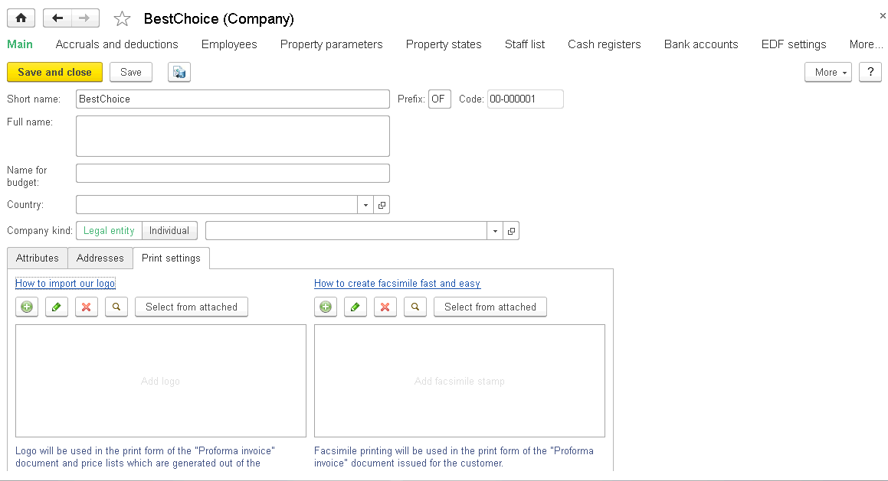
.. |image013.png| image:: media/image7.png
   :width: 0.125in
.. |image015| image:: media/image8.png
   :width: 4.40625in
   :height: 2.91667in
.. |image017| image:: media/image9.png
   :width: 4.53125in
   :height: 3.26042in

.. |image021 (2)| image:: media/image11.png
   :width: 3.78125in
   :height: 2.80208in

.. |image030.png| image:: media/image15.png
   :width: 3.9375in
   :height: 3.01042in

.. |Inv| image:: media/image18.png
   :width: 4.63542in
   :height: 2.79167in
.. |Image 3| image:: media/image19.png
   :width: 4.44792in
   :height: 3.08333in
.. |image044| image:: media/image20.png
   :width: 4.34375in
   :height: 2.66667in
.. |CompanyResources| image:: media/image21.png
   :width: 4.625in
   :height: 1.53125in
.. |Sales| image:: media/image22.png
   :width: 4.63542in
   :height: 4.47917in
.. |image050| image:: media/image23.png
   :width: 4.48958in
   :height: 2.88542in
.. |COstates| image:: media/image24.png
   :width: 4.63542in
   :height: 1.67708in
.. |Purchases| image:: media/image25.png
   :width: 4.63542in
   :height: 3.96875in

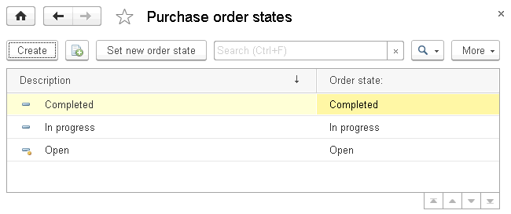
.. |ServiceSettings| image:: media/image30.png
   :width: 4.59375in
   :height: 1.89583in

.. |PrOStates| image:: media/image32.png
   :width: 4.63542in
   :height: 1.73958in

.. |image074| image:: media/image34.png
   :width: 3.89583in
   :height: 1.67708in
.. |image076| image:: media/image35.png
   :width: 3.94792in
   :height: 1.36458in
.. |Payroll| image:: media/image36.png
   :width: 4.63542in
   :height: 2.27083in

.. |WTK| image:: media/image37.png
   :width: 4.63542in
   :height: 2.5in

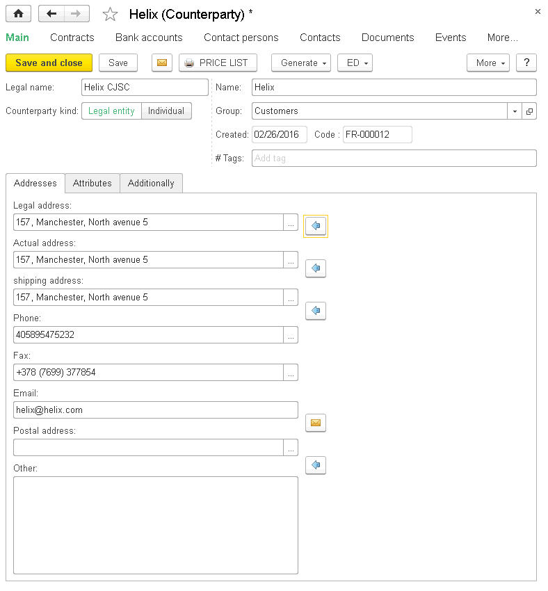
.. |Helix2| image:: media/image40.png
   :width: 4.63542in
   :height: 5.07292in
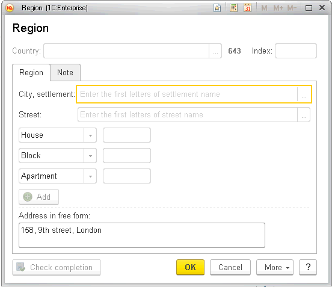
.. |image096.png| image:: media/image42.png
   :width: 3.10417in
   :height: 1.26042in
.. |image098.png| image:: media/image43.png
   :width: 3.9375in
   :height: 1.47917in

.. |Events| image:: media/image47.png
   :width: 4.63542in
   :height: 1.5in

.. |SendEmail0| image:: media/image49.png
   :width: 4.65625in
   :height: 4.39583in
.. |image112.png| image:: media/image50.png
   :width: 3.9375in
   :height: 2.26042in
.. |SendEmail3| image:: media/image51.png
   :width: 4.625in
   :height: 2.5625in
.. |image116| image:: media/image52.png
   :width: 4.46875in
   :height: 2.90625in

.. |image120.png| image:: media/image54.png
   :width: 3.9375in
   :height: 3.3125in

.. |image128.png| image:: media/image58.png
   :width: 4.20833in
   :height: 3.27083in

.. |Image 22| image:: media/image60.png
   :width: 3.82292in
   :height: 4.04167in

.. |image140.png| image:: media/image64.png
   :width: 2.3125in
   :height: 2.22917in
.. |Pricing| image:: media/image65.png
   :width: 4.67708in
   :height: 4.38542in
.. |CO| image:: media/image66.png
   :width: 4.61458in
   :height: 3.02083in
.. |CO10| image:: media/image67.png
   :width: 4.63542in
   :height: 3.17708in

.. |image150.png| image:: media/image69.png
   :width: 3.9375in
   :height: 1.3125in
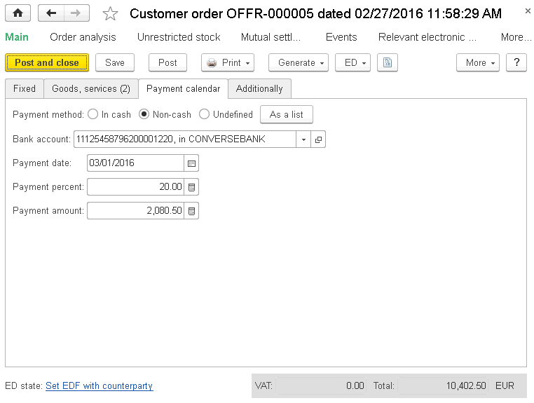
.. |3| image:: media/image71.png
   :width: 4.35417in
   :height: 3.05208in
.. |DocSetup| image:: media/image72.png
   :width: 3.77083in
   :height: 1.55208in

.. |image160.png| image:: media/image74.png
   :width: 3.9375in
   :height: 1.70833in
.. |CC3| image:: media/image75.png
   :width: 4.63542in
   :height: 2.15625in
.. |image164.png| image:: media/image76.png
   :width: 3.9375in
   :height: 2.375in

.. |Inventory| image:: media/image78.png
   :width: 4.625in
   :height: 2.59375in

.. |Invoice| image:: media/image80.png
   :width: 4.63542in
   :height: 3.28125in
.. |GoodsReceipt| image:: media/image81.png
   :width: 4.625in
   :height: 3.17708in

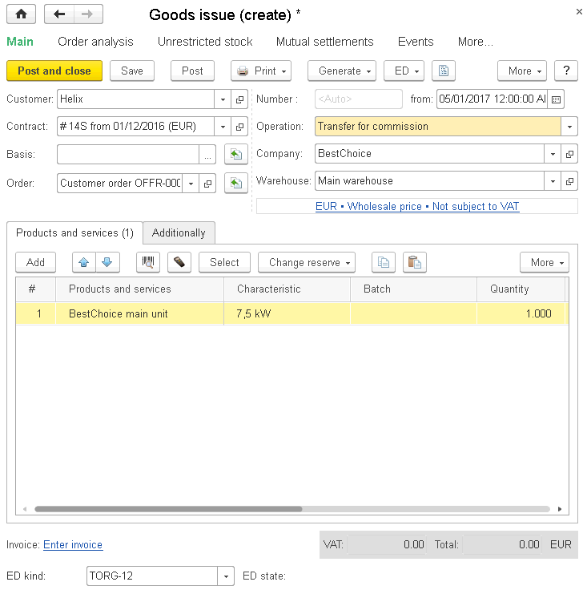

.. |AcceptanceForC| image:: media/image87.png
   :width: 4.63542in
   :height: 3.41667in
.. |ReportToPrincipal| image:: media/image88.png
   :width: 4.625in
   :height: 2.92708in

.. |GRRetail| image:: media/image91.png
   :width: 4.63542in
   :height: 3.79167in
.. |image205.png| image:: media/image92.png
   :width: 3.90625in
   :height: 1.94792in
.. |5| image:: media/image93.png
   :width: 4.53125in
   :height: 2.45833in

.. |6| image:: media/image96.png
   :width: 4.30208in
   :height: 3.125in

.. |image219.png| image:: media/image99.png
   :width: 3.9375in
   :height: 2.53125in
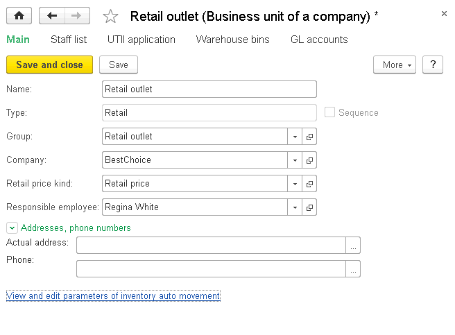
.. |RetailRevaluation| image:: media/image101.png
   :width: 4.63542in
   :height: 3.29167in

.. |image229.png| image:: media/image103.png
   :width: 3.59375in
   :height: 0.95833in

.. |image235.png| image:: media/image106.png
   :width: 3.90625in
   :height: 2.83333in

.. |MutualSettlements| image:: media/image112.png
   :width: 4.625in
   :height: 2.73958in

.. |image259.png| image:: media/image117.png
   :width: 3.97917in
   :height: 2.42708in

.. |Service| image:: media/image121.png
   :width: 4.63542in
   :height: 3.67708in
.. |Inst| image:: media/image122.png
   :width: 4.63542in
   :height: 3.66667in
.. |Operation| image:: media/image123.png
   :width: 4.63542in
   :height: 2.5625in

.. |image275.png| image:: media/image125.png
   :width: 3.9375in
   :height: 1.875in

.. |PO| image:: media/image127.png
   :width: 4.63542in
   :height: 3.42708in
.. |POcard| image:: media/image128.png
   :width: 4.63542in
   :height: 4.125in
.. |5| image:: media/image129.png
   :width: 4.55208in
   :height: 2.4375in
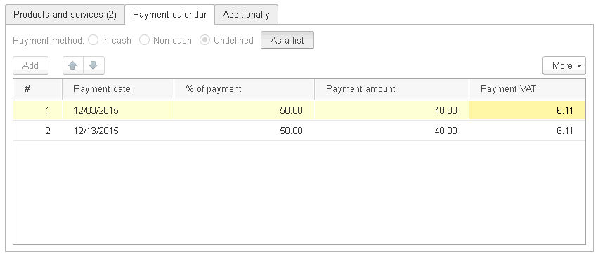

.. |Additionally| image:: media/image132.png
   :width: 4.67708in
   :height: 2.3125in
.. |GR| image:: media/image133.png
   :width: 4.67708in
   :height: 3.76042in
.. |GI11| image:: media/image134.png
   :width: 4.65625in
   :height: 3.71875in
.. |ReceivedInvoice| image:: media/image135.png
   :width: 4.63542in
   :height: 3.82292in

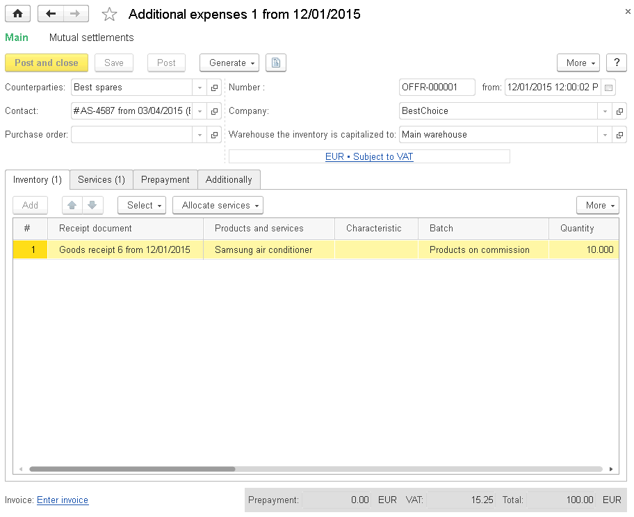
.. |image305.png| image:: media/image138.png
   :width: 3.9375in
   :height: 2.84375in
.. |image307| image:: media/image139.png
   :width: 4.63542in
   :height: 2.34375in
.. |PhysicalInventory| image:: media/image140.png
   :width: 4.63542in
   :height: 3.78125in
.. |InvCap| image:: media/image141.png
   :width: 4.625in
   :height: 3.15625in

.. |ProcessorReport| image:: media/image143.png
   :width: 4.63542in
   :height: 3.59375in

.. |Services| image:: media/image145.png
   :width: 4.63542in
   :height: 2.16667in
.. |Retail| image:: media/image146.png
   :width: 4.66667in
   :height: 3.77083in

.. |PrepaymentSetoff| image:: media/image148.png
   :width: 4.63542in
   :height: 3.34375in

.. |IMS| image:: media/image158.png
   :width: 4.63542in
   :height: 2.71875in
.. |OrderPlacement| image:: media/image159.png
   :width: 4.63542in
   :height: 2.5in

.. |image367.png| image:: media/image164.png
   :width: 3.9375in
   :height: 1.97917in

.. |SettlSup| image:: media/image166.png
   :width: 4.63542in
   :height: 2.41667in
.. |image373| image:: media/image167.png
   :width: 4.40625in
   :height: 2.86458in

.. |9| image:: media/image170.png
   :width: 4.53125in
   :height: 1.92708in

.. |10| image:: media/image172.png
   :width: 4.46875in
   :height: 2.90625in
.. |TranferredInv| image:: media/image173.png
   :width: 4.63542in
   :height: 2.375in
.. |image387.png| image:: media/image174.png
   :width: 4.21875in
   :height: 2.39583in
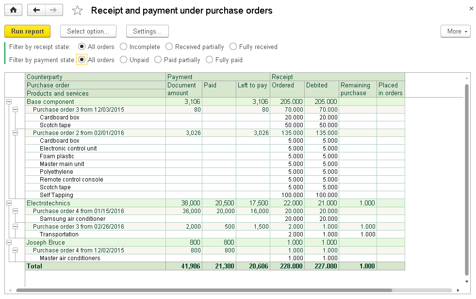
.. |image391.png| image:: media/image176.png
   :width: 4.25in
   :height: 2.16667in
.. |C:DesktopImage 1.png| image:: media/image177.png
   :width: 4.60417in
   :height: 2.66667in

.. |image180| image:: media/image180.png
   :width: 4.73958in
   :height: 1.89583in

.. |image182| image:: media/image182.png
   :width: 0.875in
   :height: 0.30208in
.. |image183| image:: media/image183.png
   :width: 0.96875in
   :height: 0.29167in
.. |image184| image:: media/image184.png
   :width: 1.28125in
   :height: 0.28125in
.. |image185| image:: media/image185.png
   :width: 1.05208in
   :height: 0.28125in
.. |image186| image:: media/image186.png
   :width: 4.53125in
   :height: 2.88542in
.. |image187| image:: media/image187.png
   :width: 4.41667in
   :height: 1.65625in

.. |JOList| image:: media/image189.png
   :width: 4.625in
   :height: 2.55208in
.. |JobOrder| image:: media/image190.png
   :width: 4.63542in
   :height: 3.29167in

.. |Scheduler| image:: media/image192.png
   :width: 4.625in
   :height: 1.75in
.. |JOScheduler| image:: media/image193.png
   :width: 4.63542in
   :height: 3.66667in

.. |ServiceReports| image:: media/image195.png
   :width: 4.63542in
   :height: 3.90625in

.. |image417.png| image:: media/image197.png
   :width: 3.9375in
   :height: 2.80208in

.. |ProductionDocuments| image:: media/image199.png
   :width: 4.63542in
   :height: 3.60417in

.. |image425.png| image:: media/image201.png
   :width: 3.92708in
   :height: 1.71875in

.. |POLoading| image:: media/image205.png
   :width: 4.63542in
   :height: 2.625in
.. |Image 1| image:: media/image206.png
   :width: 4.63542in
   :height: 2.8125in
.. |Image 2| image:: media/image207.png
   :width: 4.63542in
   :height: 3.07292in

.. |TK| image:: media/image212.png
   :width: 4.63542in
   :height: 3.34375in
.. |ManDoc| image:: media/image213.png
   :width: 4.625in
   :height: 2.73958in

.. |Man2| image:: media/image215.png
   :width: 4.625in
   :height: 2.70833in
.. |CA| image:: media/image216.png
   :width: 4.63542in
   :height: 2.73958in
.. |CA2| image:: media/image217.png
   :width: 4.63542in
   :height: 2.94792in

.. |ManReports| image:: media/image222.png
   :width: 4.625in
   :height: 3.59375in

.. |JobSheets| image:: media/image227.png
   :width: 4.63542in
   :height: 2.30208in

.. |image489| image:: media/image229.png
   :width: 4.54167in
   :height: 1.59375in
.. |image491.png| image:: media/image230.png
   :width: 4.22917in
   :height: 2.85417in

.. |image497| image:: media/image232.png
   :width: 4.4375in
   :height: 3.03125in

.. |CustDebtSelectForm| image:: media/image234.png
   :width: 4.63542in
   :height: 2.75in
.. |CreditSlip| image:: media/image235.png
   :width: 4.63542in
   :height: 3.0625in
.. |CreditSlipOther| image:: media/image236.png
   :width: 4.63542in
   :height: 3.0625in

.. |SupDebtSelForm| image:: media/image238.png
   :width: 4.63542in
   :height: 2.75in
.. |image511.png| image:: media/image239.png
   :width: 4.33333in
   :height: 2.90625in

.. |CashPaymentOther| image:: media/image241.png
   :width: 4.625in
   :height: 3.16667in
.. |CashPaymentTaxes| image:: media/image242.png
   :width: 4.63542in
   :height: 3.20833in
.. |image519.png| image:: media/image243.png
   :width: 4.33333in
   :height: 2.90625in

.. |ExpFrAc| image:: media/image246.png
   :width: 4.63542in
   :height: 3.375in
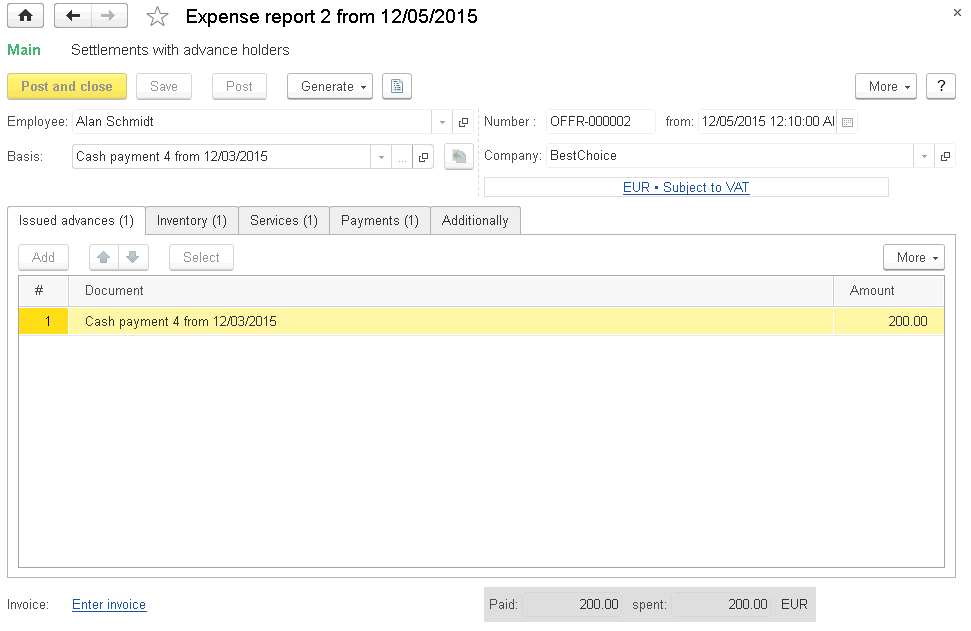

.. |ExpReport3| image:: media/image249.png
   :width: 4.63542in
   :height: 3.03125in
.. |image537.png| image:: media/image250.png
   :width: 4.33333in
   :height: 2.54167in
.. |ExpReq| image:: media/image251.png
   :width: 4.625in
   :height: 2.33333in

.. |image553.png| image:: media/image258.png
   :width: 4.33333in
   :height: 2.38542in

.. |image557| image:: media/image260.png
   :width: 4.42708in
   :height: 2.29167in
.. |image559.png| image:: media/image261.png
   :width: 0.13542in
   :height: 0.11458in
.. |image561| image:: media/image262.png
   :width: 2.92708in
   :height: 3.51042in

.. |image567.png| image:: media/image265.png
   :width: 4.33333in
   :height: 2.55208in
.. |600| image:: media/image266.png
   :width: 4.41667in
   :height: 3.16667in

.. |Картинка1| image:: media/image270.png
   :width: 4.625in
   :height: 4.0625in
.. |Timesheet| image:: media/image271.png
   :width: 4.63542in
   :height: 3.02083in
.. |image581.png| image:: media/image272.png
   :width: 4.33333in
   :height: 2.70833in

.. |image585| image:: media/image274.png
   :width: 4.4375in
   :height: 2.0625in

.. |WS| image:: media/image277.png
   :width: 4.625in
   :height: 3.94792in

.. |PR| image:: media/image279.png
   :width: 4.63542in
   :height: 3.39583in
.. |EmplList| image:: media/image280.png
   :width: 4.63542in
   :height: 2.38542in
.. |image599| image:: media/image281.png
   :width: 4.44792in
   :height: 3.64583in
.. |image601| image:: media/image282.png
   :width: 4.46875in
   :height: 3.67708in
.. |HoursWorkedByDays| image:: media/image283.png
   :width: 4.63542in
   :height: 3.3125in
.. |image605| image:: media/image284.png
   :width: 4.63542in
   :height: 2.875in

.. |Chart| image:: media/image287.png
   :width: 4.63542in
   :height: 3.14583in
.. |MSR| image:: media/image288.png
   :width: 4.59375in
   :height: 3.33333in
.. |DA| image:: media/image289.png
   :width: 4.59375in
   :height: 3.3125in
.. |image617.png| image:: media/image290.png
   :width: 4.33333in
   :height: 2.5625in

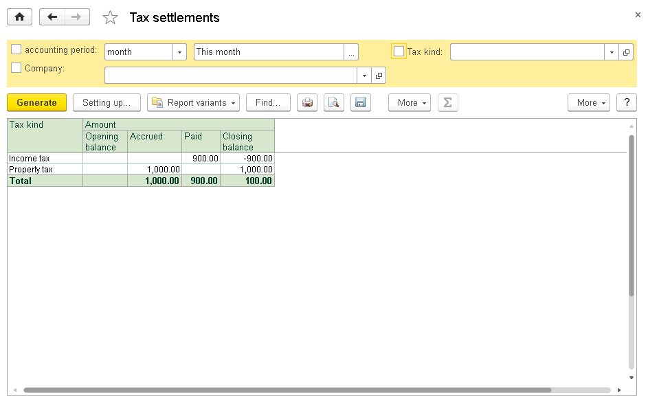
.. |image623.png| image:: media/image293.png
   :width: 4.21875in
   :height: 3.08333in

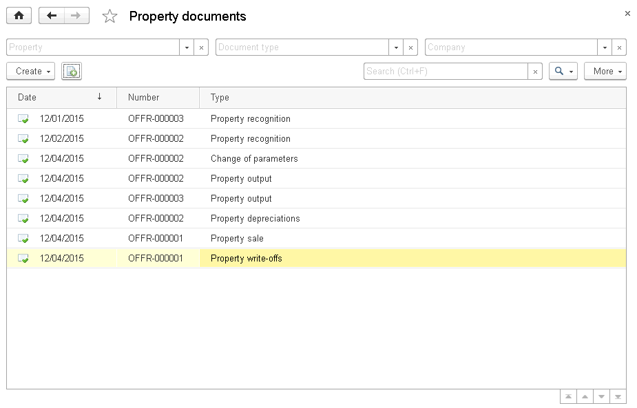
.. |Image 8| image:: media/image299.png
   :width: 4.63542in
   :height: 3.17708in

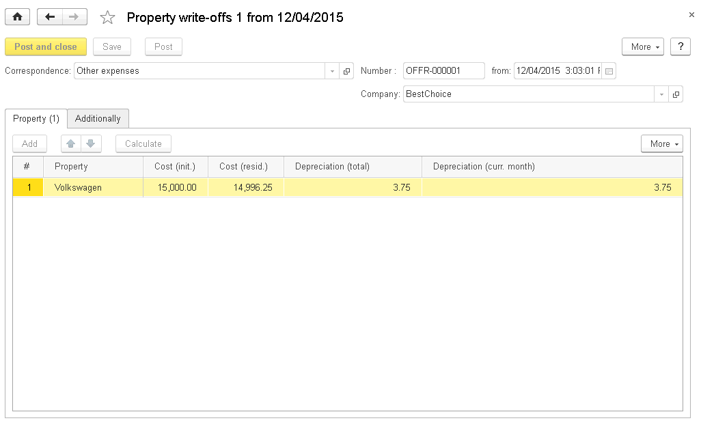
.. |Budget1| image:: media/image305.png
   :width: 4.63542in
   :height: 3.44792in
.. |Budget2| image:: media/image306.png
   :width: 4.63542in
   :height: 3.42708in

.. |Budget3| image:: media/image308.png
   :width: 4.63542in
   :height: 3.42708in
.. |Budget4| image:: media/image309.png
   :width: 4.63542in
   :height: 3.40625in

.. |image663.png| image:: media/image312.png
   :width: 4.04167in
   :height: 2.60417in

.. |Image11| image:: media/image314.png
   :width: 4.63542in
   :height: 2.98958in

.. |image673.png| image:: media/image317.png
   :width: 4.33333in
   :height: 3.86458in

.. |Receivable| image:: media/image319.png
   :width: 4.65625in
   :height: 3.67708in
.. |CompDebt| image:: media/image320.png
   :width: 4.66667in
   :height: 3.64583in

.. |image685.png| image:: media/image323.png
   :width: 3.9375in
   :height: 3.21875in

.. |Image 2| image:: media/image326.png
   :width: 4.625in
   :height: 3.15625in

.. |image701.png| image:: media/image331.png
   :width: 4.33333in
   :height: 3.28125in

.. |1111111111111| image:: media/image333.png
   :width: 4.67708in
   :height: 3.3125in
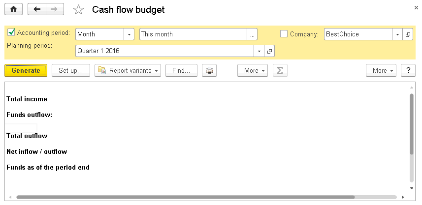

.. |Image 10| image:: media/image336.png
   :width: 4.63542in
   :height: 3.17708in
.. |image719.png| image:: media/image337.png
   :width: 4.25in
   :height: 3.05208in
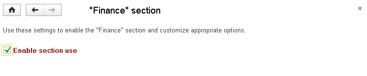
.. |PrForms.png| image:: media/image339.png
   :width: 4.5625in
   :height: 1.88542in
.. |ADR2.png| image:: media/image340.png
   :width: 4.25in
   :height: 1.79167in
.. |AdDataPr.png| image:: media/image341.png
   :width: 4.58333in
   :height: 2.51042in

.. |CHA2.png| image:: media/image343.png
   :width: 3.90625in
   :height: 3.10417in

.. |CHA3.png| image:: media/image345.png
   :width: 4.29167in
   :height: 2.36458in
.. |NewAccount.png| image:: media/image346.png
   :width: 1.95833in
   :height: 1.05208in
.. |AccountNew.png| image:: media/image347.png
   :width: 3.60417in
   :height: 2.6875in

.. |Acc.png| image:: media/image351.png
   :width: 4.54167in
   :height: 3.375in
.. |PrAndServ.png| image:: media/image352.png
   :width: 4.52083in
   :height: 2.95833in

.. |BK.png| image:: media/image354.png
   :width: 3.80208in
   :height: 2.59375in

.. |Template2.png| image:: media/image357.png
   :width: 4.4375in
   :height: 3.54167in

.. |TableChoosing.png| image:: media/image359.png
   :width: 2.1875in
   :height: 2.80208in

.. |Template4.png| image:: media/image362.png
   :width: 2.66667in
   :height: 2.44792in

.. |DK.png| image:: media/image365.png
   :width: 0.27083in
   :height: 0.25in
.. |BKOperation.png| image:: media/image366.png
   :width: 4.44792in
   :height: 2.66667in
.. |Image 11| image:: media/image367.png
   :width: 4.63542in
   :height: 3.26042in
.. |Image 12| image:: media/image368.png
   :width: 4.27083in
   :height: 2.94792in
.. |SearchAndInstall| image:: media/image369.png
   :width: 4.63542in
   :height: 1.36458in

.. |ClDate| image:: media/image371.png
   :width: 4.29167in
   :height: 1.6875in
.. |ClDateAll| image:: media/image372.png
   :width: 4.29167in
   :height: 1.80208in
.. |ClDateYear| image:: media/image373.png
   :width: 4.29167in
   :height: 2.4375in
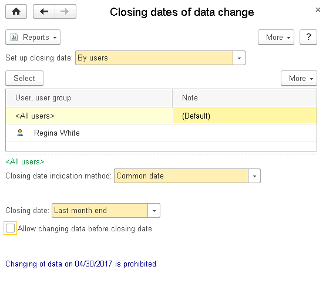
.. |ClDateCommon| image:: media/image375.png
   :width: 4.34375in
   :height: 3.6875in

.. |Image 15| image:: media/image377.png
   :width: 4.63542in
   :height: 3.23958in

.. |image753.png| image:: media/image383.png
   :width: 4.33333in
   :height: 2.94792in
.. |image755.png| image:: media/image384.png
   :width: 4.33333in
   :height: 4.01042in

.. |Image 25| image:: media/image386.png
   :width: 4.63542in
   :height: 3.32292in
.. |Image 18| image:: media/image387.png
   :width: 4.625in
   :height: 3.3125in
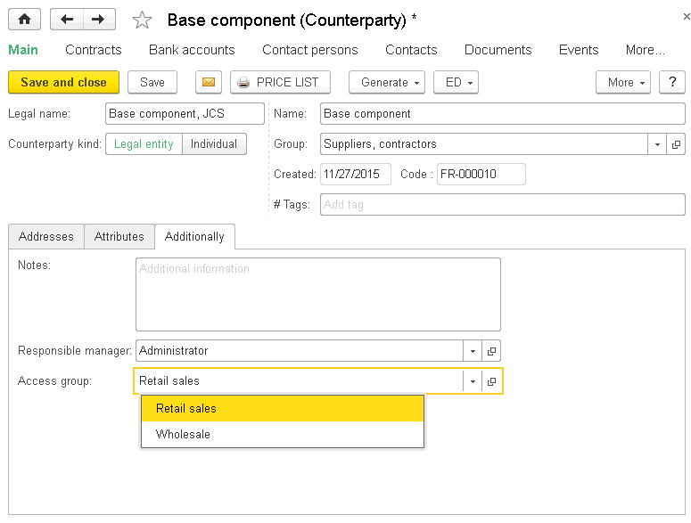
.. |Image 20| image:: media/image389.png
   :width: 4.63542in
   :height: 3.3125in
.. |Image 26| image:: media/image390.png
   :width: 4.63542in
   :height: 3.3125in
.. |FundsRights| image:: media/image391.png
   :width: 4.63542in
   :height: 3.17708in
.. |image771| image:: media/image392.png
   :width: 4.45833in
   :height: 2.65625in

.. |image774| image:: media/image394.png
   :width: 4.45833in
   :height: 2.54167in
.. |image776.png| image:: media/image395.png
   :width: 4.33333in
   :height: 2.83333in

.. |image784.png| image:: media/image399.png
   :width: 4.33333in
   :height: 3.20833in
.. |image786.png| image:: media/image400.png
   :width: 4.33333in
   :height: 3.5in
.. |image790.png| image:: media/image401.png
   :width: 4.33333in
   :height: 3.17708in
.. |image792| image:: media/image402.png
   :width: 4.29167in
   :height: 2.41667in
.. |image794| image:: media/image403.png
   :width: 3.44792in
   :height: 1.48958in
.. |image796| image:: media/image404.png
   :width: 4.07292in
   :height: 3.41667in
.. |image798.png| image:: media/image405.png
   :width: 4.33333in
   :height: 2.94792in
.. |FileOperationInterface| image:: media/image406.png
   :width: 4.63542in
   :height: 3.51042in
.. |PrintOptions| image:: media/image407.png
   :width: 4.63542in
   :height: 1.10417in
.. |Files| image:: media/image408.png
   :width: 4.63542in
   :height: 1.44792in
.. |Image 1| image:: media/image409.png
   :width: 4.42708in
   :height: 2.89583in
.. |image411| image:: media/image410.png
   :width: 4.44792in
   :height: 2.30208in

.. |image413| image:: media/image412.png
   :width: 1.125in
   :height: 0.20833in
.. |image414| image:: media/image413.png
   :width: 0.27083in
   :height: 0.21875in
.. |Image 3| image:: media/image414.png
   :width: 3.70833in
   :height: 2.95833in
.. |Image 5| image:: media/image415.png
   :width: 4.47917in
   :height: 2.23958in

.. |image808.png| image:: media/image418.png
   :width: 0.10417in
   :height: 0.125in

.. |image812.png| image:: media/image420.png
   :width: 4.25in
   :height: 2.75in
.. |image814.png| image:: media/image421.png
   :width: 4.33333in
   :height: 2.8125in
.. |image816.png| image:: media/image422.png
   :width: 0.25in
   :height: 0.125in

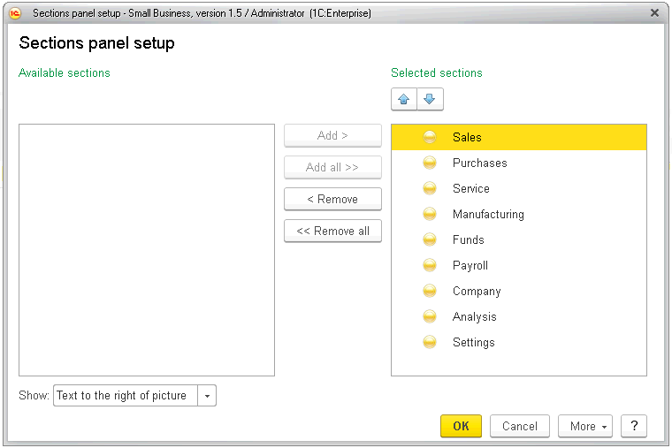
.. |image822.png| image:: media/image425.png
   :height: 0.11458in
.. |image824| image:: media/image426.png
   :width: 4.04167in
   :height: 3.89583in

.. |image828.png| image:: media/image428.png
   :width: 2.66667in
   :height: 3.01042in

.. |CO10| image:: media/image430.png
   :width: 4.63542in
   :height: 3.17708in

.. |COPO| image:: media/image432.png
   :width: 4.63542in
   :height: 4.4375in

.. |REceiptToAccount| image:: media/image435.png
   :width: 4.63542in
   :height: 3.46875in
